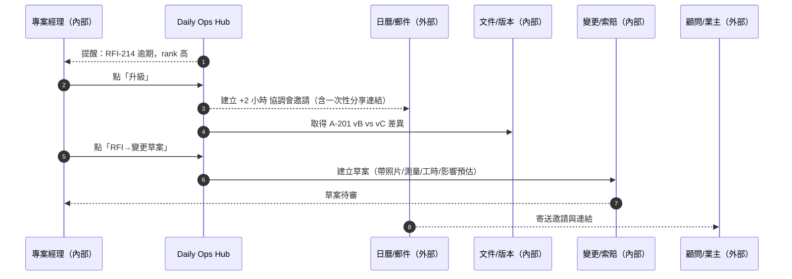
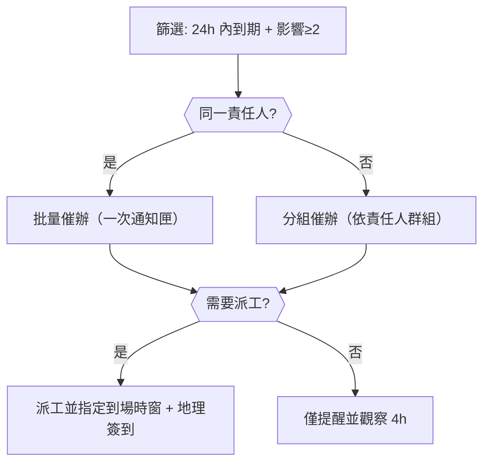
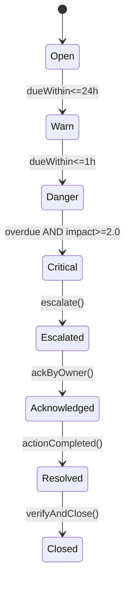

# Part 3a — 〈風險與服務等級倒數（Critical Alerts）〉卡片 詳規（Construction）
**版本**：v3.0  
**日期**：2025-09-20  
**對象**：總包/分包 專案經理（Project Manager）、現場工程師、品質/安全、商務經理、監造/業主  
**範圍**：本份文件針對首頁卡片「風險與服務等級倒數（Critical Alerts）」給出：使用者旅程（含平台外）、User Story、互動規格、資料模型、TypeScript 介面、OpenAPI 片段、高真 mock data、Playbook 決策表、狀態圖、遙測與驗收。  
> 術語皆以中文 + 英文全寫呈現：服務等級協議（Service Level Agreement, SLA）、工作分解結構（Work Breakdown Structure, WBS）、工程量清單（Bill of Quantities, BOQ）、資訊請求（Request For Information, RFI）、檢驗申請（Inspection Request, IR）、材料進場檢驗（Material Inspection Request, MIR）、建築資訊模型（Building Information Modeling, BIM）。

---

## 1. 目標與價值
**目標**：用一張卡片即時呈現所有「即將逾期 / 已逾期」且可能影響**關鍵路徑 / 成本 / 停工 / 安全**的事件，並提供**一鍵行動**（升級、派工、開會、轉單、公告）以縮短 Mean Time To Action（到首次行動的時間）。

**北極星指標（North Star）**
- 逾期升級自動化覆蓋率 ≥ 95%
- 首次行動時間（Time-to-First-Action）中位數 ≤ 15 分鐘
- 逾期事件佔比（佔總事件）下降 ≥ 25%（四週視窗）

**次級成效**
- 關鍵路徑延誤（Critical Path Slippage）抑制；變更批准中位時間下降；停工與罰款事件下降。

---

## 2. 排序與分級邏輯（Scoring）
### 2.1 欄位定義
- **remainingSeconds**：距 SLA 截止的秒數（負值代表已逾期）。  
- **impactScore**：由四個維度加權：
  - 關鍵路徑（Critical Path, CP）`cpScore ∈ {{0,3}}`（在關鍵路徑=3，否=0）
  - 成本（Cost Exposure）`costScore ∈ [0..3]`（依金額區間自動映射）
  - 停工（Stoppage Risk）`stopScore ∈ [0..3]`（是否導致停工/等待）
  - 安全（Safety / EHS）`safetyScore ∈ [0..4]`（人身風險最高）
  - `impactScore = cpScore*0.35 + costScore*0.2 + stopScore*0.2 + safetyScore*0.25`（0–3.25）

### 2.2 排序鍵（Sort Key）
- 正規化剩餘時間：`rt = clamp( -remainingSeconds / 86400 , 0, 3 )`（逾期 1 天=1，≥3 天封頂 3；未逾期則 rt=0）  
- 排序分數：`rank = rt*0.6 + impactScore*0.4`，由大到小排列。  
- **服務等級狀態（Badge）**：
  - `critical`：remainingSeconds < 0 且 impactScore ≥ 2.0  
  - `danger`：remainingSeconds < 0 且 impactScore < 2.0，或 0 ≤ remainingSeconds ≤ 1h 且 impactScore ≥ 2.0  
  - `warn`：1h < remainingSeconds ≤ 24h  
  - `ok`：> 24h

---

## 3. User Stories（以 Gherkin 表述）
**US-CA-01（專案經理）**  
- Given 我在首頁看到 Critical Alerts  
- When 我按「一鍵升級」某筆 RFI  
- Then 系統建立 +2 小時協調會（自動帶入疊圖連結與關聯 WBS/位置）並通知顧問/業主，且在 RFI 時間線記錄行動。

**US-CA-02（現場工程師）**  
- Given 我在現場，手機離線  
- When 我對逾期 IR 錄入照片與測量數值並按「提交」  
- Then 系統在離線佇列保存草稿；恢復上線後自動上傳並回寫到 IR 與此卡片。

**US-CA-03（品質/安全主管）**  
- Given 我在 Critical Alerts 篩選「安全/EHS」  
- When 我批量建立整改任務並設定服務等級倒數  
- Then 系統為每筆建立整改單、派工分包、寫入服務等級、啟用升級規則。

**US-CA-04（商務經理）**  
- Given 我在 Critical Alerts 中選擇「可能導致變更」的 RFI  
- When 我按「RFI → 變更草案」  
- Then 系統自動帶入照片/測量/工時，計算初步工期與成本影響，送審。

---

## 4. 互動規格（Interaction Spec）
### 4.1 卡片結構
- **標題列**：卡片名 + KPI 徽章（今日新逾期數 / 24h 內到期數 / 自動升級觸發數）。  
- **工具列**：`Filter`（事件類型、影響、擁有者、專案區域、服務等級狀態）、`Sort`（rank、remainingSeconds、impactScore）、`Bulk Actions`（催辦、升級、派工、開會、公告、轉變更草案）、`Pin`、`Export`。  
- **主表格欄位**：事件類型、標題、剩餘時間（倒數/逾期）、影響（CP/成本/停工/安全）、責任人、主要動作（Inline Buttons）。  
- **右側抽屜（Drawer）**：Tabs = `Timeline`（動作/通話/簽到/照片/版本）、`Impact`（得分與依據）、`Evidence`（附件/指紋）、`Relations`（WBS/Location/Document Version/BIM Element）。

### 4.2 快速操作（Inline）
- **催辦（Remind）**：內部通知 + 可選外部郵件；記錄時間線。  
- **升級（Escalate）**：依 Playbook 將責任層級向上；可自動建議會議。  
- **派工（Dispatch）**：選擇分包與到場時窗；要求地理簽到。  
- **開會（Meeting）**：建立 +X 小時協調會（預設 +2），帶疊圖連結與一次性分享 URL。  
- **RFI→變更草案**、**建立整改**、**建立延誤通知**（Delay Notice）。

### 4.3 空/錯誤/弱網
- **空狀態**：顯示近 7 日的趨勢圖與「設定提醒門檻」。  
- **弱網**：所有動作支援離線草稿（顯示 `queued`）；衝突顯示差異並可合併。  
- **權限不足**：顯示所需角色或屬性，提供「申請存取」按鈕（走審批流）。

### 4.4 可及性（Accessibility）
- ARIA 標籤、鍵盤捷徑、狀態以文字 + 圖標呈現；色盲友善色板。

### 4.5 行動端（Mobile）
- 主表改為卡片式；保留「一鍵動作」列；抽屜改為全屏覆蓋；支援掃碼跳轉到關聯實體。

---

## 5. 低保真 Wireframe（僅此卡）
```text
┌─ Critical Alerts [New Overdue: 7] [Due<24h: 12] [Auto-Escalations: 4] ─────────┐
│ Filters: [Type: RFI|IR|MIR|Change|Punch|Permit] [Impact: CP|Cost|Stop|EHS] ... │
│ Sort by: Rank ▾   Bulk: [Remind][Escalate][Dispatch][Meeting][RFI→Change]     │
├────────────────────────────────────────────────────────────────────────────────┤
│ Type  Title                         Remaining     Impact (CP/Cost/Stop/EHS)   │
│ RFI   B2 柱筋碰撞 (RFI-214)          -06:00 (late)  3 / 2 / 1 / 0   [Actions] │
│ IR    鋼筋批 MIR 見證 (MIR-77)       12:00          2 / 1 / 2 / 0   [Actions] │
│ Punch 管井門缺失 (P-031)             03:30          0 / 1 / 0 / 1   [Actions] │
├────────────────────────────────────────────────────────────────────────────────┤
│ ▸ 點列 → Drawer: [Timeline][Impact][Evidence][Relations] + 主動作按鈕            │
└────────────────────────────────────────────────────────────────────────────────┘
```

---

## 6. 使用者旅程（Mermaid；平台內/外）
### 6.1 逾期升級 + 協調會 + 變更草案（Sequence）


### 6.2 批量催辦與派工（Flow with gate）


---

## 7. 資料模型（Data Model）
### 7.1 實體與關聯（摘要）
- **AlertItem**：`id, type(RFI|IR|MIR|CHANGE|PUNCH|PERMIT), title, remainingSeconds, slaLevel, impact{{cp,cost,stop,eHS}}, owner, wbsId, locationId, drawingVersionId?, relatedIds[], rank`  
- **TimelineEvent**：`id, alertId, at, actor, kind(CREATE|REMIND|ESCALATE|DISPATCH|MEETING|CONVERT|COMMENT), payload`  
- **Evidence**：`id, alertId, type(PHOTO|VIDEO|DOC|MEASURE), hash, url, createdAt, by`

### 7.2 TypeScript 介面（片段）
```ts
export type AlertType = "RFI"|"IR"|"MIR"|"CHANGE"|"PUNCH"|"PERMIT";
export type SlaLevel = "ok"|"warn"|"danger"|"critical";

export interface ImpactScore { cp: 0|3; cost: 0|1|2|3; stop: 0|1|2|3; ehs: 0|1|2|3|4; total: number; }

export interface AlertItem {
  id: string;
  type: AlertType;
  title: string;
  remainingSeconds: number; // negative = overdue
  slaLevel: SlaLevel;
  impact: ImpactScore;
  owner: string; // 責任人或單位
  wbsId?: string;
  locationId?: string;
  drawingVersionId?: string;
  relatedIds?: string[]; // 關聯的 RFI/IR/變更/Punch/Permit
  rank: number;
  actionsAllowed: string[]; // ["REMIND","ESCALATE","DISPATCH","MEETING","CONVERT_CHANGE","NOTICE"]
}

export interface AlertsResponse {
  projectId: string;
  asOf: string; // ISO
  items: AlertItem[];
  kpis: { newOverdue: number; due24h: number; autoEscalations: number; };
}
```

---

## 8. API 規格（OpenAPI 3.0 片段）
```yaml
openapi: 3.0.3
info: { title: Construction Hub – Critical Alerts API, version: 3.0.0 }
paths:
  /projects/{{projectId}}/alerts:
    get:
      summary: 取得 Critical Alerts 清單（含 KPI 與排序分數）
      parameters:
        - in: path
          name: projectId
          required: true
          schema: { type: string }
        - in: query
          name: types
          description: 事件類型（逗號分隔）
          schema: { type: string, example: "RFI,IR,MIR,CHANGE,PUNCH,PERMIT" }
        - in: query
          name: impactMin
          schema: { type: number, minimum: 0, maximum: 3.25 }
        - in: query
          name: dueWithinHours
          schema: { type: integer, minimum: 1 }
        - in: query
          name: sort
          schema: { type: string, enum: ["rank","remainingSeconds","impact"] }
      responses:
        "200":
          description: OK
          content:
            application/json:
              schema: {{ $ref: "#/components/schemas/AlertsResponse" }}
  /alerts/{{alertId}}:
    get:
      summary: 讀取單筆 Alert 詳情（含時間線/證據/關聯）
      responses:
        "200":
          description: OK
          content:
            application/json:
              schema: {{ $ref: "#/components/schemas/AlertDetail" }}
  /alerts/{{alertId}}/actions/escalate:
    post:
      summary: 觸發升級（依 Playbook 送通知/會議）
      requestBody:
        required: false
        content:
          application/json:
            schema:
              type: object
              properties:
                reason: { type: string }
                scheduleMeetingInHours: { type: integer, default: 2 }
      responses: {{ "200": {{ description: Escalated }} }}
  /alerts/{{alertId}}/actions/remind:
    post: {{ summary: 發送提醒, responses: {{ "200": {{ description: "Reminded" }} }} }}
  /alerts/{{alertId}}/actions/dispatch:
    post:
      summary: 派工分包
      requestBody:
        content:
          application/json:
            schema:
              type: object
              properties:
                vendorId: { type: string }
                etaStart: { type: string, format: date-time }
                etaEnd: { type: string, format: date-time }
                requireGeoCheckin: { type: boolean, default: true }
      responses: {{ "200": {{ description: "Dispatched" }} }}
  /alerts/{{alertId}}/actions/convert-change:
    post: {{ summary: RFI → 變更草案, responses: {{ "201": {{ description: "Change draft created" }} }} }}
components:
  schemas:
    ImpactScore:
      type: object
      properties: {{ cp: {{type: integer}}, cost: {{type: integer}}, stop: {{type: integer}}, ehs: {{type: integer}}, total: {{type: number}} }}
    AlertItem:
      type: object
      properties:
        id: {{type: string}}
        type: {{type: string, enum: [RFI,IR,MIR,CHANGE,PUNCH,PERMIT]}}
        title: {{type: string}}
        remainingSeconds: {{type: integer}}
        slaLevel: {{type: string, enum: [ok,warn,danger,critical]}}
        impact: {{ $ref: "#/components/schemas/ImpactScore" }}
        owner: {{type: string}}
        wbsId: {{type: string}}
        locationId: {{type: string}}
        drawingVersionId: {{type: string}}
        relatedIds: {{type: array, items: {{type: string}}}}
        rank: {{type: number}}
        actionsAllowed: {{type: array, items: {{type: string}}}}
    AlertsResponse:
      type: object
      properties:
        projectId: {{type: string}}
        asOf: {{type: string, format: date-time}}
        kpis:
          type: object
          properties: {{ newOverdue: {{type: integer}}, due24h: {{type: integer}}, autoEscalations: {{type: integer}} }}
        items:
          type: array
          items: {{ $ref: "#/components/schemas/AlertItem" }}
    AlertDetail:
      allOf:
        - $ref: "#/components/schemas/AlertItem"
        - type: object
          properties:
            timeline:
              type: array
              items:
                type: object
                properties:
                  at: {{type: string, format: date-time}}
                  actor: {{type: string}}
                  kind: {{type: string}}
                  payload: {{type: object}}
            evidence:
              type: array
              items:
                type: object
                properties:
                  type: {{type: string}}
                  url: {{type: string}}
                  hash: {{type: string}}
```

---

## 9. Mock Data（高真示例）
```json
{{
  "projectId": "PRJ-001",
  "asOf": "2025-09-20T08:30:00Z",
  "kpis": {{ "newOverdue": 7, "due24h": 12, "autoEscalations": 4 }},
  "items": [
    {{
      "id": "RFI-214",
      "type": "RFI",
      "title": "B2 柱筋與管道碰撞（請求設計澄清）",
      "remainingSeconds": -21600,
      "slaLevel": "critical",
      "impact": {{ "cp": 3, "cost": 2, "stop": 1, "ehs": 0, "total": 2.35 }},
      "owner": "顧問A",
      "wbsId": "3.2.1",
      "locationId": "B2-Grid C5",
      "drawingVersionId": "A-201-vB",
      "relatedIds": ["ME-079"],
      "rank": 2.91,
      "actionsAllowed": ["REMIND","ESCALATE","MEETING","CONVERT_CHANGE"]
    }},
    {{
      "id": "MIR-77",
      "type": "IR",
      "title": "鋼筋批 MIR 見證",
      "remainingSeconds": 43200,
      "slaLevel": "warn",
      "impact": {{ "cp": 2, "cost": 1, "stop": 2, "ehs": 0, "total": 1.65 }},
      "owner": "質檢張",
      "wbsId": "3.1.4",
      "locationId": "Yard-1",
      "rank": 1.29,
      "actionsAllowed": ["REMIND","DISPATCH","MEETING"]
    }},
    {{
      "id": "P-031",
      "type": "PUNCH",
      "title": "管井門缺失（易割傷）",
      "remainingSeconds": 12600,
      "slaLevel": "warn",
      "impact": {{ "cp": 0, "cost": 1, "stop": 0, "ehs": 2, "total": 0.95 }},
      "owner": "分包甲",
      "locationId": "L3-Utility-04",
      "rank": 0.99,
      "actionsAllowed": ["REMIND","DISPATCH"]
    }}
  ]
}}
```

---

## 10. Playbook 決策表（Decision Table）
| 規則編號 | 條件（Condition） | 動作（Action） | 附註 |
|---|---|---|---|
| PB-01 | `remainingSeconds < 0` 且 `impact.total ≥ 2.0` | 升級至上層責任人；建立 +2h 協調會；寄出一次性分享連結 | 會議邀請含疊圖/文件定位 |
| PB-02 | `0 ≤ remainingSeconds ≤ 3600` 且 `impact.cp = 3` | 立即提醒 + 建議升級 | 顯示關鍵路徑影響 |
| PB-03 | `type in (IR,MIR)` 且 `impact.stop ≥ 2` | 產生延誤通知（Delay Notice）草案 | 可附替代料建議 |
| PB-04 | `type = RFI` 且 `owner 未回覆 > SLA/2` | 自動生成「RFI → 變更草案」草稿 | 帶入照片/測量/工時 |
| PB-05 | `type = PUNCH` 且 `EHS ≥ 2` | 立即派工 + 要求地理簽到 | 需要主管覆核 |

**規則語法（DSL 示意）**
```text
WHEN overdue AND impact.total >= 2.0
THEN escalate(level=+1), scheduleMeeting(+2h), sendOneTimeLink(expiry=72h, watermark=true)
```

---

## 11. 狀態圖（State Machine）


---

## 12. 遙測（Telemetry）與報表
- **Funnel**：`view → openDrawer → actionClicked → actionSuccess`（分動作類型）。  
- **自動化覆蓋率**：被 Playbook 處理的事件 / 全部逾期事件。  
- **處置時效**：Time-to-First-Action 中位數、90 分位。  
- **質量指標**：升級後 24h 內關閉率、重複逾期率。

---

## 13. 驗收準則（Acceptance Criteria）
- 能按規格排序與顯示 10,000 筆內的 Alerts，首屏回應 < 600ms（95 分位）。  
- 所有主要動作（催辦/升級/派工/開會/轉草案）皆可於行動端離線排隊並成功回寫。  
- 抽查 30 筆，證據鏈（時間、人、位置、版本、附件指紋）完整率 ≥ 98%。  
- 無障礙：鍵盤可完成所有操作；螢幕閱讀器宣告狀態與倒數。

---

## 14. 權限（RBAC + ABAC）
- 角色：專案經理（完全控制）、工程師（讀 + 行動）、品質/安全（讀 + 整改/派工）、商務（讀 + 轉變更草案）、外部（只讀 + 有效連結）。  
- 屬性：依 Project / WBS / Location / Contract Package 限定可見與可操作範圍。

---

## 15. 效能與可靠性
- 聚合查詢採 **CQRS 讀模型**；卡片資料以事件流實時更新；WebSocket/SSE 推播。  
- 本地快取 15 分鐘；分頁/虛擬滾動；批量動作走事件佇列。

---

## 16. 邊界情境（Edge Cases）
- 大量相同來源的重複事件 → 自動去重與關聯；顯示「合併 X 筆」。  
- 外部系統（ERP/文件倉/建築資訊模型）暫時故障 → 顯示來源狀態與重試；允許先記錄行動，待恢復補寫。  
- 權限更新導致可見範圍縮小 → 立即隱藏敏感欄位與附件，保留審計痕跡。

---

## 17. 本卡片輸出與下一步
- 本卡片的資料模型與 API 已對齊 Part 2/Part 1 的主鍵設計。  
- **下一步**：請指名下一張要做的卡片（建議：〈進度健康度〉或〈設計協調〉）。
