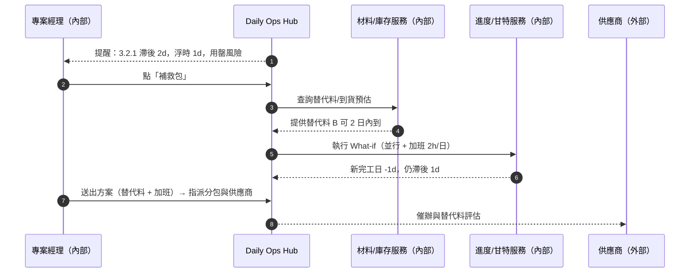
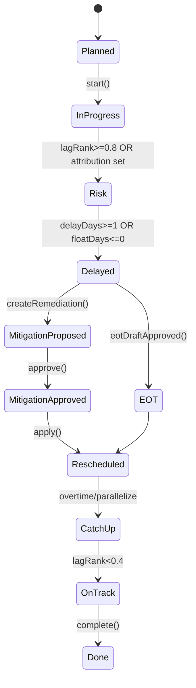

# Part 3b — 〈進度健康度（Schedule Health）〉卡片 詳規（Construction）
**版本**：v3.0  
**日期**：2025-09-20  
**對象**：專案經理（Project Manager）、計畫工程師、現場工程師、商務經理、監造/業主（唯讀）  
**範圍**：本份文件針對首頁卡片「進度健康度（Schedule Health）」給出：使用者旅程（含平台外）、User Story、互動規格、資料模型、TypeScript 介面、OpenAPI 片段、高真 mock data、Playbook 決策表、狀態圖、遙測與驗收。  
> 術語：關鍵路徑法（Critical Path Method, CPM）、工作分解結構（Work Breakdown Structure, WBS）、計畫完成百分比（Planned Percent Complete, PPC）、實際完成百分比（Actual Percent Complete, APC）、浮時（Total/Free Float）、三週滾動計畫（3-Week Lookahead）、服務等級協議（Service Level Agreement, SLA）。

---

## 1. 目標與價值
**目標**：以一張卡快速判斷「**是否偏離基線**」與「**偏離在哪裡、為什麼、接下來怎麼補救**」，用**可執行的建議**連動任務、RFI/變更與材料/設備調度，降低關鍵路徑延誤。

**北極星指標**
- 每週關鍵路徑變化（天）≤ 0  
- 滯後工項 Top5 的**處置完成率** ≥ 85%（一週內）  
- 由「進度健康度」卡片直接觸發的**補救行動完成率** ≥ 75%

**次級成效**
- 延誤歸因可追溯率 ≥ 95%；三週滾動如期完成率 ↑；EOT（Extension of Time, 工期展延）申請成功率 ↑。

---

## 2. 計分與排序邏輯
### 2.1 核心量測
- **cpDeltaDays**：關鍵路徑最早完工日（或總工期）相對基線的變動天數（+ 為延誤，- 為提早）。  
- **laggingTasks**：滯後工項集合（以「剩餘浮時」與「偏差天數」歸一化分數排序）。  
- **attribution**：延誤歸因（天氣 / 阻礙 / 缺料 / 設計 / 許可 / 其他），每筆工項可多選並附證據。  
- **lookaheadWindow**：三週滾動視窗內的里程碑與關鍵工項。

### 2.2 滯後排序鍵 `lagRank`
- `floatUse = clamp((baselineFloat - currentFloat)/max(1,baselineFloat), 0, 1)`  
- `delayScore = clamp(delayDays/7, 0, 1)`（以週規模歸一）  
- `criticalBoost = isOnCP ? 0.5 : 0`  
- `lagRank = 0.5*floatUse + 0.4*delayScore + criticalBoost`（0–1.9）

### 2.3 健康狀態徽章（卡片級）
- `healthy`：cpDeltaDays ≤ 0 且 Top5 lagRank < 0.8  
- `watch`：0 < cpDeltaDays ≤ 2 或 Top5 中任一 lagRank ≥ 0.8  
- `bad`：cpDeltaDays > 2 或 lookaheadWindow 內關鍵里程碑風險為紅

---

## 3. User Stories（Gherkin）
**US-SH-01（PM）**  
- Given 我在首頁看到「進度健康度」卡片顯示 watch/bad  
- When 我點開 Top 滯後工項並按「生成補救包」  
- Then 系統建立：調整甘特候選（重排序/並行/加班）、關聯 RFI/變更草案、材料替代與設備調度建議，並派至相關責任人。

**US-SH-02（計畫工程師）**  
- Given 我在三週滾動視窗調整序列  
- When 我採用「自動重排序」並選擇約束（例如設備到貨時間）  
- Then 系統回寫新計畫、重算關鍵路徑、同步生成變更影響草案。

**US-SH-03（現場工程師）**  
- Given 我以手機提交完成回寫與阻礙記錄（Delay Notice）  
- When 我上傳照片/簽到/測量並標註歸因  
- Then 卡片即時刷新滯後清單與歸因統計。

**US-SH-04（商務經理）**  
- Given cpDeltaDays > 0 且歸因為設計/缺料  
- When 我點「建立索賠/展延草案」  
- Then 系統引用證據鏈自動產出草案並送審。

---

## 4. 互動規格（Interaction Spec）
### 4.1 卡片結構
- **標題列**：`進度健康度` + 徽章（healthy/watch/bad）+ KPI（`cpDeltaDays`、`Top5 滯後`、`本週補救完成率`）。  
- **工具列**：`Filter`（區域/標段/WBS、歸因、是否在關鍵路徑、需要停機）、`Sort`（lagRank、delayDays、floatUse）、`Bulk Actions`（生成補救包、建立延誤通知、發起展延/索賠草案、插入協調會）、`Pin`、`Export`。  
- **主表格欄位**：WBS、工項、狀態、計畫起訖、剩餘浮時、偏差天數、是否在關鍵路徑、歸因（圖示 + 文本）、建議行動（Inline）。  
- **右側抽屜（Drawer）**：`Timeline`（回寫/阻礙/會議）/`What-if`（並行/加班/替代料模擬）/`Relations`（RFI/變更/材料/設備）。

### 4.2 快速操作（Inline）
- **補救包（Remediation Kit）**：自動組合 ①重排序候選 ②並行/加班計畫 ③替代料/替代工法 ④臨時協調會 ⑤延誤通知草案。  
- **RFI/變更草案**：若歸因含設計/範圍，建議一鍵生成草案。  
- **材料替代**：若歸因含缺料，生成替代料評估與供應商催辦。  
- **設備調度**：若歸因含機具，彈出資源調度器（移轉/租賃/維護）。  
- **展延/索賠草案**：若 cpDeltaDays>0 且歸因為不可歸責（天氣/業主/設計），生成草案。

### 4.3 空/錯誤/弱網
- **空狀態**：顯示「無滯後工項」，仍可進入 `What-if` 模擬。  
- **弱網**：允許離線標注歸因、上傳草稿，復網再同步。  
- **整合錯誤**：若外部甘特來源（如 Primavera P6 / Microsoft Project）不可用，保留快照供瀏覽與標注。

### 4.4 行動端（Mobile）
- Top5 卡片式列表；`What-if` 以精簡選單呈現（並行/加班/替代料）。

---

## 5. 低保真 Wireframe（僅此卡）
```text
┌─ Schedule Health [watch]  CP Δ: +2d | Top5 滯後: 5 | 本週補救完成: 60% ───────────┐
│ Filters: [區域][WBS][歸因: 天氣/阻礙/缺料/設計/許可][關鍵路徑]  Sort: lagRank ▾    │
│ Bulk: [補救包][延誤通知][展延/索賠草案][協調會]  Pin  Export                      │
├────────────────────────────────────────────────────────────────────────────────┤
│ WBS   工項                 狀態   計畫起訖   浮時  偏差  CP?  歸因       建議行動   │
│ 3.2.1 B2 柱筋綁紮         Delay  09/10–09/20  1d  2d   ✓    缺料/設計  [補救包]   │
│ 3.1.4 地下室模板拆除      Delay  09/12–09/18  3d  1d        阻礙       [協調會]   │
│ 4.3.2 管線安裝            Risk   09/15–09/22  0d  0.5d ✓    天氣       [展延草案] │
└────────────────────────────────────────────────────────────────────────────────┘
▸ 點列 → Drawer: [Timeline][What-if][Relations] ；What-if：並行 + 加班 + 替代料模擬
```

---

## 6. 使用者旅程（Mermaid）
### 6.1 「缺料導致滯後」→ 補救包 + 替代料 + 重排序（Sequence）


### 6.2 「天氣影響關鍵工項」→ 展延（Flow with gate）
```mermaid
flowchart TD
  A[關鍵工項風險=天氣] --> B{{不可抗力? 連續降雨>門檻}}
  B -- 是 --> C[生成展延(EOT)草案 + 證據鏈]
  B -- 否 --> D[重排/夜間作業/臨時棚架]
  C --> E[送審並通知業主/監造]
  D --> F[建立補救包 + 協調會]
```

---

## 7. 資料模型（Data Model）
### 7.1 實體與關聯（摘要）
- **ScheduleHealthSnapshot**：`projectId, asOf, cpDeltaDays, status(healthy|watch|bad), topLaggingTaskIds[], completionRateThisWeek`  
- **ScheduleTask**：`id, wbsId, name, status(Planned|InProgress|Blocked|Delayed|Risk|Done), baseline{start,end,floatDays}, plan{start,end}, actual{pct}, isOnCriticalPath, delayDays, baselineFloatDays, currentFloatDays, attributions[DelayAttribution], suggestions[RecommendationId]`  
- **DelayAttribution**：`type(WEATHER|BLOCKAGE|MATERIAL|DESIGN|PERMIT|OTHER), evidenceIds[], note`  
- **Recommendation**：`id, type(RESCHEDULE|PARALLELIZE|OVERTIME|ALT_MATERIAL|MEETING|EOT|CLAIM), effect{daysSaved,costImpact?}, requires[]`

### 7.2 TypeScript 介面（片段）
```ts
export type HealthStatus = "healthy" | "watch" | "bad";
export type TaskStatus = "Planned" | "InProgress" | "Blocked" | "Delayed" | "Risk" | "Done";
export type Attribution = "WEATHER" | "BLOCKAGE" | "MATERIAL" | "DESIGN" | "PERMIT" | "OTHER";

export interface ScheduleHealthSnapshot {
  projectId: string;
  asOf: string;
  cpDeltaDays: number;
  status: HealthStatus;
  topLaggingTaskIds: string[];
  completionRateThisWeek: number; // 0..1
}

export interface ScheduleTask {
  id: string;
  wbsId: string;
  name: string;
  status: TaskStatus;
  baseline: { start: string; end: string; floatDays: number; };
  plan: { start: string; end: string; };
  actual?: { pct: number };
  isOnCriticalPath: boolean;
  delayDays: number;
  baselineFloatDays: number;
  currentFloatDays: number;
  lagRank: number;
  attributions: { type: Attribution; evidenceIds?: string[]; note?: string }[];
  suggestions: string[]; // RecommendationId[]
}

export interface Recommendation {
  id: string;
  type: "RESCHEDULE" | "PARALLELIZE" | "OVERTIME" | "ALT_MATERIAL" | "MEETING" | "EOT" | "CLAIM";
  effect: { daysSaved: number; costImpact?: number };
  requires?: string[]; // e.g., permit, union rules
}

export interface ScheduleHealthResponse {
  snapshot: ScheduleHealthSnapshot;
  tasks: ScheduleTask[];
  recommendations: Record<string, Recommendation>;
}
```

---

## 8. API 規格（OpenAPI 3.0 片段）
```yaml
openapi: 3.0.3
info: { title: Construction Hub – Schedule Health API, version: 3.0.0 }
paths:
  /projects/{{projectId}}/schedule/health:
    get:
      summary: 取得進度健康度卡片資料
      parameters:
        - in: path
          name: projectId
          required: true
          schema: { type: string }
        - in: query
          name: lookaheadDays
          schema: { type: integer, default: 21 }
        - in: query
          name: filter
          schema: { type: string, example: "onCP=true;attr=MATERIAL,DESIGN" }
        - in: query
          name: sort
          schema: { type: string, enum: ["lagRank","delayDays","floatUse"] }
      responses:
        "200":
          description: OK
          content:
            application/json:
              schema: { $ref: "#/components/schemas/ScheduleHealthResponse" }
  /schedule/tasks/{{taskId}}/what-if:
    post:
      summary: What-if 模擬：並行/加班/重排序/替代料
      requestBody:
        content:
          application/json:
            schema:
              type: object
              properties:
                parallelizeWith: { type: string, description: "與哪個工項並行" }
                overtimeHoursPerDay: { type: number }
                useAltMaterialId: { type: string }
                reorderAfterTaskId: { type: string }
      responses: { "200": { description: Simulated, content: { application/json: { schema: { $ref: "#/components/schemas/WhatIfResult" } } } } }
  /schedule/tasks/{{taskId}}/actions/apply-recommendation:
    post:
      summary: 套用建議（產生補救包）
      requestBody:
        content:
          application/json:
            schema:
              type: object
              properties:
                recommendationId: { type: string }
      responses: { "201": { description: Remediation kit created } }
components:
  schemas:
    ScheduleHealthSnapshot:
      type: object
      properties:
        projectId: { type: string }
        asOf: { type: string, format: date-time }
        cpDeltaDays: { type: number }
        status: { type: string, enum: [healthy,watch,bad] }
        topLaggingTaskIds: { type: array, items: { type: string } }
        completionRateThisWeek: { type: number }
    ScheduleTask:
      type: object
      properties:
        id: { type: string }
        wbsId: { type: string }
        name: { type: string }
        status: { type: string, enum: [Planned,InProgress,Blocked,Delayed,Risk,Done] }
        baseline: { type: object, properties: { start: {type: string, format: date}, end: {type: string, format: date}, floatDays: {type: number} } }
        plan: { type: object, properties: { start: {type: string, format: date}, end: {type: string, format: date} } }
        actual: { type: object, properties: { pct: {type: number} } }
        isOnCriticalPath: { type: boolean }
        delayDays: { type: number }
        baselineFloatDays: { type: number }
        currentFloatDays: { type: number }
        lagRank: { type: number }
        attributions:
          type: array
          items:
            type: object
            properties:
              type: { type: string, enum: [WEATHER,BLOCKAGE,MATERIAL,DESIGN,PERMIT,OTHER] }
              evidenceIds: { type: array, items: { type: string } }
              note: { type: string }
    Recommendation:
      type: object
      properties:
        id: { type: string }
        type: { type: string, enum: [RESCHEDULE,PARALLELIZE,OVERTIME,ALT_MATERIAL,MEETING,EOT,CLAIM] }
        effect: { type: object, properties: { daysSaved: {type: number}, costImpact: {type: number} } }
        requires: { type: array, items: { type: string } }
    ScheduleHealthResponse:
      type: object
      properties:
        snapshot: { $ref: "#/components/schemas/ScheduleHealthSnapshot" }
        tasks: { type: array, items: { $ref: "#/components/schemas/ScheduleTask" } }
        recommendations:
          type: object
          additionalProperties: { $ref: "#/components/schemas/Recommendation" }
    WhatIfResult:
      type: object
      properties:
        newCpDeltaDays: { type: number }
        taskImpactDays: { type: number }
        costImpact: { type: number }
        notes: { type: string }
```

---

## 9. Mock Data（高真示例）
```json
{
  "snapshot": {
    "projectId": "PRJ-001",
    "asOf": "2025-09-20T09:00:00Z",
    "cpDeltaDays": 2,
    "status": "watch",
    "topLaggingTaskIds": ["T-321","T-204","T-437","T-510","T-270"],
    "completionRateThisWeek": 0.6
  },
  "tasks": [
    {
      "id": "T-321",
      "wbsId": "3.2.1",
      "name": "B2 柱筋綁紮",
      "status": "Delayed",
      "baseline": { "start": "2025-09-10", "end": "2025-09-20", "floatDays": 1 },
      "plan": { "start": "2025-09-10", "end": "2025-09-22" },
      "actual": { "pct": 0.55 },
      "isOnCriticalPath": true,
      "delayDays": 2,
      "baselineFloatDays": 1,
      "currentFloatDays": 0,
      "lagRank": 1.4,
      "attributions": [{ "type": "MATERIAL", "note": "鋼筋批延遲" }, { "type": "DESIGN", "note": "RFI-214 待回覆" }],
      "suggestions": ["R-11","R-20","R-32"]
    },
    {
      "id": "T-204",
      "wbsId": "3.1.4",
      "name": "地下室模板拆除",
      "status": "Delayed",
      "baseline": { "start": "2025-09-12", "end": "2025-09-18", "floatDays": 3 },
      "plan": { "start": "2025-09-12", "end": "2025-09-19" },
      "actual": { "pct": 0.7 },
      "isOnCriticalPath": false,
      "delayDays": 1,
      "baselineFloatDays": 3,
      "currentFloatDays": 2,
      "lagRank": 0.66,
      "attributions": [{ "type": "BLOCKAGE", "note": "工區交叉作業" }],
      "suggestions": ["R-05","R-13"]
    },
    {
      "id": "T-437",
      "wbsId": "4.3.2",
      "name": "管線安裝",
      "status": "Risk",
      "baseline": { "start": "2025-09-15", "end": "2025-09-22", "floatDays": 0 },
      "plan": { "start": "2025-09-15", "end": "2025-09-22" },
      "actual": { "pct": 0.2 },
      "isOnCriticalPath": true,
      "delayDays": 0.5,
      "baselineFloatDays": 0,
      "currentFloatDays": 0,
      "lagRank": 1.0,
      "attributions": [{ "type": "WEATHER", "note": "連續降雨" }],
      "suggestions": ["R-41","R-18"]
    }
  ],
  "recommendations": {
    "R-11": { "id": "R-11", "type": "ALT_MATERIAL", "effect": { "daysSaved": 1, "costImpact": 3000 }, "requires": ["監造批准"] },
    "R-20": { "id": "R-20", "type": "OVERTIME", "effect": { "daysSaved": 0.5, "costImpact": 1500 } },
    "R-32": { "id": "R-32", "type": "PARALLELIZE", "effect": { "daysSaved": 0.5 }, "requires": ["並行安全評估"] },
    "R-05": { "id": "R-05", "type": "MEETING", "effect": { "daysSaved": 0.3 } },
    "R-13": { "id": "R-13", "type": "RESCHEDULE", "effect": { "daysSaved": 0.2 } },
    "R-41": { "id": "R-41", "type": "EOT", "effect": { "daysSaved": 1 } },
    "R-18": { "id": "R-18", "type": "RESCHEDULE", "effect": { "daysSaved": 0.3 } }
  }
}
```

---

## 10. Playbook 決策表
| 規則 | 條件 | 動作 | 附註 |
|---|---|---|---|
| PB-SH-01 | `lagRank ≥ 1.0` 且 `isOnCriticalPath` | 置頂 + 生成補救包（並行/加班） | 發起協調會，預設 +2h |
| PB-SH-02 | 歸因含 `MATERIAL` 且 `delayDays ≥ 1` | 建立替代料評估 + 供應商催辦 | 連動材料/庫存服務 |
| PB-SH-03 | 歸因含 `DESIGN` 且 RFI 未回覆 | 建立「RFI→變更草案」 + 升級 | 串接 Critical Alerts |
| PB-SH-04 | 歸因含 `WEATHER` 且連續>門檻 | 生成展延（EOT）草案 | 附天氣證據 |
| PB-SH-05 | 三週滾動里程碑風險=紅 | 建立臨時協調會與公告 | 對外公告可選 |

**規則語法（DSL 示意）**
```text
WHEN task.lagRank >= 1.0 AND task.isOnCriticalPath
THEN createRemediation(parallelize=true, overtimeH=2), scheduleMeeting(+2h), notifyOwners()
```

---

## 11. 狀態圖（State Machine）


---

## 12. 遙測（Telemetry）
- 卡片→抽屜→What-if→採用→補救包完成漏斗。  
- `cpDeltaDays` 每週趨勢；Top5 滯後處置週期；歸因分佈。  
- 展延/索賠草案通過率與平均審批天數。

---

## 13. 驗收準則（Acceptance Criteria）
- 支援 ≥ 20,000 工項快照聚合，卡片回應 < 600ms（95 分位）。  
- What-if 模擬在 3 秒內回應（95 分位）。  
- 事件/證據鏈完整率 ≥ 98%；三週滾動與主進度雙向同步成功率 ≥ 99%。

---

## 14. 權限（RBAC + ABAC）
- 計畫工程師/專案經理：讀寫 + 模擬 + 套用建議。  
- 現場工程師：讀 + 回寫實績與歸因。  
- 商務：讀 + 產生展延/索賠草案。  
- 外部：唯讀（受限區域）。

---

## 15. 效能與可靠性
- 讀模型（CQRS）專用索引：`projectId + onCP + lagRank`；虛擬滾動。  
- 與 P6/MSP 同步採增量差異；網路故障時，允許離線標注與延後合併。

---

## 16. 邊界情境（Edge Cases）
- 批量更新導致關鍵路徑震盪 → 限流 + 批次重算；提供「舊版快照」回退。  
- 歸因衝突（多方各執一詞）→ 允許多重歸因並要求證據；審計保留。  
- 夜間/加班受工會或噪音法規限制 → 建議行動顯示「需要額外批准」。

---

## 17. 本卡片輸出與下一步
- 本卡與「風險與服務等級倒數」互為進出口（滯後工項將觸發 alert；alert 行動可回寫進度）。  
- **下一步建議**：〈設計協調（RFI/圖紙差異）〉或〈材料/到貨/檢驗〉。
