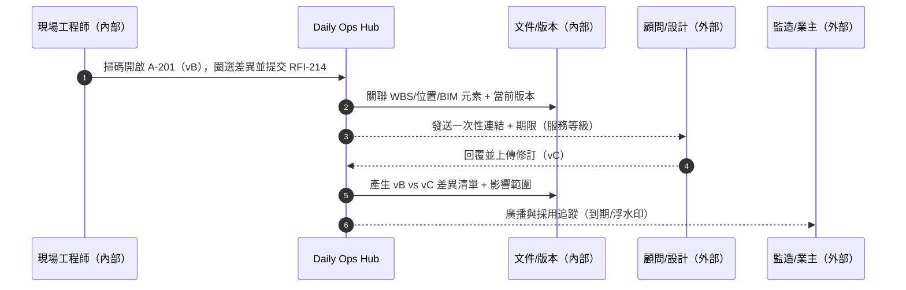
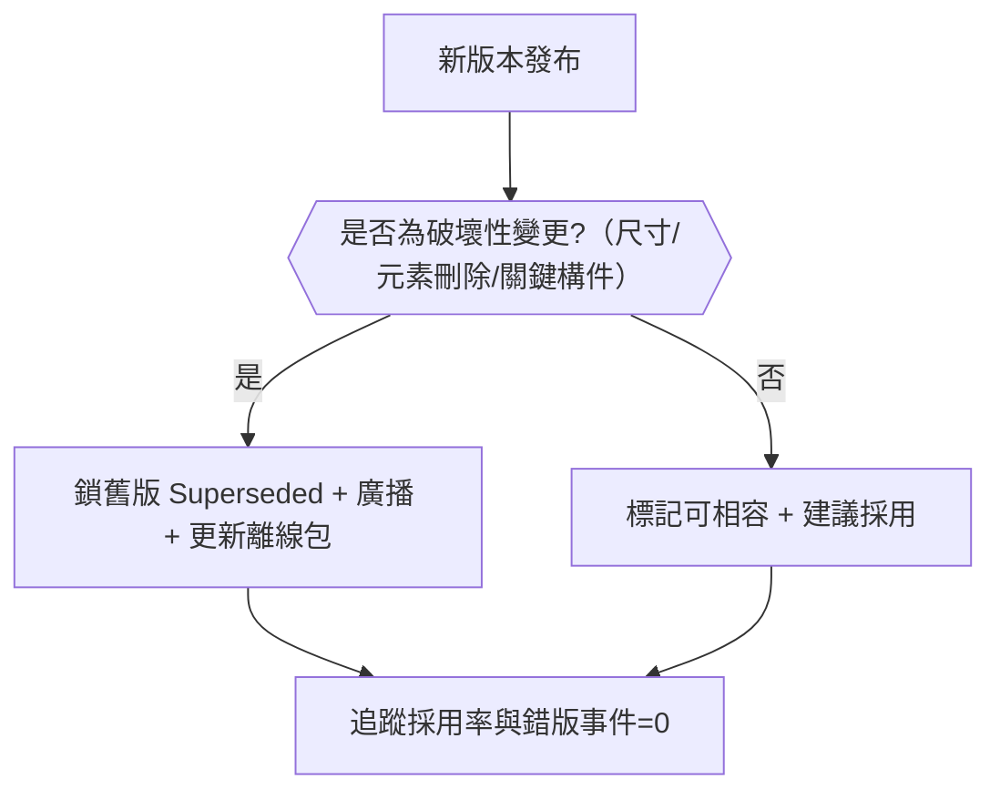
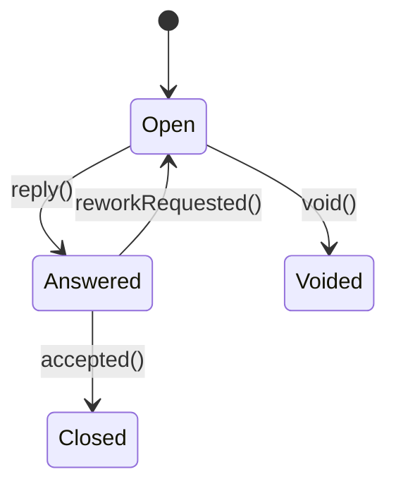
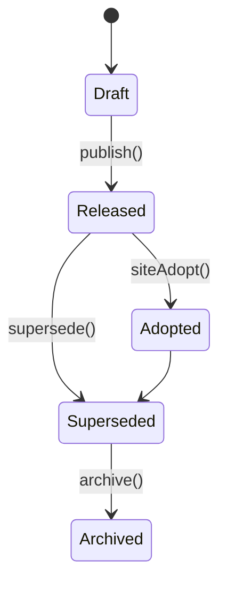

# Part 3c — 〈設計協調（RFI / 圖紙差異）〉卡片 詳規（Construction）
**版本**：v3.0  
**日期**：2025-09-20  
**對象**：專案經理（Project Manager）、現場工程師、文件管理、顧問/設計、監造/業主（受限視圖）  
**範圍**：本份文件針對首頁卡片「設計協調（RFI / 圖紙差異）」給出：平台內外使用者旅程（Mermaid 圖）、User Story、互動規格、資料模型、TypeScript 介面、OpenAPI 片段、高真 mock data、Playbook 決策表與規則語法、狀態圖、遙測、驗收、權限、效能與邊界情境。  
> 術語：資訊請求（Request For Information, RFI）、圖紙版本（Drawing Version）、建築資訊模型（Building Information Modeling, BIM）、工作分解結構（Work Breakdown Structure, WBS）、工程量清單（Bill of Quantities, BOQ）、服務等級協議（Service Level Agreement, SLA）。

---

## 1. 目標與價值
**目標**：把「**RFI 與圖紙/BIM 版本差異**」整合在一張可行動的卡片上，避免錯版施工、縮短澄清到變更的週期，將差異自動對映到 **WBS / 位置 / 系統分項**。

**北極星指標**
- 錯版施工事件 **0**（關鍵區域）  
- RFI → 變更草案 中位時間 **下降 ≥ 30%**  
- 新圖發布後 **48 小時內採用率 ≥ 95%**（含現場行動端離線包）

**次級成效**
- RFI 準時回覆率上升；BIM 衝突關閉週期下降；返工小時數下降。

---

## 2. 卡片 KPI 與排序邏輯
- **KPI 徽章**：`新發布圖數`、`未回覆 RFI 數`、`逾期 RFI 數`、`高影響差異數`。  
- **排序鍵 rank**：`rank = overdueFactor*0.5 + impactDelta*0.5`  
  - `overdueFactor = clamp(-remainingSeconds/86400, 0, 3)`  
  - `impactDelta = normalize(affectedWbsCount + affectedLocationCount + changedDims + removedElements + safetyAffected)`

---

## 3. User Stories（Gherkin）
**US-DC-01（現場工程師）**  
- Given 我在現場用手機打開此卡  
- When 我掃碼定位到 A-201，發現與現況不符，點「建立 RFI」並圈選差異  
- Then 系統自動帶入位置/WBS/相關元素與當前版本，建立 RFI 並開始服務等級倒數。

**US-DC-02（專案經理）**  
- Given 我在卡片看到新發布版本 vC 與 vB 的差異  
- When 我按「一鍵廣播 + 鎖舊版」  
- Then 系統將 vB 標記為 `Superseded`、生成「現場公告」與「離線包更新」，並在抽屜顯示採用率追蹤。

**US-DC-03（顧問/設計）**  
- Given 我收到逾期提醒與一次性分享連結  
- When 我在網頁版比較 vB vs vC，回覆 RFI 並附修訂說明  
- Then 系統將回覆、修訂說明與版本差異綁定，更新時間線並通知 PM。

**US-DC-04（商務經理）**  
- Given 某差異導致工程量改變且在關鍵路徑  
- When 我按「RFI → 變更草案」  
- Then 系統自動帶入差異影響（工程量/工期/成本初算）與證據鏈，送審。

---

## 4. 互動規格（Interaction Spec）
### 4.1 卡片結構
- **標題列**：`設計協調（RFI / 圖紙差異）` + KPI 徽章（新圖、未回覆、逾期、高影響差異）。  
- **工具列**：`Filter`（類型：RFI/圖/衝突、專業（建築/結構/機電）、圖紙號、位置、狀態、影響分）、`Sort`（rank、remainingSeconds、impactDelta）、`Bulk`（批量催辦、批量鎖舊版、批量發公告、RFI→變更草案）、`Pin`、`Export`、`Quick Add RFI`。  
- **主表格欄位**：`類型`（RFI/圖/衝突）、`標題/圖紙號`、`版本/狀態`（Open/Answered/Closed/Superseded）、`截止/倒數`、`差異指標`（新增/刪除/修改件數、尺寸變更、受影響 WBS/位置、EHS 受影響）、`責任人`、`主要動作`。  
- **右側抽屜（Drawer）**：
  - **Compare**：`Side-by-Side` / `Overlay` / `Split`；差異熱圖；元素清單（新增/刪除/修改/移動）。  
  - **Thread**：RFI 對話與回覆、@mention、SLA 時間線。  
  - **Evidence**：照片/影片/掃描、測量值、EXIF/GPS 指紋。  
  - **Relations**：WBS、位置、BIM 元素、相關工單（變更/IR/任務）。  
  - **Actions**：`廣播`、`鎖舊版`、`離線包`、`RFI→變更草案`、`建立會議`、`生成 Field Bulletin`。

### 4.2 快速操作（Inline）
- **廣播（Broadcast）**：對分包/業主/監造以多渠道（Email/SMS/IM）發布版本更新或澄清。  
- **鎖舊版（Lock Old）**：將舊版本標記為 `Superseded`，現場掃碼會跳轉到最新版本。  
- **RFI → 變更草案**：自動帶入差異、照片、工程量變動與工期影響估算。  
- **下載離線包**：把新版本與關聯附件打包，供弱網環境。  
- **建立會議**：產生 +2 小時協調會（可選擇參與者）。

### 4.3 空/錯誤/弱網
- **空狀態**：顯示近 7 天無差異高於門檻；提供「上傳/同步」與「建立 RFI」捷徑。  
- **弱網**：離線標注與 RFI 草稿，恢復上線自動推送；提供「離線包更新」提示。  
- **權限不足**：以只讀模式開啟比較，提供申請存取流程。

### 4.4 行動端（Mobile）
- 提供單指圈選與標注、拍照即關聯；支援「現況 vs 圖」疊圖手勢切換。

---

## 5. 低保真 Wireframe（僅此卡）
```text
┌─ 設計協調（RFI / 圖紙差異） NewDrawings:3 | 未回覆RFI:6 | 逾期:2 | 高影響:4 ────────┐
│ Filters:[類型 RFI/圖/衝突][專業][圖紙號][位置][狀態][影響分]  Sort: rank ▾  Bulk… │
├────────────────────────────────────────────────────────────────────────────────┤
│ 類型  標題/圖紙號      版本/狀態       截止/倒數   差異指標(增/刪/改/尺寸/受影響)  動作 │
│ 圖   A-201 vC vs vB    Released       —           12/5/34/7/3區/8WBS         [廣播/鎖] │
│ RFI  RFI-214 柱筋碰撞  Open           -06:00      相關元素 6 | 位置 B2-C5     [催/轉變更] │
│ 衝突 Clash-071         Open           12:00       交會 4 | 高風險 2         [建RFI]    │
└────────────────────────────────────────────────────────────────────────────────┘
▸ 點列 → Drawer: [Compare][Thread][Evidence][Relations][Actions]
```

---

## 6. 使用者旅程（Mermaid）
### 6.1 「現場發現差異」→ 建立 RFI → 顧問回覆 → 發布新圖（Sequence）


### 6.2 「新圖發布治理」→ 鎖舊版 + 廣播 + 離線包（Flow with gate）


---

## 7. 資料模型（Data Model）
### 7.1 實體與關聯（摘要）
- **RFI**：`id, title, status(Open|Answered|Closed|Voided), sla{dueAt, remainingSeconds}, owner, discipline, wbsId[], locationId[], drawingId, drawingVersion, attachments[], thread[], evidence[], suggestedChange?`  
- **DrawingVersion**：`id, sheetNo, title, versionTag, status(Draft|Released|Adopted|Superseded|Archived), publishedAt, supersedesId?, compatible(boolean)`  
- **CompareDelta**：`id, fromVersionId, toVersionId, metrics{added, removed, modified, dimChanged}, affected{wbsIds[], locationIds[], elementIds[]}, safetyAffected(boolean), impactScore(0..1)`  
- **ClashIssue**：`id, modelId, severity(Low|Medium|High), elementIds[], locationId, linkedRfiId?`  
- **ShareLink**：`id, targetType(Drawing|RFI|DeltaView), url, expiresAt, watermark, revoked`

### 7.2 TypeScript 介面（片段）
```ts
export type RfiStatus = "Open" | "Answered" | "Closed" | "Voided";
export type DrawingStatus = "Draft" | "Released" | "Adopted" | "Superseded" | "Archived";

export interface Rfi {
  id: string;
  title: string;
  status: RfiStatus;
  sla: { dueAt: string; remainingSeconds: number };
  owner: string;
  discipline: "ARC" | "STR" | "MEP" | "GEN";
  wbsIds: string[];
  locationIds: string[];
  drawingId: string;
  drawingVersion: string; // e.g., vB
  attachments?: string[];
  evidence?: { type: "PHOTO"|"VIDEO"|"DOC"|"MEASURE"; url: string; hash?: string }[];
  thread: { at: string; actor: string; text: string }[];
  suggestedChange?: { timeDays?: number; cost?: number; reason: string };
}

export interface DrawingVersion {
  id: string;
  sheetNo: string;
  title: string;
  versionTag: string; // vA/vB/vC
  status: DrawingStatus;
  publishedAt: string;
  supersedesId?: string;
  compatible?: boolean;
}

export interface CompareDelta {
  id: string;
  fromVersionId: string;
  toVersionId: string;
  metrics: { added: number; removed: number; modified: number; dimChanged: number };
  affected: { wbsIds: string[]; locationIds: string[]; elementIds: string[] };
  safetyAffected: boolean;
  impactScore: number; // 0..1
}

export type DesignRow =
  | { kind: "DRAWING"; sheetNo: string; from: string; to: string; status: DrawingStatus; delta: CompareDelta }
  | { kind: "RFI"; rfi: Rfi }
  | { kind: "CLASH"; clash: { id: string; severity: "Low"|"Medium"|"High"; elementIds: string[]; locationId?: string } };

export interface DesignCoordResponse {
  projectId: string;
  asOf: string;
  kpis: { newDrawings: number; rfiUnanswered: number; rfiOverdue: number; highImpactDeltas: number };
  rows: DesignRow[];
}
```

---

## 8. API 規格（OpenAPI 3.0 片段）
```yaml
openapi: 3.0.3
info: { title: Construction Hub – Design Coordination API, version: 3.0.0 }
paths:
  /projects/{{projectId}}/design/coord:
    get:
      summary: 設計協調卡片聚合（RFI + 圖紙差異 + 衝突）
      parameters:
        - in: path
          name: projectId
          required: true
          schema: { type: string }
        - in: query
          name: filter
          schema: { type: string, example: "type=RFI,DRAWING;discipline=ARC,MEP;impact>=0.6" }
        - in: query
          name: sort
          schema: { type: string, enum: ["rank","remainingSeconds","impact"] }
      responses:
        "200":
          description: OK
          content:
            application/json:
              schema: { $ref: "#/components/schemas/DesignCoordResponse" }
  /drawings/compare:
    post:
      summary: 兩版本比較
      requestBody:
        content:
          application/json:
            schema:
              type: object
              properties:
                fromVersionId: { type: string }
                toVersionId: { type: string }
      responses:
        "200":
          description: OK
          content:
            application/json:
              schema: { $ref: "#/components/schemas/CompareDelta" }
  /drawings/{{versionId}}/actions/lock:
    post: { summary: 將版本標記為 Superseded, responses: { "200": { description: Locked } } }
  /rfi:
    post: { summary: 建立 RFI, responses: { "201": { description: Created } } }
  /rfi/{{rfiId}}/reply:
    post: { summary: 顧問回覆 RFI, responses: { "200": { description: Replied } } }
  /rfi/{{rfiId}}/convert-change:
    post: { summary: RFI → 變更草案, responses: { "201": { description: Draft Created } } }
  /share-links:
    post:
      summary: 產生一次性分享連結（含到期/浮水印）
      requestBody:
        content:
          application/json:
            schema:
              type: object
              properties:
                targetType: { type: string, enum: [Drawing, RFI, DeltaView] }
                targetId: { type: string }
                expireHours: { type: integer, default: 72 }
                watermark: { type: boolean, default: true }
      responses: { "201": { description: Link Created } }
components:
  schemas:
    DesignCoordResponse:
      type: object
      properties:
        projectId: { type: string }
        asOf: { type: string, format: date-time }
        kpis:
          type: object
          properties:
            newDrawings: { type: integer }
            rfiUnanswered: { type: integer }
            rfiOverdue: { type: integer }
            highImpactDeltas: { type: integer }
        rows:
          type: array
          items: { type: object } # union，在前端以 kind 區分
    CompareDelta:
      type: object
      properties:
        id: { type: string }
        fromVersionId: { type: string }
        toVersionId: { type: string }
        metrics:
          type: object
          properties:
            added: { type: integer }
            removed: { type: integer }
            modified: { type: integer }
            dimChanged: { type: integer }
        affected:
          type: object
          properties:
            wbsIds: { type: array, items: { type: string } }
            locationIds: { type: array, items: { type: string } }
            elementIds: { type: array, items: { type: string } }
        safetyAffected: { type: boolean }
        impactScore: { type: number }
```

---

## 9. Mock Data（高真示例）
```json
{
  "projectId": "PRJ-001",
  "asOf": "2025-09-20T10:00:00Z",
  "kpis": { "newDrawings": 3, "rfiUnanswered": 6, "rfiOverdue": 2, "highImpactDeltas": 4 },
  "rows": [
    {
      "kind": "DRAWING",
      "sheetNo": "A-201",
      "from": "vB",
      "to": "vC",
      "status": "Released",
      "delta": {
        "id": "DEL-120",
        "fromVersionId": "A-201-vB",
        "toVersionId": "A-201-vC",
        "metrics": { "added": 12, "removed": 5, "modified": 34, "dimChanged": 7 },
        "affected": { "wbsIds": ["3.2.1","4.1.2"], "locationIds": ["B2-C5","L1-Atrium","L2-Corridor"], "elementIds": ["E-1001","E-2203","E-3301"] },
        "safetyAffected": true,
        "impactScore": 0.82
      }
    },
    {
      "kind": "RFI",
      "rfi": {
        "id": "RFI-214",
        "title": "B2 柱筋與管道碰撞，請求澄清",
        "status": "Open",
        "sla": { "dueAt": "2025-09-20T16:00:00Z", "remainingSeconds": -21600 },
        "owner": "顧問A",
        "discipline": "MEP",
        "wbsIds": ["3.2.1"],
        "locationIds": ["B2-C5"],
        "drawingId": "A-201",
        "drawingVersion": "vB",
        "attachments": ["photo://rfi214-1.jpg"],
        "evidence": [{ "type": "PHOTO", "url": "photo://rfi214-1.jpg" }],
        "thread": [{ "at": "2025-09-19T03:00:00Z", "actor": "FE-Lin", "text": "現況與圖不符，見附件" }]
      }
    },
    {
      "kind": "CLASH",
      "clash": { "id": "Clash-071", "severity": "High", "elementIds": ["Pipe-88","Beam-21"], "locationId": "B2-C5" }
    }
  ]
}
```

---

## 10. Playbook 決策表（Decision Table）
| 規則 | 條件 | 動作 | 附註 |
|---|---|---|---|
| PB-DC-01 | 發布新圖且 `impactScore ≥ 0.7` 或 `safetyAffected = true` | **鎖舊版** + **廣播** + **離線包更新** | 追蹤採用率至 ≥95% |
| PB-DC-02 | `RFI.remainingSeconds < 0` | 升級 + 建議建立協調會（+2h） | 並關聯到進度健康度 |
| PB-DC-03 | `RFI` 涉及關鍵路徑或工程量變動 | 產生 **RFI→變更草案** | 帶入工程量與工期估算 |
| PB-DC-04 | 衝突 `severity = High` 且影響區域已開工 | 立刻建立 RFI + 工區公告 | 阻止錯版施工 |
| PB-DC-05 | 工程師開啟 `Superseded` 版本 | 阻擋並跳轉最新版本；要求下載離線包 | 寫入審計 |

**規則語法（DSL 示意）**
```text
WHEN drawing.delta.impactScore >= 0.7 OR drawing.delta.safetyAffected
THEN lockOldVersion(), broadcast("New revision, action required"), issueOfflinePack()
```

---

## 11. 狀態圖（State Machine）
### 11.1 RFI


### 11.2 圖紙採用


---

## 12. 遙測（Telemetry）
- **RFI 漏斗**：建立 → 首次回覆 → 最終關閉（中位天數、90 分位）。  
- **採用率**：新圖發布後 48 小時採用率；錯版阻擋次數。  
- **比較互動**：Compare 檢視停留時間、差異標註數、導出的 Field Bulletin 數。

---

## 13. 驗收準則（Acceptance Criteria）
- 單張圖比較（10 萬元素）在 2 秒內載入差異指標（95 分位）；抽屜 Compare 互動 60 FPS。  
- 廣播與鎖舊版動作可在 200 毫秒內回應（入佇列）；離線包生成於背景完成並通知。  
- 抽查 30 筆 RFI/新圖，**證據鏈完整率 ≥ 98%**。  
- 錯版施工阻擋有效（Superseded → 阻擋 + 跳轉），無繞過路徑。

---

## 14. 權限（RBAC + ABAC）
- **PM/文件管理**：可發布/鎖舊版/廣播/離線包。  
- **工程師**：可建立 RFI、標註差異、下載離線包。  
- **顧問/設計**：可回覆 RFI、上傳修訂，無權發布或鎖。  
- **監造/業主**：只讀 + 受邀檢視。  
- 屬性：依學科（ARC/STR/MEP）、區域（Location）、標段、契約包授權。

---

## 15. 效能與可靠性
- 差異計算採預先索引與分區（依圖紙 / 元素類型）；前端虛擬化渲染。  
- Viewer 支援 **Overlay / Side-by-Side / Split** 模式切換；弱網預載縮圖與瓦片。  
- 版本鎖定與廣播走事件總線；採用率以匿名統計回寫。

---

## 16. 邊界情境（Edge Cases）
- 版本跳號或缺頁 → 以 `supersedesId` 追溯鏈，顯示缺漏警示。  
- 無 BIM 元素對映 → 僅以圖紙幾何差異與手動區域標註。  
- 外部顧問無法登入 → 使用一次性分享連結（到期/浮水印/只讀）。  
- 現場離線超過 72 小時 → 強制更新離線包後方可查看。

---

## 17. 本卡片輸出與下一步
- 與「風險與服務等級倒數」與「進度健康度」互通：RFI 逾期與高影響差異會自動出現在 Critical Alerts；What-if 補救包可回寫此卡。  
- **建議下一張**：〈材料 / 到貨 / 檢驗（Logistics & MIR/IR）〉。
