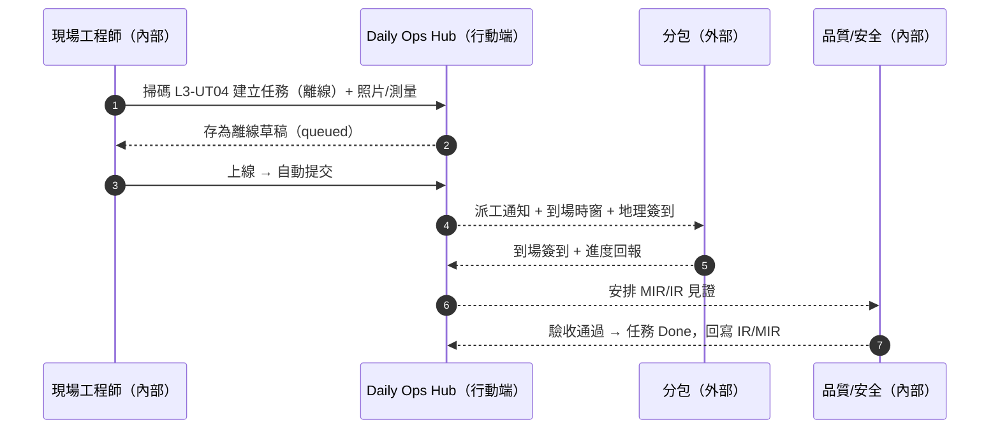
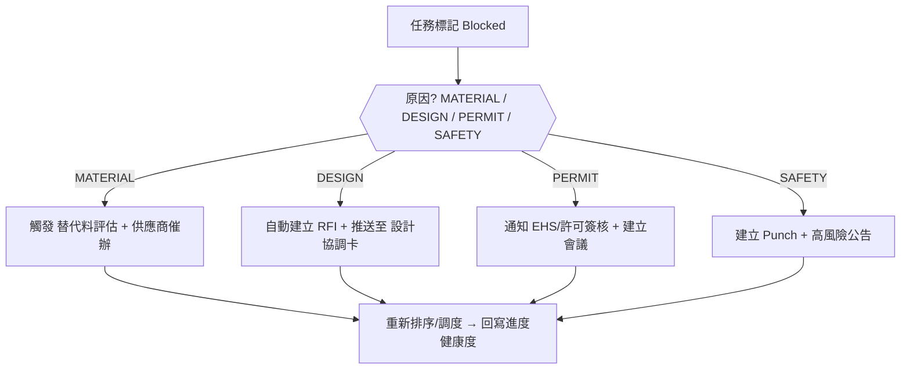
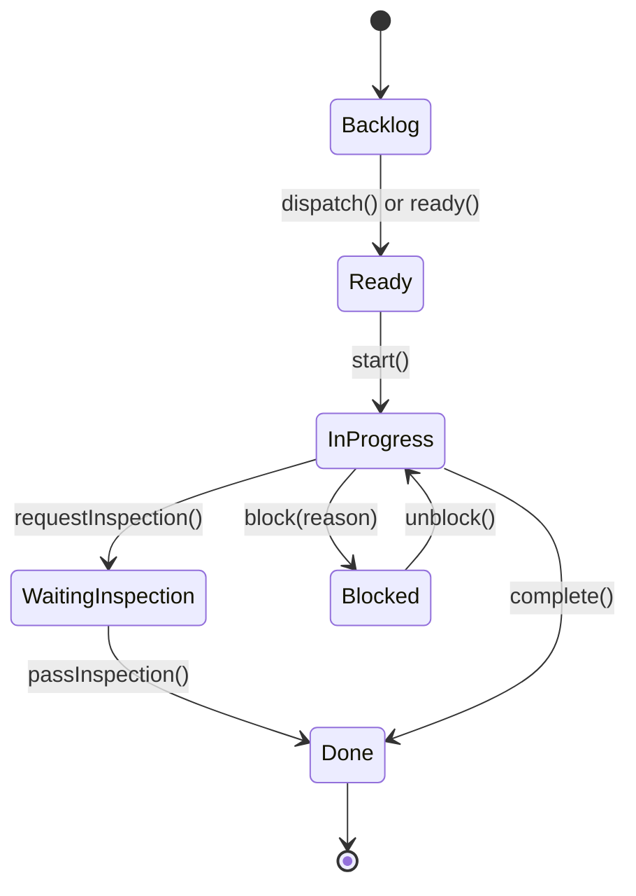

# Part 3d — 〈現場任務看板（Field Kanban）〉卡片 詳規（Construction）
**版本**：v3.0  
**日期**：2025-09-20  
**對象**：專案經理（Project Manager）、現場工程師/工地主任、品質/安全、材料/檢驗、分包與供應商（受限視圖）、監造/業主（唯讀）  
**範圍**：本文件針對首頁卡片「現場任務看板（Field Kanban）」給出：平台內外的使用者旅程（Mermaid 圖）、User Story、互動規格、資料模型、TypeScript 介面、OpenAPI 片段、高真 mock data、Playbook 決策表與規則語法、狀態圖、遙測、驗收、權限、效能與邊界情境。  
> 術語：工作分解結構（Work Breakdown Structure, WBS）、資訊請求（Request For Information, RFI）、檢驗申請（Inspection Request, IR）、材料進場檢驗（Material Inspection Request, MIR）、建築資訊模型（Building Information Modeling, BIM）、服務等級協議（Service Level Agreement, SLA）。

---

## 1. 目標與價值
**目標**：將**施工任務 / 巡檢 / 材料到貨與檢驗 / 測試點**等多源工作，整合成**一個可行動的看板**，支援行動端離線、掃碼、照片/測量回寫，並與 RFI / IR / 變更 / Punch / 進度健康度相互聯動。

**北極星指標**
- 任務從建立到首次行動（Time-to-First-Action）中位數 ≤ 10 分鐘  
- 被標記為 `Blocked` 的任務平均滯留時間 ↓ 40%（四週視窗）  
- 來源事件（IR/MIR/測試）**準時完成率 ≥ 90%**

**次級成效**
- 現場回寫時效 ↑；錯派、漏派 ↓；跨分包協同成本 ↓。

---

## 2. 卡片 KPI 與排序邏輯
- **KPI 徽章**：`今日到期`、`逾期`、`Blocked`、`等待檢驗`。  
- **排序鍵（rank）**：`rank = urgency*0.5 + impact*0.3 + proximity*0.2`
  - `urgency = clamp(-remainingSeconds/3600, 0, 24)`（小時級封頂 24）  
  - `impact` 由所屬 WBS 關鍵度、是否關鍵路徑、是否 EHS 相關組合而成（0–3）  
  - `proximity` 若帶地理座標，距離使用者位置越近分數越高（0–1）

---

## 3. User Stories（Gherkin）
**US-FK-01（現場工程師）**  
- Given 我在工區離線，掃碼到 `L3-Utility-04`  
- When 我建立「設備底座澆置」任務並附 2 張照片與尺寸  
- Then 任務進入 `Ready` 欄，關聯 WBS/位置/BIM 元素，恢復上線後自動提交並出現在看板。

**US-FK-02（專案經理）**  
- Given 我在看板篩選「本週到期 + 關鍵路徑」  
- When 我對 3 個任務執行「批量派工」並設定到場時窗與地理簽到  
- Then 分包收到通知並出現在其受限視圖；時間線紀錄派工與簽到。

**US-FK-03（品質/安全）**  
- Given 我看到 `等待檢驗` 欄位 5 筆 MIR/IR  
- When 我點進抽屜檢視證據並安排見證時間  
- Then 系統生成檢驗行程與提醒，完成後狀態自動切至 `Done`，並回寫 IR/MIR。

**US-FK-04（分包）**  
- Given 我收到派工且現場缺料  
- When 我在任務中回報 `Blocked: MATERIAL` 並建議替代料  
- Then 卡片在 PM 視圖置頂，觸發材料 Playbook（替代料評估 + 調度）。

---

## 4. 互動規格（Interaction Spec）
### 4.1 卡片結構（符合：標題、關鍵指標、主表格、快速操作、篩選、批量、Pin、右側抽屜）
- **標題列**：`現場任務看板` + KPI 徽章（今日到期/逾期/Blocked/等待檢驗）。  
- **工具列**：
  - `Filter`：任務類型（施工/巡檢/材料/測試/Permit/Meeting/安全）、WBS、位置、分包、到期、狀態、EHS、是否在關鍵路徑。  
  - `Group by`：`分包` / `工區（Location）` / `任務類型` / `WBS`。  
  - `Sort`：rank、到期、影響、距離。  
  - `Bulk Actions`：派工、催辦、改期、標記 Blocked、建立 Delay Notice（延誤通知）、建立協調會、轉工單（RFI/IR/變更/Punch）。  
  - `Pin to Top`、`Export`（CSV/Excel/離線包）。
- **主工作區**：看板欄位（預設）：`Backlog`｜`Ready`｜`In Progress`｜`Blocked`｜`Waiting Inspection`｜`Done`。  
- **任務卡片（縮圖）**：`標題`、`任務類型`、`到期倒數`、`WBS`、`位置`、`指派`（頭像或公司徽章）、`附件`小圖、`狀態徽章`、`Inline 動作`（開始/派工/催辦/標記Blocked/檢驗/完成）。  
- **右側抽屜（Drawer）**：
  - `Overview`（欄位/狀態/到期、WBS/位置/BIM 元素、關聯工單與證據）、
  - `Timeline`（簽到/照片/測量/派工/提醒/通話）、
  - `Checklist`（可配置檢核與 EHS 檢點）、
  - `Relations`（RFI/IR/變更/Permit/設備/材料批次）、
  - `Actions`（派工、改期、建立 IR/MIR、建立 RFI、建立 Punch、建立會議、建立 Delay Notice、上傳證據、完成/驗收）。

### 4.2 行動端（Mobile）
- 單欄看板；長按卡片開啟快捷動作；掃碼定位到任務或建立新任務；離線草稿佇列。

### 4.3 可及性（Accessibility）
- 鍵盤巡覽、ARIA 標籤、狀態以文字 + 圖標呈現；色盲友善。

---

## 5. 低保真 Wireframe（僅此卡）
```text
┌─ 現場任務看板  今日到期:12 | 逾期:5 | Blocked:3 | 等待檢驗:4 ──────────────────────┐
│ Filter[類型|WBS|位置|分包|到期|狀態|EHS]  Group by[分包]  Sort[rank]  Bulk[...]  Pin │
├─────────────────────────────────────────────────────────────────────────────────────┤
│ Backlog              Ready                 In Progress          Blocked             │
│ ┌[施工]L3電纜橋架…  ┌[巡檢]B2防火門…     ┌[施工]B2柱筋綁紮…  ┌[施工]B2模板拆除…      │
│  WBS 4.1  L3-UT04     WBS 6.2  B2-C5       WBS 3.2  B2-C5       WBS 3.1  B2-C3     │
│  Owner:分包甲  D-1    Due: 6h  Owner:QA     Due: 4h  Owner:乙   Blocked: MATERIAL  │
│  [派工][RFI]          [開始][檢驗]         [催辦][標阻]        [替代料][協調會]       │
│ Waiting Inspection   Done                                                                           │
│ ┌[MIR]鋼筋批見證…     ┌[巡檢]L2樓梯整改完成…                                                  │
│  Due: 2h  Owner:QC     Photo×3  筆記×1                                                           │
└─────────────────────────────────────────────────────────────────────────────────────┘
▸ 點卡 → Drawer: Overview / Timeline / Checklist / Relations / Actions
```

---

## 6. 使用者旅程（Mermaid；平台內/外）
### 6.1 「掃碼建任務並離線提交」→ 派工 → 完工驗收（Sequence）


### 6.2 「任務 Blocked」→ 自動轉單與升級（Flow with gates）


---

## 7. 資料模型（Data Model）
### 7.1 實體與關聯（摘要）
- **TaskCard**：`id, type(CONSTRUCT|INSPECTION|MATERIAL|TEST|PERMIT|MEETING|SAFETY), title, status, dueAt, remainingSeconds, wbsId, locationId, bimElementIds[], assignees[{userId|vendorId}], checklistId?, attachments[], rank, ehsFlag, onCriticalPath`  
- **TaskChecklist**：`id, items[{id, text, required, doneAt?, doneBy?}], templateId?, ehsGate?`  
- **TaskTimeline**：`id, taskId, at, actor, kind(CREATE|ASSIGN|DISPATCH|CHECKIN|PHOTO|MEASURE|COMMENT|BLOCKED|UNBLOCK|INSPECT|DONE), payload`  
- **TaskRelation**：`taskId -> { rfiId?, irId?, mirId?, changeId?, permitId?, punchId? }`  
- **GeoTag**：`taskId, lat, lng, radius, checkinRequired`

### 7.2 TypeScript 介面（片段）
```ts
export type TaskType = "CONSTRUCT" | "INSPECTION" | "MATERIAL" | "TEST" | "PERMIT" | "MEETING" | "SAFETY";
export type TaskStatus = "Backlog" | "Ready" | "InProgress" | "Blocked" | "WaitingInspection" | "Done";
export type BlockReason = "MATERIAL" | "DESIGN" | "PERMIT" | "SAFETY" | "OTHER";

export interface TaskCard {
  id: string;
  type: TaskType;
  title: string;
  status: TaskStatus;
  dueAt?: string;
  remainingSeconds?: number;
  wbsId?: string;
  locationId?: string;
  bimElementIds?: string[];
  assignees?: { userId?: string; vendorId?: string; name?: string; avatarUrl?: string }[];
  checklistId?: string;
  attachments?: { type: "PHOTO"|"VIDEO"|"DOC"|"MEASURE"; url: string; hash?: string }[];
  rank?: number;
  ehsFlag?: boolean;
  onCriticalPath?: boolean;
  block?: { reason: BlockReason; note?: string; at?: string };
  geo?: { lat: number; lng: number; radius?: number; checkinRequired?: boolean };
  actionsAllowed?: string[];
  relations?: { rfiId?: string; irId?: string; mirId?: string; changeId?: string; permitId?: string; punchId?: string };
}

export interface KanbanColumn {
  id: string;
  title: string;
  wipLimit?: number;
  status: TaskStatus;
  taskIds: string[];
}

export interface KanbanBoardResponse {
  projectId: string;
  asOf: string;
  kpis: { dueToday: number; overdue: number; blocked: number; waitingInspection: number };
  groupBy: "VENDOR" | "LOCATION" | "TYPE" | "WBS";
  groups: { key: string; title: string; columns: KanbanColumn[]; }[];
  tasks: Record<string, TaskCard>;
}
```

---

## 8. API 規格（OpenAPI 3.0 片段）
```yaml
openapi: 3.0.3
info: { title: Construction Hub – Field Kanban API, version: 3.0.0 }
paths:
  /projects/{{projectId}}/kanban:
    get:
      summary: 取得現場任務看板資料（含 KPI 與群組/欄位/任務）
      parameters:
        - in: path
          name: projectId
          required: true
          schema: { type: string }
        - in: query
          name: groupBy
          schema: { type: string, enum: [VENDOR,LOCATION,TYPE,WBS], default: VENDOR }
        - in: query
          name: filter
          schema: { type: string, example: "type=CONSTRUCT,INSPECTION;status=!Done;dueWithin=48h" }
      responses:
        "200":
          description: OK
          content:
            application/json:
              schema: { $ref: "#/components/schemas/KanbanBoardResponse" }
  /tasks:
    post:
      summary: 建立任務（支援行動端離線後補）
      requestBody:
        content:
          application/json:
            schema: { $ref: "#/components/schemas/TaskCard" }
      responses: { "201": { description: Created } }
  /tasks/{{taskId}}:
    patch:
      summary: 更新任務（狀態/欄位/指派/地理簽到要求等）
      responses: { "200": { description: Updated } }
  /tasks/{{taskId}}/move:
    post:
      summary: 拖拉移動任務至另一欄（狀態轉移，檢查 WIP 與 Gate）
      requestBody:
        content:
          application/json:
            schema:
              type: object
              properties:
                toStatus: { type: string, enum: [Backlog,Ready,InProgress,Blocked,WaitingInspection,Done] }
      responses:
        "200": { description: Moved }
        "409": { description: Gate not satisfied or WIP limit exceeded }
  /tasks/{{taskId}}/actions/dispatch:
    post:
      summary: 派工（分包或個人）
      requestBody:
        content:
          application/json:
            schema:
              type: object
              properties:
                assignees: { type: array, items: { type: object, properties: { vendorId: {type: string}, userId: {type: string} } } }
                etaStart: { type: string, format: date-time }
                etaEnd: { type: string, format: date-time }
                requireGeoCheckin: { type: boolean, default: true }
      responses: { "200": { description: Dispatched } }
  /tasks/{{taskId}}/actions/block:
    post:
      summary: 標記 Blocked（自動觸發對應 Playbook）
      requestBody:
        content:
          application/json:
            schema:
              type: object
              properties:
                reason: { type: string, enum: [MATERIAL,DESIGN,PERMIT,SAFETY,OTHER] }
                note: { type: string }
      responses: { "200": { description: Blocked set } }
  /tasks/{{taskId}}/actions/convert:
    post:
      summary: 轉工單（建立 RFI / IR / MIR / Punch / 變更草案）
      requestBody:
        content:
          application/json:
            schema:
              type: object
              properties:
                to: { type: string, enum: [RFI,IR,MIR,PUNCH,CHANGE] }
      responses: { "201": { description: Converted } }
components:
  schemas:
    TaskCard:
      type: object
      properties:
        id: { type: string }
        type: { type: string, enum: [CONSTRUCT,INSPECTION,MATERIAL,TEST,PERMIT,MEETING,SAFETY] }
        title: { type: string }
        status: { type: string, enum: [Backlog,Ready,InProgress,Blocked,WaitingInspection,Done] }
        dueAt: { type: string, format: date-time }
        remainingSeconds: { type: integer }
        wbsId: { type: string }
        locationId: { type: string }
        bimElementIds: { type: array, items: { type: string } }
        assignees:
          type: array
          items: { type: object, properties: { userId: {type: string}, vendorId: {type: string}, name: {type: string}, avatarUrl: {type: string} } }
        checklistId: { type: string }
        attachments:
          type: array
          items: { type: object, properties: { type: {type: string}, url: {type: string}, hash: {type: string} } }
        rank: { type: number }
        ehsFlag: { type: boolean }
        onCriticalPath: { type: boolean }
        block:
          type: object
          properties:
            reason: { type: string }
            note: { type: string }
            at: { type: string, format: date-time }
        geo:
          type: object
          properties:
            lat: { type: number }
            lng: { type: number }
            radius: { type: number }
            checkinRequired: { type: boolean }
    KanbanBoardResponse:
      type: object
      properties:
        projectId: { type: string }
        asOf: { type: string, format: date-time }
        kpis:
          type: object
          properties:
            dueToday: { type: integer }
            overdue: { type: integer }
            blocked: { type: integer }
            waitingInspection: { type: integer }
        groupBy: { type: string }
        groups:
          type: array
          items:
            type: object
            properties:
              key: { type: string }
              title: { type: string }
              columns:
                type: array
                items:
                  type: object
                  properties:
                    id: { type: string }
                    title: { type: string }
                    wipLimit: { type: integer }
                    status: { type: string }
                    taskIds: { type: array, items: { type: string } }
        tasks:
          type: object
          additionalProperties: { $ref: "#/components/schemas/TaskCard" }
```

---

## 9. Mock Data（高真示例）
```json
{
  "projectId": "PRJ-001",
  "asOf": "2025-09-20T10:30:00Z",
  "kpis": { "dueToday": 12, "overdue": 5, "blocked": 3, "waitingInspection": 4 },
  "groupBy": "VENDOR",
  "groups": [
    {
      "key": "VEN-A",
      "title": "分包甲",
      "columns": [
        { "id": "col-b", "title": "Backlog", "wipLimit": 20, "status": "Backlog", "taskIds": ["T-100","T-130"] },
        { "id": "col-r", "title": "Ready", "wipLimit": 15, "status": "Ready", "taskIds": ["T-210"] },
        { "id": "col-p", "title": "In Progress", "wipLimit": 10, "status": "InProgress", "taskIds": ["T-321"] },
        { "id": "col-blk", "title": "Blocked", "wipLimit": 5, "status": "Blocked", "taskIds": ["T-204"] },
        { "id": "col-wi", "title": "Waiting Inspection", "wipLimit": 8, "status": "WaitingInspection", "taskIds": ["T-402"] },
        { "id": "col-d", "title": "Done", "wipLimit": 9999, "status": "Done", "taskIds": ["T-080"] }
      ]
    }
  ],
  "tasks": {
    "T-100": { "id": "T-100", "type": "CONSTRUCT", "title": "L3 電纜橋架安裝", "status": "Backlog", "wbsId": "4.1.2", "locationId": "L3-UT04", "assignees": [{"vendorId":"VEN-A","name":"分包甲"}], "dueAt": "2025-09-22T09:00:00Z" },
    "T-130": { "id": "T-130", "type": "INSPECTION", "title": "B2 防火門巡檢", "status": "Backlog", "wbsId": "6.2.1", "locationId": "B2-C5", "assignees": [{"userId":"QA-01","name":"QA 劉"}], "dueAt": "2025-09-21T13:00:00Z" },
    "T-210": { "id": "T-210", "type": "MATERIAL", "title": "鋼筋批 MIR 見證", "status": "Ready", "wbsId": "3.1.4", "locationId": "Yard-1", "assignees": [{"userId":"QC-02","name":"QC 張"}], "dueAt": "2025-09-20T16:00:00Z" },
    "T-321": {
      "id": "T-321",
      "type": "CONSTRUCT",
      "title": "B2 柱筋綁紮",
      "status": "InProgress",
      "dueAt": "2025-09-20T14:00:00Z",
      "remainingSeconds": 14400,
      "wbsId": "3.2.1",
      "locationId": "B2-C5",
      "assignees": [{"vendorId":"VEN-A","name":"分包甲"}],
      "onCriticalPath": true,
      "attachments": [{"type":"PHOTO","url":"photo://t321-1.jpg"}],
      "relations": {"rfiId":"RFI-214"}
    },
    "T-204": {
      "id": "T-204",
      "type": "CONSTRUCT",
      "title": "地下室模板拆除",
      "status": "Blocked",
      "dueAt": "2025-09-19T12:00:00Z",
      "remainingSeconds": -3600,
      "wbsId": "3.1.4",
      "locationId": "B2-C3",
      "assignees": [{"vendorId":"VEN-A","name":"分包甲"}],
      "block": {"reason":"MATERIAL","note":"缺 M20 支撐件"}
    },
    "T-402": { "id": "T-402", "type": "TEST", "title": "消防栓水壓測試", "status": "WaitingInspection", "wbsId":"6.1.3", "locationId":"L2-Atrium", "assignees":[{"userId":"QA-02","name":"QA 王"}], "dueAt":"2025-09-21T09:00:00Z" },
    "T-080": { "id": "T-080", "type": "MEETING", "title": "分包協調會（週）", "status": "Done", "dueAt": "2025-09-18T08:00:00Z" }
  }
}
```

---

## 10. Playbook 決策表（Decision Table）
| 規則 | 條件 | 動作 | 附註 |
|---|---|---|---|
| PB-FK-01 | `status=Blocked AND reason=MATERIAL` | 產生替代料評估 + 供應商催辦；同步「材料/到貨/檢驗」卡 | 連動 MIR/採購 |
| PB-FK-02 | `status=Blocked AND reason=DESIGN` | 建立 RFI + 推送至「設計協調」卡 + 升級 | 帶入照片/位置 |
| PB-FK-03 | `status=WaitingInspection AND due<4h` | 催辦檢驗 + 排程見證 + 地理簽到要求 | 通知 QC/監造 |
| PB-FK-04 | `onCriticalPath=true AND overdue` | 置頂 + 建立協調會（+2h） + 生成延誤通知草案 | 回寫進度健康度 |
| PB-FK-05 | `type=SAFETY AND ehsFlag=true` | 立即公告 + 建立 Punch + 指派整改 | 高風險流程 |

**規則語法（DSL 示意）**
```text
WHEN task.status = "Blocked" AND task.block.reason = "MATERIAL"
THEN createAltMaterialEvaluation(task), notifyVendor(task.assignees), linkToLogistics(task)
```

---

## 11. 狀態圖（State Machine）


---

## 12. 遙測（Telemetry）
- **看板漏斗**：建立 → 派工/開始 → 首次回寫 → 檢驗 → 完成（Lead/Cycle/Blocked 時間分佈）。  
- **WIP 與超限**：各欄位在製品數與 WIP 超限次數。  
- **阻礙原因構成**：MATERIAL / DESIGN / PERMIT / SAFETY 百分比與平均滯留。  
- **任務觸發轉單比**：任務→RFI/IR/MIR/Punch/變更的轉換率與週期。

---

## 13. 驗收準則（Acceptance Criteria）
- 1,000 張任務卡、6 欄看板在 600ms（95 分位）內首屏呈現；拖拉移動回應 < 150ms。  
- 離線草稿提交成功率 ≥ 99%；地理簽到誤差半徑可配置，重試機制完善。  
- 抽查 30 筆，時間線與證據鏈完整率 ≥ 98%。  
- 無障礙：鍵盤可完成拖拉替代操作（提供 Move 菜單）；螢幕閱讀器宣告欄位與狀態。

---

## 14. 權限（RBAC + ABAC）
- **PM/工程師**：建立/編輯/派工/改期/轉單/完成。  
- **品質/安全**：可安排檢驗、標記安全事件、打開 EHS 檢核。  
- **分包/供應商**：受限視圖（僅可見自身任務與必要上下文）；需地理簽到。  
- **監造/業主**：唯讀；可接收一次性分享連結（到期/浮水印）。  
- 依 Project / WBS / Location / Contract Package 進行屬性授權。

---

## 15. 效能與可靠性
- **CQRS 讀模型**聚合；前端虛擬滾動；WebSocket/SSE 推播任務變更。  
- 手機端圖片壓縮、背景上傳與重試；離線同步採三向合併。  
- 欄位 WIP Limit 與 Gate 以規則引擎實作，可灰度發布。

---

## 16. 邊界情境（Edge Cases）
- **雙指派**（個人 + 分包）→ 優先以分包顯示，個人作為子任務負責；避免重覆通知。  
- **跨區域任務** → 支援多 Location 標註，抽屜以清單呈現並提供分解。  
- **時區/夏令時間** → 以專案時區為準，客端顯示本地時區；到期以 ISO 儲存。  
- **重覆建立** → 以 QR/位置/WBS/時間窗口相似度偵測並建議合併。

---

## 17. 本卡片輸出與下一步
- 與「進度健康度」「材料/到貨/檢驗」「設計協調」「風險與服務等級倒數」緊密互通；任務回寫影響進度與風險排序。  
- **建議下一張**：〈材料 / 到貨 / 檢驗（Logistics & MIR/IR）〉或〈品質與安全整改（Quality & EHS Actions）〉。
