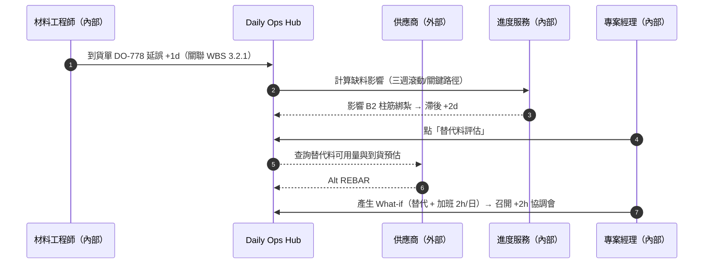
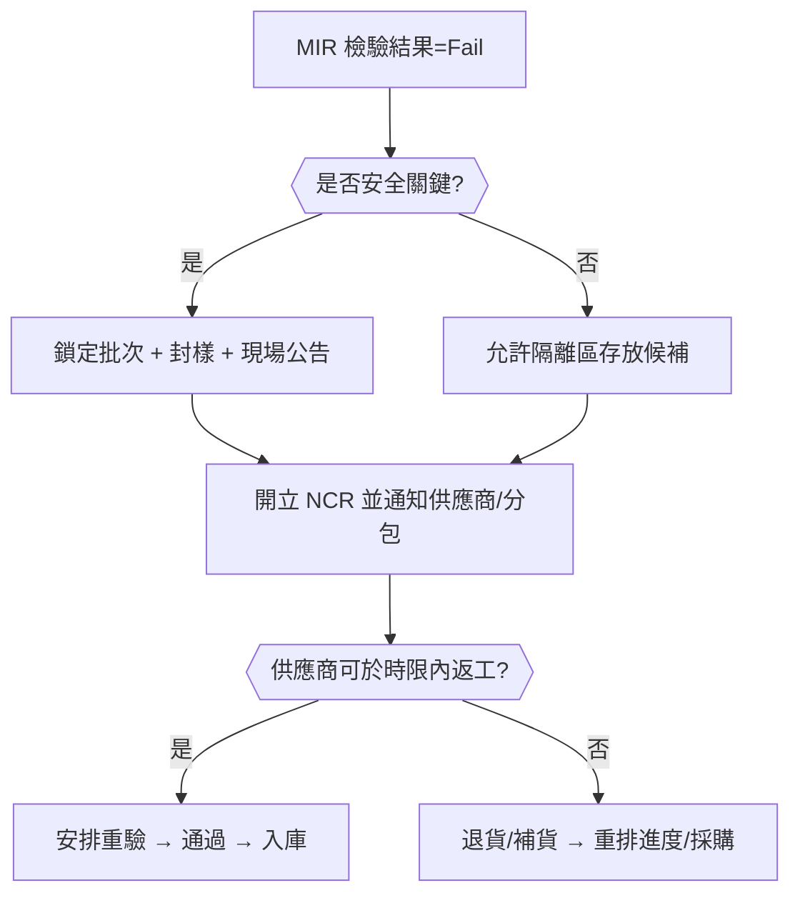
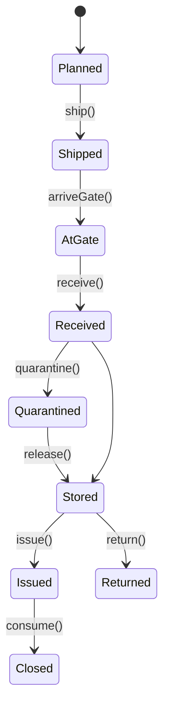
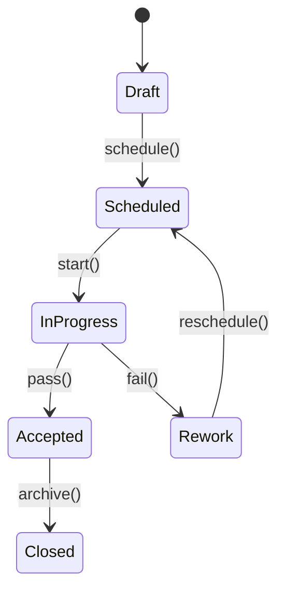
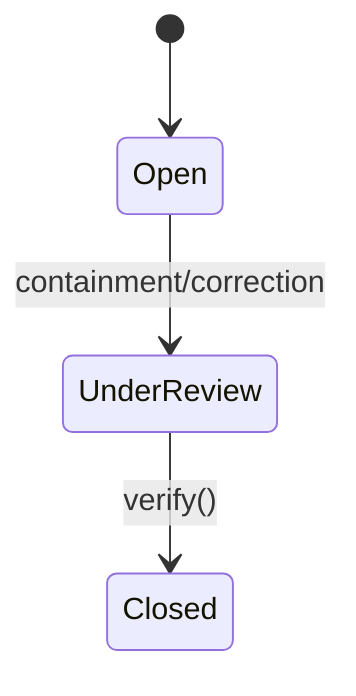

# Part 3e — 〈材料 / 到貨 / 檢驗（Logistics & MIR/IR）〉卡片 詳規（Construction）
**版本**：v3.0  
**日期**：2025-09-20  
**對象**：專案經理（Project Manager）、材料工程師/倉管、品質（Quality Control, QC）/監造、分包/供應商、商務/合約、現場工程師  
**範圍**：本文件針對首頁卡片「材料 / 到貨 / 檢驗（Logistics & Material/Inspection Request, MIR/IR）」給出：平台內外的使用者旅程（Mermaid 圖）、User Story、互動規格（含快速/批量/Pin/抽屜）、資料模型、TypeScript 介面、OpenAPI 片段、高真 mock data、Playbook 決策表與規則語法、狀態圖、遙測、驗收、權限、效能與邊界情境。  
> 術語：材料進場檢驗（Material Inspection Request, MIR）、檢驗申請（Inspection Request, IR）、工作分解結構（Work Breakdown Structure, WBS）、工程量清單（Bill of Quantities, BOQ）、不符合報告（Nonconformance Report, NCR）、請購/採購單（Purchase Requisition/Purchase Order, PR/PO）、貨到付款節點（Payment Milestone）、建築資訊模型（Building Information Modeling, BIM）。

---

## 1. 目標與價值
**目標**：確保「**到貨如期、品質合格、資料齊全**」，並自動把材料事件連動到**進度（Schedule）**與**付款（Payment）**，降低停工風險與現金流壓力。

**北極星指標**
- 準時到貨率（On-Time Delivery, OTD）≥ 95%  
- MIR/IR 一次合格率 ≥ 90%；不符合報告（NCR）率 ≤ 3%  
- 材料引致的停工小時數（Stoppage Hours due to Materials）下降 ≥ 40%（四週）  
- 到貨→付款里程碑自動對齊率 ≥ 90%

**次級成效**
- 缺料預警提前 ≥ 72 小時；延誤歸因可追溯率 ≥ 98%；倉儲占用與呆料下降。

---

## 2. 卡片 KPI 與排序邏輯
- **KPI 徽章**：`今日到貨/本週到貨`、`缺料風險`、`等待檢驗（MIR/IR）`、`NCR 開立`、`付款可觸發`。  
- **排序鍵（rank）**：`rank = lateness*0.45 + risk*0.35 + impact*0.2`
  - `lateness = clamp(-remainingSeconds/86400, 0, 7)`（以日封頂 7）  
  - `risk`：停工風險（關聯在關鍵路徑工項 + 缺料替代困難度 + 現場庫存天數）→ 0..3  
  - `impact`：關聯 WBS 權重 × 金額 × 批量/序號重要度 → 0..2

---

## 3. User Stories（Gherkin）
**US-LM-01（材料工程師）**  
- Given 我在卡片看到「今日到貨 8、等待檢驗 5」  
- When 我批量建立 MIR 與 IR 的見證時窗，並要求地理簽到  
- Then 供應商/分包收到通知，行動端簽到後即可開始檢驗；檢驗完成自動回寫。

**US-LM-02（現場工程師）**  
- Given 地下室澆置工項 D-031 需要鋼筋批次 M-REBAR-09，但尚未到貨  
- When 我按「替代料評估」  
- Then 系統顯示可用替代料與到貨預估、對應設計/監造審批流；採用後自動調整三週滾動計畫。

**US-LM-03（品質 QC）**  
- Given MIR Fail 1 筆且涉及安全構件  
- When 我在抽屜按「開立 NCR + 即時封樣」  
- Then 系統鎖定該批次，通知供應商返工/重驗，並在現場任務看板自動建立整改。

**US-LM-04（商務/合約）**  
- Given MIR Accepted 且數量達付款節點 70%  
- When 我按「建立產值申請草案」  
- Then 系統引用 MIR/送貨單/測試報告，產生對應項目的產值申請並送審，與 ERP 同步。

**US-LM-05（專案經理）**  
- Given 缺料風險指標達紅且影響關鍵路徑  
- When 我按「重排 + 臨時協調會」  
- Then 系統生成 What-if（重排序/並行）與 +2 小時會議；關聯到進度健康度與風險卡。

---

## 4. 互動規格（Interaction Spec）
### 4.1 卡片結構（符合：標題、關鍵指標、主表格、快速操作、篩選、批量、Pin、抽屜）
- **標題列**：`材料 / 到貨 / 檢驗` + KPI 徽章（今日到貨/缺料風險/等待檢驗/NCR/付款可觸發）。  
- **工具列**：
  - `Filter`：類型（到貨/待檢/MIR/IR/NCR/付款）、供應商、分包、WBS、位置、到期（到貨/檢驗視窗）、狀態（Shipped/AtGate/Received/Accepted/Quarantined/Rejected）、EHS 風險。  
  - `Sort`：rank、到貨遲延、停工風險、金額。  
  - `Group by`：供應商 / 分包 / 類型 / WBS / 位置。  
  - `Bulk Actions`：建立 MIR/IR 見證、催辦到貨、替代料評估、重排/協調會、開立產值申請草案、產生 Delay Notice。  
  - `Pin to Top`、`Export`（CSV/Excel/審計 PDF）。
- **主表格欄位（預設）**：`類型`（Delivery/MIR/IR/NCR/Payment）、`標題/編號`、`關聯 WBS/位置`、`到貨 vs 計畫`（日期/數量/差異 %）、`MIR/IR 狀態`、`停工風險`、`供應商/分包`、`金額/付款節點`、`主要動作`。  
- **右側抽屜（Drawer）**：
  - `Overview`：批次/序號、規格牌告、合格證、測試報告、相片；到貨/檢驗/入庫/領用流水。  
  - `Timeline`：催運、在途、到門崗、收貨、檢驗、封樣、NCR、入庫/發料、付款節點。  
  - `Risks & What-if`：缺料對進度的影響、替代料/重排/加班的模擬。  
  - `Relations`：PR/PO、合同分包、RFI/變更、IR/MIR、進度工項、任務、付款申請。  
  - `Actions`：`建立 MIR/IR`、`替代料評估`、`生成 Delay Notice`、`開立 NCR`、`重排/協調會`、`建立產值申請草案`。

### 4.2 行動端（Mobile）
- 「掃碼到貨」：掃描貨標或 QR → 新建收貨/MIR → 拍照與 GPS 指紋；離線佇列。  
- 「快速檢驗」：指引檢核表、逐項打勾、即拍即傳；Fail 自動要求封樣與標籤。

### 4.3 可及性（Accessibility）
- 表格 + 卡片切換；鍵盤操作；狀態有文字與圖示雙標；色盲友善。

---

## 5. 低保真 Wireframe（僅此卡）
```text
┌─ 材料 / 到貨 / 檢驗  今日到貨:8 | 缺料風險:3 | 等待檢驗:5 | NCR:1 | 付款可觸發:4 ───────────┐
│ Filter[類型|供應商|分包|WBS|位置|到期|狀態] Group by[供應商] Sort[rank] Bulk[...] Pin │
├─────────────────────────────────────────────────────────────────────────────────────┤
│ 類型  編號/標題        WBS/位置        到貨vs計畫    MIR/IR狀態   風險  供應商  金額/付款  動作 │
│ 到貨  DO-778 REBAR#9  3.2.1 B2-C5     09/20 vs 09/19 (+1d)  —     高   鋼材A  节點70%  [檢驗/替代] │
│ MIR   MIR-77 鋼筋批    3.1.4 Yard-1    —             待見證       中   —      —        [排時窗]   │
│ IR    IR-402 水壓測試  6.1.3 L2        —             安排09/21     中   —      —        [改期]     │
│ NCR   NCR-12 鋼筋外徑  3.2.1 B2-C5     —             —            高   鋼材A  —        [封樣/返工] │
└─────────────────────────────────────────────────────────────────────────────────────┘
▸ 點列 → Drawer: Overview / Timeline / Risks & What-if / Relations / Actions
```

---

## 6. 使用者旅程（Mermaid；平台內/外）
### 6.1 「到貨延誤」→ 缺料風險 → 替代料/重排/協調會（Sequence）


### 6.2 「MIR Fail」→ 開立 NCR → 鎖批次 → 返工/重驗（Flow with gates）


---

## 7. 資料模型（Data Model）
### 7.1 實體與關聯（摘要）
- **DeliveryOrder**：`id, poId, vendorId, title, plannedAt, etaAt, atGateAt?, receivedAt?, quantityPlanned, quantityReceived?, unit, locationId, wbsIds[], status(Planned|Shipped|AtGate|Received|Quarantined|Stored|Issued|Closed), docs{packingList, millCerts[], testReports[]}, amount?, paymentMilestone?`  
- **MaterialBatch**：`id, materialCode, spec, lotNo, serials[], mfgDate?, expiryDate?, certificates[], status(Free|Quarantined|Rejected|Consumed|Returned)`  
- **MIR**：`id, batchId, doId, wbsIds[], locationId, requester, scheduledAt?, startedAt?, finishedAt?, result(Pass|Fail|NA), inspectors[], checklistItems[{id,text,required,ok?,note?}], photos[], ncrId?`  
- **IR**：`id, title, wbsId, locationId, type(Work|Test), scheduledAt?, result(Pass|Fail|NA), photos[], reportUrl?`  
- **NCR**：`id, title, batchId?, irId?, severity(Low|Medium|High|Critical), actions[Containment|Correction|Corrective], dueAt, status(Open|UnderReview|Closed)`  
- **InventoryTxn**：`id, batchId, type(Receive|Move|Issue|Return|Adjust|Scrap), qty, fromLoc?, toLoc?, at, refId?`  
- **PaymentLink**：`id, poId, milestoneName, thresholdPct, achievedPct, evidence{mirIds[], doIds[], testReports[]}, status(NotReady|Ready|Submitted|Approved|Paid)`

### 7.2 TypeScript 介面（片段）
```ts
export type DeliveryStatus = "Planned"|"Shipped"|"AtGate"|"Received"|"Quarantined"|"Stored"|"Issued"|"Closed";
export type MirResult = "Pass"|"Fail"|"NA";
export type NcrSeverity = "Low"|"Medium"|"High"|"Critical";

export interface DeliveryOrder {
  id: string; poId: string; vendorId: string; title: string;
  plannedAt: string; etaAt?: string; atGateAt?: string; receivedAt?: string;
  quantityPlanned: number; quantityReceived?: number; unit: string;
  locationId?: string; wbsIds?: string[]; status: DeliveryStatus;
  docs?: { packingList?: string; millCerts?: string[]; testReports?: string[] };
  amount?: number; paymentMilestone?: { name: string; thresholdPct: number; achievedPct: number };
  risk?: { stoppage: 0|1|2|3; onCriticalPath?: boolean; inventoryDays?: number };
  actionsAllowed?: string[];
}

export interface MaterialBatch {
  id: string; materialCode: string; spec?: string; lotNo?: string;
  serials?: string[]; certificates?: string[]; status: "Free"|"Quarantined"|"Rejected"|"Consumed"|"Returned";
}

export interface MIR {
  id: string; batchId?: string; doId?: string; wbsIds?: string[]; locationId?: string;
  requester: string; scheduledAt?: string; startedAt?: string; finishedAt?: string;
  result?: MirResult; inspectors?: string[];
  checklistItems?: { id: string; text: string; required: boolean; ok?: boolean; note?: string }[];
  photos?: { url: string; hash?: string }[]; ncrId?: string;
}

export interface IR {
  id: string; title: string; wbsId: string; locationId?: string; type: "Work"|"Test";
  scheduledAt?: string; result?: MirResult; photos?: { url: string }[]; reportUrl?: string;
}

export interface NCR {
  id: string; title: string; batchId?: string; irId?: string; severity: NcrSeverity;
  actions: ("Containment"|"Correction"|"Corrective")[]; dueAt: string; status: "Open"|"UnderReview"|"Closed";
}

export interface PaymentLink {
  id: string; poId: string; milestoneName: string; thresholdPct: number; achievedPct: number;
  evidence: { mirIds?: string[]; doIds?: string[]; testReports?: string[] };
  status: "NotReady"|"Ready"|"Submitted"|"Approved"|"Paid";
}

export interface LogisticsCardResponse {
  projectId: string; asOf: string;
  kpis: { arrivalsToday: number; shortageRisks: number; waitingInspections: number; openNcrs: number; payableReady: number };
  rows: Array<
    | { kind: "Delivery"; delivery: DeliveryOrder }
    | { kind: "MIR"; mir: MIR }
    | { kind: "IR"; ir: IR }
    | { kind: "NCR"; ncr: NCR }
    | { kind: "Payment"; payment: PaymentLink }
  >;
}
```

---

## 8. API 規格（OpenAPI 3.0 片段）
```yaml
openapi: 3.0.3
info: { title: Construction Hub – Logistics & MIR/IR API, version: 3.0.0 }
paths:
  /projects/{{projectId}}/logistics:
    get:
      summary: 材料 / 到貨 / 檢驗卡片聚合
      parameters:
        - in: path
          name: projectId
          required: true
          schema: { type: string }
        - in: query
          name: filter
          schema: { type: string, example: "type=Delivery,MIR,IR;vendor=VEN-A;status=AtGate,Received" }
        - in: query
          name: groupBy
          schema: { type: string, enum: [VENDOR,SUBCON,WBS,LOCATION,TYPE], default: VENDOR }
        - in: query
          name: sort
          schema: { type: string, enum: [rank,lateness,risk,amount] }
      responses:
        "200":
          description: OK
          content:
            application/json:
              schema: { $ref: "#/components/schemas/LogisticsCardResponse" }
  /deliveries/{{deliveryId}}/actions/inspect:
    post:
      summary: 由到貨建立 MIR 並安排見證
      requestBody:
        content:
          application/json:
            schema:
              type: object
              properties:
                scheduledAt: { type: string, format: date-time }
                requireGeoCheckin: { type: boolean, default: true }
      responses: { "201": { description: MIR created } }
  /mir/{{mirId}}/result:
    post:
      summary: 提交 MIR 檢驗結果（含封樣/NCR）
      requestBody:
        content:
          application/json:
            schema:
              type: object
              properties:
                result: { type: string, enum: [Pass,Fail,NA] }
                photos: { type: array, items: { type: object, properties: { url: {type: string} } } }
                createNcr: { type: boolean, default: false }
                ncrSeverity: { type: string, enum: [Low,Medium,High,Critical] }
      responses: { "200": { description: Result recorded } }
  /deliveries/{{deliveryId}}/actions/alt-material:
    post:
      summary: 替代料評估（查庫/詢供/審批流程）
      requestBody:
        content:
          application/json:
            schema:
              type: object
              properties:
                reason: { type: string, enum: [Delay,Fail,Discontinue] }
                requiredBy: { type: string, format: date-time }
      responses: { "200": { description: Alternatives proposed } }
  /payments/{{poId}}/milestones/prepare:
    post:
      summary: 依到貨/MIR 進度產生付款節點草案
      responses: { "201": { description: Payment draft created } }
components:
  schemas:
    LogisticsCardResponse:
      type: object
      properties:
        projectId: { type: string }
        asOf: { type: string, format: date-time }
        kpis:
          type: object
          properties:
            arrivalsToday: { type: integer }
            shortageRisks: { type: integer }
            waitingInspections: { type: integer }
            openNcrs: { type: integer }
            payableReady: { type: integer }
        rows:
          type: array
          items: { type: object } # union rows，前端以 kind 區分
```

---

## 9. Mock Data（高真示例）
```json
{
  "projectId": "PRJ-001",
  "asOf": "2025-09-20T11:00:00Z",
  "kpis": { "arrivalsToday": 8, "shortageRisks": 3, "waitingInspections": 5, "openNcrs": 1, "payableReady": 4 },
  "rows": [
    {
      "kind": "Delivery",
      "delivery": {
        "id": "DO-778",
        "poId": "PO-1120",
        "vendorId": "VEN-STEEL-A",
        "title": "REBAR #9 批次",
        "plannedAt": "2025-09-19T08:00:00Z",
        "etaAt": "2025-09-20T09:00:00Z",
        "atGateAt": "2025-09-20T09:20:00Z",
        "quantityPlanned": 12000,
        "quantityReceived": 11850,
        "unit": "kg",
        "locationId": "Yard-1",
        "wbsIds": ["3.2.1"],
        "status": "AtGate",
        "docs": { "packingList": "file://do778-pl.pdf", "millCerts": ["file://cert-a.pdf"] },
        "amount": 180000,
        "paymentMilestone": { "name": "鋼筋到場70%", "thresholdPct": 0.7, "achievedPct": 0.68 },
        "risk": { "stoppage": 3, "onCriticalPath": true, "inventoryDays": 0 }
      }
    },
    {
      "kind": "MIR",
      "mir": {
        "id": "MIR-77",
        "doId": "DO-778",
        "wbsIds": ["3.1.4"],
        "locationId": "Yard-1",
        "requester": "QC-02",
        "scheduledAt": "2025-09-20T11:30:00Z",
        "result": "NA",
        "inspectors": ["QC-02","CONS-01"],
        "checklistItems": [
          { "id": "c1", "text": "外觀與銹蝕檢查", "required": true },
          { "id": "c2", "text": "尺寸/外徑抽驗", "required": true },
          { "id": "c3", "text": "材質證明/熱號", "required": true }
        ]
      }
    },
    {
      "kind": "IR",
      "ir": {
        "id": "IR-402",
        "title": "消防栓水壓測試",
        "wbsId": "6.1.3",
        "locationId": "L2-Atrium",
        "type": "Test",
        "scheduledAt": "2025-09-21T09:00:00Z",
        "result": "NA"
      }
    },
    {
      "kind": "NCR",
      "ncr": {
        "id": "NCR-12",
        "title": "鋼筋外徑不足",
        "batchId": "B-REBAR-09-A",
        "severity": "High",
        "actions": ["Containment","Correction"],
        "dueAt": "2025-09-22T12:00:00Z",
        "status": "Open"
      }
    },
    {
      "kind": "Payment",
      "payment": {
        "id": "PAY-PO1120-70",
        "poId": "PO-1120",
        "milestoneName": "鋼筋到場70%",
        "thresholdPct": 0.7,
        "achievedPct": 0.72,
        "evidence": { "mirIds": ["MIR-75","MIR-76","MIR-77"], "doIds": ["DO-760","DO-770","DO-778"] },
        "status": "Ready"
      }
    }
  ]
}
```

---

## 10. Playbook 決策表（Decision Table）
| 規則 | 條件 | 動作 | 附註 |
|---|---|---|---|
| PB-LM-01 | 到貨延誤且關聯關鍵路徑工項 | 觸發替代料評估 + 重排 + 協調會（+2h） | 連動進度健康度 |
| PB-LM-02 | MIR Fail 且為安全關鍵 | 鎖批次 + 封樣 + 開立 NCR + 現場公告 | 同步現場任務看板整改 |
| PB-LM-03 | 付款達門檻（achievedPct ≥ thresholdPct） | 生成產值申請草案 + 送審 + ERP 同步 | 附 MIR/DO/報告證據 |
| PB-LM-04 | 現場庫存天數 < 2 天 | 缺料紅旗 + 催辦到貨 + 建議替代 | 可選自動下單 |
| PB-LM-05 | IR/MIR 見證 4 小時內到期 | 催辦 + 指派見證人 + 地理簽到 | 防止無人到場 |

**規則語法（DSL 示意）**
```text
WHEN delivery.risk.stoppage >= 2 AND delivery.status IN ("Planned","Shipped","AtGate")
THEN proposeAltMaterial(delivery), scheduleCoordination(+2h), updateScheduleLookahead()
```

---

## 11. 狀態圖（State Machine）
### 11.1 到貨 / 批次


### 11.2 MIR / IR


### 11.3 NCR


---

## 12. 遙測（Telemetry）
- **OTD/遲延分佈**：供應商/材料類別維度。  
- **MIR/IR 周期**：安排→見證→結果的中位/分位數；一次合格率。  
- **NCR 漏斗**：開立→糾正→關閉；重複率。  
- **缺料紅旗**：預警次數與實際停工小時數；替代料採用率與節省天數。  
- **付款對齊**：付款節點「可觸發→已提交→核准」轉換率與天數。

---

## 13. 驗收準則（Acceptance Criteria）
- 聚合 1,000 筆到貨/MIR/IR/NCR 首屏 < 700ms（95 分位）；操作延遲（建立/排程）< 300ms。  
- 行動端掃碼收貨/見證可離線；照片上傳重試成功率 ≥ 99%。  
- 付款節點資料與 ERP 對賬一致率 ≥ 99%；證據鏈完整率 ≥ 98%。  
- 到貨延誤與 MIR Fail 的 Playbook 正確觸發率 ≥ 99%。

---

## 14. 權限（RBAC + ABAC）
- **材料工程師/倉管**：收貨/入庫/出庫、建立/排程 MIR、替代料評估。  
- **品質/監造**：見證與結果、開立 NCR。  
- **專案經理/計畫工程師**：重排/協調會、缺料決策。  
- **商務/合約**：付款節點與產值申請。  
- **供應商/分包**：受限視圖（到貨與檢驗安排、返工/NCR 任務）。  
- 屬性：依 Project / WBS / Location / 合同包 / 物料分類（Commodity）授權。

---

## 15. 效能與可靠性
- 讀模型（CQRS）專用索引：`projectId + type + status + rank`；推播（WebSocket/SSE）。  
- 圖片/報告採對象儲存（雜湊指紋），支援斷點續傳與版本化。  
- 與 ERP/採購系統雙向同步採事件總線；暫停故障時以補償交易重試。

---

## 16. 邊界情境（Edge Cases）
- **局部交貨**：允許多次收貨與多個 MIR；金額按比例分攤至付款節點。  
- **序號追溯**：對安全關鍵物料必須序號化；不完整則禁止發料。  
- **外部顧問無法登入**：提供一次性分享連結（到期/浮水印/只讀）。  
- **替代料需要設計核准**：自動建立 RFI/變更草案，且在批准前禁止發料。  
- **溫控/有效期**：冷鏈/化學品需環境數據；逾期自動隔離。

---

## 17. 本卡片輸出與下一步
- 與「現場任務看板」「進度健康度」「風險與服務等級倒數」「設計協調」互通：到貨/檢驗更新會回寫進度與風險；NCR 與替代料將推動任務與變更。  
- **建議下一張**：〈品質與安全整改（Quality & EHS Actions）〉或〈成本與現金流快照（Cost Snapshot）〉。
