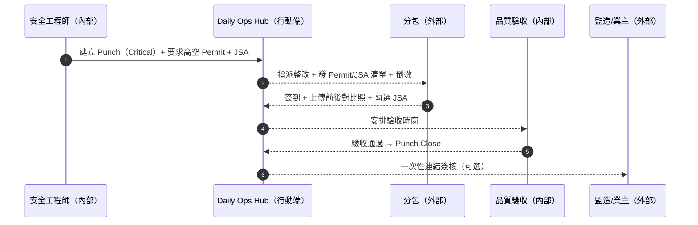
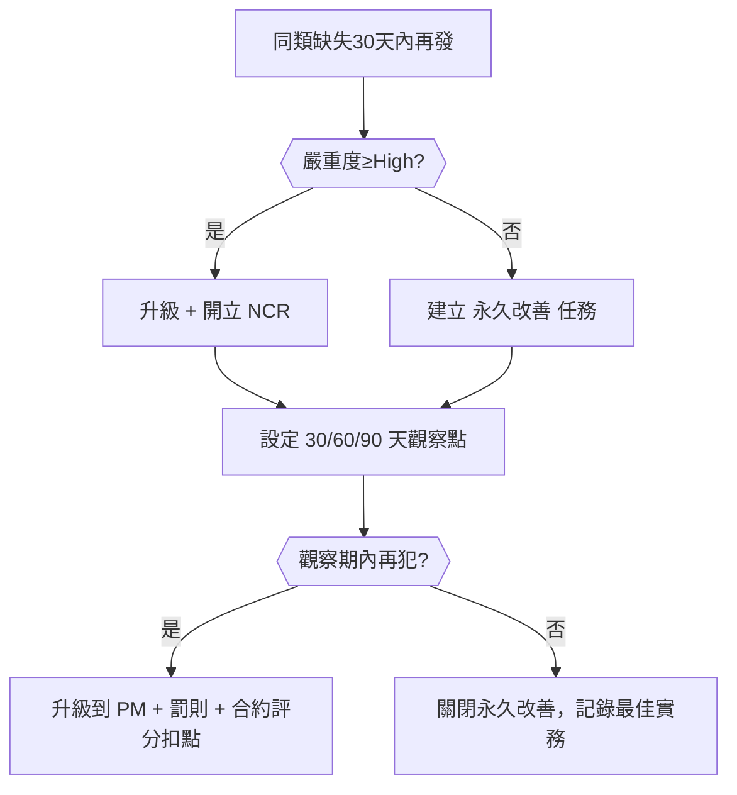
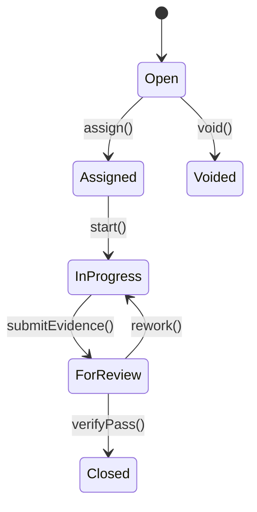
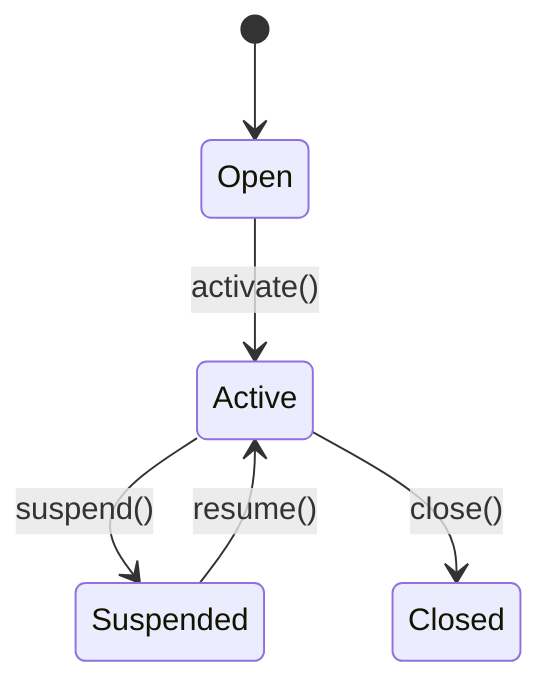
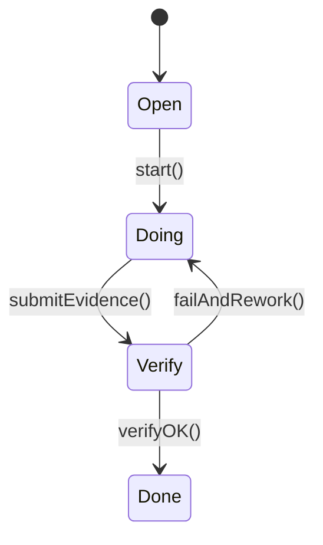

# Part 3f — 〈品質與安全整改（Quality & EHS Actions）〉卡片 詳規（Construction）
**版本**：v3.0  
**日期**：2025-09-20  
**對象**：品質（Quality Control, QC）、安全與環安衛（Environment, Health and Safety, EHS）、專案經理（Project Manager）、現場工程師、分包/供應商、監造/業主（受限視圖）  
**範圍**：本文件針對首頁卡片「品質與安全整改（Quality & EHS Actions）」給出：平台內外使用者旅程（Mermaid 圖）、User Story、互動規格、資料模型、TypeScript 介面、OpenAPI 片段、高真 mock data、Playbook 決策表與規則語法、狀態圖、遙測、驗收、權限、效能與邊界情境。  
> 術語：缺失/缺陷（Punch/Defect）、整改（Rectification/Corrective Action）、不符合報告（Nonconformance Report, NCR）、工作許可（Work Permit, Permit）、作業風險分析（Job Safety Analysis, JSA）、服務等級協議（Service Level Agreement, SLA）、建築資訊模型（Building Information Modeling, BIM）。

---

## 1. 目標與價值
**目標**：以單一卡片驅動**Punch→整改→驗收→關閉**與**Permit→JSA→作業→收尾**的完整閉環，降低重複缺失與事故風險，確保合規與證據鏈完整。

**北極星指標**
- Punch 關閉中位天數 **下降 ≥ 30%**  
- 重複缺失率（30 天內同類缺失再發）**下降 ≥ 40%**  
- 高風險 Permit（熱作/高空/吊裝等）**JSA 完整率 ≥ 98%**、**超時率 ≤ 2%**

**次級成效**
- 整改服務等級準時率上升；審計一次通過；對外稽核準備時間下降。

---

## 2. 卡片 KPI 與排序邏輯
- **KPI 徽章**：`本週新 Punch`、`逾期整改`、`高風險 Permit 進行中`、`重複缺失比`。  
- **排序鍵（rank）**：`rank = overdue*0.5 + severity*0.3 + recurrence*0.2`
  - `overdue = clamp(-remainingSeconds/86400, 0, 7)`  
  - `severity ∈ {0..3}`（Low=0, Medium=1, High=2, Critical=3）  
  - `recurrence ∈ {0..1}`（同類/同位置過去 30 天再發比率）

---

## 3. User Stories（Gherkin）
**US-QE-01（EHS）**  
- Given 我在巡檢中發現「二樓邊緣無防護」  
- When 我在手機端拍照、定位、開立 `Punch` 並要求 `工作許可（高空作業）`  
- Then 系統建立整改工單（含 JSA 模板）、設定服務等級倒數、指派分包與負責人、通知監造。

**US-QE-02（分包）**  
- Given 我收到高風險 Punch 的整改指派  
- When 我上傳整改前後對比照、完成 JSA 勾選並簽到開工/收工  
- Then 系統觸發 `驗收` 流程；通過後 Punch 關閉。

**US-QE-03（QC）**  
- Given 我查看「重複缺失 Top」  
- When 我對同一區域反覆出現的「配管未固定」進行「永久改善」任務指派與驗證期設定  
- Then 系統追蹤 30/60/90 天的觀察點，若再犯自動升級並開立 NCR。

**US-QE-04（PM）**  
- Given 高風險 Permit 超時 30 分鐘仍未收工  
- When 我按「暫停作業 + 緊急會議」  
- Then 系統即刻通知在場人員、封鎖 Permit、建立事故預警紀錄。

**US-QE-05（監造/業主）**  
- Given 我透過一次性分享連結進入指定 Punch  
- When 我審閱證據並在網頁簽核  
- Then 系統記錄簽名指紋並關閉該 Punch。

---

## 4. 互動規格（Interaction Spec）
### 4.1 卡片結構（符合：標題、關鍵指標、主表格、快速操作、篩選、批量、Pin、抽屜）
- **標題列**：`品質與安全整改` + KPI 徽章（新 Punch/逾期/高風險 Permit/重複缺失比）。  
- **工具列**：
  - `Filter`：類型（Punch/Permit/NCR/Observation）、分類（品質/安全/環境）、嚴重度、位置、分包、狀態、是否重複、是否高風險、到期。  
  - `Sort`：rank、remainingSeconds、severity、recurrence。  
  - `Bulk Actions`：批量指派、批量催辦、批量驗收排程、批量生成永久改善、批量暫停 Permit。  
  - `Pin to Top`、`Export`（CSV/PDF 審計包）。
- **主表格欄位（預設）**：`類型`、`標題`、`分類`、`嚴重度`、`位置/WBS`、`重複缺失比`、`整改服務等級倒數`、`責任人/分包`、`主要動作`。  
- **右側抽屜（Drawer）**：
  - `Overview`：文字描述、位置地圖/BIM 元素、前後對比照、量測、風險矩陣。  
  - `Checklist/JSA`：Permit 與 JSA 勾選、PPE 列表、教育訓練紀錄。  
  - `Timeline`：開單→指派→整改→驗收→關閉（簽到/簽退/通話/提醒）。  
  - `Relations`：相關任務、IR/MIR、RFI/變更、NCR、Permit、延誤通知。  
  - `Actions`：`指派/改派`、`催辦`、`安排驗收`、`開立/封鎖 Permit`、`建立 NCR`、`永久改善任務`、`一鍵生成報表`。

### 4.2 行動端（Mobile）
- 單指拍照/圈選/語音轉文字；離線草稿；地理簽到；JSA 快速勾選。

### 4.3 可及性（Accessibility）
- 圖片附替代文字；狀態以文字 + 圖標呈現；鍵盤導覽與螢幕閱讀器支援。

---

## 5. 低保真 Wireframe（僅此卡）
```text
┌─ 品質與安全整改  新Punch:14 | 逾期:5 | 高風險Permit:3 | 重複缺失比:12% ───────────────┐
│ Filter[類型|分類|嚴重度|位置|分包|狀態|重複|到期] Sort[rank] Bulk[...] Pin Export │
├───────────────────────────────────────────────────────────────────────────────────┤
│ 類型  標題                 分類   嚴重度  位置/WBS    重複%  倒數    責任人/分包  動作     │
│ Punch 二樓邊緣無防護       安全   Critical L2-Edge   35%   -02:10  分包甲       [派/催/驗] │
│ Punch 配管未固定           品質   High     L3-UT04   42%   10:00  分包乙       [派/改/永] │
│ Permit 高空作業-機房吊頂   安全   High     L5-MEP    —     03:30  分包丙       [封/暫/續] │
│ NCR   鋼筋焊接虛焊         品質   High     B2-C5     —     24:00  供應商A      [整改/關] │
└───────────────────────────────────────────────────────────────────────────────────┘
▸ 點列 → Drawer: Overview / Checklist-JSA / Timeline / Relations / Actions
（動作鍵例：派=指派、催=催辦、驗=安排驗收、改=改派、永=永久改善、封=封鎖、暫=暫停、續=續開）
```

---

## 6. 使用者旅程（Mermaid；平台內/外）
### 6.1 「高風險 Punch」→ 開 Permit + JSA → 整改 → 驗收 → 關閉（Sequence）


### 6.2 「重複缺失」→ 永久改善任務 + 觀察期驗證（Flow with gates）


---

## 7. 資料模型（Data Model）
### 7.1 實體與關聯（摘要）
- **Punch**：`id, title, category(Quality|Safety|Env), severity(Low|Medium|High|Critical), status(Open|Assigned|InProgress|ForReview|Closed|Voided), wbsId?, locationId, bimElementIds[], recurrencePct(0..1), sla{dueAt, remainingSeconds}, assignees[], photosBefore[], photosAfter[], measures[], permitId?, jsaId?, ncrId?, relations{taskId?, irId?, mirId?, changeId?}`  
- **Permit**：`id, type(HotWork|WorkAtHeight|Lifting|ConfinedSpace|Electrical|General), status(Open|Active|Suspended|Closed), validFrom, validTo, holders[], geo?, jsaId, attachments[]`  
- **JSA**：`id, permitId?, checklist[{id,text,required,ok?,note?}], ppeList[], trainingRecords[], signatures[{by,at,role}], hazards[{type,control}]`  
- **CorrectiveAction**：`id, punchId?, title, owner, dueAt, status(Open|Doing|Verify|Done), evidence[], isPermanentFix?, observeMilestones[{at,check}]`  
- **NCR**：`id, source(punchId|mirId|auditId), severity, actions[Containment|Correction|Corrective], status, dueAt`

### 7.2 TypeScript 介面（片段）
```ts
export type PunchCategory = "Quality" | "Safety" | "Env";
export type Severity = "Low" | "Medium" | "High" | "Critical";
export type PunchStatus = "Open" | "Assigned" | "InProgress" | "ForReview" | "Closed" | "Voided";
export type PermitType = "HotWork" | "WorkAtHeight" | "Lifting" | "ConfinedSpace" | "Electrical" | "General";
export type PermitStatus = "Open" | "Active" | "Suspended" | "Closed";

export interface Punch {
  id: string;
  title: string;
  category: PunchCategory;
  severity: Severity;
  status: PunchStatus;
  wbsId?: string;
  locationId: string;
  bimElementIds?: string[];
  recurrencePct?: number;
  sla: { dueAt: string; remainingSeconds: number };
  assignees: { userId?: string; vendorId?: string; name: string }[];
  photosBefore?: { url: string; hash?: string }[];
  photosAfter?: { url: string; hash?: string }[];
  measures?: { kind: "MEASURE"|"NOTE"; value?: number; unit?: string; text?: string }[];
  permitId?: string;
  jsaId?: string;
  ncrId?: string;
  relations?: { taskId?: string; irId?: string; mirId?: string; changeId?: string };
}

export interface Permit {
  id: string;
  type: PermitType;
  status: PermitStatus;
  validFrom: string;
  validTo: string;
  holders: { userId?: string; vendorId?: string; name: string }[];
  geo?: { lat: number; lng: number; radius?: number };
  jsaId: string;
  attachments?: string[];
}

export interface JSA {
  id: string;
  permitId?: string;
  checklist: { id: string; text: string; required: boolean; ok?: boolean; note?: string }[];
  ppeList: string[];
  trainingRecords?: { name: string; date: string }[];
  signatures?: { by: string; at: string; role: string }[];
  hazards?: { type: string; control: string }[];
}

export interface CorrectiveAction {
  id: string;
  punchId?: string;
  title: string;
  owner: string;
  dueAt: string;
  status: "Open"|"Doing"|"Verify"|"Done";
  evidence?: { url: string; hash?: string }[];
  isPermanentFix?: boolean;
  observeMilestones?: { at: string; check: "OK"|"FAIL"|"NA" }[];
}

export interface QualityEhsResponse {
  projectId: string;
  asOf: string;
  kpis: { newPunchThisWeek: number; overdueRectifications: number; highRiskPermits: number; recurrencePct: number };
  rows: Array<
    | { kind: "PUNCH"; punch: Punch }
    | { kind: "PERMIT"; permit: Permit }
    | { kind: "NCR"; ncr: any }
    | { kind: "ACTION"; action: CorrectiveAction }
  >;
}
```

---

## 8. API 規格（OpenAPI 3.0 片段）
```yaml
openapi: 3.0.3
info: { title: Construction Hub – Quality & EHS Actions API, version: 3.0.0 }
paths:
  /projects/{{projectId}}/quality-ehs:
    get:
      summary: 品質與安全整改卡片聚合（Punch/Permit/NCR/Actions）
      parameters:
        - in: path
          name: projectId
          required: true
          schema: { type: string }
        - in: query
          name: filter
          schema: { type: string, example: "type=PUNCH,PERMIT;severity=High,Critical;overdue=true" }
        - in: query
          name: sort
          schema: { type: string, enum: [rank,remainingSeconds,severity,recurrence] }
      responses:
        "200":
          description: OK
          content:
            application/json:
              schema: { $ref: "#/components/schemas/QualityEhsResponse" }
  /punch:
    post: { summary: 建立 Punch, responses: { "201": { description: Created } } }
  /punch/{{punchId}}/assign:
    post:
      summary: 指派/改派整改
      requestBody:
        content:
          application/json:
            schema:
              type: object
              properties:
                assignees: { type: array, items: { type: object, properties: { userId: {type: string}, vendorId: {type: string} } } }
                dueAt: { type: string, format: date-time }
      responses: { "200": { description: Assigned } }
  /punch/{{punchId}}/verify:
    post: { summary: 驗收通過, responses: { "200": { description: Verified } } }
  /punch/{{punchId}}/close:
    post: { summary: 關閉 Punch, responses: { "200": { description: Closed } } }
  /permit:
    post: { summary: 開立 Permit（含 JSA 模板）, responses: { "201": { description: Created } } }
  /permit/{{permitId}}/suspend:
    post: { summary: 暫停 Permit, responses: { "200": { description: Suspended } } }
  /permit/{{permitId}}/resume:
    post: { summary: 續開 Permit, responses: { "200": { description: Resumed } } }
  /actions/permanent-fix:
    post: { summary: 建立 永久改善 任務, responses: { "201": { description: Created } } }
components:
  schemas:
    QualityEhsResponse:
      type: object
      properties:
        projectId: { type: string }
        asOf: { type: string, format: date-time }
        kpis:
          type: object
          properties:
            newPunchThisWeek: { type: integer }
            overdueRectifications: { type: integer }
            highRiskPermits: { type: integer }
            recurrencePct: { type: number }
        rows: { type: array, items: { type: object } }
```

---

## 9. Mock Data（高真示例）
```json
{
  "projectId": "PRJ-001",
  "asOf": "2025-09-20T11:30:00Z",
  "kpis": { "newPunchThisWeek": 14, "overdueRectifications": 5, "highRiskPermits": 3, "recurrencePct": 0.12 },
  "rows": [
    {
      "kind": "PUNCH",
      "punch": {
        "id": "P-201",
        "title": "二樓邊緣無防護",
        "category": "Safety",
        "severity": "Critical",
        "status": "Assigned",
        "locationId": "L2-Edge",
        "recurrencePct": 0.35,
        "sla": { "dueAt": "2025-09-20T14:00:00Z", "remainingSeconds": -7800 },
        "assignees": [{ "vendorId": "VEN-A", "name": "分包甲" }],
        "photosBefore": [{ "url": "photo://p201-before.jpg" }],
        "permitId": "WP-HA-33",
        "jsaId": "JSA-HA-33"
      }
    },
    {
      "kind": "PERMIT",
      "permit": {
        "id": "WP-HA-33",
        "type": "WorkAtHeight",
        "status": "Active",
        "validFrom": "2025-09-20T01:00:00Z",
        "validTo": "2025-09-20T13:00:00Z",
        "holders": [{ "vendorId": "VEN-A", "name": "分包甲" }],
        "jsaId": "JSA-HA-33"
      }
    },
    {
      "kind": "ACTION",
      "action": {
        "id": "CA-901",
        "punchId": "P-150",
        "title": "配管固定永久改善",
        "owner": "SUB-B",
        "dueAt": "2025-10-05T09:00:00Z",
        "status": "Doing",
        "isPermanentFix": true,
        "observeMilestones": [
          { "at": "2025-10-20T00:00:00Z", "check": "OK" },
          { "at": "2025-11-20T00:00:00Z", "check": "OK" }
        ]
      }
    },
    {
      "kind": "NCR",
      "ncr": {
        "id": "NCR-34",
        "source": "punchId:P-175",
        "severity": "High",
        "actions": ["Containment","Corrective"],
        "status": "UnderReview",
        "dueAt": "2025-09-25T12:00:00Z"
      }
    }
  ]
}
```

---

## 10. Playbook 決策表（Decision Table）
| 規則 | 條件 | 動作 | 附註 |
|---|---|---|---|
| PB-QE-01 | Punch.severity=Critical | 強制開立對應 Permit + JSA；要求地理簽到；置頂 | 高風險作業控制 |
| PB-QE-02 | Punch 逾期且嚴重度≥High | 升級 + 暫停相關 Permit（若在進行中） | 保守安全 |
| PB-QE-03 | 同類/同區域 30 天內再發 | 標記重複缺失；建立永久改善任務；設定觀察點 | 再發即升級 |
| PB-QE-04 | Permit 超時（有效期過） | 自動 `Suspended`；通知在場人員；建立事故預警 | 需要 PM 續開 |
| PB-QE-05 | 驗收未通過 2 次 | 自動開立 NCR；要求顧問/監造共同見證 | 強化品質管控 |

**規則語法（DSL 示意）**
```text
WHEN punch.severity = "Critical"
THEN ensurePermit(type=DerivedFromHazard), attachJSA(template="HighWork"), requireGeoCheckin(true), escalate(level=+1)
```

---

## 11. 狀態圖（State Machine）
### 11.1 Punch


### 11.2 Permit


### 11.3 永久改善（CorrectiveAction）


---

## 12. 遙測（Telemetry）
- **Punch 漏斗**：建立→指派→首次行動→驗收→關閉（中位/分位數）。  
- **重複缺失**：類別/區域/分包維度；永久改善達成率與再犯率。  
- **Permit 健康度**：JSA 完整率、超時率、Suspended 事件；與事故/未遂關聯。  
- **審計完整性**：證據（前後對比照、簽到、JSA、簽核）齊全度。

---

## 13. 驗收準則（Acceptance Criteria）
- 1,000 筆 Punch/Permit 首屏 < 600ms（95 分位）；抽屜載入與圖片縮圖 < 300ms。  
- 高風險作業必須有 Permit + JSA 才能轉入 `InProgress`；否則禁止操作。  
- 30 筆抽查：證據鏈完整率 ≥ 98%；重複缺失自動辨識準確率 ≥ 90%。  
- 行動端離線建單/上傳重試成功率 ≥ 99%。

---

## 14. 權限（RBAC + ABAC）
- **EHS/QC**：建立/指派/驗收/封鎖 Permit。  
- **分包/供應商**：僅限所屬整改與 Permit，需地理簽到。  
- **PM**：升級、暫停/續開 Permit、永久改善審批。  
- **監造/業主**：只讀 + 受邀簽核。  
- 依 Project / WBS / Location / Hazard Type 屬性授權。

---

## 15. 效能與可靠性
- **CQRS** 聚合與索引：`projectId + severity + status + recurrence`；推播更新。  
- 圖像壓縮與簽名指紋（EXIF/GPS/哈希）；一次性分享連結到期/浮水印。  
- 規則引擎灰度發佈，Permit 超時邊界測試與演練。

---

## 16. 邊界情境（Edge Cases）
- **多發包重疊責任** → 支援多 assignees 與責任拆分；審計顯示各自完成度。  
- **隱私/安全** → 有人像的照片自動打碼；敏感位置以遮罩處理。  
- **無法地理簽到** → 允許主管授權的「現場口令碼」替代；必須加註原因。  
- **外部顧問無帳號** → 使用一次性連結完成驗收。

---

## 17. 本卡片輸出與下一步
- 本卡與「現場任務看板」「風險與服務等級倒數」「材料 / 到貨 / 檢驗」互通：Punch/Permit 狀態將回寫任務與風險；重複缺失與 NCR 觸發成本與合約評分。  
- **建議下一張**：〈成本與現金流快照（Cost Snapshot）〉或〈會議與決議（Meetings & Minutes）〉。
