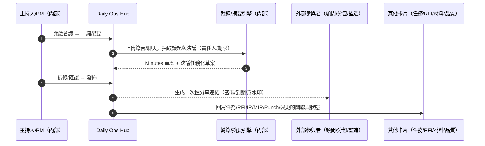
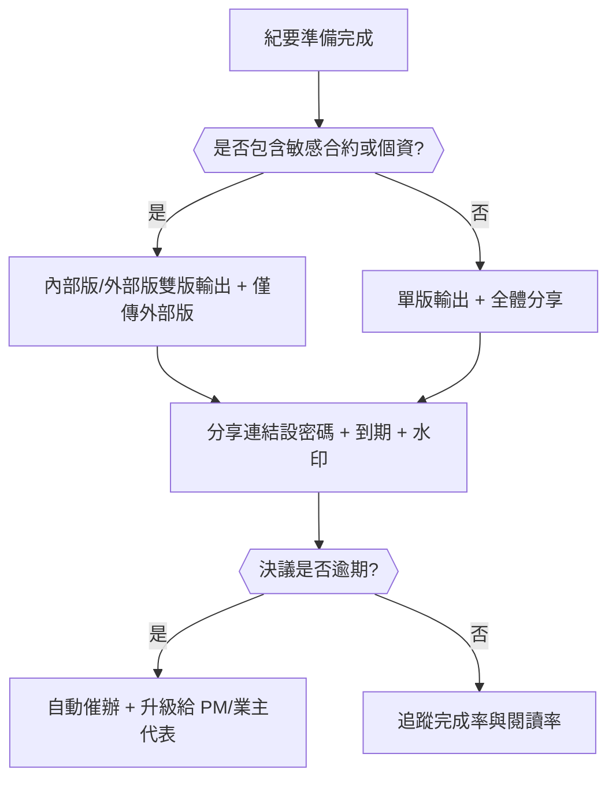
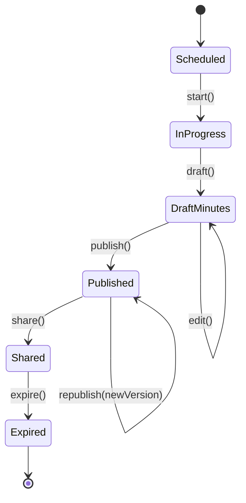
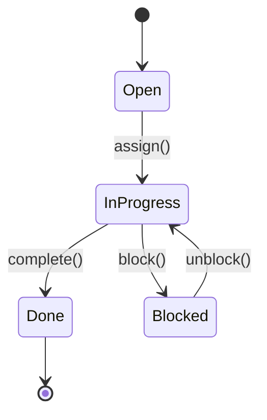

# Part 3g — 〈會議與決議（Meetings & Minutes）〉卡片 詳規（Construction）
**版本**：v3.0  
**日期**：2025-09-20  
**對象**：專案經理（Project Manager）、協調會主持、現場工程師、分包/供應商、顧問/設計、監造/業主（受限視圖）、商務/合約  
**範圍**：本文件針對首頁卡片「會議與決議（Meetings & Minutes）」給出：平台內外的使用者旅程（Mermaid 圖）、User Story、互動規格、資料模型、TypeScript 介面、OpenAPI 片段、高真 mock data、Playbook 決策表與規則語法、狀態圖、遙測、驗收、權限、效能與邊界情境。  
> 術語：工作分解結構（Work Breakdown Structure, WBS）、資訊請求（Request For Information, RFI）、檢驗申請（Inspection Request, IR）、材料進場檢驗（Material Inspection Request, MIR）、不符合報告（Nonconformance Report, NCR）、服務等級協議（Service Level Agreement, SLA）。

---

## 1. 目標與價值
**目標**：將「**議程 → 紀要 → 決議任務化 → 對外分享**」整合到單一卡片，實現**一鍵紀要**與**責任人落地**，並將會議輸出自動回寫到「現場任務看板」「設計協調」「材料/檢驗」「品質與安全整改」等卡片。

**北極星指標**
- 會後 **10 分鐘內**完成可分享紀要（含任務化決議）比例 ≥ 90%  
- 決議任務化覆蓋率（含責任人與期限） ≥ 95%  
- 外部分享閱讀 + 採取行動（點擊任務連結）轉換率 ≥ 60%

**次級成效**
- 追蹤會議行動落地率、避免「開會無用」；跨單位透明與可追責。

---

## 2. 卡片 KPI 與排序邏輯
- **KPI 徽章**：`今日會議`、`待確認紀要`、`開放分享`、`逾期決議`。  
- **排序鍵（rank）**：`rank = imminence*0.5 + impact*0.3 + overdueAction*0.2`
  - `imminence = clamp((startInSeconds<=0? -startInSeconds: startInSeconds)/3600, 0, 24)`（離會議開始或已過去）  
  - `impact`：與關鍵路徑/成本/安全之關聯程度（0..3）  
  - `overdueAction`：由「決議任務」逾期數量與超期時長換算（0..2）

---

## 3. User Stories（Gherkin）
**US-MM-01（主持人/專案經理）**  
- Given 我在卡片看到「今日協調會 x3、待確認紀要 x2」  
- When 我點開 10:00 的協調會，使用「一鍵紀要」將聊天室/錄音轉錄為議程摘要與決議列表  
- Then 系統自動抽取責任人與期限，將決議同步到任務看板，並生成對外分享連結（可設密碼/到期）。

**US-MM-02（顧問/設計）**  
- Given 我收到「一次性分享連結」與密碼  
- When 我打開紀要頁，點擊「我方待回覆 RFI #214」的任務連結  
- Then 我在網頁完成回覆，紀要自動更新決議狀態。

**US-MM-03（分包）**  
- Given 我在會議中被指派「B2 柱筋加派工」的行動  
- When 我從行動郵件/即時訊息進入任務並上傳施工證據  
- Then 紀要中的該決議自動標記為「完成（含證據鏈）」。

**US-MM-04（商務/合約）**  
- Given 決議涉及「變更草案提交」與「付款里程碑申請」  
- When 我按「生成草案」並送審  
- Then 紀要回寫該決議的審批狀態與鏈結。

**US-MM-05（監造/業主）**  
- Given 我只需要看與我相關的決議  
- When 我用分享連結篩選「待我簽核」  
- Then 我完成簽核後，決議狀態改為「已同意」，並通知相關責任人。

---

## 4. 互動規格（Interaction Spec）
### 4.1 卡片結構（符合：標題、關鍵指標、主表格、快速操作、篩選、批量、Pin、抽屜）
- **標題列**：`會議與決議` + KPI 徽章（今日會議/待確認紀要/開放分享/逾期決議）。  
- **工具列**：
  - `Filter`：會議類型（協調/安全/品質/商務/變更/移交）、時間（今日/本週/自訂）、主持人、參與者（公司/角色）、狀態（已完成/待確認/已分享）、是否有錄音/錄影、是否有逾期決議。  
  - `Sort`：rank、開始時間、逾期決議數、影響。  
  - `Bulk Actions`：批量產生紀要、批量外部分享、批量催辦決議、批量鎖定對外版本、批量匯出 PDF。  
  - `Pin to Top`、`Export`（PDF/Word/CSV 審計包）。
- **主表格欄位（預設）**：`會議名稱/類型/時間`、`議題數`、`決議數（逾期/總）`、`責任人 Top`、`分享狀態/到期`、`主要動作`。  
- **右側抽屜（Drawer）**：
  - `Minutes`：議程/關鍵點/決議清單（支援勾選與文字編修、標注 WBS/位置、關聯 RFI/IR/變更/任務）。  
  - `Tasks`：決議任務化列表（責任人、期限、SLA、證據鏈）。  
  - `Share`：一次性分享連結（到期/密碼/浮水印/可見範圍）；外部閱覽紀錄。  
  - `Timeline`：錄音/錄影/聊天訊息 → 自動摘要 → 人工編修 → 發佈 → 變更紀錄。  
  - `Actions`：`一鍵紀要`、`產出 PDF/Word`、`批量指派`、`催辦`、`外部分享`、`鎖定版本`。

### 4.2 行動端（Mobile）
- 快捷錄音/照片上傳；語音轉文字；勾選模板議程；簽到/簽退；外部分享一鍵。

### 4.3 可及性（Accessibility）
- 逐字稿有時間戳；字幕檔 WebVTT；PDF/Word 含結構化標頭與替代文字。

---

## 5. 低保真 Wireframe（僅此卡）
```text
┌─ 會議與決議  今日會議:3 | 待確認紀要:2 | 已分享:5 | 逾期決議:4 ───────────────────────────┐
│ Filter[類型|時間|主持人|參與者|狀態|錄音]  Sort[rank]  Bulk[...]  Pin  Export(PDF/Word) │
├───────────────────────────────────────────────────────────────────────────────────────┤
│ 會議/時間             議題  決議(逾期/總)  責任人Top              分享/到期        動作  │
│ 協調會(10:00-11:00)   8     5(2/5)        分包甲, 顧問A          未分享           [紀/任/分] │
│ 品質會(14:00-15:00)   5     4(0/4)        QC王, SUB-B            已分享(09/22)    [催/鎖/匯] │
│ 商務會(16:00-17:00)   6     3(1/3)        商務李                 未分享           [紀/任/分] │
└───────────────────────────────────────────────────────────────────────────────────────┘
▸ 點列 → Drawer: Minutes / Tasks / Share / Timeline / Actions
（動作鍵例：紀=一鍵紀要、任=批量指派、分=外部分享、催=催辦、鎖=鎖定版本、匯=匯出）
```

---

## 6. 使用者旅程（Mermaid；平台內/外）
### 6.1 「一鍵紀要」→ 任務化 → 外部分享 → 回寫關聯卡（Sequence）


### 6.2 「對外分享策略」與「逾期決議升級」（Flow with gates）


---

## 7. 資料模型（Data Model）
### 7.1 實體與關聯（摘要）
- **Meeting**：`id, title, type(Coordination|Quality|Safety|Commercial|Design|Handover), startAt, endAt, hostId, attendees[], location|link, recordingUrl?, transcriptUrl?, minutesVersion, shareStatus(None|InternalOnly|ExternalShared), shareLinkId?`  
- **AgendaTopic**：`id, meetingId, order, title, description?, ownerId?`  
- **Decision**：`id, meetingId, topicId?, title, owner, dueAt?, status(Open|InProgress|Done|Blocked), priority(Low|Med|High), evidence[], related{wbsIds[], locationIds[], rfiId?, irId?, mirId?, punchId?, changeId?, taskId?}`  
- **ActionItem**：`id, decisionId, owner, dueAt, status(Open|Doing|Verify|Done), assignees[], links[]`  
- **ShareLink**：`id, meetingId, url, password?, expiresAt, watermark, visibility(Participants|Company|PublicByLink), revoked`  
- **MinuteVersion**：`id, meetingId, no, createdAt, createdBy, docUrl, diffFromPrev`

### 7.2 TypeScript 介面（片段）
```ts
export type MeetingType = "Coordination" | "Quality" | "Safety" | "Commercial" | "Design" | "Handover";
export type ShareStatus = "None" | "InternalOnly" | "ExternalShared";

export interface Meeting {
  id: string;
  title: string;
  type: MeetingType;
  startAt: string;
  endAt: string;
  hostId: string;
  attendees: { id: string; name: string; company?: string; role?: string; email?: string }[];
  location?: string; // room or link
  recordingUrl?: string;
  transcriptUrl?: string;
  minutesVersion?: number;
  shareStatus?: ShareStatus;
  shareLinkId?: string;
}

export interface Decision {
  id: string;
  meetingId: string;
  topicId?: string;
  title: string;
  owner: string;
  dueAt?: string;
  status: "Open" | "InProgress" | "Done" | "Blocked";
  priority?: "Low" | "Med" | "High";
  evidence?: { url: string; hash?: string }[];
  related?: {
    wbsIds?: string[];
    locationIds?: string[];
    rfiId?: string; irId?: string; mirId?: string; punchId?: string; changeId?: string; taskId?: string;
  };
}

export interface ActionItem {
  id: string;
  decisionId: string;
  owner: string;
  dueAt: string;
  status: "Open"|"Doing"|"Verify"|"Done";
  assignees?: { id: string; name: string }[];
  links?: string[];
}

export interface MeetingsCardResponse {
  projectId: string;
  asOf: string;
  kpis: { todayMeetings: number; pendingMinutes: number; shared: number; overdueDecisions: number };
  rows: {
    meeting: Meeting;
    topics: { id: string; title: string }[];
    decisionStats: { total: number; overdue: number; topOwners: string[] };
    share: { status: ShareStatus; expiresAt?: string } | null;
  }[];
}
```

---

## 8. API 規格（OpenAPI 3.0 片段）
```yaml
openapi: 3.0.3
info: { title: Construction Hub – Meetings & Minutes API, version: 3.0.0 }
paths:
  /projects/{{projectId}}/meetings:
    get:
      summary: 會議與決議卡片聚合（今日/本週 + 未完成紀要 + 分享狀態）
      parameters:
        - in: path
          name: projectId
          required: true
          schema: { type: string }
        - in: query
          name: filter
          schema: { type: string, example: "type=Coordination,Quality;withRecording=true;withOverdue=true" }
        - in: query
          name: sort
          schema: { type: string, enum: [rank,startAt,overdueDecisions,impact] }
      responses:
        "200":
          description: OK
          content:
            application/json:
              schema: { $ref: "#/components/schemas/MeetingsCardResponse" }

  /meetings:
    post:
      summary: 建立會議（含預設議程模板）
      requestBody:
        content:
          application/json:
            schema: { $ref: "#/components/schemas/Meeting" }
      responses: { "201": { description: Created } }

  /meetings/{{meetingId}}/minutes/draft:
    post:
      summary: 一鍵紀要（錄音/聊天轉摘要 + 決議抽取）
      requestBody:
        content:
          application/json:
            schema:
              type: object
              properties:
                recordingUrl: { type: string }
                chatLogUrl: { type: string }
                language: { type: string, example: "zh-TW" }
      responses:
        "200": { description: Draft ready }

  /meetings/{{meetingId}}/minutes/publish:
    post:
      summary: 發佈紀要（產出 PDF/Word、版本化、任務化決議並回寫關聯卡）
      requestBody:
        content:
          application/json:
            schema:
              type: object
              properties:
                publishFormats: { type: array, items: { type: string, enum: [PDF, DOCX, HTML] } }
                lockExternalVersion: { type: boolean, default: true }
      responses: { "200": { description: Published } }

  /meetings/{{meetingId}}/share-links:
    post:
      summary: 產生一次性分享連結（密碼/到期/浮水印/可見範圍）
      requestBody:
        content:
          application/json:
            schema:
              type: object
              properties:
                visibility: { type: string, enum: [Participants, Company, PublicByLink] }
                password: { type: string }
                expiresHours: { type: integer, default: 168 }
                watermark: { type: boolean, default: true }
      responses: { "201": { description: Link created } }

  /decisions/{{decisionId}}/assign:
    post:
      summary: 指派決議（責任人/期限/SLA）
      requestBody:
        content:
          application/json:
            schema:
              type: object
              properties:
                owner: { type: string }
                dueAt: { type: string, format: date-time }
      responses: { "200": { description: Assigned } }

  /decisions/{{decisionId}}/status:
    post:
      summary: 更新決議狀態（Open/InProgress/Done/Blocked）
      requestBody:
        content:
          application/json:
            schema:
              type: object
              properties:
                status: { type: string, enum: [Open, InProgress, Done, Blocked] }
      responses: { "200": { description: Updated } }

components:
  schemas:
    MeetingsCardResponse:
      type: object
      properties:
        projectId: { type: string }
        asOf: { type: string, format: date-time }
        kpis:
          type: object
          properties:
            todayMeetings: { type: integer }
            pendingMinutes: { type: integer }
            shared: { type: integer }
            overdueDecisions: { type: integer }
        rows:
          type: array
          items:
            type: object
            properties:
              meeting: { $ref: "#/components/schemas/Meeting" }
              topics:
                type: array
                items: { type: object, properties: { id: {type: string}, title: {type: string} } }
              decisionStats:
                type: object
                properties:
                  total: { type: integer }
                  overdue: { type: integer }
                  topOwners: { type: array, items: { type: string } }
              share:
                type: object
                nullable: true
                properties:
                  status: { type: string, enum: [None, InternalOnly, ExternalShared] }
                  expiresAt: { type: string, format: date-time }
    Meeting:
      type: object
      properties:
        id: { type: string }
        title: { type: string }
        type: { type: string }
        startAt: { type: string, format: date-time }
        endAt: { type: string, format: date-time }
        hostId: { type: string }
        attendees:
          type: array
          items: { type: object, properties: { id: {type: string}, name: {type: string}, company: {type: string}, role: {type: string} } }
        location: { type: string }
        recordingUrl: { type: string }
        transcriptUrl: { type: string }
        minutesVersion: { type: integer }
        shareStatus: { type: string, enum: [None, InternalOnly, ExternalShared] }
        shareLinkId: { type: string }
```

---

## 9. Mock Data（高真示例）
```json
{
  "projectId": "PRJ-001",
  "asOf": "2025-09-20T12:00:00Z",
  "kpis": { "todayMeetings": 3, "pendingMinutes": 2, "shared": 5, "overdueDecisions": 4 },
  "rows": [
    {
      "meeting": {
        "id": "M-1001",
        "title": "週協調會（結構+機電）",
        "type": "Coordination",
        "startAt": "2025-09-20T10:00:00Z",
        "endAt": "2025-09-20T11:00:00Z",
        "hostId": "PM-01",
        "attendees": [
          { "id": "PM-01", "name": "PM 林", "company": "GC", "role": "Host" },
          { "id": "SUB-A", "name": "分包甲", "company": "SUB-A", "role": "MEP" },
          { "id": "CONS-1", "name": "顧問A", "company": "CONS", "role": "Designer" }
        ],
        "location": "Site Room 2",
        "recordingUrl": "media://M-1001-record.mp3",
        "transcriptUrl": "media://M-1001.vtt",
        "minutesVersion": 1,
        "shareStatus": "None"
      },
      "topics": [
        { "id": "T-1", "title": "B2 柱筋碰撞與替代方案" },
        { "id": "T-2", "title": "鋼筋到貨延誤對進度影響" }
      ],
      "decisionStats": { "total": 5, "overdue": 2, "topOwners": ["SUB-A","CONS-1"] },
      "share": null
    },
    {
      "meeting": {
        "id": "M-1002",
        "title": "品質會（MIR/NCR）",
        "type": "Quality",
        "startAt": "2025-09-20T14:00:00Z",
        "endAt": "2025-09-20T15:00:00Z",
        "hostId": "QC-01",
        "attendees": [{ "id": "QC-01", "name": "QC 王" }, { "id": "VEN-STEEL-A", "name": "鋼材A" }],
        "location": "Site Room 1",
        "minutesVersion": 0,
        "shareStatus": "InternalOnly",
        "shareLinkId": "SL-445"
      },
      "topics": [
        { "id": "T-3", "title": "MIR-77 見證安排與合格判定" }
      ],
      "decisionStats": { "total": 4, "overdue": 0, "topOwners": ["QC-01"] },
      "share": { "status": "InternalOnly", "expiresAt": "2025-09-27T00:00:00Z" }
    }
  ]
}
```

---

## 10. Playbook 決策表（Decision Table）
| 規則 | 條件 | 動作 | 附註 |
|---|---|---|---|
| PB-MM-01 | 有錄音/聊天且主持人點「一鍵紀要」 | 產生 Minutes 草案 + 決議任務化草案 | 引擎支援多語 |
| PB-MM-02 | 決議 `dueAt` 過期 | 自動催辦 + 升級（通知 PM/業主代表） | 直送責任人 |
| PB-MM-03 | Minutes 含敏感關鍵字（價金/個資） | 自動切版：內部版/外部版；外部版隱碼 | 安全合規 |
| PB-MM-04 | 外部分享到期 | 自動失效連結；保留審計 | 可續期 |
| PB-MM-05 | 決議關聯關鍵路徑工項 | 回寫「進度健康度」卡並置頂 | 強化執行 |

**規則語法（DSL 示意）**
```text
WHEN minutes.containsSensitive() = true
THEN createDualVersions(internal=true, external=redacted), enforceSharePolicy(password, expiry=7d, watermark)
```

---

## 11. 狀態圖（State Machine）
### 11.1 Meeting → Minutes → Share


### 11.2 Decision / ActionItem


---

## 12. 遙測（Telemetry）
- **紀要時效**：會後到可分享紀要的時間分佈（中位/分位數）。  
- **決議落地**：任務化覆蓋率、準時率、逾期天數；責任人與公司維度。  
- **分享互動**：閱讀/下載/點擊任務連結；公共連結的外部來源。  
- **版本行為**：內外部版比率、重發版次數；敏感偵測命中率。

---

## 13. 驗收準則（Acceptance Criteria）
- 100 分鐘音訊產生草案 ≤ 3 分鐘；卡片首屏載入 ≤ 500 毫秒（95 分位）。  
- 一鍵產出 PDF/Word 與外部連結（密碼/到期/水印）可用；審計鏈完整率 ≥ 98%。  
- 決議任務與關聯卡回寫成功率 ≥ 99%；逾期升級延遲 ≤ 60 秒。

---

## 14. 權限（RBAC + ABAC）
- **主持人/專案經理**：建立/發佈/分享/鎖版；批量指派與催辦。  
- **參與者（內部/外部）**：可檢視與回覆/上傳證據；外部者需分享連結與密碼。  
- **監造/業主**：只讀或簽核（依邀請）。  
- 屬性：依 Project / Company / Role / AgendaTopic / 敏感標記 控制。

---

## 15. 效能與可靠性
- 轉錄/摘要引擎支援非同步任務；前端樂觀呈現草案與增量儲存。  
- 分享連結以短期憑證與浮水印；防二次散播（開啟指紋 + 禁止直接下載可選）。  
- 決議回寫採事件總線（Kafka/NATS），失敗補償重試。

---

## 16. 邊界情境（Edge Cases）
- **無錄音**：可僅用聊天與手動筆記生成草案。  
- **多語會議**：支援多段語言與分段摘要；外部版只顯示關鍵點。  
- **與會者權限不均**：外部分享僅顯示與其公司相關之決議。  
- **線下會議**：拍照上傳白板/紙本，光學文字辨識輔助摘要。

---

## 17. 本卡片輸出與下一步
- 與「風險與服務等級倒數」「設計協調」「現場任務看板」「材料/檢驗」「品質與安全整改」互通；會議週報可一鍵生成。  
- **建議下一張**：〈成本與現金流快照（Cost Snapshot）〉或〈對外公告（External Comms）〉。
