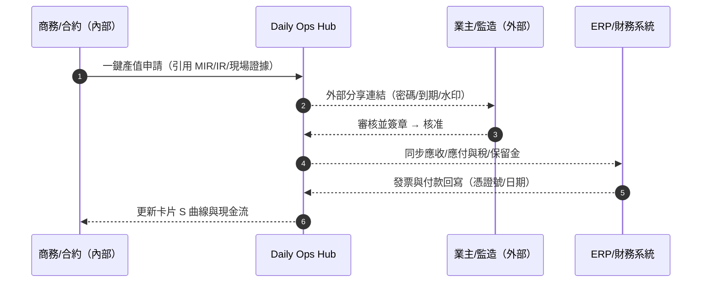
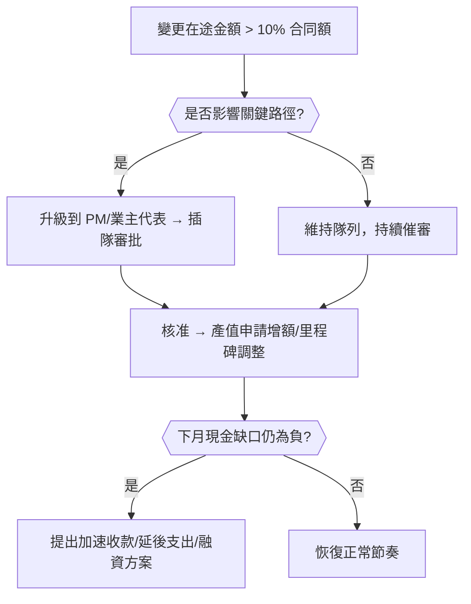
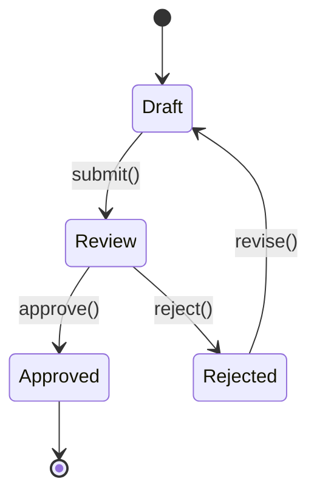
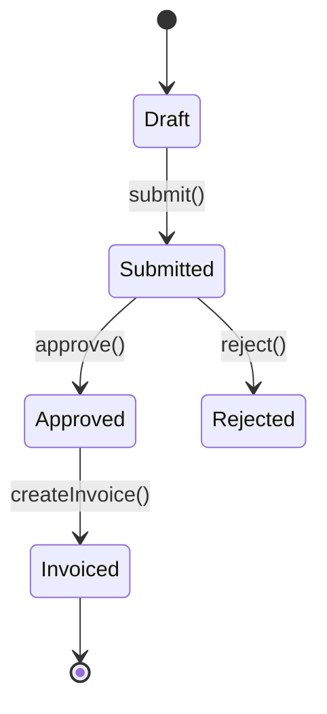
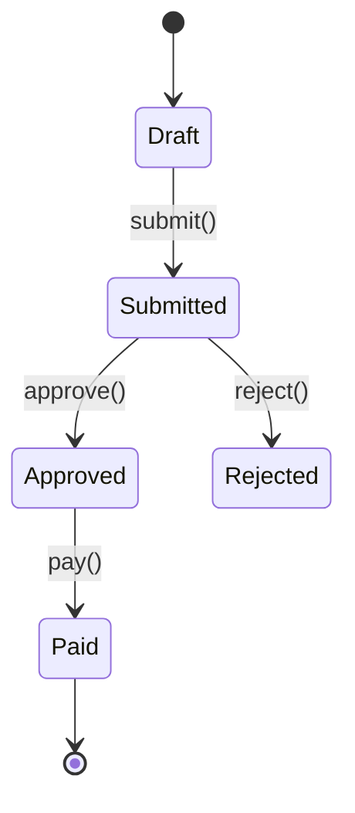

# Part 3h — 〈成本與現金流快照（Cost Snapshot）〉卡片 詳規（Construction）
**版本**：v3.0  
**日期**：2025-09-20  
**對象**：商務/合約（Commercial/Contracts）、專案經理（Project Manager, PM）、財務（Finance/AP/AR）、分包/供應商（受限視圖）、監造/業主代表（Owner’s Rep，受限視圖）  
**範圍**：本文件針對首頁卡片「成本與現金流快照（Cost Snapshot）」給出：平台內外的使用者旅程（Mermaid 圖）、User Story、互動規格、資料模型、TypeScript 介面、OpenAPI 片段、高真 mock data、Playbook 決策表與規則語法、狀態圖、遙測、驗收、權限、效能與邊界情境。  
> 術語：已核定總預算（Budget at Completion, BAC）、計畫產值（Planned Value, PV）、實得產值（Earned Value, EV）、實際成本（Actual Cost, AC）、進度績效指標（Schedule Performance Index, SPI=EV/PV）、成本績效指標（Cost Performance Index, CPI=EV/AC）、完工預估（Estimate at Completion, EAC）。

---

## 1. 目標與價值
**目標**：將**產值 vs 計畫、變更在途、批准週期與現金流**整合於單一卡片，提供**即時的 S 曲線與現金流預測**，支援**一鍵產值申請/付款里程碑**，並與**材料/檢驗、設計協調、任務看板**互通。

**北極星指標**
- 當月**產值提交→核准**中位天數 ≤ 7 天  
- **實際開支（Actual Cost, AC）與 ERP 對賬一致率 ≥ 99%**  
- **變更在途（Committed but Unapproved）週期中位數**下降 ≥ 30%  
- **現金流偏差 |Forecast – Actual|**（月度）下降 ≥ 20%

**次級成效**：降低資金占用，縮短應付/應收周期，避免由變更滯後導致的現金流斷點。

---

## 2. 卡片 KPI 與排序邏輯
- **KPI 徽章**：`本月產值 vs 計畫`、`變更在途金額`、`批准中位天數`、`下月現金缺口`。  
- **排序鍵（rank）**：`rank = cashRisk*0.45 + changeExposure*0.3 + approvalDelay*0.25`
  - `cashRisk`：下 30 天現金淨流量為負的幅度（0..3 分檔）  
  - `changeExposure`：未核變更金額 / 合同總額（0..3）  
  - `approvalDelay`：近 60 天產值/變更的批准中位天數（0..3）

**關鍵公式（顯示於抽屜）**  
- `SPI = EV / PV`；`CPI = EV / AC`  
- `EAC = AC + (BAC - EV) / max(CPI, ε)`；`ETC = EAC - AC`  
- `CashGapRisk = (AvgApprovalDays - TermsDays) × BurnRate`（估算）

---

## 3. User Stories（Gherkin）
**US-CC-01（商務/合約）**  
- Given 我看到「本月產值落後 8%，變更在途 1,200 萬」  
- When 我按「一鍵產值申請」產生 **進度計價申請**（含 MIR/IR/現場證據）並送審  
- Then 卡片顯示「提交中」，並開始追蹤批准週期與現金流影響。

**US-CC-02（專案經理）**  
- Given `SPI < 0.9` 且「變更在途金額 / 合同額 > 10%」  
- When 我按「召開協調會 + 變更快審」  
- Then 系統排定 +2 小時會議、推送優先審批，並在「會議與決議」卡建立決議任務。

**US-CC-03（財務）**  
- Given 供應商提交發票與證據鏈（MIR/收貨、合約里程碑）  
- When 我進行三方對賬（合約/收貨/發票）並按「批准付款」  
- Then 卡片現金流曲線更新，並向 ERP 同步付款。

**US-CC-04（分包/供應商）**  
- Given 我在受限視圖看到「應付將於 10/05 到期」  
- When 我上傳發票與出貨證明  
- Then 系統提示缺件並引導補齊，避免退件延遲。

**US-CC-05（業主代表）**  
- Given 我收到產值申請外部分享連結（含密碼與到期）  
- When 我核對證據並簽核  
- Then 系統記錄簽章指紋並將批准回寫卡片。

---

## 4. 互動規格（Interaction Spec）
### 4.1 卡片結構（符合：標題、關鍵指標、主表格、快速操作、篩選、批量、Pin、抽屜）
- **標題列**：`成本與現金流快照` + KPI 徽章（本月產值/變更在途/批准中位天數/下月現金缺口）。  
- **工具列**：
  - `Filter`：合同包/分包、成本代碼（Cost Code）、WBS、變更狀態（草案/審批中/已核/駁回）、幣別、稅制、是否關鍵路徑影響。  
  - `Group by`：`合同包` / `成本代碼` / `WBS` / `供應商`。  
  - `Sort`：rank、現金缺口、變更在途、批准週期、金額。  
  - `Bulk Actions`：批量產生產值申請、批量外部分享、批量催審、批量入 ERP、批量導出（Excel/PDF）。  
  - `Pin to Top`、`Export`（S 曲線/現金流 CSV）。
- **主表格欄位（預設）**：`合同包/供應商`、`本月產值 vs 計畫`、`EV/PV/AC（本月/累計）`、`變更在途金額`、`批准中位天數`、`下月淨現金`、`主要動作`。  
- **右側抽屜（Drawer）**：
  - `Snapshot`：S 曲線（BAC/PV/EV/AC/EAC），SPI/CPI，月度淨現金條。  
  - `Changes`：變更清單與狀態（草案/審批中/核准/駁回）、對進度與成本影響。  
  - `Valuations`：當月進度計價申請（Contractor IPC/Progress Certificate）、批准鏈、外部分享。  
  - `Cashflow`：未來 90 天收付計畫（含保留金/扣款/罰金/回扣）。  
  - `Relations`：PR/PO、MIR/IR/收貨、發票、付款、RFI。  
  - `Actions`：`一鍵產值申請`、`生成付款里程碑草案`、`推送 ERP`、`催審/升級`、`召開協調會`。

### 4.2 行動端（Mobile）
- 快速查看「本月產值/在途變更/批准狀態」；一鍵分享產值申請 PDF；推進催審。

### 4.3 可及性（Accessibility）
- 數值與圖形雙呈；色盲配色；貨幣/日期以本地化展示並提供原始值提示。

---

## 5. 低保真 Wireframe（僅此卡）
```text
┌─ 成本與現金流快照  本月產值: 18.3M / 計畫: 19.9M | 變更在途: 12.0M | 批准中位: 9d | 下月淨現金: -4.5M ─┐
│ Filter[合同包|成本代碼|WBS|變更狀態|幣別|是否關鍵]  Group[合同包]  Sort[rank]  Bulk[...]  Pin  Export │
├────────────────────────────────────────────────────────────────────────────────────────────────────────┤
│ 合同包/供應商     本月 EV/PV/AC     變更在途    批准中位天數  下月淨現金   動作                                  │
│ 結構-鋼筋/鋼材A   6.1/6.8/6.4 (M)   4.2M        11d           -2.3M       [產值申請/催審/ERP/協調]               │
│ 機電-管道/分包乙  5.2/5.0/4.7 (M)   3.1M        7d            -1.1M       [產值申請/分享/ERP]                    │
│ 建築-裝修/分包丙  3.5/4.0/3.0 (M)   2.0M        9d            -0.8M       [產值申請/變更快審/召會]                │
└────────────────────────────────────────────────────────────────────────────────────────────────────────┘
▸ 點列 → Drawer: Snapshot / Changes / Valuations / Cashflow / Relations / Actions
```

---

## 6. 使用者旅程（Mermaid；平台內/外）
### 6.1 「產值申請」→ 審批 → 發票 → 付款 → ERP 同步（Sequence）


### 6.2 「變更在途」→ 快審 → 現金流緩解（Flow with gates）


---

## 7. 資料模型（Data Model）
### 7.1 實體與關聯（摘要）
- **ContractPackage**：`id, name, contractorId, currency, taxSchema, bac, retentionPct, paymentTermsDays, costCodes[]`  
- **Commitment**（採購/分包合約）：`id, contractPackageId, type(PO|Subcontract), amount, currency, vendorId, status(Open|Closed)`  
- **ChangeOrder**（變更/變更指令）：`id, contractPackageId, number, title, status(Draft|Review|Approved|Rejected), amount, reason, scheduleImpactDays?, submittedAt, approvedAt?`  
- **ProgressValuation**（進度計價申請/進度憑證）：`id, contractPackageId, period{month,year}, pv, ev, ac, amountApplied, status(Draft|Submitted|Approved|Rejected), evidence{mirIds[], photos[], reports[]}, approvalTrail[]`  
- **Invoice**：`id, contractPackageId, type(AR|AP), amount, currency, tax, retentionHold, status(Draft|Submitted|Approved|Paid|Rejected), linkedValuationId?`  
- **Payment**：`id, invoiceId, paidAt, amount, method, refNo, bankAccount, currencyFx{from,to,rate}`  
- **CashForecast**：`id, projectId, date, inflow, outflow, net, scenario(Base|Optimistic|Pessimistic)`  
- **SPeriod**（S 曲線期間點）：`date, bac, pv, ev, ac, eac`

### 7.2 TypeScript 介面（片段）
```ts
export type Money = { currency: string; value: number };
export type StatusCO = "Draft"|"Review"|"Approved"|"Rejected";
export type StatusIPC = "Draft"|"Submitted"|"Approved"|"Rejected";
export type StatusINV = "Draft"|"Submitted"|"Approved"|"Paid"|"Rejected";

export interface ContractPackage {
  id: string; name: string; contractorId: string;
  currency: string; taxSchema?: string; bac: number; retentionPct?: number;
  paymentTermsDays: number; costCodes?: string[];
}

export interface ChangeOrder {
  id: string; contractPackageId: string; number: string; title: string;
  status: StatusCO; amount: number; reason?: string;
  scheduleImpactDays?: number; submittedAt?: string; approvedAt?: string;
}

export interface ProgressValuation {
  id: string; contractPackageId: string; period: { month: number; year: number };
  pv: number; ev: number; ac: number; amountApplied: number;
  status: StatusIPC; evidence?: { mirIds?: string[]; photos?: string[]; reports?: string[] };
  approvalTrail?: { by: string; at: string; action: "SUBMIT"|"APPROVE"|"REJECT" }[];
}

export interface Invoice {
  id: string; contractPackageId: string; type: "AR"|"AP";
  amount: number; currency: string; tax?: number; retentionHold?: number;
  status: StatusINV; linkedValuationId?: string;
}

export interface CashPoint { date: string; inflow: number; outflow: number; net: number; }
export interface SPoint { date: string; bac: number; pv: number; ev: number; ac: number; eac?: number; }

export interface CostSnapshotResponse {
  projectId: string; asOf: string;
  kpis: { evThisMonth: number; pvThisMonth: number; acThisMonth: number; changeInProgress: number; approvalMedianDays: number; cashNetNextMonth: number };
  rows: {
    contract: ContractPackage;
    ev: number; pv: number; ac: number;
    changeInProgress: number;
    approvalMedianDays: number;
    cashNetNextMonth: number;
  }[];
  sCurve: SPoint[];
  cashCurve: CashPoint[];
}
```

---

## 8. API 規格（OpenAPI 3.0 片段）
```yaml
openapi: 3.0.3
info: { title: Construction Hub – Cost & Cashflow Snapshot API, version: 3.0.0 }
paths:
  /projects/{{projectId}}/cost-snapshot:
    get:
      summary: 成本與現金流快照（含 KPI、表格、S 曲線、現金流）
      parameters:
        - in: path
          name: projectId
          required: true
          schema: { type: string }
        - in: query
          name: groupBy
          schema: { type: string, enum: [PACKAGE,COSTCODE,WBS,VENDOR], default: PACKAGE }
        - in: query
          name: filter
          schema: { type: string, example: "currency=TWD;status!=Closed;impactCriticalPath=true" }
      responses:
        "200":
          description: OK
          content:
            application/json:
              schema: { $ref: "#/components/schemas/CostSnapshotResponse" }

  /valuations:
    post:
      summary: 一鍵建立進度計價申請（引用證據鏈）
      requestBody:
        content:
          application/json:
            schema:
              type: object
              properties:
                contractPackageId: { type: string }
                period: { type: object, properties: { month: {type: integer}, year: {type: integer} } }
                includeEvidence: { type: boolean, default: true }
      responses: { "201": { description: Created } }

  /valuations/{{valuationId}}/submit:
    post: { summary: 提交審批, responses: { "200": { description: Submitted } } }

  /valuations/{{valuationId}}/share-links:
    post:
      summary: 產生外部審批連結（密碼/到期/浮水印）
      requestBody:
        content:
          application/json:
            schema:
              type: object
              properties:
                password: { type: string }
                expiresHours: { type: integer, default: 168 }
                watermark: { type: boolean, default: true }
      responses: { "201": { description: Link created } }

  /invoices:
    post:
      summary: 由核准的進度計價生成發票草案（AR/AP）
      requestBody:
        content:
          application/json:
            schema:
              type: object
              properties:
                valuationId: { type: string }
                type: { type: string, enum: [AR, AP] }
      responses: { "201": { description: Created } }

  /erp-sync:
    post:
      summary: 與 ERP 對賬與同步（發票/付款/匯率/稅）
      responses: { "200": { description: Synced } }

components:
  schemas:
    CostSnapshotResponse:
      type: object
      properties:
        projectId: { type: string }
        asOf: { type: string, format: date-time }
        kpis:
          type: object
          properties:
            evThisMonth: { type: number }
            pvThisMonth: { type: number }
            acThisMonth: { type: number }
            changeInProgress: { type: number }
            approvalMedianDays: { type: number }
            cashNetNextMonth: { type: number }
        rows:
          type: array
          items:
            type: object
            properties:
              contract: 
                type: object
                properties:
                  id: { type: string }
                  name: { type: string }
                  contractorId: { type: string }
                  currency: { type: string }
                  bac: { type: number }
                  paymentTermsDays: { type: integer }
              ev: { type: number }
              pv: { type: number }
              ac: { type: number }
              changeInProgress: { type: number }
              approvalMedianDays: { type: number }
              cashNetNextMonth: { type: number }
        sCurve:
          type: array
          items:
            type: object
            properties:
              date: { type: string, format: date }
              bac: { type: number }
              pv: { type: number }
              ev: { type: number }
              ac: { type: number }
              eac: { type: number }
        cashCurve:
          type: array
          items:
            type: object
            properties:
              date: { type: string, format: date }
              inflow: { type: number }
              outflow: { type: number }
              net: { type: number }
```

---

## 9. Mock Data（高真示例）
```json
{
  "projectId": "PRJ-001",
  "asOf": "2025-09-20T12:30:00Z",
  "kpis": {
    "evThisMonth": 18.3,
    "pvThisMonth": 19.9,
    "acThisMonth": 17.1,
    "changeInProgress": 12.0,
    "approvalMedianDays": 9,
    "cashNetNextMonth": -4.5
  },
  "rows": [
    {
      "contract": { "id": "PKG-STR", "name": "結構-鋼筋", "contractorId": "VEN-STEEL-A", "currency": "TWD", "bac": 120.0, "paymentTermsDays": 30 },
      "ev": 6.1, "pv": 6.8, "ac": 6.4,
      "changeInProgress": 4.2,
      "approvalMedianDays": 11,
      "cashNetNextMonth": -2.3
    },
    {
      "contract": { "id": "PKG-MEP", "name": "機電-管道", "contractorId": "SUB-B", "currency": "TWD", "bac": 95.0, "paymentTermsDays": 30 },
      "ev": 5.2, "pv": 5.0, "ac": 4.7,
      "changeInProgress": 3.1,
      "approvalMedianDays": 7,
      "cashNetNextMonth": -1.1
    },
    {
      "contract": { "id": "PKG-ARC", "name": "建築-裝修", "contractorId": "SUB-C", "currency": "TWD", "bac": 88.0, "paymentTermsDays": 45 },
      "ev": 3.5, "pv": 4.0, "ac": 3.0,
      "changeInProgress": 2.0,
      "approvalMedianDays": 9,
      "cashNetNextMonth": -0.8
    }
  ],
  "sCurve": [
    { "date": "2025-07-31", "bac": 303.0, "pv": 155.0, "ev": 150.0, "ac": 148.0, "eac": 312.0 },
    { "date": "2025-08-31", "bac": 303.0, "pv": 175.0, "ev": 170.2, "ac": 168.1, "eac": 310.5 },
    { "date": "2025-09-30", "bac": 303.0, "pv": 194.9, "ev": 188.5, "ac": 185.2, "eac": 309.8 }
  ],
  "cashCurve": [
    { "date": "2025-09-30", "inflow": 12.1, "outflow": 14.3, "net": -2.2 },
    { "date": "2025-10-31", "inflow": 10.0, "outflow": 14.5, "net": -4.5 },
    { "date": "2025-11-30", "inflow": 16.2, "outflow": 12.4, "net": 3.8 }
  ]
}
```

---

## 10. Playbook 決策表（Decision Table）
| 規則 | 條件 | 動作 | 附註 |
|---|---|---|---|
| PB-CS-01 | `SPI < 0.9 AND changeInProgress/BAC > 10%` | 召開協調會（+2h）、變更快審、產值申請優先 | 回寫進度/會議卡 |
| PB-CS-02 | `approvalMedianDays > paymentTermsDays` | 發出催審 + 預警現金缺口；建議調整收付節奏 | 減少資金斷點 |
| PB-CS-03 | `cashNetNextMonth < 0` | 生成緩解方案：加速收款/延後採購/融資 | 提供多方案評估 |
| PB-CS-04 | `CPI < 0.9` | 建議節流方案與再估 `EAC`；向 PM 報警 | 成本超支風險 |
| PB-CS-05 | `Approved CO 增加 > 5% 本月` | 自動更新 S 曲線/EAC，推送最新週報 | 透明化變更影響 |

**規則語法（DSL 示意）**
```text
WHEN spi() < 0.9 AND changeExposure() > 0.10
THEN scheduleCoordination(+2h), escalateFastTrackApproval(), prioritizeValuationSubmission()
```

---

## 11. 狀態圖（State Machine）
### 11.1 變更（Change Order）


### 11.2 進度計價（Progress Valuation / IPC）


### 11.3 發票/付款（Invoice/Payment）


---

## 12. 遙測（Telemetry）
- **批准週期**：產值/變更/發票的提交→批准時間分布（中位數/95 分位）。  
- **現金流準確度**：預測 vs 實際的偏差；月度滾動平均。  
- **S 曲線趨勢**：SPI/CPI/EAC 的月度走勢與警戒線命中率。  
- **在途變更**：金額與天數分布；關鍵路徑影響比。  
- **ERP 對賬**：差異筆數/金額；匯率與稅差異統計。

---

## 13. 驗收準則（Acceptance Criteria）
- 卡片首屏（含 3 個合同包 + 90 天曲線）載入 ≤ 600ms（95 分位）；操作（產值申請/分享/催審）≤ 300ms。  
- S 曲線與現金流可導出 CSV/PDF；多貨幣支援（以專案幣別與報告幣別雙呈）。  
- ERP 對賬一致率 ≥ 99%；證據鏈完整率 ≥ 98%。  
- 變更/產值/發票狀態更新**即時回寫**其他卡片（事件延遲 ≤ 60 秒）。

---

## 14. 權限（RBAC + ABAC）
- **商務/合約**：建立/提交/分享產值、變更與發票；推送 ERP。  
- **PM**：審核/升級；觸發會議；調整 What-if。  
- **財務**：三方對賬、批准付款、匯率/稅設置。  
- **分包/供應商**：受限視圖（上傳發票/證據、查審批狀態）。  
- **業主代表**：外部分享審批與簽章。  
- 屬性授權：ContractPackage / Vendor / WBS / CostCode / Currency。

---

## 15. 效能與可靠性
- **CQRS** 讀模型，預計算 PV/EV/AC/SPI/CPI/EAC 與 90 天現金流；WebSocket/SSE 推播。  
- 多幣別匯率快取與日終校正；財務計算使用高精度小數（decimal128）。  
- ERP 連接採事件總線 + 補償交易；對賬衝突以三方匹配解決。

---

## 16. 邊界情境（Edge Cases）
- **保留金/扣款/罰金**：自動分攤至發票與現金流；釋放條件（移交/驗收）。  
- **暫列金/暫估量**：對 EAC 與現金流影響以情境（Scenario）呈現。  
- **負變更/折讓**：允許負金額變更並調整 BAC 與 S 曲線。  
- **多幣別/匯率波動**：報表幣別與合同幣別分離；歷史匯率鎖定。  
- **回扣/折讓與稅差**：以稅制與帳務科目處理；導出憑證明細。

---

## 17. 本卡片輸出與下一步
- 與「會議與決議」「材料/到貨/檢驗」「設計協調」「現場任務看板」互通：產值與變更的狀態會回寫並影響進度與風險排序。  
- **建議下一張**：〈對外公告（External Comms）〉或〈合約與分包（Contract & Subcontract）〉。
