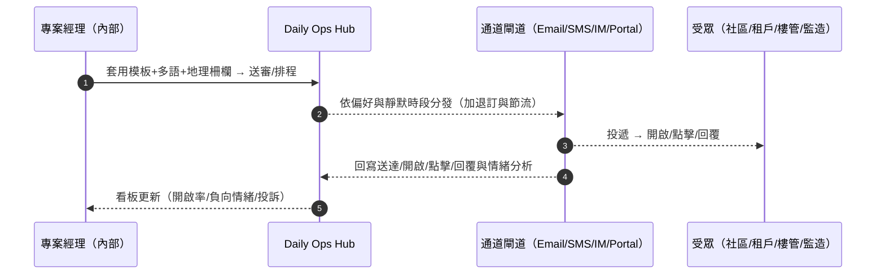
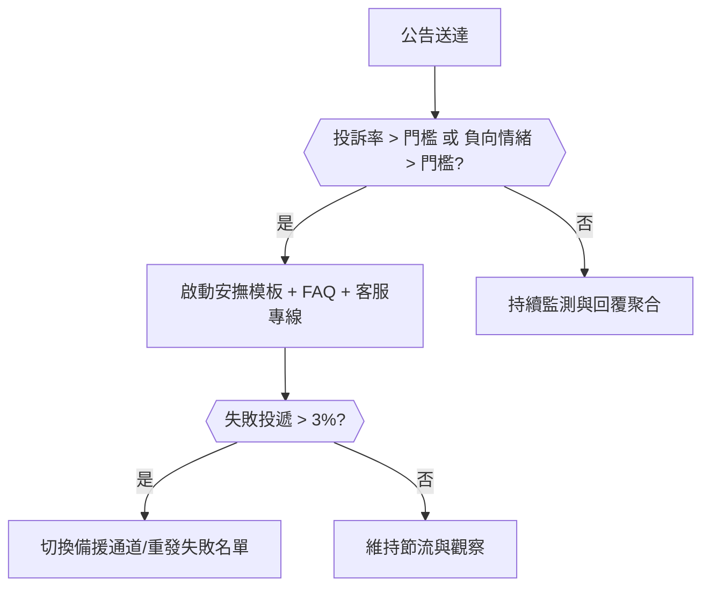
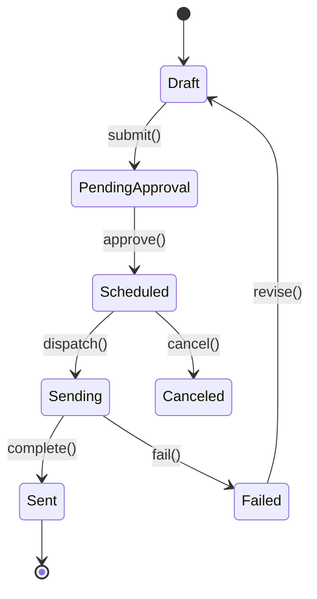
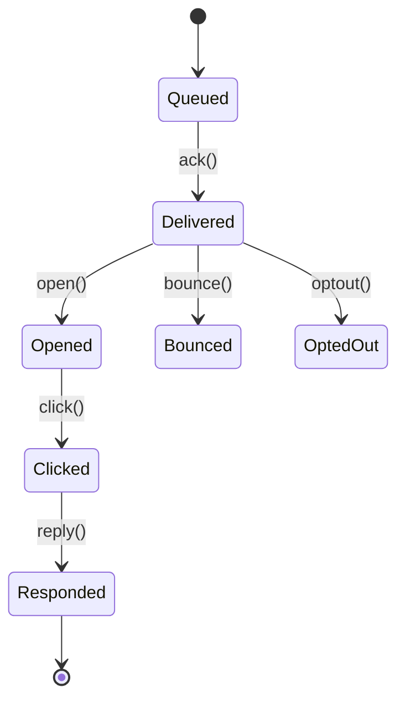

# Part 3i — 〈對外公告（External Communications）〉卡片 詳規（Construction）
**版本**：v3.0  
**日期**：2025-09-20  
**對象**：專案經理（Project Manager）、社區/樓管窗口、物業/租戶關係經理、公關（Public Relations）、安全與環安衛（Environment, Health and Safety, EHS）、分包商與供應商（受限視圖）、監造/業主代表（受限視圖）  
**範圍**：本文件針對首頁卡片「對外公告（External Communications）」給出：平台內外使用者旅程（Mermaid 圖）、User Story、互動規格、資料模型、TypeScript 介面、OpenAPI 片段、高真 mock data、Playbook 決策表與規則語法、狀態圖、遙測、驗收、權限、效能與邊界情境。  
> 術語：關係人（Stakeholder）、受眾分群（Audience Segment）、服務等級協議（Service Level Agreement, SLA）、地理柵欄（Geofence）、送達/開啟/點擊（Delivered/Open/Click）、投訴與情緒（Complaint & Sentiment）、靜默時段（Quiet Hours）、退訂/拒收（Opt-out）。

---

## 1. 目標與價值
**目標**：用一張卡片把涉及**業主/監造/社區/樓管/租戶**的對外公告，做成**可分群、多通道、可追蹤且合規**的溝通中心，支援**多語與模板**、**靜默時段**、**回覆收集**與**情緒監測**，並與**進度/安全/會議**等模組互通（例如夜間澆置、停水停電、動線封閉、噪音作業）。

**北極星指標**
- 覆蓋率（Coverage = 有效送達/目標人數）≥ 95%  
- 投訴率（Complaints / Delivered）≤ 0.5%；負向情緒比（Negative Sentiment）≤ 5%  
- 平均到達首開時間（Time to First Open）≤ 15 分鐘（短信/即時通訊）；≤ 2 小時（電子郵件）  
- 靜默時段違規發送率 **0**（合規）

**次級成效**：降低臨時通知的人力成本 ≥ 50%、噪音與動線干擾投訴下降 ≥ 30%。

---

## 2. 卡片 KPI 與排序邏輯
- **KPI 徽章**：`今日公告`、`開啟率（加權）`、`負向情緒`、`待審批`、`逾期回覆`。  
- **排序鍵（rank）**：`rank = urgency*0.4 + impact*0.3 + risk*0.2 + aging*0.1`
  - `urgency`：與作業窗口的時間接近度（0..3）  
  - `impact`：觸達人數 × 受影響業務（出入/供水/用電/消防/安全）（0..3）  
  - `risk`：歷史投訴率/負向情緒、合規風險（0..3）  
  - `aging`：草案/待審批/已排程但將到期（0..1）

---

## 3. User Stories（Gherkin）
**US-EC-01（PM）**  
- Given 明晚 22:00–04:00 進行夜間混凝土澆置，影響社區與租戶休息  
- When 我開啟卡片→選模板「夜間噪音作業通知」→分群（半徑 500 公尺 + 住宅用戶 + 中文/英文）→排程晚間 18:00 發送，啟用靜默與退訂管理  
- Then 系統產出多通道（簡訊/即時通訊/電子郵件/社群貼文）並追蹤開啟與情緒，必要時自動降噪補償說明。

**US-EC-02（物業/樓管）**  
- Given 我需在施工動線變更前 48 小時告知租戶與訪客  
- When 我使用「動線變更」模板，上傳平面圖與替代路徑圖，選擇公告牆投放（大廳與電梯）與租戶門戶推送  
- Then 系統輸出海報 PDF 與門戶訊息，並提供 QR 代碼追蹤。

**US-EC-03（公關）**  
- Given 近一週負向情緒升高且投訴關鍵字集中於「夜間噪音」  
- When 我發佈安撫與補充說明（含噪音儀數據、聯絡窗口與問答）  
- Then 投訴率下降，卡片呈現趨勢與 FAQ 點閱。

**US-EC-04（EHS）**  
- Given 明天 09:00–12:00 吊裝作業需封鎖北門出入口  
- When 我勾選「危險作業」標記並要求現場警衛簽收  
- Then 系統對北門出入人的受眾分群發送，並收集警衛簽收證據鏈。

**US-EC-05（業主/監造）**  
- Given 我只想收到與我標段相關的公告  
- When 我透過一次性分享頁設定偏好（語言/標段/時段）  
- Then 後續公告依偏好送達，且可隨時退訂。

---

## 4. 互動規格（Interaction Spec）
### 4.1 卡片結構（符合：標題、關鍵指標、主表格、快速操作、篩選、批量、Pin、抽屜）
- **標題列**：`對外公告` + KPI（今日公告/開啟率/負向情緒/待審批/逾期回覆）。  
- **工具列**：
  - `Filter`：通道（電子郵件/簡訊/即時通訊/租戶門戶/海報）、受眾（業主/監造/社區/樓管/租戶/訪客/警衛）、語言、狀態（草案/待審批/已排程/傳送中/已送達/回覆待處理）、是否危險作業、是否靜默時段、區域/地理柵欄。  
  - `Group by`：`受眾分群` / `通道` / `區域` / `語言`。  
  - `Sort`：rank、開啟率、負向情緒、傳送失敗率、覆蓋率。  
  - `Bulk Actions`：批量排程/取消、批量審批、批量重發（僅失敗）、批量導出投訴回覆、批量生成海報。  
  - `Pin to Top`、`Export`（CSV/Excel/PDF 審計包）。
- **主表格欄位（預設）**：`標題/時間窗`、`通道`、`目標受眾`、`覆蓋率`、`開啟率`、`情緒（正/中/負）`、`回覆/投訴`、`分享/到期`、`主要動作`。  
- **右側抽屜（Drawer）**：
  - `Compose`：模板（可變數 {{project}}, {{date}}, {{zone}}）、多語內容、附件（圖/平面圖/FAQ）、連結追蹤（UTM/短鏈結）。  
  - `Audience`：受眾分群（名單/屬性/地理柵欄/標段/角色/偏好），退訂/拒收與偏好管理。  
  - `Schedule`：時間（含多時區提示）、靜默時段、頻率與節流（Throttle）、重試策略。  
  - `Insights`：送達/開啟/點擊/回覆/投訴/情緒、通道成本與成效。  
  - `Relations`：對應作業（夜間澆置/封路/停電/停水）、Permit、會議決議、風險卡。  
  - `Actions`：`送審`、`排程`、`立即送出`、`取消`、`重發（失敗）`、`產生海報 PDF`、`對外分享頁`。

### 4.2 行動端（Mobile）
- 一鍵套用模板與地理柵欄；預覽多語; 推播測試；簽核與取消；回覆與投訴即時查看。

### 4.3 可及性（Accessibility）
- 海報 PDF 含向量文字與替代文字；顏色對比合規；可讀型字體與多語排序。

---

## 5. 低保真 Wireframe（僅此卡）
```text
┌─ 對外公告  今日:4 | 開啟率(加權):62% | 負向情緒:3% | 待審批:2 ───────────────────────────┐
│ Filter[通道|受眾|語言|狀態|危險作業|區域]  Group[受眾]  Sort[rank]  Bulk[...]  Pin  Export │
├────────────────────────────────────────────────────────────────────────────────────────┤
│ 標題/時間窗                 通道            受眾              覆蓋  開啟  情緒  回覆/投訴  分享  動作 │
│ 夜間澆置噪音通知(22-04)      SMS/IM/Email    社區500m/租戶       97%  64%  4%    3/1       9/21  [審/排/看] │
│ 北門封鎖與改道(09-12)        Portal/海報       租戶+訪客           99%  58%  2%    1/0       9/20  [審/排/圖] │
│ 停電維修(13-15)              SMS/Email        租戶（辦公）         95%  70%  1%    0/0       9/20  [送/取/海] │
└────────────────────────────────────────────────────────────────────────────────────────┘
▸ 點列 → Drawer: Compose / Audience / Schedule / Insights / Relations / Actions
（動作鍵例：審=送審、排=排程、看=看數據、圖=上傳示意圖、送=立即發、取=取消、海=生海報）
```

---

## 6. 使用者旅程（Mermaid；平台內/外）
### 6.1 「夜間作業公告」→ 多通道排程 → 追蹤與情緒監測（Sequence）


### 6.2 「投訴升級」與「重發策略」（Flow with gates）


---

## 7. 資料模型（Data Model）
### 7.1 實體與關聯（摘要）
- **Announcement**：`id, projectId, title, window{{start,end}}, isHazardousOp?, templateId?, languages[{{code,subject,body,attachments[]}}], channels[Email|SMS|IM|Portal|Poster], share{{pageUrl?,password?,expiresAt?}}, status(Draft|PendingApproval|Scheduled|Sending|Sent|Canceled|Failed)`.  
- **AudienceSegment**：`id, projectId, name, criteria{{role/company/building/floor/unit,useType,geofence,language,tag[]}}, size, optedOutCount`.  
- **Dispatch**：`id, announcementId, channel, scheduleAt, throttle{{ratePerMin,maxPerHour}}, retries, quietHours{{start,end}}, status`.  
- **Recipient**：`id, announcementId, audienceId, personId, contact{{email,phone,imId,portalId}}, preferredChannel, delivery{{status,at}}, engagement{{openedAt,clickedAt,reply?,sentiment(Positive|Neutral|Negative)}}, complaint?, optOut?`.  
- **Poster**：`id, announcementId, pdfUrl, qrUrl, locations[]`。  
- **Feedback**：`id, announcementId, personId?, channel, text, sentiment, tags[], at`。

### 7.2 TypeScript 介面（片段）
```ts
export type Channel = "Email"|"SMS"|"IM"|"Portal"|"Poster";
export type AnnStatus = "Draft"|"PendingApproval"|"Scheduled"|"Sending"|"Sent"|"Canceled"|"Failed";
export type Sentiment = "Positive"|"Neutral"|"Negative";

export interface Announcement {
  id: string; projectId: string; title: string;
  window?: { start: string; end: string };
  isHazardousOp?: boolean;
  templateId?: string;
  languages: { code: string; subject?: string; body: string; attachments?: string[] }[];
  channels: Channel[];
  audienceIds: string[];
  share?: { pageUrl?: string; password?: string; expiresAt?: string };
  status: AnnStatus;
  createdBy: string; createdAt: string;
}

export interface AudienceSegment {
  id: string; projectId: string; name: string;
  criteria?: { role?: string[]; company?: string[]; building?: string[]; floor?: string[]; unit?: string[]; useType?: string[]; geofence?: { lat: number; lng: number; radius: number }; language?: string[]; tag?: string[] };
  size?: number; optedOutCount?: number;
}

export interface Dispatch {
  id: string; announcementId: string; channel: Channel;
  scheduleAt: string; throttle?: { ratePerMin?: number; maxPerHour?: number };
  retries?: number; quietHours?: { start: string; end: string };
  status: "Scheduled"|"Sending"|"Sent"|"Canceled"|"Failed";
}

export interface Recipient {
  id: string; announcementId: string; audienceId?: string; personId?: string;
  contact: { email?: string; phone?: string; imId?: string; portalId?: string };
  preferredChannel?: Channel;
  delivery?: { status: "Queued"|"Delivered"|"Bounced"; at?: string };
  engagement?: { openedAt?: string; clickedAt?: string; reply?: string; sentiment?: Sentiment };
  complaint?: boolean; optOut?: boolean;
}

export interface ExternalCommsResponse {
  projectId: string; asOf: string;
  kpis: { today: number; weightedOpenRate: number; negativeSentimentPct: number; pendingApprovals: number };
  rows: {
    announcement: Announcement;
    channels: Channel[];
    audience: { name: string; size: number; coveragePct: number };
    metrics: { deliveredPct: number; openPct: number; negativePct: number; replies: number; complaints: number };
    share?: { url?: string; expiresAt?: string };
  }[];
}
```

---

## 8. API 規格（OpenAPI 3.0 片段）
```yaml
openapi: 3.0.3
info: { title: Construction Hub – External Communications API, version: 3.0.0 }
paths:
  /projects/{{projectId}}/external-comms:
    get:
      summary: 對外公告卡片聚合（KPI + 表格）
      parameters:
        - in: path
          name: projectId
          required: true
          schema: { type: string }
        - in: query
          name: filter
          schema: { type: string, example: "channel=SMS,Email;status=PendingApproval,Scheduled;language=zh-TW,en" }
        - in: query
          name: sort
          schema: { type: string, enum: [rank,openRate,negativePct,coverage] }
      responses:
        "200":
          description: OK
          content:
            application/json:
              schema: { $ref: "#/components/schemas/ExternalCommsResponse" }

  /announcements:
    post:
      summary: 建立公告（多語/多通道/模板）
      requestBody:
        content:
          application/json:
            schema: { $ref: "#/components/schemas/Announcement" }
      responses: { "201": { description: Created } }

  /announcements/{{id}}/approve:
    post: { summary: 送審/核准, responses: { "200": { description: Approved } } }

  /announcements/{{id}}/schedule:
    post:
      summary: 排程與節流/靜默時段設定
      requestBody:
        content:
          application/json:
            schema:
              type: object
              properties:
                scheduleAt: { type: string, format: date-time }
                throttle: { type: object, properties: { ratePerMin: {type: integer}, maxPerHour: {type: integer} } }
                quietHours: { type: object, properties: { start: {type: string}, end: {type: string} } }
      responses: { "200": { description: Scheduled } }

  /announcements/{{id}}/send:
    post: { summary: 立即送出, responses: { "202": { description: Dispatching } } }

  /announcements/{{id}}/cancel:
    post: { summary: 取消排程/發送, responses: { "200": { description: Canceled } } }

  /announcements/{{id}}/resend-failed:
    post: { summary: 僅重發失敗名單, responses: { "202": { description: Re-dispatching } } }

  /announcements/{{id}}/poster:
    post:
      summary: 生成海報 PDF 與 QR（指定位置）
      requestBody:
        content:
          application/json:
            schema:
              type: object
              properties:
                locations: { type: array, items: { type: string } }
      responses: { "201": { description: Poster created } }

  /webhooks/inbound:
    post: { summary: 回覆/退訂/投訴 Webhook, responses: { "200": { description: Received } } }

components:
  schemas:
    ExternalCommsResponse:
      type: object
      properties:
        projectId: { type: string }
        asOf: { type: string, format: date-time }
        kpis:
          type: object
          properties:
            today: { type: integer }
            weightedOpenRate: { type: number }
            negativeSentimentPct: { type: number }
            pendingApprovals: { type: integer }
        rows:
          type: array
          items:
            type: object
            properties:
              announcement: { $ref: "#/components/schemas/Announcement" }
              channels: { type: array, items: { type: string } }
              audience:
                type: object
                properties:
                  name: { type: string }
                  size: { type: integer }
                  coveragePct: { type: number }
              metrics:
                type: object
                properties:
                  deliveredPct: { type: number }
                  openPct: { type: number }
                  negativePct: { type: number }
                  replies: { type: integer }
                  complaints: { type: integer }
              share:
                type: object
                properties:
                  url: { type: string }
                  expiresAt: { type: string, format: date-time }
```

---

## 9. Mock Data（高真示例）
```json
{
  "projectId": "PRJ-001",
  "asOf": "2025-09-20T13:00:00Z",
  "kpis": { "today": 4, "weightedOpenRate": 0.62, "negativeSentimentPct": 0.03, "pendingApprovals": 2 },
  "rows": [
    {
      "announcement": {
        "id": "ANN-9001",
        "projectId": "PRJ-001",
        "title": "夜間澆置噪音通知（22:00–04:00）",
        "window": { "start": "2025-09-21T22:00:00Z", "end": "2025-09-22T04:00:00Z" },
        "isHazardousOp": true,
        "languages": [
          { "code": "zh-TW", "subject": "夜間施工通知", "body": "9/21 22:00–4:00 將進行夜間澆置..." },
          { "code": "en", "subject": "Night Concrete Pour Notice", "body": "Night pour on Sep 21 22:00–04:00..." }
        ],
        "channels": ["SMS","IM","Email"],
        "audienceIds": ["SEG-NEIGHBOR-500M"],
        "status": "Scheduled",
        "createdBy": "PM-01",
        "createdAt": "2025-09-20T11:20:00Z"
      },
      "channels": ["SMS","IM","Email"],
      "audience": { "name": "社區500m", "size": 1320, "coveragePct": 0.97 },
      "metrics": { "deliveredPct": 0.95, "openPct": 0.64, "negativePct": 0.04, "replies": 3, "complaints": 1 },
      "share": { "url": "https://portal.example.com/ann/ANN-9001", "expiresAt": "2025-09-22T12:00:00Z" }
    },
    {
      "announcement": {
        "id": "ANN-9002",
        "projectId": "PRJ-001",
        "title": "北門封鎖與改道（09:00–12:00）",
        "window": { "start": "2025-09-21T09:00:00Z", "end": "2025-09-21T12:00:00Z" },
        "languages": [{ "code": "zh-TW", "body": "北門封鎖，請改走南門；附動線圖" }],
        "channels": ["Portal","Poster"],
        "audienceIds": ["SEG-TENANT-OFFICE"],
        "status": "PendingApproval",
        "createdBy": "EHS-02",
        "createdAt": "2025-09-20T09:00:00Z"
      },
      "channels": ["Portal","Poster"],
      "audience": { "name": "辦公租戶", "size": 860, "coveragePct": 0.99 },
      "metrics": { "deliveredPct": 0.98, "openPct": 0.58, "negativePct": 0.02, "replies": 1, "complaints": 0 },
      "share": { "url": "https://portal.example.com/ann/ANN-9002", "expiresAt": "2025-09-21T12:30:00Z" }
    }
  ]
}
```

---

## 10. Playbook 決策表（Decision Table）
| 規則 | 條件 | 動作 | 附註 |
|---|---|---|---|
| PB-EC-01 | 危險作業公告且窗口 < 24 小時 | 強制雙語 + 短信/即時通訊優先；啟用靜默時段檢查 | 保證時效 |
| PB-EC-02 | 送達失敗率 > 3% 或 某通道退信/退簡 > 門檻 | 啟動備援通道；只重發失敗名單；標記問題名單 | 提升覆蓋 |
| PB-EC-03 | 負向情緒 > 5% 或 投訴連續 3 筆 | 啟動安撫模板 + FAQ；派專人回電；建立會議決議 | 控制輿情 |
| PB-EC-04 | 含個資/合約敏感詞 | 觸發外部版脫敏，強制密碼與到期 + 水印 | 法規合規 |
| PB-EC-05 | 受眾偏好指定「不在靜默時段通知」 | 自動延後至結束時段；如為緊急類別則覆寫並記錄 | 兼顧體驗 |

**規則語法（DSL 示意）**
```text
WHEN announcement.isHazardousOp = true AND hoursTo(announcement.window.start) < 24
THEN enforceLanguages(["zh-TW","en"]), preferChannels(["SMS","IM"]), requireQuietHourCheck(true)
```

---

## 11. 狀態圖（State Machine）
### 11.1 Announcement


### 11.2 Recipient Delivery & Engagement


---

## 12. 遙測（Telemetry）
- **通道成效**：送達/開啟/點擊/回覆率；失敗與退訂。  
- **情緒趨勢**：正/中/負比例與關鍵字雲；週期趨勢。  
- **覆蓋率與成本**：每人成本（Cost per Reached）、單次公告總成本、通道分攤。  
- **合規指標**：靜默時段觸發/覆寫次數、外部脫敏比率、一次性連結到期失效率。

---

## 13. 驗收準則（Acceptance Criteria）
- 聚合 5000 名受眾的公告排程 ≤ 2 秒；卡片首屏 ≤ 500 毫秒（95 分位）。  
- 支援多語模板、地理柵欄、節流與靜默時段；退訂/偏好可自助管理。  
- 送達/開啟/點擊/情緒追蹤成功率 ≥ 98%；投訴／退訂事件即時回寫（≤ 60 秒）。  
- 生成海報 PDF 與門戶公告頁可用，掃 QR 可追蹤到卡片統計。

---

## 14. 權限（RBAC + ABAC）
- **創建者（PM/物業/公關/EHS）**：草案、分群、送審、排程、取消、重發。  
- **審批人（PM/監造/業主代表）**：核准/駁回；外部版脫敏設定。  
- **外部受眾**：僅可閱覽/回覆/退訂/偏好設定（透過分享頁）。  
- 屬性：Project / Geofence / Building-Floor-Unit / Role / Company / Language / Hazard。

---

## 15. 效能與可靠性
- 佇列與節流保障通道穩定；失敗重試（指數退避 + 死信佇列）。  
- 短鏈結與追蹤一體化（UTM/簽章）；個資最小化與資料加密。  
- 內容模板版本化與審計；一次性分享頁短期憑證與水印。

---

## 16. 邊界情境（Edge Cases）
- **無法定位**：缺 GPS 或地址不完整 → 用建物/樓層/出入口作為近似分群。  
- **名單重疊**：多分群重複 → 自動去重，保留單一聯絡，合併偏好。  
- **退訂與合規**：受眾退訂 → 後續自動排除；緊急類別可覆寫但需理由與紀錄。  
- **通道封鎖**：社群或即時通訊 API 限制 → 退回備援通道，通知「通道降級」。  
- **多語**：缺少翻譯 → 以預設語言 + 機器翻譯佔位，提醒人工校訂。

---

## 17. 本卡片輸出與下一步
- 與「會議與決議」「風險與服務等級倒數」「品質與安全整改」互通：公告可由決議觸發；投訴與情緒將回寫風險；危險作業公告關聯 Permit。  
- **建議下一張**：〈合約與分包（Contract & Subcontract）〉或返回優先卡補強（例如 sentiment 規則與語音留言回覆）。
