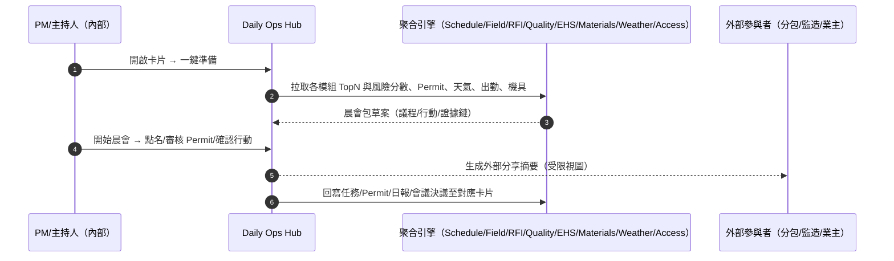
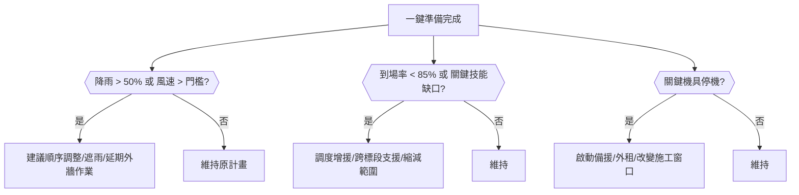
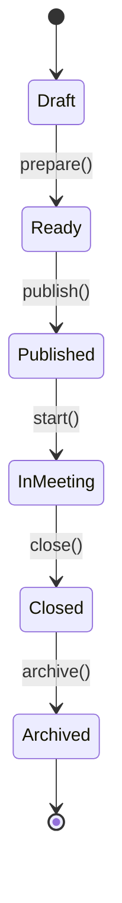
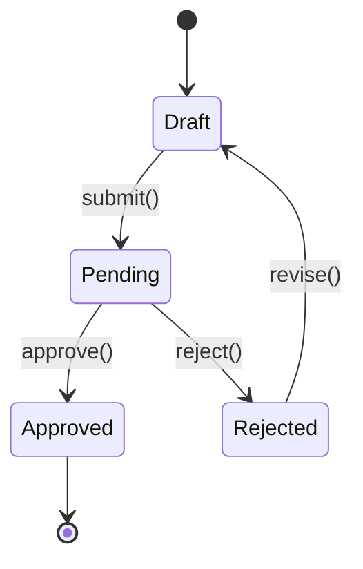

# Part 3j — 〈晨會摘要（Daily Briefing）〉卡片 詳規（Construction）
**版本**：v3.0  
**日期**：2025-09-20  
**對象**：專案經理（Project Manager, PM）、總工/工地主任（General Foreman）、安全與環安衛（Environment, Health and Safety, EHS）、現場工程師、分包班組長、監造/業主代表（受限視圖）  
**範圍**：本文件針對首頁卡片「晨會摘要（Daily Briefing）」給出：平台內外的使用者旅程（Mermaid 圖）、User Story、互動規格、資料模型、TypeScript 介面、OpenAPI 片段、高真 mock data、Playbook 決策表與規則語法、狀態圖、遙測、驗收、權限、效能與邊界情境。  
> 術語：工作分解結構（Work Breakdown Structure, WBS）、資訊請求（Request For Information, RFI）、檢驗申請（Inspection Request, IR）、材料進場檢驗（Material Inspection Request, MIR）、服務等級協議（Service Level Agreement, SLA）、關鍵路徑法（Critical Path Method, CPM）、個人防護具（Personal Protective Equipment, PPE）。

---

## 1. 目標與價值
**目標**：在會前 **3 分鐘**提供**一頁式**摘要，涵蓋**今日高風險作業、天氣與阻礙、出勤與資格、關鍵機具、三週滾動計畫重點、逾期風險與待辦**，支援**點名/簽到、工作許可（Permit）打包**與**一鍵發佈晨會紀要**，並將決議與任務回寫到其他卡片（進度、風險、品質、安全、材料、協同）。

**北極星指標**
- 晨會準備時間（「點開卡片 → 準備完成」） ≤ **90 秒**  
- 晨會後 **15 分鐘內**發布紀要與任務化決議比例 ≥ **95%**  
- 高風險作業（熱作/吊裝/高空）**許可齊備率** ≥ **98%**

**次級成效**：減少重複會前蒐集、降低錯版施工與安全事故風險。

---

## 2. 卡片 KPI 與排序邏輯
- **KPI 徽章**：`今日高風險作業`、`預報降雨概率`、`到場率`、`關鍵機具可用率`、`逾期風險`。  
- **排序鍵（rank）**：`rank = riskScore*0.45 + weatherImpact*0.25 + capacityGap*0.2 + scheduleTight*0.1`
  - `riskScore`：未辦理或即將到期工作許可 × 嚴重度（0..3）  
  - `weatherImpact`：降雨/風速對外作業影響（0..3）  
  - `capacityGap`：到場人力/機具 vs 計畫需求缺口（0..3）  
  - `scheduleTight`：關鍵路徑 3 日內緊迫工項數（0..3）

---

## 3. User Stories（Gherkin）
**US-DB-01（PM）**  
- Given 我在 07:50 開啟卡片，看到「高風險 3 項、降雨 60%、到場率 82%、吊車 1 臺待修」  
- When 我點「一鍵準備」生成晨會包（議程、Permit 清單、關鍵圖紙/RFI、三週滾動要點）  
- Then 我在 08:00 準時開始，會後 08:20 發佈紀要並將整改/RFI/變更任務化。

**US-DB-02（EHS）**  
- Given 今日有「熱作×2、吊裝×1、高空×3」  
- When 我在抽屜中核對資格證與 Permit 到期，缺件者直接開單補辦與暫停作業標記  
- Then 相關風險自動回寫「品質與安全整改」卡並進入 SLA 倒數。

**US-DB-03（總工/工地主任）**  
- Given 機具出勤不足且雨量 60% 影響外牆澆灌  
- When 我在卡片上使用「建議行動 → 施工順序調整」與「調度支援」  
- Then 「進度健康度」卡更新關鍵路徑與三週滾動計畫，並通知分包。

**US-DB-04（分包）**  
- Given 我收到晨會摘要外部分享連結（只含我標段與責任事項）  
- When 我確認指派與到期並回覆材料到貨時間  
- Then 卡片顯示回覆已接收並更新「材料/到貨/檢驗」卡風險。

**US-DB-05（監造/業主）**  
- Given 我只看得到「安全關鍵、關鍵路徑偏差與今日里程碑」  
- When 我在分享頁簽核同意外牆澆灌備案（附風險緩解與噪音公告鏈結）  
- Then 系統留存審計鏈並更新相關卡片狀態。

---

## 4. 互動規格（Interaction Spec）
### 4.1 卡片結構（符合：標題、關鍵指標、主表格、快速操作、篩選、批量、Pin、抽屜）
- **標題列**：`晨會摘要` + KPI（高風險作業/降雨概率/到場率/機具可用率/逾期風險）。  
- **工具列**：
  - `Filter`：日期/班次（早/中/晚）、工區/樓層、標段、分包、作業類型（熱作/吊裝/高空/動火）、是否含外部視圖。  
  - `Group by`：`工區` / `分包` / `作業類型`。  
  - `Sort`：rank、風險分數、到場缺口、Permit 到期、機具停機時間。  
  - `Bulk Actions`：批量提醒（資格/Permit/出勤）、批量生成 Permit、批量調度、批量導出（PDF/Word/CSV）。  
  - `Pin to Top`、`Export`（晨會包 PDF/投影稿）。
- **主表格（預設區塊）**：
  1) **高風險作業**：`類型/位置/分包/Permit/到期/風險/主要行動`  
  2) **天氣與阻礙**：`降雨/風速/體感/警報/阻礙`（如道路封閉、停電）  
  3) **出勤與資格**：`到場/應到/到場率/資格缺口/教育訓練`  
  4) **關鍵機具**：`設備/狀態（可用/維修/占用）/利用率/維護`  
  5) **計畫重點（3 週滾動）**：`工項/里程碑/關聯 WBS/是否關鍵路徑/需注意`  
  6) **逾期風險**：`RFI/變更/整改/檢驗/會議決議（逾期/即將逾期）`
- **右側抽屜（Drawer）**：
  - `Briefing Pack`：晨會包草案（議程、風險、Permit、三週滾動、外部公告），可一鍵發佈。  
  - `Attendance`：快速點名（掃碼/名單/外部工區門禁）；教育訓練/證照檢核。  
  - `Permits`：今日 Permit 清單（熱作/吊裝/高空…），批量生成與簽核流。  
  - `Recommendations`：建議行動（順序調整、臨時遮雨、替代料、增援）。  
  - `Relations`：連到其他卡片/模組（Schedule/RFI/Quality/EHS/Materials/Meetings/External Comms）。  
  - `Actions`：`一鍵準備`、`開始晨會`、`發佈摘要 PDF/投影稿`、`一鍵日報`。

### 4.2 行動端（Mobile）
- 會前快速模式：3 卡位（風險、出勤、Permit）；線上/離線點名；掃碼檢核證照與 Permit；一鍵共享。

### 4.3 可及性（Accessibility）
- 投影模式字級自適應；色弱配色；PDF 含結構化大綱與替代文字。

---

## 5. 低保真 Wireframe（僅此卡）
```text
┌─ 晨會摘要  高風險:6 | 降雨:60% | 到場率:82% | 機具可用:91% | 逾期風險:5 ──────────────────────────┐
│ Filter[日期|班次|工區|分包|作業類型|外部視圖]  Group[工區]  Sort[rank]  Bulk[...]  Pin  Export │
├────────────────────────────────────────────────────────────────────────────────────────────┤
│ 高風險作業： 類型  位置  分包  Permit  到期  風險  行動   │ 天氣：降雨/風速/警報； 阻礙：道路封閉 │
│ 出勤： 到場/應到/率； 資格缺口； 教育訓練            │ 機具：可用/維修/占用； 維護計畫          │
│ 計畫重點(3週)： 里程碑/WBS/是否關鍵路徑/注意事項        │ 逾期：RFI/變更/整改/檢驗/決議            │
└────────────────────────────────────────────────────────────────────────────────────────────┘
▸ 點列 → Drawer: Briefing Pack / Attendance / Permits / Recommendations / Relations / Actions
```

---

## 6. 使用者旅程（Mermaid；平台內/外）
### 6.1 「一鍵準備」→ 晨會 → 任務化與分享（Sequence）


### 6.2 「雨勢/人力/機具門檻」→ 決策分支（Flow with gates）


---

## 7. 資料模型（Data Model）
### 7.1 實體與關聯（摘要）
- **DailyBriefing**：`id, projectId, date, shift(Morning|Afternoon|Night), status(Draft|Ready|Published|InMeeting|Closed|Archived), kpis{riskCount, rainProb, attendancePct, equipmentAvailPct, overdueCount}, packUrl?`  
- **BriefingSection**：`id, briefingId, type(Risks|Weather|Attendance|Equipment|Plan|Overdue), rank, items[]`  
- **RiskItem**：`id, type(HotWork|Lifting|WorkAtHeight|Electrical|ConfinedSpace), locationIds[], contractorId, permit{required, id?, expiresAt?}, severity(1..5), actionSuggested[]`  
- **WeatherInfo**：`date, rainProb, windSpeed, tempFeelsLike, alerts[]`  
- **AttendanceSummary**：`expected, present, pct, gaps{skill:[{name,need,have}]}, trainingDue[]`  
- **EquipmentStatus**：`equipmentId, name, status(Available|Down|InUse|Maintenance), utilizationPct, maintenanceDueAt?`  
- **PlanHighlight**：`wbsId, title, isCriticalPath, milestoneDate, notes`  
- **OverdueItem**：`kind(RFI|Change|Rectification|Inspection|Decision), refId, dueAt, owner, impact(Schedule|Cost|Safety|Quality)`  
- **PermitTask**：`id, type, holders[], status(Draft|Pending|Approved|Rejected), expiresAt`  
- **ShareLink**：`id, url, password?, expiresAt, visibility(Participants|Company|PublicByLink), redactions[]`

### 7.2 TypeScript 介面（片段）
```ts
export type BriefingStatus = "Draft"|"Ready"|"Published"|"InMeeting"|"Closed"|"Archived";
export type SectionType = "Risks"|"Weather"|"Attendance"|"Equipment"|"Plan"|"Overdue";

export interface DailyBriefing {
  id: string; projectId: string; date: string;
  shift: "Morning"|"Afternoon"|"Night";
  status: BriefingStatus;
  kpis: { riskCount: number; rainProb: number; attendancePct: number; equipmentAvailPct: number; overdueCount: number };
  packUrl?: string;
}

export interface RiskItem {
  id: string;
  type: "HotWork"|"Lifting"|"WorkAtHeight"|"Electrical"|"ConfinedSpace";
  locationIds: string[];
  contractorId: string;
  permit: { required: boolean; id?: string; expiresAt?: string };
  severity: number; // 1..5
  actionSuggested?: string[];
}

export interface AttendanceSummary {
  expected: number; present: number; pct: number;
  gaps?: { skill: { name: string; need: number; have: number }[] };
  trainingDue?: { personId: string; name: string; course: string; dueAt: string }[];
}

export interface EquipmentStatus { equipmentId: string; name: string; status: "Available"|"Down"|"InUse"|"Maintenance"; utilizationPct?: number; maintenanceDueAt?: string; }

export interface PlanHighlight { wbsId: string; title: string; isCriticalPath: boolean; milestoneDate: string; notes?: string; }

export interface OverdueItem { kind: "RFI"|"Change"|"Rectification"|"Inspection"|"Decision"; refId: string; dueAt: string; owner: string; impact: "Schedule"|"Cost"|"Safety"|"Quality"; }

export interface DailyBriefingResponse {
  projectId: string; date: string; shift: "Morning"|"Afternoon"|"Night";
  kpis: DailyBriefing["kpis"];
  sections: { type: SectionType; rank: number; items: any[] }[];
  share?: { url?: string; expiresAt?: string; visibility?: "Participants"|"Company"|"PublicByLink" };
}
```

---

## 8. API 規格（OpenAPI 3.0 片段）
```yaml
openapi: 3.0.3
info: { title: Construction Hub – Daily Briefing API, version: 3.0.0 }
paths:
  /projects/{{projectId}}/daily-briefing:
    get:
      summary: 晨會摘要卡片聚合（KPI + 區塊）
      parameters:
        - in: path
          name: projectId
          required: true
          schema: { type: string }
        - in: query
          name: date
          schema: { type: string, format: date }
        - in: query
          name: shift
          schema: { type: string, enum: [Morning,Afternoon,Night], default: Morning }
        - in: query
          name: include
          schema: { type: string, example: "Risks,Weather,Attendance,Equipment,Plan,Overdue" }
      responses:
        "200":
          description: OK
          content:
            application/json:
              schema: { $ref: "#/components/schemas/DailyBriefingResponse" }

  /projects/{{projectId}}/daily-briefing/prepare:
    post:
      summary: 一鍵準備晨會包（聚合 + 排序 + 建議行動）
      requestBody:
        content:
          application/json:
            schema:
              type: object
              properties:
                date: { type: string, format: date }
                shift: { type: string, enum: [Morning,Afternoon,Night] }
                topN: { type: integer, default: 5 }
      responses: { "200": { description: Ready } }

  /daily-briefing/{{briefingId}}/publish:
    post:
      summary: 發佈晨會包（PDF/投影稿/分享頁），並將行動任務化
      requestBody:
        content:
          application/json:
            schema:
              type: object
              properties:
                formats: { type: array, items: { type: string, enum: [PDF, PPTX, HTML] } }
                createShareLink: { type: boolean, default: true }
      responses: { "200": { description: Published } }

  /daily-briefing/{{briefingId}}/attendance:
    post:
      summary: 晨會點名（掃碼/名單）與資格檢核
      requestBody:
        content:
          application/json:
            schema:
              type: object
              properties:
                presentIds: { type: array, items: { type: string } }
                checkedPermits: { type: array, items: { type: string } }
      responses: { "200": { description: Attendance recorded } }

  /daily-briefing/{{briefingId}}/permits/generate:
    post:
      summary: 批量生成今日工作許可（熱作/吊裝/高空…）
      responses: { "201": { description: Permits created } }

  /daily-briefing/{{briefingId}}/actions/accept:
    post:
      summary: 接受建議行動並回寫相關模組（進度/材料/品質/EHS）
      requestBody:
        content:
          application/json:
            schema:
              type: object
              properties:
                actions: { type: array, items: { type: string } }
      responses: { "200": { description: Actions accepted } }

components:
  schemas:
    DailyBriefingResponse:
      type: object
      properties:
        projectId: { type: string }
        date: { type: string, format: date }
        shift: { type: string, enum: [Morning,Afternoon,Night] }
        kpis:
          type: object
          properties:
            riskCount: { type: integer }
            rainProb: { type: number }
            attendancePct: { type: number }
            equipmentAvailPct: { type: number }
            overdueCount: { type: integer }
        sections:
          type: array
          items:
            type: object
            properties:
              type: { type: string }
              rank: { type: integer }
              items: { type: array, items: { type: object } }
        share:
          type: object
          properties:
            url: { type: string }
            expiresAt: { type: string, format: date-time }
            visibility: { type: string, enum: [Participants,Company,PublicByLink] }
```

---

## 9. Mock Data（高真示例）
```json
{
  "projectId": "PRJ-001",
  "date": "2025-09-20",
  "shift": "Morning",
  "kpis": { "riskCount": 6, "rainProb": 0.6, "attendancePct": 0.82, "equipmentAvailPct": 0.91, "overdueCount": 5 },
  "sections": [
    {
      "type": "Risks",
      "rank": 1,
      "items": [
        { "id": "RK-01", "type": "Lifting", "locationIds": ["LOC-B2-N"], "contractorId": "SUB-A", "permit": { "required": true, "id": null, "expiresAt": null }, "severity": 5, "actionSuggested": ["立即開吊裝許可", "封鎖北門", "公告社區"] },
        { "id": "RK-02", "type": "HotWork", "locationIds": ["LOC-L3-C"], "contractorId": "SUB-C", "permit": { "required": true, "id": "PT-778", "expiresAt": "2025-09-21T23:59:00Z" }, "severity": 4, "actionSuggested": ["檢查滅火器", "設防火毯"] },
        { "id": "RK-03", "type": "WorkAtHeight", "locationIds": ["LOC-Façade-W"], "contractorId": "SUB-B", "permit": { "required": true }, "severity": 4, "actionSuggested": ["系掛雙保護", "風速>8m/s即停"] }
      ]
    },
    {
      "type": "Weather",
      "rank": 2,
      "items": [
        { "date": "2025-09-20", "rainProb": 0.6, "windSpeed": 9.2, "tempFeelsLike": 31, "alerts": ["午後雷陣雨可能"] }
      ]
    },
    {
      "type": "Attendance",
      "rank": 3,
      "items": [
        { "expected": 220, "present": 181, "pct": 0.8227, "gaps": { "skill": [ { "name": "模板工", "need": 30, "have": 22 }, { "name": "塔吊指揮", "need": 4, "have": 2 } ] }, "trainingDue": [ { "personId": "P-887", "name": "張三", "course": "高空作業復訓", "dueAt": "2025-09-22T00:00:00Z" } ] }
      ]
    },
    {
      "type": "Equipment",
      "rank": 4,
      "items": [
        { "equipmentId": "EQ-CRANE-1", "name": "履帶吊 250t", "status": "Down", "utilizationPct": 0.0, "maintenanceDueAt": "2025-09-21T10:00:00Z" },
        { "equipmentId": "EQ-PUMP-2", "name": "混凝土泵", "status": "Available", "utilizationPct": 0.85 }
      ]
    },
    {
      "type": "Plan",
      "rank": 5,
      "items": [
        { "wbsId": "WBS-3.2.1", "title": "外牆澆灌區 W 西段", "isCriticalPath": true, "milestoneDate": "2025-09-21", "notes": "受雨影響，建議提前搭棚" },
        { "wbsId": "WBS-2.4.5", "title": "B2 鋼筋綁紮", "isCriticalPath": false, "milestoneDate": "2025-09-21" }
      ]
    },
    {
      "type": "Overdue",
      "rank": 6,
      "items": [
        { "kind": "RFI", "refId": "RFI-214", "dueAt": "2025-09-19T09:00:00Z", "owner": "CONS-1", "impact": "Schedule" },
        { "kind": "Decision", "refId": "DEC-533", "dueAt": "2025-09-18T18:00:00Z", "owner": "SUB-A", "impact": "Safety" }
      ]
    }
  ],
  "share": { "url": "https://portal.example.com/brief/DB-20250920", "expiresAt": "2025-09-21T12:00:00Z", "visibility": "Company" }
}
```

---

## 10. Playbook 決策表（Decision Table）
| 規則 | 條件 | 動作 | 附註 |
|---|---|---|---|
| PB-DB-01 | `rainProb > 0.5 AND plan.hasExteriorConcrete = true` | 建議：搭棚/延後/改內業；自動更新進度卡 What-if | 安全優先 |
| PB-DB-02 | `attendancePct < 0.85 OR skillGap.exists = true` | 觸發「人力調度」與「縮減範圍」建議；通知分包增援 | 保障關鍵路徑 |
| PB-DB-03 | `equipment.hasDownOnCritical = true` | 建議外租/備援；將受影響工項標註為風險 | 降低停工 |
| PB-DB-04 | `riskItem.permit.required AND !permit.id` | 生成 Permit 草案並急件審批；未通過則標記暫停 | 合規 |
| PB-DB-05 | `overdue.count > 0` | 產生催辦與升級；在會議卡建立臨時協調會 | 提速回應 |

**規則語法（DSL 示意）**
```text
WHEN weather.rainProb > 0.5 AND plan.contains("ExteriorConcrete")
THEN suggest(["SetupRainShelter","RescheduleToDryWindow","SwapToIndoorTasks"]), propagateTo("Schedule","Materials")
```

---

## 11. 狀態圖（State Machine）
### 11.1 DailyBriefing


### 11.2 Permit 批量生成與簽核


---

## 12. 遙測（Telemetry）
- **準備時效**：`prepare()`耗時分布；資料新鮮度（分鐘）。  
- **覆蓋率**：晨會參與簽到率；外部分享點閱率。  
- **合規**：Permit 齊備率、證照/教育訓練到期命中率。  
- **行動落地**：建議行動採納率、會後 24 小時內完成率；對進度 KPI（SPI）與安全事件的影響。

---

## 13. 驗收準則（Acceptance Criteria）
- 一鍵準備（聚合 6 模組 TopN + 排序 + 建議）≤ **20 秒**；卡片首屏載入 ≤ **400 毫秒（95 分位）**。  
- 晨會包可輸出 PDF/PPTX/HTML，外部分享（密碼/到期/水印）可用；審計鏈完整率 ≥ **98%**。  
- 點名成功率 ≥ **99%**（離線可緩存，回線自動同步）；Permit 批量生成成功率 ≥ **99%**。  
- 建議行動回寫其他卡片事件延遲 ≤ **60 秒**。

---

## 14. 權限（RBAC + ABAC）
- **PM/主持人**：準備/發佈/開始/關閉；接納建議；生成 Permit；外部分享。  
- **EHS**：Permit 與資格檢核；暫停/恢復作業。  
- **總工/工地主任**：調度人機、採納建議、通知分包。  
- **分包**：受限視圖（到場、Permit、指派與回覆）。  
- **監造/業主**：只讀或簽核（依邀請）。  
- 屬性：Project / Zone / Contractor / WorkType / PermitType。

---

## 15. 效能與可靠性
- **CQRS 讀模型**：對「風險、進度、出勤、機具、材料、會議、外部公告」設聚合索引，預先計算 TopN 與風險分數。  
- **離線同步**：行動端具本地資料庫，支援點名與 Permit 草案；採樂觀鎖與衝突解決。  
- **事件總線**：行動採納與 Permit 狀態變更透過事件驅動回寫。  
- **天氣來源**：可配置多供應商，取可信合併值並緩存。

---

## 16. 邊界情境（Edge Cases）
- **無外部數據/離線**：使用前一日快照與在地氣象站；顯示「資料過期」標示並允許手動更新。  
- **多班次與交疊**：允許同日多 briefing，抽屜可切換；避免重複生成 Permit。  
- **突發事故**：會中插入安全事故通報 → 自動置頂並生成臨時決議與公告。  
- **跨標段**：僅匯入授權標段的出勤與 Permit；外部分享脫敏非相關資訊。

---

## 17. 本卡片輸出與下一步
- 與「風險與服務等級倒數」「進度健康度」「現場任務看板」「材料/到貨/檢驗」「品質與安全整改」「會議與決議」「對外公告」互通；可一鍵生成日報。  
- **建議下一張**：〈合約與分包（Contract & Subcontract）〉或回頭補強「Permit 模板與條款校驗規則庫」。
