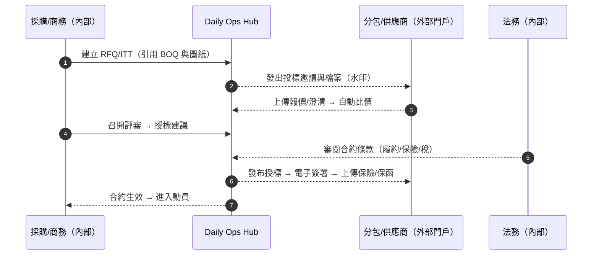
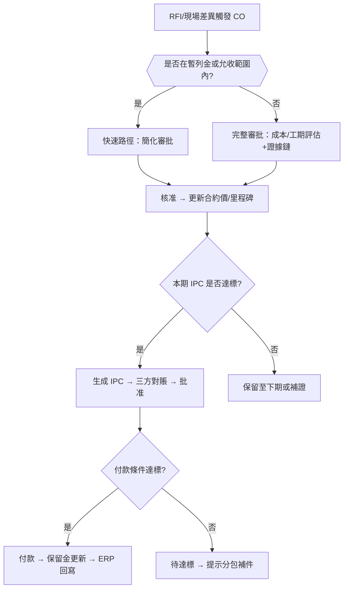
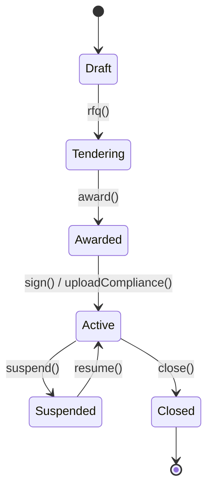
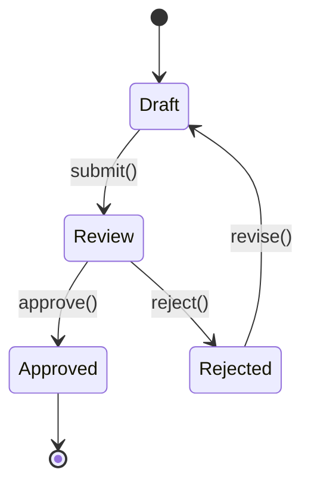
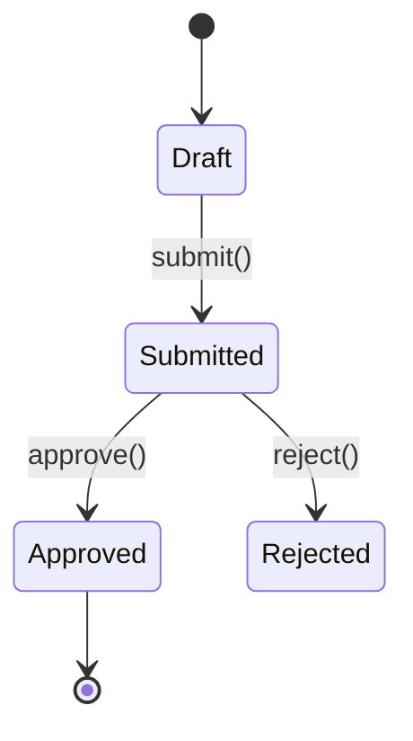
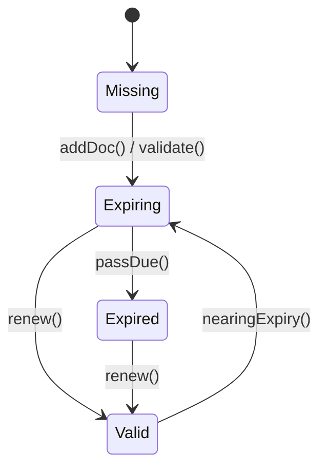

# Part 3k — 〈合約與分包（Contract & Subcontract）〉卡片 詳規（Construction）
**版本**：v3.0  
**日期**：2025-09-20  
**對象**：商務/合約經理（Commercial/Contracts Manager）、採購（Procurement）、專案經理（Project Manager, PM）、財務（Finance/Accounts Payable and Accounts Receivable）、法務（Legal）、安全與環安衛（Environment, Health and Safety, EHS）、分包/供應商（外部受限視圖）、監造/業主代表（Owner’s Representative，受限視圖）  
**範圍**：首頁卡片「合約與分包（Contract & Subcontract）」之完整規格：平台內外使用者旅程（Mermaid 圖）、User Story、互動規格、資料模型、TypeScript 介面、OpenAPI 片段、高真 mock data、Playbook 決策表與規則語法、狀態圖、遙測、驗收、權限、效能與邊界情境。  
> 術語：招標詢價（Request For Quotation, RFQ）、投標邀請（Invitation To Tender, ITT）、工程量清單（Bill Of Quantities, BOQ）、暫列金（Provisional Sum, PS）、變更指令/變更單（Variation Order/Change Order, VO/CO）、進度計價憑證（Interim Payment Certificate, IPC）、最終結算（Final Account, FA）、保留金（Retention）、保險/履約（Insurance/Bond）、服務等級協議（Service Level Agreement, SLA）、關鍵績效指標（Key Performance Indicator, KPI）。

---

## 1. 目標與價值
**目標**：統一管理**招評比→授標→合約主檔→合約履約→變更→進度計價→發票與付款→保留金釋放**，與**進度、材料/檢驗、RFI、品質與安全、成本快照**雙向關聯，支援**多幣別/稅制**、**外部分包門戶**、**證據鏈與審計**。

**北極星指標**
- **授標週期中位數**（RFQ 發出→授標） ≤ 14 天  
- **變更核准週期中位數** ≤ 10 天；**變更在途金額/合同額** ≤ 10%  
- **進度計價核准週期中位數** ≤ 7 天；**準時付款率（On-time Payment Ratio）** ≥ 95%  
- **合規覆蓋率**（保險/證照有效） ≥ 99%

**次級成效**：降低議價成本、縮短資金占用、降低索賠與爭議、提升供應商績效透明。

---

## 2. 卡片 KPI 與排序邏輯
- **KPI 徽章**：`授標中`、`變更在途金額`、`計價待審`、`準時付款率`、`合規缺件`。  
- **排序鍵（rank）**：`rank = exposure*0.4 + approvalDelay*0.3 + complianceRisk*0.2 + disputeRisk*0.1`
  - `exposure`：合約金額×進度/關鍵路徑影響 + 在途變更  
  - `approvalDelay`：近 60 天變更/計價的批准中位天數  
  - `complianceRisk`：保險/履約/證照到期與缺件分數  
  - `disputeRisk`：投訴、拒付、缺陷與回扣爭議權重

**顯示公式（抽屜）**：`Revised Contract Sum = Original Sum + Σ(Approved Variations) ± Provisional Sum Adjustments`。

---

## 3. User Stories（Gherkin）
**US-CSC-01（採購/商務）**  
- Given 我已完成工程量清單（BOQ）與圖紙關聯  
- When 我在卡片建立 **招標詢價（Request For Quotation, RFQ）** 並發送投標邀請（Invitation To Tender, ITT）給 3 家分包  
- Then 系統收集報價、比較與審批流，**於 48 小時內**輸出授標建議與合約草案。

**US-CSC-02（PM）**  
- Given RFI 回覆導致管線改線並影響工期 3 天  
- When 我在卡片對應分包 **一鍵自動生成變更單（Change Order, CO）草案**（帶出量測、照片、工時）並送審  
- Then 核准後自動更新合約價、支付里程碑、進度計價配額與關鍵路徑。

**US-CSC-03（財務）**  
- Given 分包提交進度計價憑證（Interim Payment Certificate, IPC）  
- When 我進行三方對賬（合約里程碑/收貨與檢驗/發票）並批准付款  
- Then 現金流曲線與成本快照卡同步更新，保留金狀態與稅務憑證回寫。

**US-CSC-04（EHS）**  
- Given 新分包進場需檢核保險、教育訓練、危險作業資格  
- When 我在卡片抽屜的 **合規（Compliance）** 勾選齊備清單  
- Then 未齊備項目自動阻擋授標/開工，並排定補件期限與升級。

**US-CSC-05（分包/供應商）**  
- Given 我在外部門戶收到授標通知  
- When 我線上簽署、上傳保險/保函、確認支付條件與里程碑  
- Then 合約生效，進入動員，並可按里程碑提交計價與變更。

---

## 4. 互動規格（Interaction Spec）
### 4.1 卡片結構（符合：標題、關鍵指標、主表格、快速操作、篩選、批量、Pin、抽屜）
- **標題列**：`合約與分包` + KPI（授標中/變更在途/計價待審/準時付款率/合規缺件）。  
- **工具列**：
  - `Filter`：合同包、分包/供應商、狀態（招標/授標/履約/結束）、幣別、稅制、是否關鍵路徑影響、保險到期、是否有爭議。  
  - `Group by`：`合同包` / `分包` / `狀態` / `幣別`。  
  - `Sort`：rank、在途變更、批准週期、付款逾期、合規缺件。  
  - `Bulk Actions`：批量發 RFQ、批量授標、批量生成變更草案（來源 RFI/現量）、批量催審、批量推 ERP、批量導出（Excel/PDF 審計包）。  
  - `Pin to Top`、`Export`。
- **主表格欄位（預設）**：`合同包/分包`、`原合約價`、`已核變更`、`修正後合約價`、`已承諾/已發生成本`、`計價狀態（待審/已核/逾期）`、`付款狀態（到期/已付/逾期）`、`保留金`、`合規（保險/證照）`、`績效分`、`主要動作`。  
- **右側抽屜（Drawer）**：
  - `Summary`：金額、貨幣、稅、里程碑、保留金、付款條款；`Original/Approved Variations/Revised`。  
  - `Variations`（VO/CO）：草案/審批中/已核/駁回；來源（RFI/設計/現場）；成本/工期影響。  
  - `Valuations`（IPC）：當期申請、憑證與證據、批准鏈、外部分享。  
  - `Invoices & Payments`：發票/付款、稅/匯率、保留金釋放條件。  
  - `Compliance`：保險/履約/證照/教育訓練到期；阻擋規則開關。  
  - `Performance`：交期/品質/安全/協同的績效評分與趨勢。  
  - `Relations`：WBS/BOQ、IR/MIR、Schedule、Risk、Meetings。  
  - `Actions`：`發 RFQ`、`授標`、`CO 草案`、`IPC 建立`、`催審`、`推 ERP`、`釋放保留金`。

### 4.2 行動端（Mobile）
- 以「當前分包」為主視圖：查看里程碑、上傳憑證、提交 IPC、簽核 CO、查看付款進度。

### 4.3 可及性（Accessibility）
- 金額附幣別與稅制提示；表格支援鍵盤導覽；外部分享頁支援多語與可讀替代文字。

---

## 5. 低保真 Wireframe（僅此卡）
```text
┌─ 合約與分包  授標中:3 | 在途變更:12.0M | 計價待審:4 | 準時付款:96% | 合規缺件:1 ──────────────────────┐
│ Filter[合同包|分包|狀態|幣別|關鍵路徑|保險到期|爭議]  Group[合同包]  Sort[rank]  Bulk[...]  Pin  Export │
├──────────────────────────────────────────────────────────────────────────────────────────────────────┤
│ 合同包/分包     原價   已核變更   修正後   承諾/已發生   IPC 狀態     付款   保留金  合規  績效  動作           │
│ 結構-鋼筋/甲商  120.0  +4.2       124.2   85.1/72.3     待審(2)      到期   5%     ✓✓     4.5   [RFQ/CO/IPC]    │
│ 機電-管道/乙商  95.0   +3.1        98.1   66.2/58.7     已核(本月)   已付   5%     !保險   4.2   [授標/催審/ERP] │
│ 裝修/丙商       88.0   +2.0        90.0   40.3/33.0     逾期(1)      逾期   5%     ✓✓     4.7   [CO/IPC/釋保]    │
└──────────────────────────────────────────────────────────────────────────────────────────────────────┘
▸ 點列 → Drawer: Summary / Variations / Valuations / Invoices&Payments / Compliance / Performance / Relations / Actions
```

---

## 6. 使用者旅程（Mermaid；平台內/外）
### 6.1 招標→授標→合約生效（Sequence）


### 6.2 變更（CO/VO）→ 計價（IPC）→ 付款（Flow with gates）


---

## 7. 資料模型（Data Model）
### 7.1 實體與關聯（摘要）
- **ContractPackage**：`id, projectId, name, currency, taxSchema, originalSum, retentionPct, paymentTermsDays, milestones[]`  
- **Subcontract**：`id, contractPackageId, vendorId, originalSum, revisedSum, startAt, endAt, status(Draft|Tendering|Awarded|Active|Suspended|Closed), riskScore, performanceScore`  
- **RFQ/ITT**：`id, contractPackageId, items[{boqId, qty, uom}], tenderers[], dueAt, attachments[], status`  
- **Bid**：`id, rfqId, vendorId, price, conditions, validity, attachments[], clarifications[]`  
- **Adjudication**：`id, rfqId, committee[], scoring[], recommendation, minutesUrl`  
- **ComplianceDoc**：`id, subcontractId, type(Insurance|Bond|License|Training), number, issuer, effective, expiresAt, status(Valid|Expiring|Expired|Missing)`  
- **ChangeOrder (CO/VO)**：`id, subcontractId, number, title, source(RFI|Design|Site|Client), amount, currency, scheduleImpactDays?, status(Draft|Review|Approved|Rejected), evidence{photos[],measurements[],timesheets[]}`  
- **InterimPaymentCertificate (IPC)**：`id, subcontractId, period{month,year}, amountApplied, amountApproved?, status(Draft|Submitted|Approved|Rejected), evidence[], approvalTrail[]`  
- **Invoice/Payment/Retention**：與成本快照卡一致關聯；**Retention** 包含 `basePct, held, released, releaseConditions`。  
- **PerformanceReview**：`id, subcontractId, month, kpi{quality,safety,delivery,collab}, score, notes`。

### 7.2 TypeScript 介面（片段）
```ts
export type Money = { currency: string; value: number };
export type SubStatus = "Draft"|"Tendering"|"Awarded"|"Active"|"Suspended"|"Closed";
export type DocStatus = "Valid"|"Expiring"|"Expired"|"Missing";
export type COStatus = "Draft"|"Review"|"Approved"|"Rejected";
export type IPCStatus = "Draft"|"Submitted"|"Approved"|"Rejected";

export interface ContractPackage {
  id: string; projectId: string; name: string; currency: string; taxSchema?: string;
  originalSum: number; retentionPct?: number; paymentTermsDays: number;
  milestones?: { name: string; amount?: number; dueAt?: string }[];
}

export interface Subcontract {
  id: string; contractPackageId: string; vendorId: string;
  originalSum: number; revisedSum?: number;
  startAt?: string; endAt?: string; status: SubStatus;
  riskScore?: number; performanceScore?: number;
}

export interface ChangeOrder {
  id: string; subcontractId: string; number: string; title: string;
  source: "RFI"|"Design"|"Site"|"Client"; amount: number; currency: string;
  scheduleImpactDays?: number; status: COStatus;
  evidence?: { photos?: string[]; measurements?: string[]; timesheets?: string[] };
}

export interface InterimPaymentCertificate {
  id: string; subcontractId: string; period: { month: number; year: number };
  amountApplied: number; amountApproved?: number; status: IPCStatus;
  evidence?: string[]; approvalTrail?: { by: string; at: string; action: "SUBMIT"|"APPROVE"|"REJECT" }[];
}

export interface ComplianceDoc {
  id: string; subcontractId: string;
  type: "Insurance"|"Bond"|"License"|"Training";
  number?: string; issuer?: string; effective?: string; expiresAt?: string; status: DocStatus;
}
```

---

## 8. API 規格（OpenAPI 3.0 片段）
```yaml
openapi: 3.0.3
info: { title: Construction Hub – Contract & Subcontract API, version: 3.0.0 }
paths:
  /projects/{{projectId}}/contracts-snapshot:
    get:
      summary: 合約與分包卡片聚合（KPI + 表格）
      parameters:
        - in: path
          name: projectId
          required: true
          schema: { type: string }
        - in: query
          name: filter
          schema: { type: string, example: "status=Active,Tendering;currency=TWD;compliance=Expiring" }
        - in: query
          name: groupBy
          schema: { type: string, enum: [PACKAGE,VENDOR,STATUS,CURRENCY], default: PACKAGE }
      responses:
        "200":
          description: OK
          content:
            application/json:
              schema: { $ref: "#/components/schemas/ContractsSnapshotResponse" }

  /rfqs:
    post:
      summary: 建立 RFQ/ITT 並通知投標人（外部門戶）
      requestBody:
        content:
          application/json:
            schema:
              type: object
              properties:
                contractPackageId: { type: string }
                items: { type: array, items: { type: object, properties: { boqId: {type: string}, qty: {type: number}, uom: {type: string} } } }
                tenderers: { type: array, items: { type: string } }
      responses: { "201": { description: Created } }

  /subcontracts:
    post:
      summary: 授標與建立分包（帶條款/里程碑/保留金/付款）
      responses: { "201": { description: Created } }

  /subcontracts/{{id}}/change-orders:
    post: { summary: 建立變更單（由 RFI/現量/設計差異） , responses: { "201": { description: Created } } }

  /subcontracts/{{id}}/ipcs:
    post: { summary: 建立進度計價憑證（IPC） , responses: { "201": { description: Created } } }
  /ipcs/{{id}}/submit:
    post: { summary: 提交 IPC , responses: { "200": { description: Submitted } } }
  /ipcs/{{id}}/approve:
    post: { summary: 核准 IPC , responses: { "200": { description: Approved } } }

  /subcontracts/{{id}}/compliance:
    get: { summary: 查驗保險/履約/證照/教育 , responses: { "200": { description: OK } } }
  /subcontracts/{{id}}/compliance/verify:
    post: { summary: 更新合規狀態與阻擋規則 , responses: { "200": { description: Verified } } }

  /retentions/{{subcontractId}}/release:
    post: { summary: 條件達成時釋放保留金 , responses: { "200": { description: Released } } }

components:
  schemas:
    ContractsSnapshotResponse:
      type: object
      properties:
        projectId: { type: string }
        asOf: { type: string, format: date-time }
        kpis:
          type: object
          properties:
            tenderingCount: { type: integer }
            changeInProgress: { type: number }
            ipcPending: { type: integer }
            onTimePaymentRatio: { type: number }
            complianceIssues: { type: integer }
        rows:
          type: array
          items:
            type: object
            properties:
              package:
                type: object
                properties:
                  id: { type: string }
                  name: { type: string }
                  currency: { type: string }
                  retentionPct: { type: number }
              subcontract:
                type: object
                properties:
                  id: { type: string }
                  vendorId: { type: string }
                  originalSum: { type: number }
                  approvedVariations: { type: number }
                  revisedSum: { type: number }
                  committed: { type: number }
                  actualCost: { type: number }
                  ipcStatus: { type: string }
                  paymentStatus: { type: string }
                  retention: { type: number }
                  compliance: { type: string }
                  performance: { type: number }
```

---

## 9. Mock Data（高真示例）
```json
{
  "projectId": "PRJ-001",
  "asOf": "2025-09-20T13:30:00Z",
  "kpis": {
    "tenderingCount": 3,
    "changeInProgress": 12.0,
    "ipcPending": 4,
    "onTimePaymentRatio": 0.96,
    "complianceIssues": 1
  },
  "rows": [
    {
      "package": { "id": "PKG-STR", "name": "結構-鋼筋", "currency": "TWD", "retentionPct": 0.05 },
      "subcontract": {
        "id": "SUB-STEEL-A",
        "vendorId": "VEN-STEEL-A",
        "originalSum": 120.0,
        "approvedVariations": 4.2,
        "revisedSum": 124.2,
        "committed": 85.1,
        "actualCost": 72.3,
        "ipcStatus": "Pending(2)",
        "paymentStatus": "Due",
        "retention": 6.2,
        "compliance": "Valid",
        "performance": 4.5
      }
    },
    {
      "package": { "id": "PKG-MEP", "name": "機電-管道", "currency": "TWD", "retentionPct": 0.05 },
      "subcontract": {
        "id": "SUB-MEP-B",
        "vendorId": "SUB-B",
        "originalSum": 95.0,
        "approvedVariations": 3.1,
        "revisedSum": 98.1,
        "committed": 66.2,
        "actualCost": 58.7,
        "ipcStatus": "Approved(This month)",
        "paymentStatus": "Paid",
        "retention": 4.9,
        "compliance": "Insurance Expiring",
        "performance": 4.2
      }
    },
    {
      "package": { "id": "PKG-ARC", "name": "建築-裝修", "currency": "TWD", "retentionPct": 0.05 },
      "subcontract": {
        "id": "SUB-ARCH-C",
        "vendorId": "SUB-C",
        "originalSum": 88.0,
        "approvedVariations": 2.0,
        "revisedSum": 90.0,
        "committed": 40.3,
        "actualCost": 33.0,
        "ipcStatus": "Overdue(1)",
        "paymentStatus": "Overdue",
        "retention": 3.9,
        "compliance": "Valid",
        "performance": 4.7
      }
    }
  ]
}
```

---

## 10. Playbook 決策表（Decision Table）
| 規則 | 條件 | 動作 | 附註 |
|---|---|---|---|
| PB-CSC-01 | `ComplianceDoc.status in {Expiring,Expired,Missing}` | 阻擋授標或計價提交；發出補件期限與升級 | 合規優先 |
| PB-CSC-02 | `CO.amount > 2% of Subcontract.originalSum OR scheduleImpactDays > 2` | 啟動「變更快審」並同步影響至計畫/成本 | 重大變更 |
| PB-CSC-03 | `IPC 提交後 > paymentTermsDays` | 自動催審與升級、推送 ERP 對賬、標記現金風險 | 現金流 |
| PB-CSC-04 | `On-time Payment Ratio < 90%` | 啟動供應商關係溝通與調整付款節奏 | 供應鏈穩定 |
| PB-CSC-05 | `Retention 釋放條件達成（驗收/移交/無缺陷期）` | 生成釋放任務與付款請求 | 關係維護 |

**規則語法（DSL 示意）**
```text
WHEN compliance(subcontractId).has("Insurance", ["Expiring","Expired","Missing"])
THEN block(["AWARD","IPC_SUBMIT"]), notify(["Commercial","EHS"]), setDeadline(days=3)
```

---

## 11. 狀態圖（State Machine）
### 11.1 Subcontract


### 11.2 Change Order


### 11.3 Interim Payment Certificate


### 11.4 Compliance


---

## 12. 遙測（Telemetry）
- **授標週期**：RFQ→授標時間分布；取消/流標比率。  
- **變更週期**：起案→核准時間分布；金額與天數分佈；造成影響（進度/成本）。  
- **計價與付款**：IPC 提交→核准→付款週期；逾期率與金額；保留金釋放時點。  
- **合規覆蓋**：有效保險/保函/證照占比；到期預警命中率。  
- **績效評分**：分包月度得分趨勢與關聯事件（缺陷/安全）。

---

## 13. 驗收準則（Acceptance Criteria）
- 卡片首屏（> 50 筆合同）載入 **≤ 700 毫秒（95 分位）**；主要動作（RFQ/CO/IPC/催審）**≤ 300 毫秒**。  
- 變更/計價/付款狀態 **即時回寫** 成本快照卡（延遲 **≤ 60 秒**）。  
- 多幣別/稅制準確（四捨五入規則與 decimal128）；審計鏈完整度 **≥ 98%**。  
- 外部分包門戶可用（Service Level Agreement 99.9%）；一次性分享頁具密碼/到期/水印。

---

## 14. 權限（RBAC + ABAC）
- **採購/商務**：RFQ/授標/合約主檔；建立 CO/IPC。  
- **PM**：審批 CO/IPC；調整里程碑；觸發升級。  
- **財務**：三方對賬、發票與付款、保留金釋放。  
- **法務**：條款與風險審核；合約模板管理。  
- **EHS**：合規檢核；阻擋規則。  
- **分包/供應商（外部）**：回覆投標、上傳合規、提交 IPC、查審批。  
- 屬性：Project / Package / Vendor / Currency / BOQ / RiskLevel。

---

## 15. 效能與可靠性
- **CQRS 讀模型 + 預計算聚合**：在途變更、批准週期、付款/保留金即時計算。  
- **事件總線**：RFI→CO、IR/MIR→IPC、IPC→Invoice→Payment 全鏈條事件驅動。  
- **整合 ERP**：補償交易與對賬；匯率快取；重試/死信佇列。  
- **安全**：外部分享脫敏；簽章指紋；附件指紋與內容指紋。

---

## 16. 邊界情境（Edge Cases）
- **聯合承攬/多供應商**：一合同包多分包分攤；共同聯署。  
- **負變更與折讓**：允許負數 CO；同步調整合約價與保留金。  
- **暫列金/暫估量**：PS 消耗與結轉的規則配置。  
- **回扣/罰金/扣款**：依合約條款自動抵扣至 IPC 或發票。  
- **爭議與拒付**：設置調解流程與停付標記，不影響其他分包。  
- **缺少 BOQ 映射**：允許臨時項與後續補綁；標記風險。

---

## 17. 本卡片輸出與下一步
- 與「成本與現金流快照」「設計協調」「材料/到貨/檢驗」「會議與決議」互通；CO/IPC 會影響 S 曲線與現金流。  
- **建議下一張**：若你同意，我可以接著做 **資源與機具（Equipment & Plant）** 或回到任何卡片深化（例如 **合規阻擋規則庫** 與 **供應商績效模型** 的細項）。
