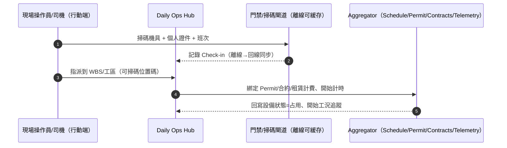
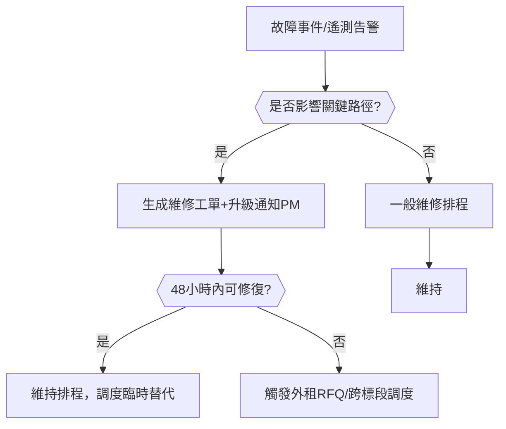
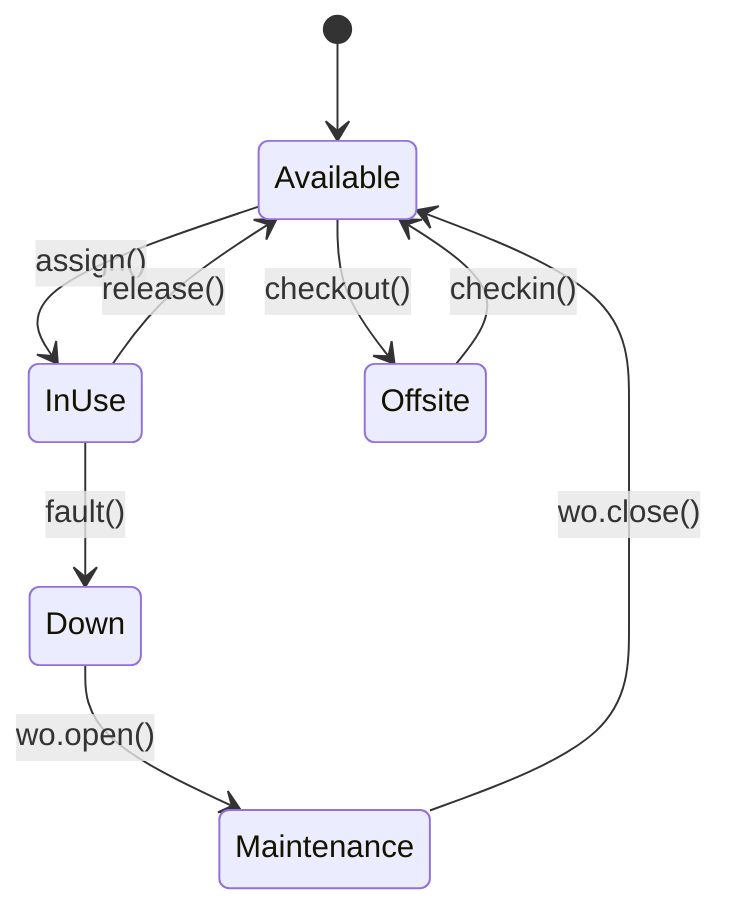
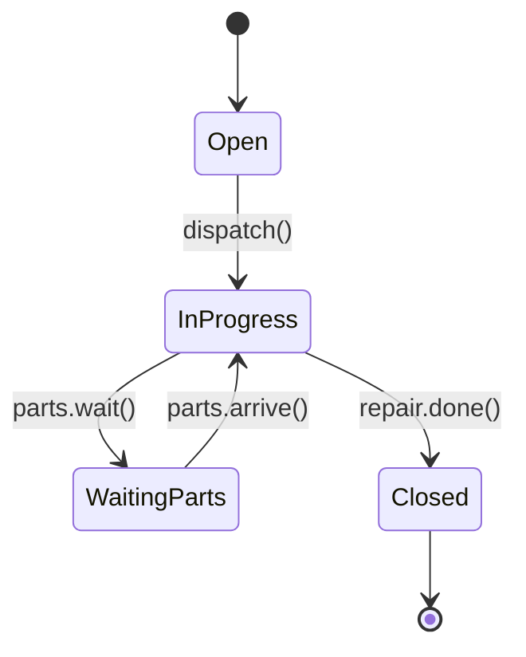
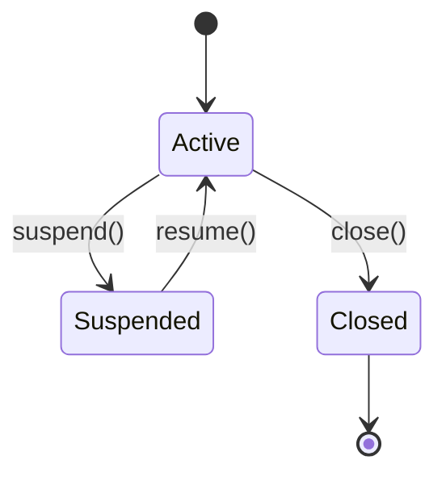
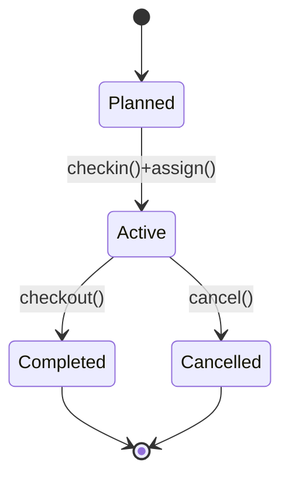

# Part 3l — 〈資源與機具（Equipment & Plant）〉卡片 詳規（Construction）
**版本**：v3.0  
**日期**：2025-09-20  
**對象**：機具管理（Plant Manager）、施工調度（Site Dispatcher）、專案經理（Project Manager, PM）、採購與合約（Procurement & Contracts）、安全與環安衛（Environment, Health and Safety, EHS）、維護工程師（Maintenance）、財務（Finance/Accounts Payable and Accounts Receivable）、分包商/租賃商（外部受限視圖）  
**範圍**：首頁卡片「資源與機具（Equipment & Plant）」之完整規格：平台內外使用者旅程（Mermaid 圖）、User Story、互動規格、資料模型、TypeScript 介面、OpenAPI 片段、高真 mock data、Playbook 決策表與規則語法、狀態圖、遙測、驗收、權限、效能與邊界情境。  
> 術語：工作分解結構（Work Breakdown Structure, WBS）、材料/設備到貨檢驗（Material/Inspection Request, MIR/IR）、機具進出場（Check-in/Check-out）、全球定位系統（GPS）、地理柵欄（Geofence）、電控單元（Engine Control Unit, ECU）遙測、標準作業許可（Permit）、平均故障間隔（Mean Time Between Failures, MTBF）、平均修復時間（Mean Time To Repair, MTTR）。

---

## 1. 目標與價值
**目標**：以**單一卡片**即時呈現**在場機具、利用率、維護到期、租賃計費、進出場合規**與**影響進度的關鍵機具風險**；支援**掃碼進出場、指派到 WBS/工區、IoT 遙測回寫**，並與「進度」「材料/檢驗」「安全許可」「合約與分包」「成本快照」互通。

**北極星指標**
- **有效利用率（稼動/可用）** ≥ 85%  
- **停機占比（Down/Total）** ≤ 4%；**MTTR** ≤ 24 小時  
- **重複租賃率**（同型機具在同時段重複租入且有閒置） ≤ 2%  
- **掃碼進出場成功率** ≥ 99%（離線可用）

**次級成效**：降低空轉與重複租賃成本 ≥ 20%、提前預警維護與零件，減少進度延誤。

---

## 2. 卡片 KPI 與排序邏輯
- **KPI 徽章**：`在場臺數`、`有效利用率`、`停機`、`維護到期`、`租賃日燒（每日費）`、`違規（地理柵欄/超速/怠速超標）`。  
- **排序鍵（rank）**：`rank = criticality*0.4 + downtime*0.25 + utilizationGap*0.2 + costBurn*0.15`
  - `criticality`：是否關鍵路徑之關鍵工序所依賴機具（0..3）  
  - `downtime`：近 24 小時停機時數與維修工單狀態（0..3）  
  - `utilizationGap`：可用 vs 實際稼動缺口（0..3）  
  - `costBurn`：租賃費 × 閒置比例（0..3）

---

## 3. User Stories（Gherkin）
**US-EP-01（調度）**  
- Given 外牆澆灌明日需要「混凝土泵 × 2」「塔吊 × 1」  
- When 我在卡片按「資源建議」並指定 WBS 與時窗  
- Then 系統建議就近調度、檢查維護到期、必要時啟動外租 RFQ，並生成對應的 Permit 與 MIR/IR 關聯。

**US-EP-02（維護）**  
- Given 某履帶吊近 8 小時無法啟動且 ECU 報錯油壓低  
- When 我在抽屜建立維護工單並自動抓取遙測與上次保養記錄  
- Then 系統排程技師、凍結該機具排程並更新「進度健康度」卡的風險與建議替代方案。

**US-EP-03（採購/合約）**  
- Given 本週平均利用率 68% 且同型機具外租中  
- When 我在卡片啟動「重複租賃檢查」並產出替代/合併建議  
- Then 取消冗余租賃、與分包調整排程並同步至「合約與分包」卡的租賃計費。

**US-EP-04（EHS）**  
- Given 遙測顯示某吊車進入禁行區且未有吊裝許可  
- When 系統觸發警示與停機（如支援）並通知現場  
- Then 產生事件紀錄與事故未遂報告，更新「品質與安全整改」卡。

**US-EP-05（工區門禁/司機）**  
- Given 我用手機掃碼機具與個人識別進場  
- When 離線環境下完成出勤與機具配對、綁定 WBS 與 Permit  
- Then 回線後於 30 秒內同步，卡片更新利用率與成本計價起算。

---

## 4. 互動規格（Interaction Spec）
### 4.1 卡片結構（符合：標題、關鍵指標、主表格、快速操作、篩選、批量、Pin、抽屜）
- **標題列**：`資源與機具` + KPI（在場/利用率/停機/維護到期/租賃日燒/違規）。  
- **工具列**：
  - `Filter`：機具類型（吊/泵/挖/壓…）、狀態（在場/外出/停機/維修/可用）、承包方、租賃 vs 自有、合規（保險/牌照/檢驗）、地理柵欄違規、是否關鍵路徑依賴。  
  - `Group by`：`類型` / `工區` / `承包方` / `狀態`。  
  - `Sort`：rank、利用率、停機小時、維護剩餘時數、租賃費。  
  - `Bulk Actions`：批量調度/改派、批量開工單、批量續租/退租、批量上傳計時/油耗、批量導出（Excel/PDF 審計包）。  
  - `Pin to Top`、`Export`。
- **主表格欄位（預設）**：`資產編號/機型`、`狀態（可用/在場/外出/停機/維修/占用）`、`工區/WBS`、`承包方/司機`、`利用率（本日/本週）`、`怠速比`、`維護（剩餘小時/到期日）`、`租賃（計價/到期）`、`違規（超速/地理柵欄/未許可）`、`主要動作`。  
- **右側抽屜（Drawer）**：
  - `Summary`：資產主檔、照片、證照、定位與軌跡、燃油/電量、近期 KPI。  
  - `Assign`：指派到 WBS/工區/班次，生成/綁定 Permit。  
  - `Maintenance`：保養計畫、維修工單、零件庫存、停機時間線。  
  - `Rental`：租賃合約、計費模式（按日/按時/按里程/混合）、到期與續退。  
  - `Telemetry`：即時/歷史遙測（啟停、轉速、油耗、位置、工況）、違規記錄。  
  - `Relations`：對應「材料/檢驗」「進度」「安全」「合約與分包」。  
  - `Actions`：`掃碼進出場`、`指派/改派`、`開維修工單`、`外租 RFQ`、`續租/退租`、`停機/復機`、`導出`.

### 4.2 行動端（Mobile）
- 首屏三鍵：`掃碼進出場`、`指派到 WBS`、`報修/保養`；離線佇列與回線自動同步；相機拍照自動寫入設備編號與座標。

### 4.3 可及性（Accessibility）
- 大按鈕、手套操作友善；語音輸入報修；高對比模式。

---

## 5. 低保真 Wireframe（僅此卡）
```text
┌─ 資源與機具  在場:46 | 利用率:78% | 停機:3 | 維護到期:5 | 租賃日燒:$12.3k | 違規:2 ────────────────┐
│ Filter[類型|狀態|承包|租/自|合規|地理柵欄|關鍵路徑]  Group[類型]  Sort[rank]  Bulk[...]  Pin  Export │
├────────────────────────────────────────────────────────────────────────────────────────────────┤
│ 資產/機型   狀態   工區/WBS   承包/司機   利用率(日/週)  怠速  維護(hrs)  租賃(到期)  違規  動作                │
│ CR-250t     停機   西立面/W3  甲商/王師   0% / 42%       0%    -12(逾)    9/30 日付   柵欄  [指派/工單/續退]   │
│ PUMP-02     可用   倉庫/-     自有/-      18% / 65%      9%    48         自有        -     [指派/外租RFQ]     │
│ EXC-08      占用   地下室/W1  乙商/李師   72% / 80%      6%    96         10/15 時付  -     [改派/報修]        │
└────────────────────────────────────────────────────────────────────────────────────────────────┘
▸ 點列 → Drawer: Summary / Assign / Maintenance / Rental / Telemetry / Relations / Actions
```

---

## 6. 使用者旅程（Mermaid；平台內/外）
### 6.1 掃碼進出場 → 指派到 WBS → 利用率回寫（Sequence）


### 6.2 維修/停機 → 替代/外租 決策（Flow with gates）


---

## 7. 資料模型（Data Model）
### 7.1 實體與關聯（摘要）
- **Equipment**：`id, assetCode, type, make, model, year, ownership(Own/Rent/Subcontractor), capacity, fuelType, photos[], docs{license,inspection,insurance}, status(Available/InUse/Down/Maintenance/Offsite), location{lat,lng,zone}, geofences[]`  
- **Assignment**：`id, equipmentId, wbsId, zoneId, shift, operatorId, startAt, endAt?, permitId?, status(Planned/Active/Completed/Cancelled)`  
- **CheckEvent**：`id, equipmentId, operatorId, type(CheckIn/CheckOut), at, gateId?, offline?, meta{qr,rfid}`  
- **Telemetry**：`id, equipmentId, at, engineOn, rpm?, speed?, fuelRate?, fuelLevel?, hours, gps{lat,lng}, flags{overspeed,idle,geofenceBreach}`  
- **MaintenancePlan**：`id, equipmentId, policy(Hours/Calendar/Mixed), threshold, nextDueAtHours?, nextDueDate?, spares[]`  
- **MaintenanceWO**：`id, equipmentId, title, type(Preventive/Corrective), openedAt, dueAt?, closedAt?, status(Open/InProgress/WaitingParts/Closed), mttrHours?, cause, actions[]`  
- **RentalContract**：`id, vendorId, equipmentType, rate{mode(Daily/Hourly/Mixed), value, currency}, startAt, endAt?, minHoursPerDay?, overtimeRate?, penalties?, status(Active/Suspended/Closed)`  
- **BillingRecord**：`id, equipmentId, rentalId?, date, hours, fuel, cost, currency, posted?, costCenter?, wbsId?`  
- **Violation**：`id, equipmentId, at, type(OverSpeed/Geofence/NoPermit/IdleExcess), severity, resolved?, actions[]`

### 7.2 TypeScript 介面（片段）
```ts
export type EqStatus = "Available"|"InUse"|"Down"|"Maintenance"|"Offsite";
export type Ownership = "Own"|"Rent"|"Subcontractor";
export type AssignStatus = "Planned"|"Active"|"Completed"|"Cancelled";
export type WOType = "Preventive"|"Corrective";
export type WOStatus = "Open"|"InProgress"|"WaitingParts"|"Closed";
export type RateMode = "Daily"|"Hourly"|"Mixed";

export interface Equipment {
  id: string; assetCode: string; type: string; make?: string; model?: string; year?: number;
  ownership: Ownership; capacity?: string; fuelType?: string;
  photos?: string[]; docs?: { license?: string; inspection?: string; insurance?: string };
  status: EqStatus; location?: { lat?: number; lng?: number; zone?: string }; geofences?: string[];
}

export interface Assignment {
  id: string; equipmentId: string; wbsId?: string; zoneId?: string;
  shift?: "Morning"|"Afternoon"|"Night"; operatorId?: string;
  startAt: string; endAt?: string; permitId?: string; status: AssignStatus;
}

export interface TelemetryPoint {
  id: string; equipmentId: string; at: string; engineOn?: boolean;
  rpm?: number; speed?: number; fuelRate?: number; fuelLevel?: number; hours?: number;
  gps?: { lat: number; lng: number };
  flags?: { overspeed?: boolean; idle?: boolean; geofenceBreach?: boolean };
}

export interface MaintenancePlan {
  id: string; equipmentId: string; policy: "Hours"|"Calendar"|"Mixed";
  threshold?: number; nextDueAtHours?: number; nextDueDate?: string; spares?: string[];
}

export interface MaintenanceWO {
  id: string; equipmentId: string; title: string; type: WOType;
  openedAt: string; dueAt?: string; closedAt?: string; status: WOStatus;
  mttrHours?: number; cause?: string; actions?: string[];
}

export interface RentalContract {
  id: string; vendorId: string; equipmentType: string;
  rate: { mode: RateMode; value: number; currency: string };
  startAt: string; endAt?: string; minHoursPerDay?: number; overtimeRate?: number; penalties?: string; status: "Active"|"Suspended"|"Closed";
}

export interface EquipmentSnapshotRow {
  equipment: Equipment;
  assignment?: { wbsId?: string; zoneId?: string; operator?: string };
  utilization: { day: number; week: number; idlePct?: number };
  maintenance: { hoursToDue?: number; dueDate?: string };
  rental?: { mode?: RateMode; rate?: number; currency?: string; endsAt?: string };
  violations?: { overspeed?: number; geofence?: number; noPermit?: number; idleExcess?: number };
}
```

---

## 8. API 規格（OpenAPI 3.0 片段）
```yaml
openapi: 3.0.3
info: { title: Construction Hub – Equipment & Plant API, version: 3.0.0 }
paths:
  /projects/{{projectId}}/equipment-snapshot:
    get:
      summary: 機具卡片聚合（KPI + 表格）
      parameters:
        - in: path
          name: projectId
          required: true
          schema: { type: string }
        - in: query
          name: filter
          schema: { type: string, example: "type=Crane,Pump;status=Available,InUse;ownership=Own,Rent;critical=true" }
        - in: query
          name: groupBy
          schema: { type: string, enum: [TYPE,ZONE,CONTRACTOR,STATUS], default: TYPE }
      responses:
        "200":
          description: OK
          content:
            application/json:
              schema: { $ref: "#/components/schemas/EquipmentSnapshotResponse" }

  /equipment/{{id}}/check-in:
    post:
      summary: 機具進場（可離線，回線同步）
      requestBody:
        content:
          application/json:
            schema:
              type: object
              properties:
                operatorId: { type: string }
                shift: { type: string, enum: [Morning,Afternoon,Night] }
                zoneId: { type: string }
                offline: { type: boolean, default: false }
      responses: { "200": { description: Checked-in } }

  /equipment/{{id}}/check-out:
    post:
      summary: 機具出場或移區
      requestBody:
        content:
          application/json:
            schema:
              type: object
              properties:
                reason: { type: string, enum: [Complete,Move,Repair,Return] }
      responses: { "200": { description: Checked-out } }

  /assignments:
    post:
      summary: 指派/改派到 WBS/工區
      requestBody:
        content:
          application/json:
            schema: { $ref: "#/components/schemas/Assignment" }
      responses: { "201": { description: Created } }

  /maintenance/work-orders:
    post: { summary: 建立維修工單, responses: { "201": { description: Created } } }
  /maintenance/work-orders/{{id}}/close:
    post: { summary: 結案與 MTTR 計算, responses: { "200": { description: Closed } } }

  /rentals/rfq:
    post: { summary: 啟動外租詢價（關聯合約與供應商）, responses: { "201": { description: Created } } }

  /telemetry/ingest:
    post:
      summary: 遙測資料上報（批次）
      requestBody:
        content:
          application/json:
            schema:
              type: object
              properties:
                points: { type: array, items: { $ref: "#/components/schemas/TelemetryPoint" } }
      responses: { "202": { description: Accepted } }

  /reports/utilization:
    get:
      summary: 利用率與怠速報表（按日/週/類型/工區）
      parameters:
        - in: query
          name: scope
          schema: { type: string, example: "project=PRJ-001;groupBy=TYPE;period=2025-09-01..2025-09-20" }
      responses: { "200": { description: OK } }

components:
  schemas:
    EquipmentSnapshotResponse:
      type: object
      properties:
        projectId: { type: string }
        asOf: { type: string, format: date-time }
        kpis:
          type: object
          properties:
            inYard: { type: integer }
            utilizationEff: { type: number }
            down: { type: integer }
            maintenanceDue: { type: integer }
            rentalBurnDaily: { type: number }
            violations: { type: integer }
        rows:
          type: array
          items:
            type: object
            properties:
              equipment: { $ref: "#/components/schemas/Equipment" }
              assignment:
                type: object
                properties:
                  wbsId: { type: string }
                  zoneId: { type: string }
                  operator: { type: string }
              utilization:
                type: object
                properties:
                  day: { type: number }
                  week: { type: number }
                  idlePct: { type: number }
              maintenance:
                type: object
                properties:
                  hoursToDue: { type: integer }
                  dueDate: { type: string, format: date }
              rental:
                type: object
                properties:
                  mode: { type: string }
                  rate: { type: number }
                  currency: { type: string }
                  endsAt: { type: string, format: date }
              violations:
                type: object
                properties:
                  overspeed: { type: integer }
                  geofence: { type: integer }
                  noPermit: { type: integer }
                  idleExcess: { type: integer }
    Equipment:
      type: object
      properties:
        id: { type: string }
        assetCode: { type: string }
        type: { type: string }
        ownership: { type: string }
        status: { type: string }
```

---

## 9. Mock Data（高真示例）
```json
{
  "projectId": "PRJ-001",
  "asOf": "2025-09-20T14:00:00Z",
  "kpis": { "inYard": 46, "utilizationEff": 0.78, "down": 3, "maintenanceDue": 5, "rentalBurnDaily": 12300, "violations": 2 },
  "rows": [
    {
      "equipment": { "id": "EQ-CR-250", "assetCode": "CR-250t", "type": "Crane", "ownership": "Rent", "status": "Down", "location": { "zone": "Façade-W" } },
      "assignment": { "wbsId": "WBS-3.2.1", "zoneId": "Façade-W", "operator": "王師" },
      "utilization": { "day": 0.0, "week": 0.42, "idlePct": 0.0 },
      "maintenance": { "hoursToDue": -12, "dueDate": "2025-09-18" },
      "rental": { "mode": "Daily", "rate": 3500, "currency": "USD", "endsAt": "2025-09-30" },
      "violations": { "geofence": 1, "overspeed": 0, "noPermit": 0, "idleExcess": 0 }
    },
    {
      "equipment": { "id": "EQ-PUMP-02", "assetCode": "PUMP-02", "type": "ConcretePump", "ownership": "Own", "status": "Available", "location": { "zone": "Yard" } },
      "assignment": { "wbsId": null, "zoneId": "Yard", "operator": null },
      "utilization": { "day": 0.18, "week": 0.65, "idlePct": 0.09 },
      "maintenance": { "hoursToDue": 48, "dueDate": "2025-09-25" },
      "rental": null,
      "violations": { "geofence": 0, "overspeed": 0, "noPermit": 0, "idleExcess": 0 }
    },
    {
      "equipment": { "id": "EQ-EXC-08", "assetCode": "EXC-08", "type": "Excavator", "ownership": "Subcontractor", "status": "InUse", "location": { "zone": "B2" } },
      "assignment": { "wbsId": "WBS-1.1.3", "zoneId": "B2", "operator": "李師" },
      "utilization": { "day": 0.72, "week": 0.80, "idlePct": 0.06 },
      "maintenance": { "hoursToDue": 96, "dueDate": "2025-10-05" },
      "rental": { "mode": "Hourly", "rate": 45, "currency": "USD", "endsAt": "2025-10-15" },
      "violations": { "geofence": 0, "overspeed": 0, "noPermit": 0, "idleExcess": 1 }
    }
  ]
}
```

---

## 10. Playbook 決策表（Decision Table）
| 規則 | 條件 | 動作 | 附註 |
|---|---|---|---|
| PB-EP-01 | `utilization.week < 0.6 AND rental.mode != null` | 建議退租或跨標段調度；啟動重複租賃檢查 | 降本 |
| PB-EP-02 | `maintenance.hoursToDue < 0 OR telemetry.flags.geofenceBreach = true` | 冷卻排程/停機；生成維修或合規任務；通知 EHS | 安全 |
| PB-EP-03 | `telemetry.flags.idle = true AND idlePct > 0.2` | 推送怠速降低建議；更新司機績效 | 節能 |
| PB-EP-04 | `Down on Critical WBS` | 升級給 PM；觸發外租 RFQ；更新進度風險 | 進度 |
| PB-EP-05 | `duplicate rentals of same type overlap AND availability of own/subcontractor > 0` | 合併/取消冗餘租賃；調整分包計價 | 去重 |

**規則語法（DSL 示意）**
```text
WHEN rental.mode != null AND utilization.week < 0.6
THEN suggest(["ReturnRental","CrossProjectRebalance"]), openTask("Commercial","ReviewRental")
```

---

## 11. 狀態圖（State Machine）
### 11.1 Equipment


### 11.2 Maintenance Work Order


### 11.3 Rental Contract


### 11.4 Assignment（Check-in/Check-out）


---

## 12. 遙測（Telemetry）
- **利用率**：啟停/工況時段；怠速比例；按類型/工區/承包的趨勢。  
- **維護**：到期命中率；MTBF/MTTR；常見故障與零件周轉。  
- **地理柵欄與合規**：違規事件趨勢與處置時間；Permit 對齊率。  
- **租賃成本**：日燒、退租節省、重複租賃避免的金額。

---

## 13. 驗收準則（Acceptance Criteria）
- 卡片首屏（> 100 臺設備）載入 **≤ 500 毫秒（95 分位）**；聚合 KPI 計算**實時**或**≤ 5 秒**延遲。  
- 掃碼進出場 **≤ 200 毫秒**（離線寫本地）；回線同步 **≤ 30 秒**。  
- 遙測上報吞吐 **≥ 2,000 點/秒/專案**；告警觸發至卡片顯示 **≤ 10 秒**。  
- 租賃計費日結正確（跨時區/夏令時間/混合計價）。

---

## 14. 權限（RBAC + ABAC）
- **機具管理**：新增/編輯資產、維護計畫、地理柵欄。  
- **調度**：指派/改派/退租/外租 RFQ。  
- **維護**：開工單/結案；停機/復機。  
- **EHS**：查看與處置違規；Permit 檢核；禁行區管控。  
- **司機/操作員**：進出場掃碼、查看指派、上報異常。  
- **外部租賃商/分包**：受限視圖；上傳計時/里程；發票。  
- 屬性：Project / Zone / EquipmentType / Ownership / Contractor / Criticality。

---

## 15. 效能與可靠性
- **CQRS 讀模型 + 預計算**：24h/7d 利用率、怠速、到期/超期、租賃日燒。  
- **事件總線**：CheckEvent、Assignment.Changed、WO.StatusChanged、Telemetry.Alert、Rental.Updated。  
- **離線與衝突解決**：進出場在本地排隊；雙重提交檢測與去重。  
- **IoT 整合**：多協議（HTTP/MQTT/CSV 批次）；時序庫；去噪與插補。  
- **安全與合規**：裝置憑證、簽章、地理資訊脫敏。

---

## 16. 邊界情境（Edge Cases）
- **幽靈設備**：未註冊的 QR 被掃 → 進入隔離清單待驗。  
- **雙重進/出場**：短時間重複掃碼 → 去重與提示。  
- **無 GPS/遮蔽**：改用工區閘道與手動區域選擇；以近似位置處理。  
- **遙測離線**：以司機報工與工況近似估算；回線後自動更正與重算計費。  
- **混合計價**：時/日/里程相互切換；以規則決定優先。

---

## 17. 本卡片輸出與下一步
- 與「進度健康度」「材料/到貨/檢驗」「合約與分包」「品質與安全整改」互通（指派→Permit→MIR/IR→成本）。  
- **建議下一張**：〈存貨與材料追溯（Inventory & Material Tracking）〉或回到本卡強化「怠速節能策略引擎」與「地理柵欄設計器」。
