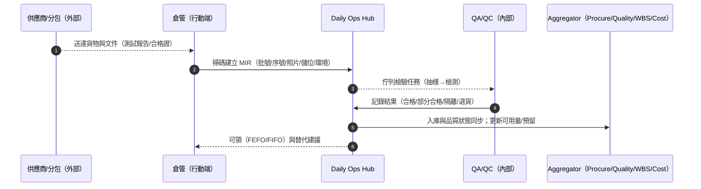
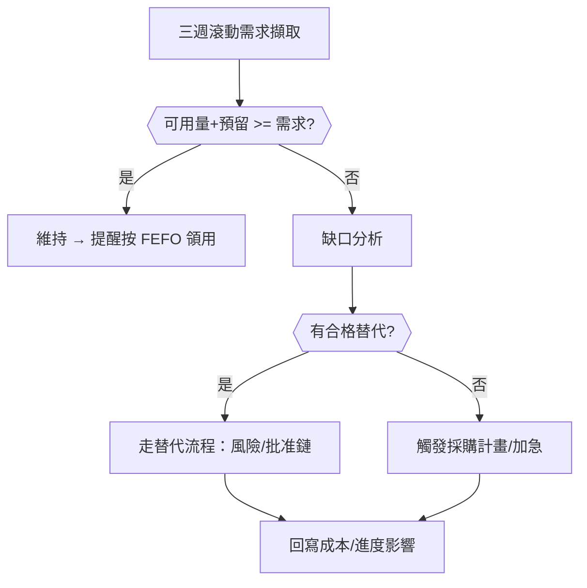
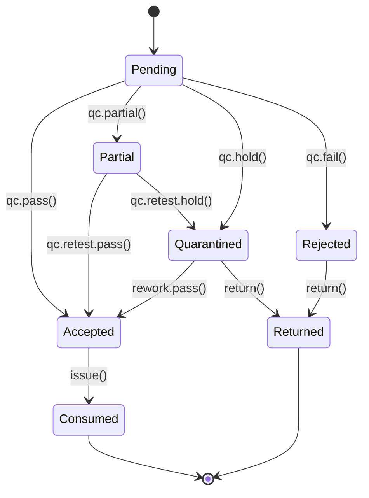
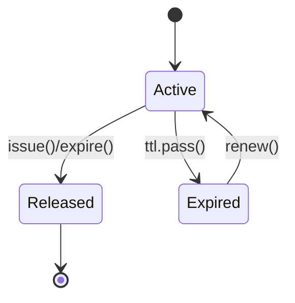
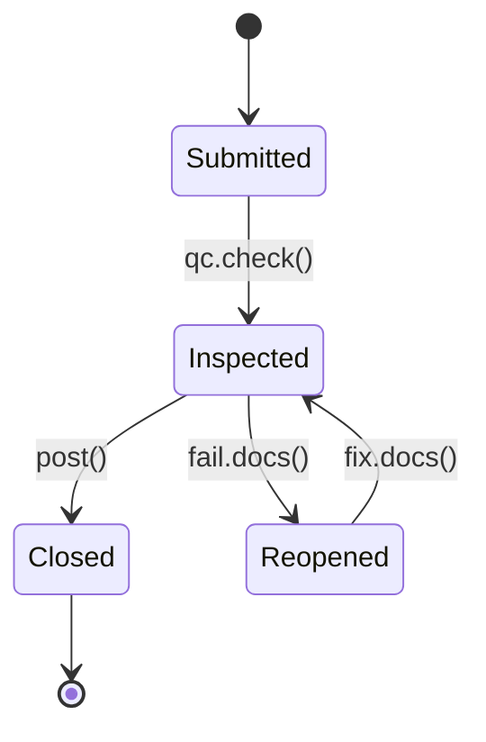

# Part 3m — 〈存貨與材料追溯（Inventory & Material Tracking）〉卡片 詳規（Construction）
**版本**：v3.0  
**日期**：2025-09-20  
**對象**：倉管/庫管（Storekeeper/Warehouse）、材料工程師（Material Engineer）、品質保證/品質管制（Quality Assurance/Quality Control, QA/QC）、採購與合約（Procurement & Contracts）、專案經理（Project Manager, PM）、分包/供應商（外部受限視圖）、監造/業主（Owner’s Rep，受限視圖）、審計（Audit）  
**範圍**：首頁卡片「存貨與材料追溯（Inventory & Material Tracking）」之完整規格：平台內外使用者旅程（Mermaid 圖）、User Story、互動規格、資料模型、TypeScript 介面、OpenAPI 片段、高真 mock data、Playbook 決策表與規則語法、狀態圖、遙測、驗收、權限、效能與邊界情境。  
> 術語：材料進場檢驗（Material Inspection Request, MIR）、檢驗申請（Inspection Request, IR）、工程量清單（Bill Of Quantities, BOQ）、工作分解結構（Work Breakdown Structure, WBS）、不符合報告（Non-Conformance Report, NCR）、先進先出（First-Expired-First-Out, FEFO / First-In-First-Out, FIFO）、條碼/國際標準一（Quick Response, QR / Global Standards 1, GS1）、批號/序號（Lot/Serial）。

---

## 1. 目標與價值
**目標**：將**到貨→檢驗→入庫→預留→領料到工項→退料/調撥/報廢**全鏈打通，提供**一鍵追溯**（由任何 Punch/RFI/缺陷或設備回到材料批號→供應商→測試報告→憑證），支援**替代料評估**、**保質期/環境條件（溫度/濕度）**控管與**付款節點**聯動。

**北極星指標**
- **缺料導致停工事件**月度下降 ≥ 40%  
- **MIR 到決定（合格/隔離/退貨）週期中位數** ≤ 24 小時  
- **追溯覆蓋率**（具批號/序號綁定到 WBS 的領料占比） ≥ 98%  
- **盤點準確率** ≥ 99.5%（循環盤點與差異處置閉環）

**次級成效**：降低庫存資金占用（庫存週轉天數下降）、提升檢驗準確度與審計可回溯性。

---

## 2. 卡片 KPI 與排序邏輯
- **KPI 徽章**：`缺料風險`、`待驗/MIR`、`隔離/NCR`、`即將到期`、`替代料在用`、`庫存週轉（天）`。  
- **排序鍵（rank）**：`rank = stockoutRisk*0.45 + qualityRisk*0.25 + freshness*0.15 + costExposure*0.15`
  - `stockoutRisk`：`需求（3 週滾動） - 可用（自由 + 已預留可替代）`的缺口  
  - `qualityRisk`：隔離/NCR/待驗金額與關鍵工序權重  
  - `freshness`：保質期剩餘天數（FEFO）與環境偏差分  
  - `costExposure`：在途+呆滯+逾期未結案金額

---

## 3. User Stories（Gherkin）
**US-IMT-01（倉管）**  
- Given 供應商送達「防火塗料 Lot#FRC-0920」與測試報告  
- When 我使用行動端**掃碼**建立 MIR、抽樣拍照、標記儲位與環境條件（溫/濕）  
- Then QC 在 4 小時內**在抽屜完成檢驗**，合格後自動入庫並以 **先到期先出（FEFO）** 規則可領。

**US-IMT-02（PM/施工）**  
- Given 三週滾動計畫下週需要「#8 鋼筋 12t」  
- When 我在卡片按「**預留**」並綁定 WBS/樓層/區段  
- Then 系統檢查缺口→若不足，**觸發採購計畫與替代料評估**並在「材料/到貨/檢驗」卡顯示風險。

**US-IMT-03（QA/QC）**  
- Given 抽驗有 2 桶塗料未達規範  
- When 我將 Lot 分為**部分合格/部分隔離**，自動生成 **不符合報告（NCR）** 與補測計畫  
- Then 隔離批無法被領出；若最終退貨，更新「合約與分包」的金額與付款節點。

**US-IMT-04（監造/業主）**  
- Given 我於外部分享頁看到「外牆澆灌」材料清單  
- When 我點選「**一鍵追溯**」  
- Then 顯示**批號→供應商→測試報告→入庫→領料到工項**之證據鏈（脫敏非必要資料）。

**US-IMT-05（審計）**  
- Given 我抽查去年 10 月份的某次滲漏事件  
- When 我從 Punch 反查材料批號與領料憑證、照片/測試與人員資格  
- Then 10 分鐘內得出**完整證據鏈 PDF**，無需人工跨系統檢索。

---

## 4. 互動規格（Interaction Spec）
### 4.1 卡片結構（符合：標題、關鍵指標、主表格、快速操作、篩選、批量、Pin、抽屜）
- **標題列**：`存貨與材料追溯` + KPI（缺料/待驗/隔離/到期/替代/週轉）。  
- **工具列**：
  - `Filter`：材料類別、關鍵工序、狀態（在途/待驗/隔離/可用/預留/呆滯/到期）、供應商、倉庫/儲位、保質期、是否具序號、環境告警（溫/濕）。  
  - `Group by`：`材料類別` / `倉庫` / `供應商` / `狀態` / `WBS`。  
  - `Sort`：rank、缺口（需求-可用）、到期日、金額、呆滯天數。  
  - `Bulk Actions`：批量入庫、批量預留、批量領料、批量退料/調撥、批量標記隔離/解除、批量導出（Excel/PDF 審計包）。  
  - `Pin to Top`、`Export`。
- **主表格欄位（預設）**：`材料/規格`、`批號/序號`、`狀態（在途/待驗/隔離/可用/預留/到期）`、`倉庫/儲位`、`可用量/單位`、`預留量`、`到期日/環境`、`供應商/MIR`、`NCR/品質`、`替代料`、`主要動作`。  
- **右側抽屜（Drawer）**：
  - `Trace`：一鍵追溯（供應→測試→入庫→調撥→領用→工項），時間軸視圖。  
  - `Reserve`：預留到 WBS/樓層/區段，設定失效時間與替代規則。  
  - `Quality`：MIR/IR、抽驗結果、NCR 與處置、照片/報告；隔離/部分合格邏輯。  
  - `Locations`：多儲位/分批量、環境曲線（IoT 感測）。  
  - `Substitution`：可用替代料（等級、風險、批准鏈），一鍵發起評估。  
  - `Transactions`：所有出入庫、領/退/調撥/報廢記錄。  
  - `Relations`：採購單、合約/付款節點、Schedule、Quality、Cost Snapshot。  
  - `Actions`：`掃碼入庫`、`掃碼領料`、`預留`、`調撥`、`退料`、`隔離/解除`、`替代評估`、`導出追溯 PDF`。

### 4.2 行動端（Mobile）
- 大按鈕：`掃碼入庫`、`掃碼領料`、`預留到 WBS`、`標記隔離`；離線佇列與回線同步；相機自動寫入批號/序號與座標。

### 4.3 可及性（Accessibility）
- 倉庫弱光模式；超大字碼；支援語音輸入批註。

---

## 5. 低保真 Wireframe（僅此卡）
```text
┌─ 存貨與材料追溯  缺料:8 | 待驗:5 | 隔離:2 | 到期:3 | 替代:4 | 週轉:32天 ──────────────────────────┐
│ Filter[類別|狀態|供應商|倉庫|到期|序號|環境]  Group[材料類別]  Sort[rank]  Bulk[...]  Pin  Export │
├────────────────────────────────────────────────────────────────────────────────────────────────┤
│ 材料/規格     批/序號   狀態     倉庫/儲位  可用/單位  預留  到期/環境  供應商/MIR  品質/NCR  替代  動作      │
│ 防火塗料 20L  FRC-0920 待驗     W1-S03     0/桶       0     2025/12    供A/MIR-221 抽驗中     有   [預留/隔離]│
│ 鋼筋 #8       LOT-R8-07 可用     YD-RackC   12/噸      5     -/常溫     供B/MIR-210 ✓         有   [領/調/退] │
│ 玻璃棉 1.2m   BT-GL-55  隔離     W2-QA-ISO  150/片     0     2026/03    供C/MIR-214 NCR-102    有   [解除/退]  │
└────────────────────────────────────────────────────────────────────────────────────────────────┘
▸ 點列 → Drawer: Trace / Reserve / Quality / Locations / Substitution / Transactions / Relations / Actions
```

---

## 6. 使用者旅程（Mermaid；平台內/外）
### 6.1 到貨→MIR→檢驗→入庫→預留/領用（Sequence）


### 6.2 缺料決策（Flow with gates）


---

## 7. 資料模型（Data Model）
### 7.1 實體與關聯（摘要）
- **Material**：`id, code, name, spec, uom, category, fefo(bool), serialRequired(bool), minStock, maxStock, substitutionGroup, safetyStock`  
- **Batch (Lot/Serial)**：`id, materialId, lotNo, serials[], supplierId, mfgDate, expDate?, shelfLifeDays?, qaStatus(Pending/Accepted/Partial/Quarantined/Rejected), certificates[], photos[], storageReq{tempMin,tempMax,humMax}`  
- **InventoryLocation**：`id, warehouseId, code, type(Rack/Bin/QA/Quarantine/Yard), temp?, hum?`  
- **StockLedger (Transaction)**：`id, batchId, type(Receipt/Issue/Reserve/Unreserve/Transfer/Adjust/Return/Scrap), qty, uom, at, ref{mirId, wbsId, irId, docNo}, by`  
- **Reservation**：`id, materialId, batchIds[], qty, uom, wbsId, zoneId, expiresAt?, status(Active/Expired/Released)`  
- **MIR/IR**：`id, supplierId, poId?, items[{materialId, qty, uom, batchTemp}], status(Draft/Submitted/Inspected/Closed), result(Accepted/Partial/Quarantine/Rejected)`  
- **NCR**：`id, batchId, reason, severity, actions[], status(Open/Investigating/Closed)`  
- **SubstitutionRule**：`id, group, primaryMaterialId, altMaterialId, riskLevel, approvers[], status(Active/Suspended)`  
- **EnvProbe**：`id, locationId, at, temp, hum, alarm?`

### 7.2 TypeScript 介面（片段）
```ts
export type QAStatus = "Pending"|"Accepted"|"Partial"|"Quarantined"|"Rejected";
export type TxType = "Receipt"|"Issue"|"Reserve"|"Unreserve"|"Transfer"|"Adjust"|"Return"|"Scrap";

export interface Material {
  id: string; code: string; name: string; spec?: string; uom: string; category?: string;
  fefo?: boolean; serialRequired?: boolean; minStock?: number; maxStock?: number; safetyStock?: number;
  substitutionGroup?: string;
}

export interface Batch {
  id: string; materialId: string; lotNo?: string; serials?: string[];
  supplierId?: string; mfgDate?: string; expDate?: string; shelfLifeDays?: number;
  qaStatus: QAStatus; certificates?: string[]; photos?: string[];
  storageReq?: { tempMin?: number; tempMax?: number; humMax?: number };
}

export interface InventoryLocation {
  id: string; warehouseId: string; code: string; type: "Rack"|"Bin"|"QA"|"Quarantine"|"Yard";
  temp?: number; hum?: number;
}

export interface StockTx {
  id: string; batchId: string; type: TxType; qty: number; uom: string; at: string;
  ref?: { mirId?: string; wbsId?: string; irId?: string; docNo?: string }; by?: string;
}

export interface Reservation {
  id: string; materialId: string; batchIds?: string[]; qty: number; uom: string;
  wbsId: string; zoneId?: string; expiresAt?: string; status: "Active"|"Expired"|"Released";
}
```

---

## 8. API 規格（OpenAPI 3.0 片段）
```yaml
openapi: 3.0.3
info: { title: Construction Hub – Inventory & Traceability API, version: 3.0.0 }
paths:
  /projects/{{projectId}}/inventory-snapshot:
    get:
      summary: 存貨卡片聚合（KPI + 表格）
      parameters:
        - in: path
          name: projectId
          required: true
          schema: { type: string }
        - in: query
          name: filter
          schema: { type: string, example: "status=Available,Pending,Quarantined;category=Rebar,Coating;warehouse=W1" }
        - in: query
          name: groupBy
          schema: { type: string, enum: [MATERIAL,WAREHOUSE,SUPPLIER,STATUS,WBS], default: MATERIAL }
      responses:
        "200":
          description: OK
          content:
            application/json:
              schema: { $ref: "#/components/schemas/InventorySnapshotResponse" }

  /materials/receipts:
    post:
      summary: MIR 到貨/收貨（可離線，回線同步）
      requestBody:
        content:
          application/json:
            schema:
              type: object
              properties:
                supplierId: { type: string }
                items:
                  type: array
                  items:
                    type: object
                    properties:
                      materialId: { type: string }
                      qty: { type: number }
                      uom: { type: string }
                      lotNo: { type: string }
                      serials: { type: array, items: { type: string } }
                      warehouseId: { type: string }
                      locationCode: { type: string }
      responses: { "201": { description: Created } }

  /mir/{{id}}/inspect:
    post:
      summary: MIR 檢驗結果（合格/部分/隔離/退貨）
      requestBody:
        content:
          application/json:
            schema:
              type: object
              properties:
                result: { type: string, enum: [Accepted,Partial,Quarantine,Rejected] }
                acceptedQty: { type: number }
                quarantineQty: { type: number }
                notes: { type: string }
      responses: { "200": { description: Inspected } }

  /trace/batch/{{batchId}}:
    get:
      summary: 批號/序號一鍵追溯（來源→測試→入庫→領用→工項）
      responses: { "200": { description: OK } }

  /reservations:
    post: { summary: 建立預留, responses: { "201": { description: Created } } }
  /issues:
    post: { summary: 領料到 WBS/樓層/區段, responses: { "201": { description: Issued } } }
  /returns:
    post: { summary: 退料入庫, responses: { "201": { description: Returned } } }
  /transfers:
    post: { summary: 倉庫/儲位調撥, responses: { "201": { description: Transferred } } }

  /substitutions/request:
    post:
      summary: 發起替代料評估
      requestBody:
        content:
          application/json:
            schema:
              type: object
              properties:
                primaryMaterialId: { type: string }
                altMaterialId: { type: string }
                reason: { type: string }
                riskLevel: { type: string, enum: [Low,Medium,High] }
      responses: { "201": { description: Submitted } }

  /alerts/expiring:
    get: { summary: 保質期與環境告警列表, responses: { "200": { description: OK } } }

components:
  schemas:
    InventorySnapshotResponse:
      type: object
      properties:
        projectId: { type: string }
        asOf: { type: string, format: date-time }
        kpis:
          type: object
          properties:
            stockoutRisks: { type: integer }
            mirPending: { type: integer }
            quarantined: { type: integer }
            expiring: { type: integer }
            substitutionsActive: { type: integer }
            inventoryTurnDays: { type: number }
        rows:
          type: array
          items:
            type: object
            properties:
              material:
                type: object
                properties:
                  id: { type: string }
                  code: { type: string }
                  name: { type: string }
                  spec: { type: string }
                  uom: { type: string }
              batch:
                type: object
                properties:
                  id: { type: string }
                  lotNo: { type: string }
                  qaStatus: { type: string }
                  expDate: { type: string, format: date }
              status: { type: string }
              warehouse: { type: string }
              bin: { type: string }
              qtyAvailable: { type: number }
              qtyReserved: { type: number }
              supplier: { type: string }
              mirNo: { type: string }
              ncrNo: { type: string }
              substitution: { type: string }
```

---

## 9. Mock Data（高真示例）
```json
{
  "projectId": "PRJ-001",
  "asOf": "2025-09-20T14:30:00Z",
  "kpis": { "stockoutRisks": 8, "mirPending": 5, "quarantined": 2, "expiring": 3, "substitutionsActive": 4, "inventoryTurnDays": 32.0 },
  "rows": [
    {
      "material": { "id": "MAT-FRC-20L", "code": "FRC-20L", "name": "防火塗料 20L", "spec": "Class A", "uom": "桶" },
      "batch": { "id": "BATCH-FRC-0920", "lotNo": "FRC-0920", "qaStatus": "Pending", "expDate": "2025-12-31" },
      "status": "Pending",
      "warehouse": "W1",
      "bin": "S03",
      "qtyAvailable": 0,
      "qtyReserved": 0,
      "supplier": "供應商A",
      "mirNo": "MIR-221",
      "ncrNo": null,
      "substitution": "可用（FRC-20L-ALT）"
    },
    {
      "material": { "id": "MAT-RB-08", "code": "RB-08", "name": "鋼筋 #8", "spec": "D25", "uom": "噸" },
      "batch": { "id": "BATCH-R8-07", "lotNo": "LOT-R8-07", "qaStatus": "Accepted", "expDate": null },
      "status": "Available",
      "warehouse": "Yard",
      "bin": "Rack-C",
      "qtyAvailable": 12.0,
      "qtyReserved": 5.0,
      "supplier": "供應商B",
      "mirNo": "MIR-210",
      "ncrNo": null,
      "substitution": "有（RB-08-ALT）"
    },
    {
      "material": { "id": "MAT-GLW-12", "code": "GLW-12", "name": "玻璃棉 1.2m", "spec": "密度55", "uom": "片" },
      "batch": { "id": "BATCH-GL-55", "lotNo": "BT-GL-55", "qaStatus": "Quarantined", "expDate": "2026-03-31" },
      "status": "Quarantined",
      "warehouse": "W2",
      "bin": "QA-ISO",
      "qtyAvailable": 0,
      "qtyReserved": 0,
      "supplier": "供應商C",
      "mirNo": "MIR-214",
      "ncrNo": "NCR-102",
      "substitution": "候選（GLW-12-ALT-1）"
    }
  ]
}
```

---

## 10. Playbook 決策表（Decision Table）
| 規則 | 條件 | 動作 | 附註 |
|---|---|---|---|
| PB-IMT-01 | `Demand(3w) > Available+Reserved AND no ApprovedAlt` | 觸發採購計畫（加急）與缺料預警；更新進度風險 | 缺料 |
| PB-IMT-02 | `MIR.result in {Quarantine,Rejected}` | 封鎖領料；自動建立 NCR；通知供應商/採購 | 品質 |
| PB-IMT-03 | `Batch.expDate within 14d OR EnvProbe.alarm=true` | FEFO 提醒、降級/重測；必要時隔離 | 保質 |
| PB-IMT-04 | `Substitution.approved AND cost <= baseline*(1+5%)` | 建議替代並回寫成本/進度影響 | 替代 |
| PB-IMT-05 | `Idle > 60d AND value > threshold` | 標記呆滯；建議退貨/轉售/調撥 | 去呆滯 |

**規則語法（DSL 示意）**
```text
WHEN demand.horizon("3w").gap(materialId) > 0 AND NOT hasApprovedSubstitute(materialId)
THEN raise("StockoutRisk"), create("ProcPlan",{priority:"Expedite"}), propagateTo("Schedule","Risk")
```

---

## 11. 狀態圖（State Machine）
### 11.1 Batch（Lot/Serial）


### 11.2 Reservation


### 11.3 MIR


---

## 12. 遙測（Telemetry）
- **供應→入庫效率**：MIR 週期（到貨→檢驗→入庫）的中位與 95 分位。  
- **缺料風險與對進度影響**：缺口事件數/時長、Critical Path 受影響工項數。  
- **品質與隔離**：隔離/退貨率、NCR 解決週期、重檢通過率。  
- **庫存效率**：週轉天數、呆滯金額、FEFO/FIFO 違反率。  
- **追溯完整度**：具批號/序號綁定至 WBS 的領用占比。

---

## 13. 驗收準則（Acceptance Criteria）
- 卡片首屏（> 1,000 批次）載入 **≤ 600 毫秒（95 分位）**；追溯頁生成 **≤ 2 秒**。  
- MIR 檢驗與入庫全程可離線；回線同步 **≤ 30 秒**，且**無重複入帳**。  
- 領料掃碼→過帳 **≤ 200 毫秒**；FEFO 引擎正確率 **≥ 99.5%**。  
- 一鍵追溯 PDF 完整（證據鏈/時間戳/操作者/版本），審計抽查**全過**。

---

## 14. 權限（RBAC + ABAC）
- **倉管**：入庫/調撥/退料/盤點。  
- **QA/QC**：檢驗與品質狀態；隔離/解除；NCR。  
- **PM/施工**：預留/領料；替代申請。  
- **採購/合約**：採購計畫、退貨/折讓、供應商績效。  
- **供應商/分包（外部）**：上傳文件、查看 MIR 結果（受限）。  
- **審計/監造/業主**：追溯只讀；下載審計包。  
- 屬性：Project / Warehouse / Material Category / WBS / Supplier / QAStatus。

---

## 15. 效能與可靠性
- **CQRS 讀模型 + 預計算**：缺口、FEFO、到期、呆滯、週轉與替代可用性。  
- **事件總線**：MIR.Inspected、Batch.StatusChanged、Reservation.Created、Issue.Posted、NCR.Opened。  
- **離線與衝突**：入庫與領料允許離線；以批號+儲位+時間戳去重；補償交易。  
- **IoT 整合**：環境感測（溫/濕）與冷鏈資料；超限觸發隔離/重測。  
- **單位/換算**：支援跨單位（噸↔公斤↔支）；以轉換係數與四捨五入規則統一。

---

## 16. 邊界情境（Edge Cases）
- **部分合格**：單一 MIR 分割為多批次（Accepted/Quarantine）；領料僅釋放合格量。  
- **拆併批**：大批拆成多儲位；或多批併領到同一工項，追溯仍保完整鏈。  
- **負庫存防護**：預留與領料不可造成負庫存；出錯以調整單處理。  
- **退貨跨期**：退貨對上期 IPC/付款做補償與折讓。  
- **替代衝突**：多條替代規則衝突時，以風險等級與批准鏈決定。  
- **序列化設備零件**：序號件需對應設備與保固，報修時回查批號。

---

## 17. 本卡片輸出與下一步
- 與「材料/到貨/檢驗」「合約與分包」「進度健康度」「品質與安全整改」互通（缺口→採購→入庫→領料→品質）。  
- **建議下一張**：若你同意，我可做 **「品質與檢驗（Quality & Punch）」的材料關聯深挖版**，或轉向 **「天氣與阻礙（Weather & Obstruction）」** 的供應鏈預測加權模型。
