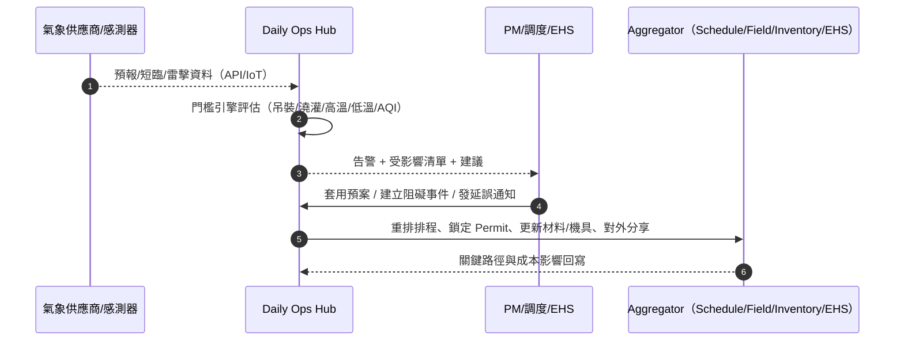
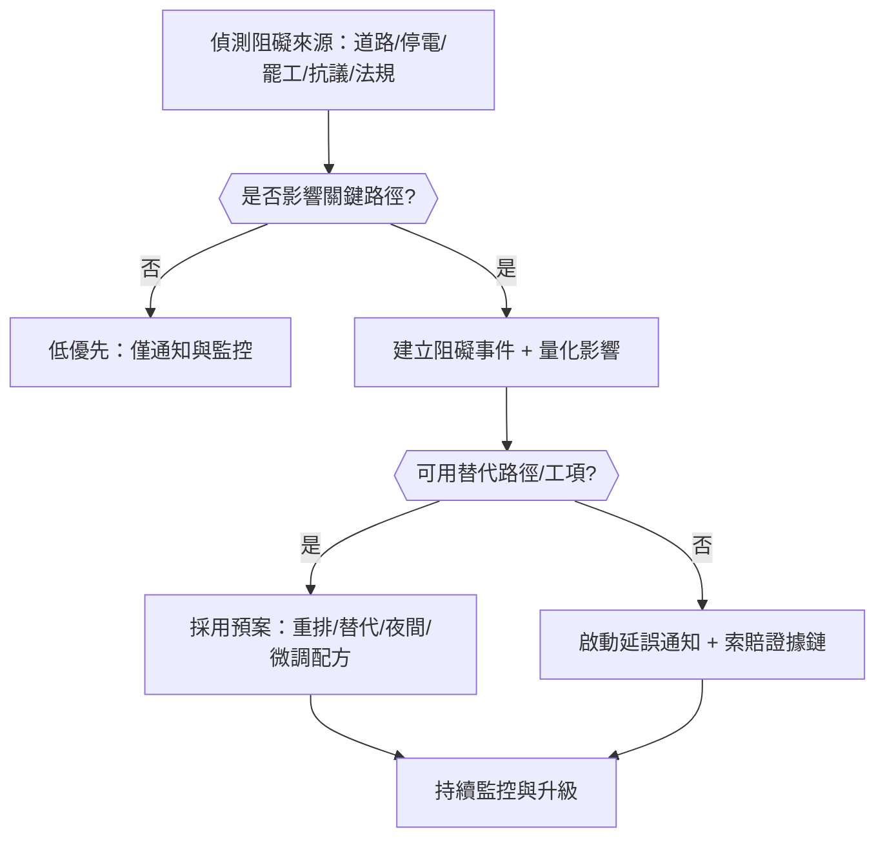
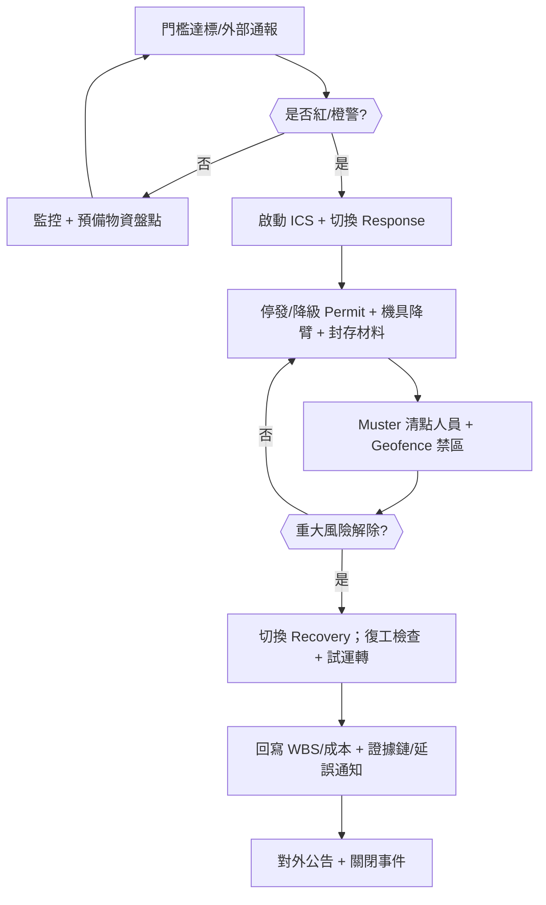
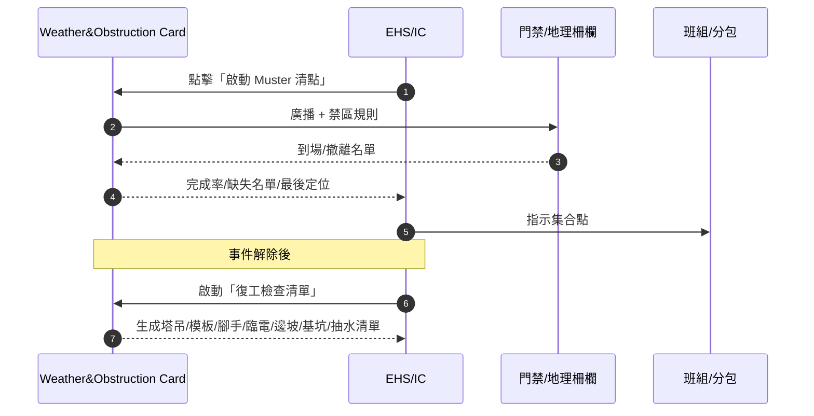
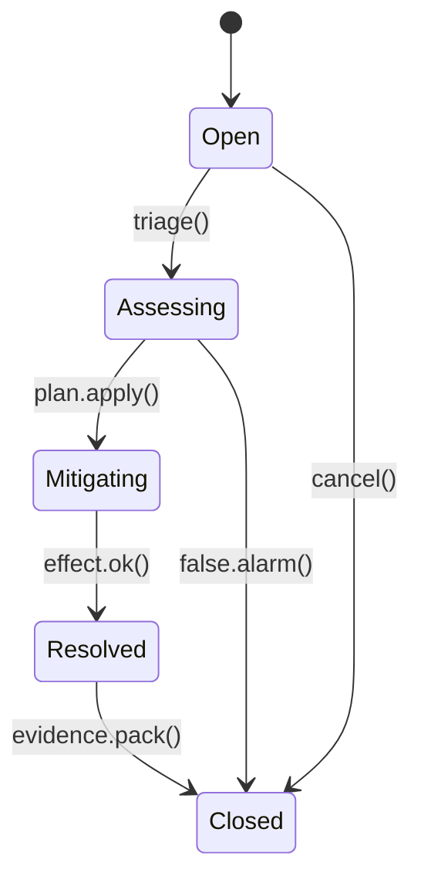
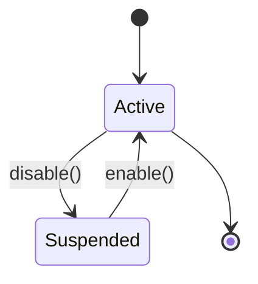
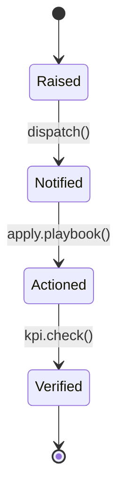

# Part 3n — 〈天氣與阻礙（Weather & Obstruction）〉卡片 詳規（合併極端天氣版）
**版本**：v3.2（Merged）  
**日期**：2025-09-20  
**對象**：專案經理（Project Manager, PM）、施工調度（Dispatcher）、現場工地主任（Site Supervisor）、環安衛（Environment, Health and Safety, EHS）、採購/物流（Procurement/Logistics）、業主/監造（Owner’s Representative，受限視圖）  
**範圍**：首頁卡片「天氣與阻礙」的完整規格，已**合併極端天氣加強版（事前/事中/事後）**。包含：平台內外使用者旅程（Mermaid 圖）、User Story、互動規格、資料模型、TypeScript 介面、OpenAPI 片段、高真 mock data、Playbook 決策表與規則語法、狀態圖、遙測、驗收、權限、效能與邊界情境。  
> 術語：即時短臨預報（Nowcast）、數值天氣預報（Numerical Weather Prediction, NWP）、空氣品質指標（Air Quality Index, AQI）、感熱指數（Heat Index）、雷擊告警（Lightning Warning）、地理柵欄（Geofence）、延誤通知（Delay Notice）、工作分解結構（Work Breakdown Structure, WBS）、事件指揮系統（Incident Command System, ICS）、人員清點（Muster）。

---

## 1. 目標與價值
**目標**：在單一卡片即時呈現**氣象風險**（降雨、風、雷、熱、寒、能見度、空汙/煙霧）、**現場阻礙**（道路封閉、停電、許可停發、社區抗議、突發事故），其**對 WBS/關鍵路徑與成本/安全**的**量化影響**，提供**可執行建議**（自動重排、替代工項、臨時資源/防護/封存），並與**進度、材料、機具、EHS、合約**雙向關聯。

**合併新增（極端天氣）**：提供**事前（Preparedness）–事中（Response）–事後（Recovery）**三階段運作，含**預案包/資源包**、**Permit 批次管控**、**Muster 清點**、**復工檢查清單**、**對外公告與延誤通知一鍵化**。

**北極星指標**
- **天氣/阻礙造成的停工小時**（月）下降 ≥ 25%  
- **門檻觸發→通知→採取動作** 的中位時間 ≤ 10 分鐘  
- **因天氣導致的返工率**下降 ≥ 15%  
- **預案覆蓋率**（對高風險工序有可執行替代/防護方案）≥ 95%

**次級成效**：減少臨時停工溝通成本、提升對業主的透明度、降低索賠爭議。

---

## 2. 卡片 KPI 與排序邏輯
- **KPI 徽章**：`重大告警（紅）`、`48 小時內可施工時數`、`受影響工項`、`預估延誤（小時）`、`風險熱區（工區）`、`已採取措施（%）`。  
- **排序鍵（rank）**：`rank = severity*0.45 + scheduleImpact*0.35 + safetyRisk*0.15 + costExposure*0.05`
  - `severity`：告警等級（紅/橙/黃/藍）、預報確信度（0..1）  
  - `scheduleImpact`：受影響的關鍵工項工時 + 依賴（機具、材料）可用性  
  - `safetyRisk`：EHS 風險矩陣分值（概率×後果）  
  - `costExposure`：停工成本 + 可能的加班/臨時材料/租賃日燒

---

## 3. User Stories（Gherkin）
**US-WO-01（調度）**  
- Given 48 小時預報顯示明日 10:00–16:00 陣雨 > 10 mm/h  
- When 我在卡片一鍵套用「澆灌防雨」預案（推遲澆灌、提前鋼筋綁扎與模板檢查）  
- Then 系統自動重排 WBS、通知分包、更新混凝土到貨與泵車指派，並生成延誤通知草案。

**US-WO-02（EHS）**  
- Given 風速預測 18 m/s 且雷擊概率高，塔吊與吊裝作業有風險  
- When 我啟用「吊裝停止線」門檻策略與地理柵欄監控  
- Then 超門檻自動暫停吊裝工作許可，通知司機與監造，並開立巡檢清單。

**US-WO-03（PM）**  
- Given 社區抗議導致西側道路封閉 72 小時，混凝土車無法通行  
- When 我在卡片建立「阻礙事件（Obstruction）」並標記關聯工序與供應商  
- Then 系統計算延誤工時，提供替代路線/夜間施工/混凝土改配合比等方案並更新成本快照。

**US-WO-04（材料/物流）**  
- Given 野火煙霧導致 AQI > 200、倉庫需封閉  
- When 我啟動「易燃/塗料封存」與「防護具升級」指引  
- Then 預留與領料鎖定、工人配發 N95、作業改為室內替代工項。

**US-WO-05（業主/監造）**  
- Given 我想了解停工是否合理  
- When 我查看外部分享頁的**天氣證據鏈**與**門檻/預案**  
- Then 10 分鐘內得到**可稽核的延誤依據**與**替代行動**摘要（含時間戳）。

**US-XW-06（ICS/Muster）**  
- Given 發布紅警，現場需要清點人員並劃定禁區  
- When 我在卡片啟動「Muster 清點」與「地理柵欄」  
- Then 15 分鐘內 Muster 完成率 ≥ 95%，缺失名單與最後定位即時回傳，事件解除後自動切換到「復工檢查清單」。

**US-XW-07（復工）**  
- Given 風雨解除，需要安全復工  
- When 我啟動「復工檢查清單」與關鍵設備試運轉  
- Then 所有必檢項合格後，系統解除 Permit 停發/降級、回寫延誤與成本、產出對外公告。

---

## 4. 互動規格（Interaction Spec）
### 4.1 卡片結構（符合：標題、關鍵指標、主表格、快速操作、篩選、批量、Pin、抽屜）
- **標題列**：`天氣與阻礙` + KPI（紅警/可施工時數/受影響工項/延誤/熱區/採取措施）。  
- **工具列**：
  - `Filter`：時間窗（24/48/72h）、風險類型（雨/風/熱/寒/雷/AQI/能見度/停電/道路/抗議/罷工/法規/許可）、工區、WBS、供應商、確信度、是否關鍵路徑。  
  - `Group by`：`風險類型` / `工區` / `WBS` / `供應商` / `狀態`。  
  - `Sort`：rank、延誤時數、受影響工項數、確信度、採取措施比率。  
  - `Bulk Actions`：批量套用預案、批量發延誤通知、批量通知分包/供應商、批量重排、批量導出（證據鏈 PDF）。  
  - `Pin to Top`、`Export`。
- **主表格欄位（預設）**：`風險/阻礙`、`時間窗`、`等級/確信度`、`受影響 WBS/工區`、`可施工時數（48h）`、`預估延誤（h）`、`主要建議`、`狀態`、`主要動作`。  
- **右側抽屜（Drawer）**：
  - `Forecast`：逐小時/逐 15 分短臨；雨/風/雷/溫/AQI/能見度；地圖/剖面。  
  - `Thresholds`：門檻策略與觸發紀錄；可一鍵套用模板（吊裝、澆灌、防水、外牆）。  
  - `Impacts`：受影響 WBS/機具/材料/人力；可施工時數計算與關鍵路徑變化。  
  - `Recommendations`：預案與替代工項清單；一鍵執行（重排/通知/Permit 停發或降級）。  
  - `Obstruction`：道路封閉、停電、供應異常等事件詳細；外部來源連結。  
  - `Evidence`：證據鏈（來源→門檻→動作），時間戳與審計。  
  - `Relations`：Schedule、Field、Inventory、Contracts、EHS、Meetings。  
  - `Actions`：`套用預案`、`建立阻礙事件`、`發延誤通知`、`重排`、`對外分享`、`導出 PDF`。

### 4.2 合併新增（極端天氣 UI 擴充）
- **三階段小總管（事前/事中/事後）**：卡片上方顯示三分欄進度（Preparedness/Response/Recovery）。  
- **一鍵預案包**：套用對應風險的檢查清單、資源包、Permit 管控、通訊模板。  
- **Muster 與 Geofence**：一鍵啟動清點，呈現完成率、缺失名單、最後定位；禁區即時生效。  
- **復工檢查清單**：以 Gate 方式控管，必檢項完成才可解除 Permit。

---

## 5. 低保真 Wireframe（僅此卡）
```text
┌─ 天氣與阻礙  紅警:2 | 48h可施工:26h | 受影響工項:9 | 延誤:14h | 熱區:西立面 | 採取:62% ────────────────┐
│ 事前 Preparedness [Kits Ready 80% | Securing 8/12]  事中 Response [Muster 92% | Permits STOP]  事後 Recovery [Checks 3/12] │
│ Filter[時間窗|類型|工區|WBS|供應商|確信度|關鍵路徑]  Group[類型]  Sort[rank]  Bulk[...]  Pin  Export │
├────────────────────────────────────────────────────────────────────────────────────────────────┤
│ 風險/阻礙         窗口         等級/確信  影響WBS/工區  可施工(48h)  延誤(h)  建議               狀態   動作       │
│ 大雨>10mm/h       明10:00-16:00 紅/0.78    外牆澆灌/W3   2h           6       延後澆灌+先整模   草案   [預案/重排] │
│ 風>18m/s+雷       今14:00-20:00 紅/0.66    吊裝/塔吊     0h           4       停吊+改內場      已執行 [通知/Permit]│
│ 西路封閉72h       今起72h       橙/0.80    物流/混凝土   18h          4       夜間改線+改配比  進行中 [建立事件]  │
└────────────────────────────────────────────────────────────────────────────────────────────────┘
▸ 點列 → Drawer: Forecast / Thresholds / Impacts / Recommendations / Obstruction / Evidence / Relations / Actions
```

---

## 6. 使用者旅程（Mermaid；平台內/外）
### 6.1 預報→門檻→預案→重排（Sequence）


### 6.2 阻礙事件決策（Flow with gates）


### 6.3 極端天氣三階段（端到端）


### 6.4 Muster 與復工（Sequence）


---

## 7. 資料模型（Data Model）
### 7.1 實體與關聯（摘要）
- **WeatherSnapshot**：`id, projectId, at, horizon(hrs), provider, confidence(0..1), series[{ts, rain, wind, gust, temp, rh, heatIndex, visibility, aqi, lightningProb}]`  
- **ThresholdPolicy**：`id, name, scope(WBS/Type/Zone), rules[{metric, op, value, duration?, anyAll}], actions[{type(StopPermit|Reschedule|Notify|Protect), params}], status(Active/Suspended)`  
- **ObstructionEvent**：`id, projectId, type(Weather|Road|Power|Permit|Protest|Strike|Accident|Other), title, detectedAt, source(Feed|Manual), zoneId?, supplierId?, description, severity, confidence, status(Open/Assessing/Mitigating/Resolved/Closed), evidence[], relations{wbsIds[], equipmentIds[], materials[]}, impact{delayHours, costDelta}`  
- **Recommendation**：`id, eventId, kind(Reschedule|AlternativeWork|Route|Protection|MaterialRecipe|Overtime), rationale, actions[]`  
- **ReschedulePlan**：`id, eventId, plan{moveTasks[], lockTasks[], resourceOps[], permitOps[]}, appliedAt?, approvals[]`  
- **DelayNotice**：`id, eventId, recipients[], message, fileUrl, sentAt`  
- **SensorProbe**：`id, type(RainGauge|Anemometer|ThermoHygro|AQI|Lightning), at, value, unit, location`

### 7.2 合併新增（極端天氣擴充）
- **ExtremeEventPlan**：`id, riskType, phase(Preparedness/Response/Recovery), tMinusHours, checklists[], resourceKits[], commTemplates[]`  
- **ChecklistItem**：`id, text, ownerRole, zoneId?, mandatory, evidenceRequired?, photos[], status(Open/Done)`  
- **ResourceKit**：`id, name, items[{sku, qty, location}], readiness(Ready/LowStock/Unavailable)`  
- **MusterRollcall**：`id, eventId, startedAt, targetPct, currentPct, missing[{personId, lastSeenZone?}]`  
- **RecoveryChecklist**：`id, eventId, sections[{name, items[]}] , gateToResume{allChecked, approvals[], timestamp?}`

### 7.3 TypeScript 介面（片段）
```ts
export type RiskType = "Rain"|"Wind"|"Lightning"|"Heat"|"Cold"|"AQI"|"Visibility"|"Power"|"Road"|"Protest"|"Strike"|"Permit"|"Accident"|"Other";
export type EventStatus = "Open"|"Assessing"|"Mitigating"|"Resolved"|"Closed";
export type Phase = "Preparedness"|"Response"|"Recovery";

export interface WeatherPoint {
  ts: string; rain?: number; wind?: number; gust?: number; temp?: number; rh?: number;
  heatIndex?: number; visibility?: number; aqi?: number; lightningProb?: number;
}

export interface WeatherSnapshot {
  id: string; projectId: string; at: string; horizon: number; provider: string; confidence?: number;
  series: WeatherPoint[];
}

export interface ThresholdRule {
  metric: "rain"|"wind"|"gust"|"temp"|"heatIndex"|"aqi"|"lightningProb"|"visibility";
  op: ">"|">="|"<"|"<=";
  value: number; durationMins?: number; anyAll?: "ANY"|"ALL";
}

export interface ThresholdPolicy {
  id: string; name: string; scope?: { wbsIds?: string[]; types?: RiskType[]; zones?: string[] };
  rules: ThresholdRule[];
  actions?: { type: "StopPermit"|"Reschedule"|"Notify"|"Protect"; params?: any }[];
  status: "Active"|"Suspended";
}

export interface ObstructionEvent {
  id: string; projectId: string; type: RiskType; title: string; detectedAt: string;
  source: "Feed"|"Manual"; zoneId?: string; supplierId?: string; description?: string;
  severity?: "Blue"|"Yellow"|"Orange"|"Red"; confidence?: number;
  status: EventStatus; evidence?: string[];
  relations?: { wbsIds?: string[]; equipmentIds?: string[]; materials?: { id: string; qty?: number }[] };
  impact?: { delayHours?: number; costDelta?: number };
}

export interface ExtremeEventPlan {
  id: string;
  riskType: RiskType;
  phase: Phase;
  tMinusHours?: number;
  checklists: ChecklistItem[];
  resourceKits?: ResourceKit[];
  commTemplates?: { channel: "ICS"|"Owner"|"Community"|"Contractor"; templateId: string }[];
}

export interface ChecklistItem {
  id: string; text: string; ownerRole: string; zoneId?: string;
  mandatory: boolean; evidenceRequired?: boolean; photos?: string[]; status?: "Open"|"Done";
}

export interface ResourceKit {
  id: string; name: string; items: { sku: string; qty: number; location: string }[];
  readiness: "Ready"|"LowStock"|"Unavailable";
}

export interface MusterRollcall {
  id: string; eventId: string; startedAt: string; targetPct: number;
  currentPct: number; missing: { personId: string; lastSeenZone?: string }[];
}

export interface RecoveryChecklist {
  id: string; eventId: string; sections: { name: string; items: ChecklistItem[] }[];
  gateToResume: { allChecked: boolean; approvals: string[]; timestamp?: string };
}
```

---

## 8. API 規格（OpenAPI 3.0 片段—合併）
```yaml
openapi: 3.0.3
info: { title: Construction Hub – Weather & Obstruction API, version: 3.2.0 }
paths:
  /projects/{{projectId}}/weather-obstruction-snapshot:
    get:
      summary: 天氣與阻礙卡片聚合（KPI + 表格）
      parameters:
        - in: path
          name: projectId
          required: true
          schema: { type: string }
        - in: query
          name: windowHrs
          schema: { type: integer, default: 48, minimum: 1, maximum: 168 }
        - in: query
          name: filter
          schema: { type: string, example: "types=Rain,Wind,Road;zones=W3,W2;critical=true" }
      responses:
        "200":
          description: OK
          content:
            application/json:
              schema: { $ref: "#/components/schemas/WxObsSnapshotResponse" }

  /thresholds:
    get: { summary: 列出門檻策略, responses: { "200": { description: OK } } }
    post: { summary: 建立門檻策略, responses: { "201": { description: Created } } }
  /thresholds/{{id}}:
    patch: { summary: 更新門檻策略, responses: { "200": { description: Updated } } }
    delete: { summary: 停用/刪除門檻策略, responses: { "204": { description: Deleted } } }

  /obstructions:
    post: { summary: 建立阻礙事件（自動/手動） , responses: { "201": { description: Created } } }
    get: { summary: 查詢阻礙事件列表 , responses: { "200": { description: OK } } }
  /obstructions/{{id}}:
    get: { summary: 查詢單筆阻礙事件 , responses: { "200": { description: OK } } }
    patch: { summary: 更新狀態與影響（Assess/Mitigate/Resolve/Close） , responses: { "200": { description: Updated } } }
  /obstructions/{{id}}/recommendations:
    post: { summary: 產生重排/替代/防護建議 , responses: { "201": { description: Created } } }
  /obstructions/{{id}}/reschedule/apply:
    post: { summary: 套用重排計畫並更新進度 , responses: { "200": { description: Applied } } }
  /obstructions/{{id}}/delay-notice:
    post: { summary: 產生並發送延誤通知（含證據鏈 PDF） , responses: { "201": { description: Sent } } }

  /feeds/weather/ingest:
    post:
      summary: 氣象/雷擊/空汙/能見度資料上報（批次）
      requestBody:
        content:
          application/json:
            schema:
              type: object
              properties:
                snapshot: { $ref: "#/components/schemas/WeatherSnapshot" }
      responses: { "202": { description: Accepted } }

  # 合併新增（極端天氣擴充）
  /obstructions/{{id}}/phase:
    post:
      summary: 切換事件階段（事前/事中/事後）
      requestBody:
        content:
          application/json:
            schema:
              type: object
              properties:
                phase: { type: string, enum: [Preparedness,Response,Recovery] }
      responses: { "200": { description: Updated } }

  /obstructions/{{id}}/muster/start:
    post: { summary: 啟動人員清點, responses: { "201": { description: Started } } }
  /obstructions/{{id}}/muster/status:
    get: { summary: 讀取清點進度, responses: { "200": { description: OK } } }

  /obstructions/{{id}}/kits:
    get: { summary: 取得資源包清單與備妥狀態, responses: { "200": { description: OK } } }
  /obstructions/{{id}}/checklists:
    post: { summary: 指派/完成事前或復工檢查, responses: { "201": { description: Created } } }
  /obstructions/{{id}}/broadcast:
    post: { summary: 發送 ICS/對外公告（套用模板）, responses: { "201": { description: Sent } } }

components:
  schemas:
    WxObsSnapshotResponse:
      type: object
      properties:
        projectId: { type: string }
        asOf: { type: string, format: date-time }
        kpis:
          type: object
          properties:
            redAlerts: { type: integer }
            workableHours48h: { type: number }
            affectedTasks: { type: integer }
            delayHours: { type: number }
            hotZones: { type: array, items: { type: string } }
            actionTakenRatio: { type: number }
        rows:
          type: array
          items:
            type: object
            properties:
              risk:
                type: object
                properties:
                  type: { type: string }
                  window: { type: string }
                  level: { type: string }
                  confidence: { type: number }
              impact:
                type: object
                properties:
                  wbsIds: { type: array, items: { type: string } }
                  workableHours48h: { type: number }
                  delayHours: { type: number }
              recommendation: { type: string }
              status: { type: string }
```

---

## 9. Mock Data（高真示例）
### 9.1 卡片快照
```json
{
  "projectId": "PRJ-001",
  "asOf": "2025-09-20T15:00:00Z",
  "kpis": {
    "redAlerts": 2,
    "workableHours48h": 26,
    "affectedTasks": 9,
    "delayHours": 14,
    "hotZones": ["Facade-W", "Gate-2"],
    "actionTakenRatio": 0.62
  },
  "rows": [
    {
      "risk": { "type": "Rain", "window": "2025-09-21T10:00:00Z..2025-09-21T16:00:00Z", "level": "Red", "confidence": 0.78 },
      "impact": { "wbsIds": ["WBS-3.2.1", "WBS-3.2.2"], "workableHours48h": 2, "delayHours": 6 },
      "recommendation": "Delay pour; advance rebar & formwork checks; apply cover; adjust mix if necessary",
      "status": "Draft"
    },
    {
      "risk": { "type": "Wind+Lightning", "window": "2025-09-20T14:00:00Z..2025-09-20T20:00:00Z", "level": "Red", "confidence": 0.66 },
      "impact": { "wbsIds": ["WBS-2.1.4"], "workableHours48h": 0, "delayHours": 4 },
      "recommendation": "Stop lifting; switch to indoor work; suspend crane permit; conduct inspection checklist after event",
      "status": "Applied"
    },
    {
      "risk": { "type": "Road", "window": "2025-09-20T08:00:00Z..2025-09-23T08:00:00Z", "level": "Orange", "confidence": 0.80 },
      "impact": { "wbsIds": ["WBS-3.2.1"], "workableHours48h": 18, "delayHours": 4 },
      "recommendation": "Night route via Gate-3; coordinate with supplier; consider alternate mix",
      "status": "Ongoing"
    }
  ]
}
```

### 9.2 極端天氣執行資料
```json
{
  "eventId": "OBS-20250920-RED-01",
  "phase": "Response",
  "muster": {
    "startedAt": "2025-09-20T07:05:00Z",
    "targetPct": 0.95,
    "currentPct": 0.92,
    "missing": [
      {"personId":"SUB-8891","lastSeenZone":"B2"},
      {"personId":"EMP-4412","lastSeenZone":"Gate-2"}
    ]
  },
  "kits": [
    {"id":"KIT-FLOOD-01","name":"防洪包","readiness":"Ready",
     "items":[{"sku":"PUMP-2IN","qty":4,"location":"W1"},{"sku":"SAND-BAG","qty":120,"location":"W1"}]},
    {"id":"KIT-WIND-01","name":"強風加固包","readiness":"LowStock",
     "items":[{"sku":"ANCHOR-STRAP","qty":30,"location":"Yard"}]}
  ],
  "checklists": {
    "preparedness": [
      {"id":"CL-CRANE-LOWER","text":"塔吊降臂與固定吊鉤","ownerRole":"Dispatcher","mandatory":true,"status":"Done"},
      {"id":"CL-SCAFF-BRACE","text":"腳手架斜撐加固","ownerRole":"Site","mandatory":true,"status":"Open"}
    ],
    "recovery": [
      {"id":"RC-POWER-ISO","text":"臨電絕緣測試/接地檢查","ownerRole":"Electrical","mandatory":true,"status":"Open"}
    ]
  }
}
```

---

## 10. Playbook 決策表（Decision Table）
### 10.1 通用
| 規則 | 條件 | 動作 | 附註 |
|---|---|---|---|
| PB-WO-01 | `rain >= 10 mm/h for ≥ 60 mins` | 觸發「澆灌防雨」預案：延後/覆蓋/改配比；鎖定澆灌 Permit | 澆灌 |
| PB-WO-02 | `wind >= 15 m/s OR gust >= 20 m/s` | 暫停吊裝作業；塔吊 Permit 自動停發；通知司機與監造 | 吊裝 |
| PB-WO-03 | `lightningProb >= 0.6 within 30 mins` | 清場並停工；雷擊後復工檢查清單 | 雷擊 |
| PB-WO-04 | `heatIndex >= 32°C for ≥ 2h` | 啟動高溫作業保護（補水/輪休/調整班次）；限制澆灌/防水 | 高溫 |
| PB-WO-05 | `AQI >= 200 OR Visibility < 200m` | 室外作業降級；N95 配發；室內替代工項 | 空汙/能見度 |
| PB-WO-06 | `Road Closure overlapping supplier route` | 生成阻礙事件；夜間改線/臨時通行證；更新到貨 | 道路 |
| PB-WO-07 | `Power Outage >= 1h` | 啟動發電機/電池備援；停用高風險設備；保溫/保冷 | 供電 |

### 10.2 極端天氣（三階段）
| 規則 | 條件 | 動作 |
|---|---|---|
| PB-XW-01 | `rain >= 10 mm/h (60m) OR floodLevel >= warn` | 啟動洪雨預案：封存材料、抽水待命、停止澆灌、更新到貨 |
| PB-XW-02 | `wind >= 15 m/s OR gust >= 20 m/s` | 停吊、降臂、Permit 停發、腳手加固 |
| PB-XW-03 | `lightningProb >= 0.6 (30m)` | 停止室外作業、清場、雷後復工檢查 |
| PB-XW-04 | `heatIndex >= 32°C (120m)` | 高溫保護：補水/輪休、班次調整 |
| PB-XW-05 | `AQI >= 200 OR visibility < 200m` | 室外降級、N95 配發、室內替代 |
| PB-XW-06 | `powerOutage >= 1h` | 發電機/電池啟動、關停高風險設備 |
| PB-XW-07 | `roadClosure.overlap(route)` | 改線/夜間、生成阻礙事件與延誤草案 |

**規則語法（DSL 示意）**
```text
WHEN metric("wind").over(30m).max() >= 15 OR metric("gust").over(15m).max() >= 20
THEN stopPermit(kind="Lifting"), notify(["EHS","Dispatcher","CraneOperator"]), suggest("IndoorAlternatives"),
     setPhase("Response")
```

---

## 11. 狀態圖（State Machine）
### 11.1 ObstructionEvent


### 11.2 ThresholdPolicy


### 11.3 Alert Lifecycle


---

## 12. 遙測（Telemetry）
- **告警處置時間**：觸發→通知→採取→完成 的中位與 95 分位；按類型分佈。  
- **延誤歸因**：天氣/道路/供電/許可… 對關鍵路徑的總延誤小時與成本影響。  
- **預案成效**：採用預案 vs 未採用之延誤/返工對比；可施工時數回收率。  
- **準確度**：預報確信度 vs 實際；虛驚率（False Positive）。  
- **EHS 指標**：天氣相關停工次數、近失事件、個人保護具配發合規。  
- **合併新增（極端天氣）**：`Muster 完成率（15 分鐘）`、`Securing 清單完成率（T-6h）`、`復工 Gate 合格率（100% 必檢項）`。

---

## 13. 驗收準則（Acceptance Criteria）
- 預報資料**攝取→評估→告警** 全流程 **≤ 60 秒**；雷擊/短臨更新頻率 **≤ 5 分鐘**。  
- 卡片首屏（> 50 事件）載入 **≤ 500 毫秒（95 分位）**；重排建議生成 **≤ 10 秒**。  
- 證據鏈 PDF 包含 **來源、門檻、時間戳、動作、關聯 WBS/Permit/人機料**，可審計。  
- 離線快取最近 72h 風險與已決策預案；回線同步 **≤ 30 秒**。  
- **合併新增（極端天氣）**：一鍵啟動任一「預案包」→ 自動：Permit 管控、任務派發、資源包領用、廣播、證據鏈生成；全流程可在卡片內單畫面操作。

---

## 14. 權限（RBAC + ABAC）
- **PM/調度**：套用預案、重排、發延誤通知、建立/關閉事件。  
- **EHS**：設定門檻策略、停發 Permit、檢查清單、Muster 管控。  
- **材料/物流**：改線、改到貨時窗、替代配方。  
- **業主/監造（外部）**：只讀告警與證據鏈、下載 PDF。  
- 屬性：Project / Zone / WBS / RiskType / Criticality / Supplier / PermitKind / Phase。

---

## 15. 效能與可靠性
- **時序庫 + 流式計算**：短臨/雷擊/AQI 以流處理計算門檻；維持 90 天細粒度、1 年彙總。  
- **CQRS 讀模型**：預先計算 24–72h「可施工時數」與「受影響清單」。  
- **多來源融合**：外部 API、IoT 感測、社群/交通資料；以信任度權重合成。  
- **回退策略**：外部 API 故障時以歷史統計近似；標記信心下降並提示人工檢視。  
- **安全**：來源簽章、座標脫敏；分享頁加水印與到期時間。  
- **極端天氣**：ICS 廣播在離線時走本地閘道；門禁/地理柵欄邊緣節點持續運作，回線補傳。

---

## 16. 邊界情境（Edge Cases）
- **預報反覆**：不同供應商迴異 → 加權融合與不確定度顯示；避免頻繁重排（最低變更間隔）。  
- **微氣候**：高樓層/峽谷風；在地感測修正；門檻支持分區差異。  
- **長時間阻礙**：道路封閉 > 7 天 → 轉入風險登錄/變更流程（索賠依據）。  
- **複合事件**：風 + 雨 + 雷 → 以最嚴重門檻為準並套用綜合預案。  
- **法律/社會事件**：抗議/罷工走法務通報流程與社區關係預案。  
- **通訊中斷**：離線廣播、短信備援、回線補傳；Muster 結果保留本地快取。

---

## 17. 本卡片輸出與下一步
- 與「進度健康度」「現場任務看板」「材料/到貨/檢驗」「資源與機具」「品質與安全整改」「合約與分包」雙向互通（重排/Permit/到貨/機具/成本）。  
- 下一步：把**預案包/資源包**做成可配置模板（卡片市場）；加入**影像感知**（相機/無人機）自動辨識積水/散落物；對接城市開放資料（道路與電力故障）提升阻礙偵測。
