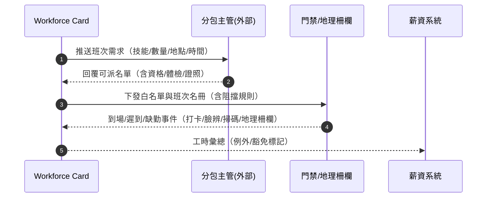
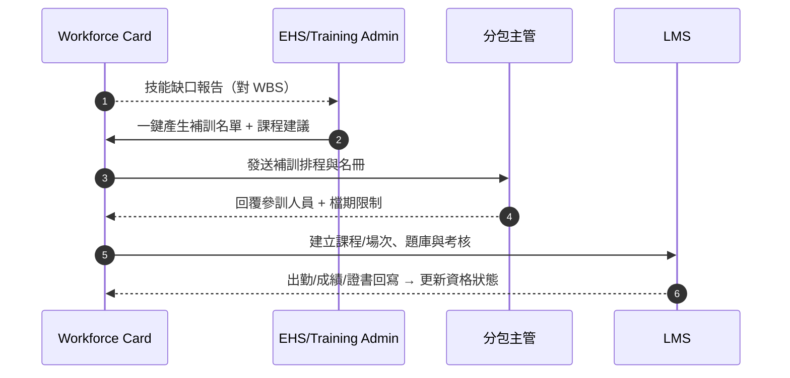
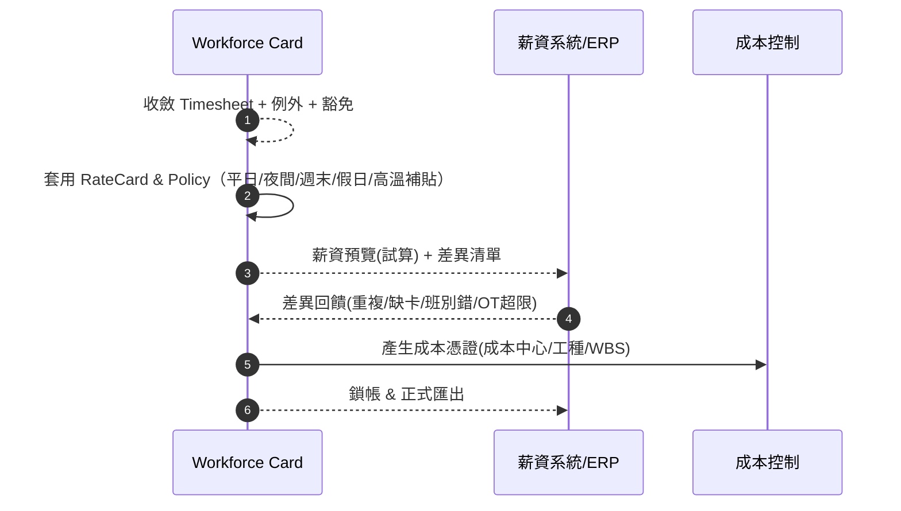
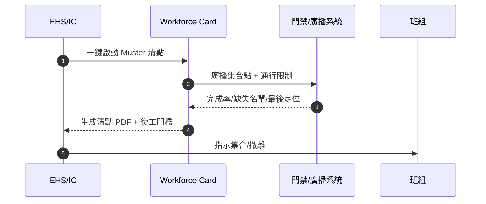
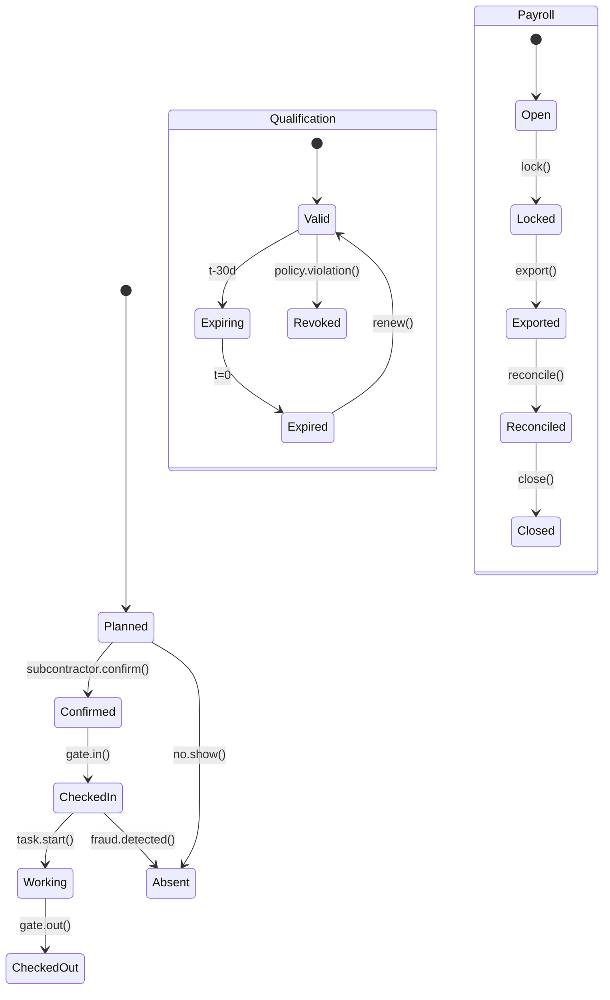

# Part 3o — 〈工地工人人員配置及出勤（Workforce Deployment & Attendance）〉卡片 詳規（**v3.1 Merged: 訓練・資格・薪酬**）
**版本**：v3.1（Merged TQP）  
**日期**：2025-09-20  
**對象**：專案經理（Project Manager, PM）、工區主任/工頭（Foreman/Supervisor）、分包商管理者（Subcontractor Supervisor）、人資/薪資（HR/Payroll）、環安衛（Environment, Health and Safety, EHS）、門禁安保（Security）、業主/監造（Owner’s Representative—受限視圖）  
**範圍**：本檔將 v3.0 主檔與「訓練（Training）・資格（Qualification）・薪酬（Payroll）」附錄**全面整併**，成為單一來源。內容含：平台內外使用者旅程（Mermaid 圖）、User Story、互動規格、資料模型、TypeScript 介面、OpenAPI 3.0 片段、高真 mock data、Playbook 決策表與規則語法、狀態圖、遙測、驗收、權限、效能、隱私與邊界情境。

> 術語：工作分解結構（Work Breakdown Structure, WBS）、人員清點（Muster）、地理柵欄（Geofence）、個人防護具（Personal Protective Equipment, PPE）、工作許可（Permit to Work）、線上學習平台（Learning Management System, LMS）、費率卡（Rate Card）、薪資週期（Payroll Cycle）。

---

## 1. 目標與價值
**卡片使命**：以單一操作面板完成 **人員需求→派工→出勤→合規（訓練/資格/Permit）→例外處理→工時彙總→薪資預覽/對帳/導出** 的全流程，並與 **進度（WBS）**、**安全（EHS/Permit）**、**天氣與阻礙**、**機具與材料** 雙向串接。

**北極星指標**
- **人力覆蓋率（對三週滾動計畫）** ≥ 98%  
- **準時出勤率** ≥ 95%；**無證上崗率** ≤ 0.5%  
- **資格/證照有效覆蓋率** ≥ 99.5%；**補訓準時率** ≥ 98%  
- **薪資差異率** ≤ 0.3%；**關帳時效** T+2 日內

**次級成效**：降低等待與臨時加班、減少安衛與稽核成本、提升分包透明度與信任。

---

## 2. 卡片 KPI 與排序邏輯（整併後）
- **KPI 徽章**：`到場/計畫（人）`、`準時率`、`缺勤/遲到`、`資格未通過`、`即將到期(30/14/7/1d)`、`補訓進度`、`超時預警`、`薪資差異(筆)`、`關鍵工序覆蓋`。  
- **排序鍵（rank）**：`rank = criticality*0.40 + coverageGap*0.25 + complianceRisk*0.20 + costImpact*0.10 + payrollRisk*0.05`

---

## 3. User Stories（Gherkin）—整併版
**US-WFA-01（Foreman 調度）**  
- Given 明日澆灌需 12 名模板、8 名鋼筋、2 名泵車司機  
- When 我在卡片建立班次與人力需求（綁定 WBS/工區）並推送給分包商  
- Then 系統在 2 小時內回收回覆，顯示覆蓋率/缺口，並提供合格替補名單（含資格狀態）。

**US-WFA-02（門禁/出勤）**  
- Given 07:30 需清點到場人員  
- When 工人通過 門禁/掃碼/臉辨/地理柵欄 打卡  
- Then 卡片即時刷新：到場、遲到、缺勤、資格未通過名單。

**US-TQP-01（EHS 補訓）**  
- Given 下週外牆作業需「高空」資格 26 人，現況有效 21 人，5 人將到期  
- When 我按「一鍵補訓」  
- Then 系統排課（線上+現地），回收簽到與測驗，資格自動更新並解除阻擋。

**US-TQP-03（HR/Payroll）**  
- Given 本週薪資預覽差異 17 筆（缺卡/班別錯/OT 超限）  
- When 我逐筆核銷或批量修正  
- Then 差異清零後鎖帳，並產生成本分攤與 ERP 匯出。

**US-WFA-06（安保/ICS）**  
- Given 風雷紅警需清場  
- When 我啟動「Muster 清點」  
- Then 15 分鐘內完成率 ≥ 95%，缺失名單推送組長與門禁顯示器。

---

## 4. 互動規格（整併）
### 4.1 卡片結構
- **標題列**：`工地工人人員配置及出勤` + KPI 徽章。  
- **工具列**：
  - `Filter`：日期/班次、分包、工種、工區/樓層、資格/Permit、訓練狀態、薪資狀態、關鍵路徑、到場狀態。  
  - `Group by`：分包 / 工種 / 班次 / 工區 / 資格類型 / 議程 / 薪資週期。  
  - `Sort`：rank、覆蓋差距、準時率、資格風險、OT 小時、薪資差異。  
  - `Bulk Actions`：批量派工/調班、批量續證/補訓、批量通知、批量凍結入場、批量導出（Excel/PDF/CSV）。  
  - `Pin to Top`、`Export`。
- **主表格欄位**：`工種/班組`、`計畫人數`、`到場/遲到/缺勤`、`覆蓋率`、`資格合規（%）`、`到期(人)`、`課程進度`、`OT（h）`、`薪資差異`、`工區/樓層`、`關聯 WBS`、`主要動作`。  
- **右側抽屜（Drawer）**：
  - `Roster`（班次/需求/回覆/替補分析）  
  - `Attendance`（打卡/軌跡/異常）  
  - `Compliance`（資格/Permit/PPE、體檢、阻擋/豁免）  
  - `Training`（課程、場次、名冊、考核成績、證書）  
  - `Payroll`（費率卡、薪資預覽、差異、鎖帳、導出）  
  - `Timesheet`（工時彙總與對帳）  
  - `Actions`（建立班次、派工/重派、Muster、凍結入場、續證、補訓、薪資試算/鎖帳/導出）

### 4.2 行動端（Mobile）
- 大按鈕：`掃碼入場`、`離線打卡`、`查看班次/任務`、`提交請假/替補`、`我的課程`、`上傳證照`。

---

## 5. 低保真 Wireframe（更新）
```text
┌─ Workforce  到場/計畫: 134/148 | 準時: 96% | 缺勤: 7 | 資格未通過: 3 | 到期: 5 | 補訓進度: 82% | OT警示: 2 | 薪資差異: 17 ─┐
│ Filter[日期|班次|分包|工種|工區|資格|訓練|薪資|關鍵路徑]  Group[分包/資格/課程/週期]  Sort[rank]  Bulk[...]  Pin  Export        │
├───────────────────────────────────────────────────────────────────────────────────────────────────────────────────────────────────────┤
│ 工種/班組         計畫  到場/遲到/缺勤 覆蓋  資格(%)  到期  課程進度  OT(h)  差異  工區/樓層  WBS        動作                     │
│ 模板(分包A)       12    12/1/0        100%  100%     0     100%     3.0   0    T3/L15   WBS-3.2.1 [派工/補訓/薪資預覽]              │
│ 鋼筋(分包B)       8     7/0/1         88%   86%      2     60%      1.0   4    T3/L15   WBS-3.2.2 [替補/續證/差異核銷]             │
│ 機操(供C 泵車)    2     2/0/0         100%  100%     0     100%     0.0   0    Gate-2   WBS-3.2.3 [通知/豁免/導出]                 │
└───────────────────────────────────────────────────────────────────────────────────────────────────────────────────────────────────────┘
```

---

## 6. 使用者旅程（Mermaid）
### 6.1 需求→派工→到場（Sequence）


### 6.2 資格門檻與例外（Flow with gates）
```mermaid
flowchart TD
  A[打卡/領任務事件] --> B{{資格/體檢/Permit 有效?}}
  B -- 否 --> C[阻擋 + 續證/補訓派發 + 通知主管]
  B -- 是 --> D{{敏感工序(高空/吊裝/受限空間)?}}
  D -- 是 --> E[二次驗證 + 現場點名]
  D -- 否 --> F[允許上崗 -> 記錄合規憑證]
```

### 6.3 訓練補缺（技能矩陣→課程→考核→上崗）


### 6.4 薪資（工時→規則→預覽→導出→對帳）


### 6.5 Muster 清點（Sequence）


---

## 7. 資料模型（Data Model，整併）
### 7.1 人員/班次/出勤（沿用 v3.0）
- **Worker**、**Crew**、**Shift**、**Assignment**、**Attendance**、**Exception**、**Timesheet**、**Vendor**、**GeofenceZone**。

### 7.2 訓練・資格・薪酬（新增）
```ts
export interface TrainingCourse { id: string; title: string; mode: "OnSite"|"Online"; durationHours: number; provider?: string; syllabus?: string[]; examRequired?: boolean; }
export interface TrainingSession { id: string; courseId: string; start: string; end: string; location?: string; capacity?: number; seatsTaken?: number; roster?: string[]; }
export interface Enrollment { id: string; sessionId: string; workerId: string; status: "Planned"|"Enrolled"|"Attended"|"Passed"|"Failed"|"NoShow"; score?: number; certificateUrl?: string; }
export interface Certification { id: string; workerId: string; type: string; issuedAt: string; validTo: string; issuer?: string; evidenceUrls?: string[]; status: "Valid"|"Expiring"|"Expired"|"Revoked"; }
export interface HealthCheck { id: string; workerId: string; type: "PhysicalExam"|"DrugTest"|"Vaccination"; validTo: string; status: "Valid"|"Expiring"|"Expired"; }
export interface RateCard { id: string; scope: { vendorId?: string; trade?: string; projectId?: string }; rules: PayRule[]; currency: string; }
export interface PayRule { id: string; name: string; predicate: { dayType?: "Weekday"|"Weekend"|"Holiday"; shift?: "AM"|"PM"|"Night"; heatIndexMin?: number }; rate: { type: "Hourly"|"Daily"; base: number; multiplier?: number; allowance?: number }; }
export interface PayrollCycle { id: string; projectId: string; periodStart: string; periodEnd: string; status: "Open"|"Locked"|"Exported"|"Reconciled"|"Closed"; }
export interface PayItem { workerId: string; day: string; hoursRegular: number; hoursOT?: number; payGross: number; deductions?: number; costCode?: string; wbsId?: string; notes?: string; anomalies?: string[]; }
```

---

## 8. API 規格（OpenAPI 片段，整併）
```yaml
openapi: 3.0.3
info: { title: Construction Hub – Workforce & Attendance API (with TQP), version: 3.1.0 }
paths:
  /projects/{{projectId}}/workforce-snapshot:
    get: { summary: 人員配置與出勤卡片聚合（KPI + 表格）, responses: { "200": { description: OK } } }

  /shifts: { post: { summary: 建立班次需求, responses: { "201": { description: Created } } } }
  /shifts/{{id}}/assignments: { post: { summary: 批次派工（人員/班組）, responses: { "200": { description: Assigned } } } }

  /attendance/checkin: { post: { summary: 打卡入場（門禁/QR/NFC/臉辨/地理柵欄）, responses: { "201": { description: CheckedIn } } } }
  /attendance/checkout: { post: { summary: 打卡離場, responses: { "201": { description: CheckedOut } } } }
  /qualifications/verify: { post: { summary: 批量資格校驗（打卡/派工前）, responses: { "200": { description: Verified } } } }

  # Training
  /training/courses:
    get: { summary: 列出課程, responses: { "200": { description: OK } } }
    post: { summary: 建立課程, responses: { "201": { description: Created } } }
  /training/sessions:
    post: { summary: 建立課程場次, responses: { "201": { description: Created } } }
    get: { summary: 查詢場次, responses: { "200": { description: OK } } }
  /training/sessions/{{id}}/enrollments:
    post: { summary: 批量報名, responses: { "201": { description: Enrolled } } }
  /training/enrollments/{{id}}:
    patch: { summary: 更新出勤/成績/通過, responses: { "200": { description: Updated } } }

  # Qualification renewals
  /qualifications/renew:
    post: { summary: 續證預約/上傳憑證, responses: { "201": { description: Created } } }

  # Payroll
  /payroll/cycles:
    post: { summary: 建立薪資週期, responses: { "201": { description: Created } } }
    get: { summary: 列出薪資週期, responses: { "200": { description: OK } } }
  /payroll/cycles/{{id}}/preview:
    post: { summary: 生成薪資預覽（套用 RateCard/Policy）, responses: { "200": { description: OK } } }
  /payroll/cycles/{{id}}/lock:
    post: { summary: 鎖帳, responses: { "200": { description: Locked } } }
  /payroll/cycles/{{id}}/export:
    get: { summary: 匯出薪資檔（CSV/ERP 格式）, responses: { "200": { description: OK } } }
  /payroll/cycles/{{id}}/reconcile:
    post: { summary: 對帳/核銷差異, responses: { "200": { description: Reconciled } } }

  /ratecards:
    get: { summary: 列出費率卡, responses: { "200": { description: OK } } }
    post: { summary: 建立/導入費率卡, responses: { "201": { description: Created } } }
```

---

## 9. 高真 Mock Data（合併）
### 9.1 Workforce Snapshot
```json
{
  "projectId": "PRJ-001",
  "date": "2025-09-20",
  "shift": "AM",
  "kpis": {
    "planned": 148,
    "present": 134,
    "onTimeRate": 0.96,
    "absent": 7,
    "nonCompliant": 3,
    "expiring": 5,
    "trainingProgress": 0.82,
    "overtimeAlerts": 2,
    "payrollDiffs": 17,
    "coverageRate": 0.98
  },
  "rows": [
    {
      "group": "分包A-模板",
      "planned": 12,
      "present": 12,
      "late": 1,
      "absent": 0,
      "coverageRate": 1.0,
      "compliancePct": 1.0,
      "expiring": 0,
      "trainingProgress": 1.0,
      "otHours": 3.0,
      "payrollDiff": 0,
      "zone": "T3-L15",
      "wbs": "WBS-3.2.1"
    },
    {
      "group": "分包B-鋼筋",
      "planned": 8,
      "present": 7,
      "late": 0,
      "absent": 1,
      "coverageRate": 0.88,
      "compliancePct": 0.86,
      "expiring": 2,
      "trainingProgress": 0.6,
      "otHours": 1.0,
      "payrollDiff": 4,
      "zone": "T3-L15",
      "wbs": "WBS-3.2.2"
    }
  ]
}
```

### 9.2 Training/Qualification
```json
{
  "courses": [
    {"id":"CRS-WAH","title":"高處作業（Working at Heights）","mode":"OnSite","durationHours":4,"examRequired":true},
    {"id":"CRS-HSE-BAS","title":"基礎安全（線上）","mode":"Online","durationHours":2}
  ],
  "sessions": [
    {"id":"SES-001","courseId":"CRS-WAH","start":"2025-09-22T01:00:00Z","end":"2025-09-22T05:00:00Z","location":"T3-TrainingRoom","capacity":20,"seatsTaken":16},
    {"id":"SES-002","courseId":"CRS-HSE-BAS","start":"2025-09-21T02:00:00Z","end":"2025-09-21T04:00:00Z","location":"Online","capacity":200,"seatsTaken":120}
  ],
  "enrollments": [
    {"id":"ENR-1001","sessionId":"SES-001","workerId":"EMP-4412","status":"Enrolled"},
    {"id":"ENR-1002","sessionId":"SES-002","workerId":"SUB-8891","status":"Attended","score":85,"certificateUrl":"https://.../certs/8891.pdf"}
  ],
  "certifications": [
    {"id":"CERT-4412-WAH","workerId":"EMP-4412","type":"WorkingAtHeights","issuedAt":"2025-09-22","validTo":"2026-09-21","status":"Valid"},
    {"id":"CERT-8891-HSE","workerId":"SUB-8891","type":"HSE-Base","issuedAt":"2025-09-21","validTo":"2027-09-20","status":"Valid"}
  ]
}
```

### 9.3 Payroll Preview
```json
{
  "cycle": {"id": "PAY-2025W38","projectId": "PRJ-001","periodStart": "2025-09-15","periodEnd": "2025-09-21","status": "Open"},
  "rateCard": {
    "id": "RC-PRJ001-Formwork","scope": {"projectId":"PRJ-001","trade":"Formwork"},"currency": "TWD",
    "rules": [
      {"id":"R1","name":"Weekday-Base","predicate":{"dayType":"Weekday"},"rate":{"type":"Hourly","base":220}},
      {"id":"R2","name":"Night-25%","predicate":{"shift":"Night"},"rate":{"type":"Hourly","base":220,"multiplier":1.25}},
      {"id":"R3","name":"Weekend-50%","predicate":{"dayType":"Weekend"},"rate":{"type":"Hourly","base":220,"multiplier":1.5}},
      {"id":"R4","name":"Heat-Allowance","predicate":{"heatIndexMin":32},"rate":{"type":"Hourly","base":0,"allowance":20}}
    ]
  },
  "preview": [
    {"workerId":"EMP-4412","day":"2025-09-17","hoursRegular":8,"hoursOT":2,"payGross": 8*220 + 2*220*1.5, "deductions":0, "wbsId":"WBS-3.2.1","anomalies":[]},
    {"workerId":"SUB-8891","day":"2025-09-18","hoursRegular":10,"hoursOT":0,"payGross": 10*220, "deductions":0, "wbsId":"WBS-3.2.2","anomalies":["MissingCheckOut"]}
  ]
}
```

---

## 10. Playbook（Decision Table + DSL）
| 規則 | 條件 | 動作 |
|---|---|---|
| PB-WFA-01 | `CoverageGap > 0 AND skillMatchAvailable` | 推薦替補＋一鍵調派 |
| PB-WFA-02 | `NoQualification OR PermitExpired` | 阻擋入場＋通知主管/EHS＋生成培訓/續證任務 |
| PB-WFA-03 | `Late > threshold OR Absent detected` | 建立例外單＋自動補位（候補名單） |
| PB-WFA-04 | `OTHours weekly > policy.limit` | 疲勞風險＋限制加班＋替補建議 |
| PB-WFA-05 | `Weather.RedAlert AND zone=Outdoor` | 自動啟動 Muster＋凍結入場 |
| PB-WFA-06 | `DuplicateCheckin OR OutOfZone` | 臉辨二次驗證＋稽核標記 |
| PB-TQP-01 | `cert.validTo <= T+30d AND criticalTrade` | 建立補訓名單＋排課＋通知分包/工頭 |
| PB-TQP-03 | `timesheet.anomaly in [MissingCheckIn, MissingCheckOut, Overlap]` | 產生差異工單＋Payroll 預覽標記 |
| PB-TQP-05 | `HeatIndex >= 32` | 自動套用「高溫補貼」＋飲水/輪休 |
| PB-TQP-06 | `union.rule breach` | 產生合規警示＋暫停鎖帳 |

**DSL 示意**
```text
WHEN coverage.gap(wbsId, trade="Formwork") > 0 AND exists(substitute(trade="Formwork"))
THEN suggest("SubstituteList"), do("dispatch.assign", {{ plan: "AutoFill" }}), notify(["Foreman","SubcontractorA"])

WHEN cert.days_to_expire(workerId, type="WorkingAtHeights") <= 14
THEN schedule.training(course="CRS-WAH"), notify(["Worker","SubcontractorSupervisor","EHS"])

WHEN payroll.preview(cycleId).diff.count() > 0
THEN block("payroll.lock"), route("diff.queue")
```

---

## 11. 狀態圖（State Machine）
### Assignment / Attendance / Qualification / Payroll Cycle（綜合）


---

## 12. 遙測（Telemetry）
- **出勤**：準時率、缺勤率、重複打卡率、越區入場率。  
- **覆蓋**：計畫 vs 到場差距、技能覆蓋率、關鍵工序覆蓋。  
- **合規**：資格/PPE/Permit 失效率、阻擋入場次數、補訓準時率、到期提醒命中率。  
- **工時/薪資**：OT 比率、疲勞風險事件、薪資預覽差異數與平均處理時間、關帳 T+ 日。  
- **分包績效**：回覆時效、覆蓋達標、出勤可靠度。  
- **應急**：Muster 完成率/時效。

---

## 13. 驗收準則（Acceptance Criteria）
- 首屏（>1,000 人）**≤ 600ms（95分位）**；打卡到卡片刷新 **≤ 2s**。  
- 打卡/派工前資格校驗 **< 300ms**（95分位）；阻擋與提示即時。  
- 一鍵補訓→課程建立與通知 **≤ 2 分鐘**；LMS 成績回寫 **≤ 5 分鐘**。  
- 薪資預覽（≥2,000 人/週期）**≤ 15 秒**；對帳 API 可用性 **≥ 99.9%**。  
- 例外/豁免流程全程可審計（時間戳、操作者、原因、附件）。  
- Muster 啟動後 15 分鐘完成率 **≥ 95%**。

---

## 14. 權限（RBAC + ABAC）
- **PM/Foreman**：建立需求、派工、調班、審批例外、查看薪資彙總。  
- **分包主管**：回覆名單、調派與替補、回覆課程與續證。  
- **EHS**：資格/Permit 規則、阻擋/豁免、Muster、課程管理。  
- **HR/Payroll**：費率卡、薪資週期、預覽/鎖帳/導出/對帳。  
- **Security**：門禁與地理柵欄管理。  
- **業主/監造**：只讀覆蓋率與合規摘要（脫敏）。  
- 屬性：Project / Zone / WBS / Trade / Vendor / Shift / RiskLevel / CertificationType / PayrollCycle。

---

## 15. 效能、可靠性與隱私
- **離線**：行動端離線打卡與名冊；課程簽到離線紀錄，回線同步。  
- **邊緣運算**：地理柵欄/臉辨在閘道本地運作，回線補傳事件。  
- **反舞弊**：臉辨二次驗證、活體檢測（如可用）；GPS 偏移/時間漂移偵測。  
- **隱私**：面部模板與醫療/體檢資料最小化與加密；存取審計與到期刪除。  
- **安全**：端到端加密、簽章、外部分享水印與到期。

---

## 16. 邊界情境（Edge Cases）
- **跨日夜班**：跨午夜的工時與薪資切割；地理柵欄延伸。  
- **多角色/多派工**：避免重疊工時與雙重打卡。  
- **異地支援**：多工地動態白名單；跨場調度。  
- **弱網/無電**：紙本名冊掃描上傳，後臺 OCR 自動對帳。  
- **臨時工**：快速註冊/臨時許可；到期自動失效。  
- **工會/法規**：最小休息時間、日/週最大工時、特殊津貼自動化。

---

## 17. 與其他卡片的關聯
- 與「進度健康度」「現場任務看板」「天氣與阻礙」「品質與安全整改」「成本與現金流」「對外公告」雙向同步（排程/Permit/材料/機具/成本/公告）。
