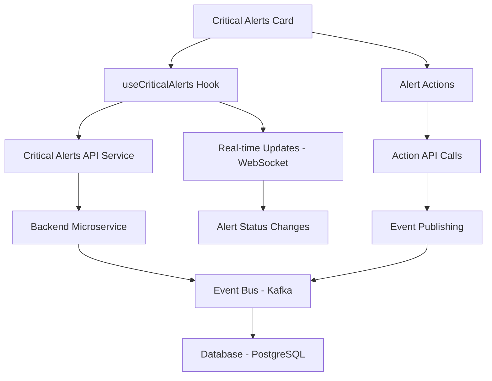

# Critical Alerts - Technical Specification

**Version**: v3.0  
**Date**: 2025-09-21  
**Status**: Draft → Review  
**Scope**: Technical implementation specification for the Critical Alerts dashboard card

## Overview

This document provides the technical implementation details for the Critical Alerts card, including data models, API specifications, component architecture, and integration points.

## Technical Architecture

### Component Structure

```
src/components/cards/CriticalAlerts/
├── CriticalAlertsCard.tsx          # Main card component
├── CriticalAlertsTable.tsx         # Data table component
├── AlertDrawer.tsx                 # Right-side drawer component
├── AlertActions.tsx                # Action buttons component
├── AlertFilters.tsx                # Filter controls component
└── __tests__/                      # Test files
    ├── CriticalAlertsCard.test.tsx
    ├── CriticalAlertsTable.test.tsx
    └── AlertDrawer.test.tsx
```

### Data Flow



## Data Models

### TypeScript Interfaces

```typescript
// Core Alert Types
export type AlertType = "RFI" | "IR" | "MIR" | "CHANGE" | "PUNCH" | "PERMIT";
export type SlaLevel = "ok" | "warn" | "danger" | "critical";

// Impact Scoring
export interface ImpactScore {
  cp: 0 | 3;           // Critical Path impact
  cost: 0 | 1 | 2 | 3; // Cost exposure
  stop: 0 | 1 | 2 | 3; // Stoppage risk
  ehs: 0 | 1 | 2 | 3 | 4; // Safety impact
  total: number;       // Calculated total
}

// Main Alert Item
export interface AlertItem {
  id: string;
  type: AlertType;
  title: string;
  remainingSeconds: number; // negative = overdue
  slaLevel: SlaLevel;
  impact: ImpactScore;
  owner: string;
  wbsId?: string;
  locationId?: string;
  drawingVersionId?: string;
  relatedIds?: string[];
  rank: number;
  actionsAllowed: string[];
  createdAt: string;
  updatedAt: string;
}

// API Response
export interface AlertsResponse {
  projectId: string;
  asOf: string;
  items: AlertItem[];
  kpis: {
    newOverdue: number;
    due24h: number;
    autoEscalations: number;
  };
}
```

### Database Schema

```sql
-- Alerts table
CREATE TABLE alerts (
  id UUID PRIMARY KEY DEFAULT gen_random_uuid(),
  project_id UUID NOT NULL REFERENCES projects(id),
  type VARCHAR(20) NOT NULL CHECK (type IN ('RFI', 'IR', 'MIR', 'CHANGE', 'PUNCH', 'PERMIT')),
  title TEXT NOT NULL,
  remaining_seconds INTEGER NOT NULL,
  sla_level VARCHAR(10) NOT NULL CHECK (sla_level IN ('ok', 'warn', 'danger', 'critical')),
  impact_cp INTEGER NOT NULL DEFAULT 0,
  impact_cost INTEGER NOT NULL DEFAULT 0,
  impact_stop INTEGER NOT NULL DEFAULT 0,
  impact_ehs INTEGER NOT NULL DEFAULT 0,
  impact_total DECIMAL(3,2) NOT NULL,
  owner_id UUID REFERENCES users(id),
  wbs_id UUID REFERENCES wbs(id),
  location_id UUID REFERENCES locations(id),
  drawing_version_id UUID REFERENCES drawing_versions(id),
  rank DECIMAL(3,2) NOT NULL,
  actions_allowed TEXT[] NOT NULL DEFAULT '{}',
  created_at TIMESTAMP WITH TIME ZONE DEFAULT NOW(),
  updated_at TIMESTAMP WITH TIME ZONE DEFAULT NOW()
);

-- Indexes for performance
CREATE INDEX idx_alerts_project_rank ON alerts(project_id, rank DESC);
CREATE INDEX idx_alerts_sla_level ON alerts(sla_level);
CREATE INDEX idx_alerts_remaining_seconds ON alerts(remaining_seconds);
CREATE INDEX idx_alerts_type ON alerts(type);
```

## API Specifications

### REST Endpoints

```yaml
# GET /api/v1/projects/{projectId}/alerts
GET /api/v1/projects/{projectId}/alerts
Parameters:
  - projectId: string (path, required)
  - types: string (query, optional) - comma-separated alert types
  - impactMin: number (query, optional) - minimum impact score
  - dueWithinHours: integer (query, optional) - alerts due within hours
  - sort: string (query, optional) - sort field (rank, remainingSeconds, impact)
  - limit: integer (query, optional, default: 50)
  - offset: integer (query, optional, default: 0)

Response:
  - 200: AlertsResponse
  - 400: Bad Request
  - 401: Unauthorized
  - 404: Project Not Found

# POST /api/v1/alerts/{alertId}/actions/escalate
POST /api/v1/alerts/{alertId}/actions/escalate
Body:
  - reason?: string
  - scheduleMeetingInHours?: integer (default: 2)
  - notifyExternal?: boolean (default: true)

# POST /api/v1/alerts/{alertId}/actions/remind
POST /api/v1/alerts/{alertId}/actions/remind
Body:
  - message?: string
  - includeExternal?: boolean (default: false)

# POST /api/v1/alerts/{alertId}/actions/dispatch
POST /api/v1/alerts/{alertId}/actions/dispatch
Body:
  - vendorId: string
  - etaStart: string (ISO datetime)
  - etaEnd: string (ISO datetime)
  - requireGeoCheckin: boolean (default: true)
```

### WebSocket Events

```typescript
// Real-time alert updates
interface AlertUpdateEvent {
  type: 'ALERT_UPDATED' | 'ALERT_CREATED' | 'ALERT_RESOLVED';
  projectId: string;
  alert: AlertItem;
  timestamp: string;
}

// SLA level changes
interface SlaLevelChangeEvent {
  type: 'SLA_LEVEL_CHANGED';
  alertId: string;
  oldLevel: SlaLevel;
  newLevel: SlaLevel;
  timestamp: string;
}
```

## Component Implementation

### Critical Alerts Card Component

```typescript
import React, { useEffect, useState } from 'react';
import { useCriticalAlerts } from '@/hooks/useCriticalAlerts';
import { AlertItem, AlertsResponse } from '@/types/alerts';
import { CriticalAlertsTable } from './CriticalAlertsTable';
import { AlertDrawer } from './AlertDrawer';
import { AlertFilters } from './AlertFilters';

interface CriticalAlertsCardProps {
  projectId: string;
  onAlertSelect?: (alert: AlertItem) => void;
}

export const CriticalAlertsCard: React.FC<CriticalAlertsCardProps> = ({
  projectId,
  onAlertSelect
}) => {
  const {
    alerts,
    kpis,
    loading,
    error,
    refetch,
    updateAlert,
    performAction
  } = useCriticalAlerts(projectId);

  const [selectedAlert, setSelectedAlert] = useState<AlertItem | null>(null);
  const [filters, setFilters] = useState({
    types: [],
    impactMin: 0,
    dueWithinHours: null
  });

  const handleAlertSelect = (alert: AlertItem) => {
    setSelectedAlert(alert);
    onAlertSelect?.(alert);
  };

  const handleAction = async (alertId: string, action: string, params: any) => {
    try {
      await performAction(alertId, action, params);
      // Real-time updates will handle UI refresh
    } catch (error) {
      console.error('Action failed:', error);
    }
  };

  if (loading) return <AlertCardSkeleton />;
  if (error) return <AlertCardError error={error} onRetry={refetch} />;

  return (
    <div className="critical-alerts-card">
      <div className="card-header">
        <h3>Critical Alerts</h3>
        <div className="kpi-badges">
          <span className="badge overdue">{kpis.newOverdue} Overdue</span>
          <span className="badge due-soon">{kpis.due24h} Due Soon</span>
          <span className="badge auto-escalated">{kpis.autoEscalations} Auto-Escalated</span>
        </div>
      </div>
      
      <AlertFilters 
        filters={filters} 
        onChange={setFilters}
        onExport={() => {/* Export logic */}}
      />
      
      <CriticalAlertsTable
        alerts={alerts}
        onAlertSelect={handleAlertSelect}
        onAction={handleAction}
        loading={loading}
      />
      
      {selectedAlert && (
        <AlertDrawer
          alert={selectedAlert}
          onClose={() => setSelectedAlert(null)}
          onAction={handleAction}
        />
      )}
    </div>
  );
};
```

### Custom Hook Implementation

```typescript
import { useState, useEffect, useCallback } from 'react';
import { useWebSocket } from '@/hooks/useWebSocket';
import { alertsApi } from '@/services/alertsApi';
import { AlertItem, AlertsResponse } from '@/types/alerts';

export const useCriticalAlerts = (projectId: string) => {
  const [alerts, setAlerts] = useState<AlertItem[]>([]);
  const [kpis, setKpis] = useState({
    newOverdue: 0,
    due24h: 0,
    autoEscalations: 0
  });
  const [loading, setLoading] = useState(true);
  const [error, setError] = useState<Error | null>(null);

  const { socket } = useWebSocket(`/projects/${projectId}/alerts`);

  // Fetch alerts
  const fetchAlerts = useCallback(async (filters?: any) => {
    try {
      setLoading(true);
      const response = await alertsApi.getAlerts(projectId, filters);
      setAlerts(response.items);
      setKpis(response.kpis);
      setError(null);
    } catch (err) {
      setError(err as Error);
    } finally {
      setLoading(false);
    }
  }, [projectId]);

  // WebSocket event handling
  useEffect(() => {
    if (!socket) return;

    const handleAlertUpdate = (event: AlertUpdateEvent) => {
      setAlerts(prev => {
        const index = prev.findIndex(a => a.id === event.alert.id);
        if (index >= 0) {
          const updated = [...prev];
          updated[index] = event.alert;
          return updated;
        } else {
          return [event.alert, ...prev];
        }
      });
    };

    socket.on('alert_updated', handleAlertUpdate);
    return () => socket.off('alert_updated', handleAlertUpdate);
  }, [socket]);

  // Perform action on alert
  const performAction = useCallback(async (
    alertId: string, 
    action: string, 
    params: any
  ) => {
    try {
      await alertsApi.performAction(alertId, action, params);
      // Real-time updates will handle UI refresh
    } catch (err) {
      throw new Error(`Failed to perform ${action}: ${err.message}`);
    }
  }, []);

  // Initial load
  useEffect(() => {
    fetchAlerts();
  }, [fetchAlerts]);

  return {
    alerts,
    kpis,
    loading,
    error,
    refetch: fetchAlerts,
    performAction
  };
};
```

## Performance Considerations

### Optimization Strategies

1. **Virtual Scrolling**: For large alert lists (>100 items)
2. **Debounced Filtering**: Prevent excessive API calls
3. **Optimistic Updates**: Immediate UI feedback for actions
4. **Caching**: Redis cache for frequently accessed alerts
5. **Pagination**: Load alerts in batches

### Performance Metrics

- **Initial Load**: < 600ms (95th percentile)
- **Action Response**: < 200ms (95th percentile)
- **Real-time Update Latency**: < 100ms
- **Memory Usage**: < 50MB for 1000 alerts

## Testing Strategy

### Unit Tests

```typescript
// CriticalAlertsCard.test.tsx
describe('CriticalAlertsCard', () => {
  it('renders alerts with correct sorting', () => {
    const mockAlerts = [
      { id: '1', rank: 2.5, slaLevel: 'critical' },
      { id: '2', rank: 1.8, slaLevel: 'danger' }
    ];
    
    render(<CriticalAlertsCard projectId="test" />);
    
    // Verify sorting by rank
    expect(screen.getByTestId('alert-1')).toBeInTheDocument();
    expect(screen.getByTestId('alert-2')).toBeInTheDocument();
  });

  it('handles alert actions correctly', async () => {
    const mockPerformAction = jest.fn();
    render(<CriticalAlertsCard projectId="test" />);
    
    await user.click(screen.getByTestId('escalate-button'));
    expect(mockPerformAction).toHaveBeenCalledWith('alert-id', 'escalate', {});
  });
});
```

### Integration Tests

```typescript
// Critical Alerts Integration Tests
describe('Critical Alerts Integration', () => {
  it('updates alert status in real-time', async () => {
    // Setup WebSocket mock
    const mockSocket = new MockWebSocket();
    
    render(<CriticalAlertsCard projectId="test" />);
    
    // Simulate real-time update
    mockSocket.emit('alert_updated', {
      type: 'ALERT_UPDATED',
      alert: { id: '1', slaLevel: 'critical' }
    });
    
    await waitFor(() => {
      expect(screen.getByTestId('alert-1')).toHaveClass('critical');
    });
  });
});
```

### E2E Tests

```typescript
// Critical Alerts E2E Tests
describe('Critical Alerts E2E', () => {
  it('completes full alert escalation workflow', async () => {
    await page.goto('/projects/test/alerts');
    
    // Select critical alert
    await page.click('[data-testid="alert-critical-1"]');
    
    // Open drawer
    await page.waitForSelector('[data-testid="alert-drawer"]');
    
    // Perform escalation
    await page.click('[data-testid="escalate-button"]');
    await page.fill('[data-testid="escalation-reason"]', 'Urgent issue');
    
    // Submit escalation
    await page.click('[data-testid="submit-escalation"]');
    
    // Verify success
    await expect(page.locator('[data-testid="success-message"]')).toBeVisible();
  });
});
```

## Security Considerations

### Access Control

- **RBAC**: Role-based access to alert actions
- **ABAC**: Attribute-based access for project-specific alerts
- **Audit Trail**: All actions logged with user and timestamp

### Data Protection

- **Encryption**: Sensitive alert data encrypted at rest
- **Input Validation**: All user inputs validated and sanitized
- **Rate Limiting**: API endpoints protected against abuse

## Monitoring and Observability

### Metrics

- **Alert Count**: Total alerts by status and type
- **Response Times**: API and action performance
- **Error Rates**: Failed actions and API errors
- **User Engagement**: Alert interaction patterns

### Logging

```typescript
// Structured logging for alerts
logger.info('Alert action performed', {
  alertId: 'ALERT-123',
  action: 'escalate',
  userId: 'USER-456',
  projectId: 'PROJ-789',
  timestamp: new Date().toISOString(),
  metadata: {
    reason: 'Critical path impact',
    escalationLevel: 2
  }
});
```

## Deployment Considerations

### Environment Configuration

```bash
# Production environment variables
CRITICAL_ALERTS_CACHE_TTL=300
CRITICAL_ALERTS_MAX_ITEMS=1000
CRITICAL_ALERTS_WEBSOCKET_ENABLED=true
CRITICAL_ALERTS_AUTO_ESCALATION_ENABLED=true
```

### Database Migrations

```sql
-- Migration for alerts table
-- File: 001_create_alerts_table.sql
-- Applied in: Production deployment v1.0.0
```

## Future Enhancements

### Planned Features

1. **AI-Powered Prioritization**: Machine learning for alert ranking
2. **Predictive Analytics**: Early warning system for potential issues
3. **Mobile Push Notifications**: Real-time alerts on mobile devices
4. **Advanced Filtering**: Saved filter presets and smart filters
5. **Bulk Operations**: Mass actions on multiple alerts

### Technical Debt

1. **Legacy API Support**: Maintain backward compatibility
2. **Performance Optimization**: Database query optimization
3. **Test Coverage**: Increase E2E test coverage to 90%
4. **Documentation**: API documentation updates

---

**Next Steps**: 
1. Review and approve technical specification
2. Create implementation tickets
3. Set up development environment
4. Begin component development
5. Implement API endpoints
6. Add comprehensive testing
