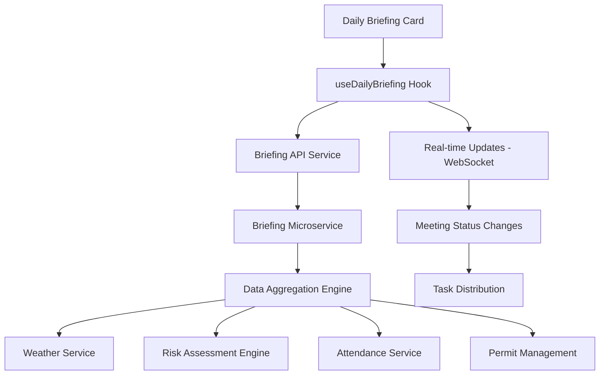

# Daily Briefing - Technical Specification

**Version**: v3.0  
**Date**: 2025-09-21  
**Status**: Draft → Review  
**Scope**: Technical implementation specification for the Daily Briefing dashboard card

## Overview

This document provides the technical implementation details for the Daily Briefing card, including automated meeting preparation, attendance tracking, permit management, and post-meeting task distribution.

## Technical Architecture

### Component Structure

```
src/components/cards/DailyBriefing/
├── DailyBriefingCard.tsx           # Main card component
├── BriefingPack.tsx                # Meeting preparation component
├── AttendanceTracker.tsx           # Attendance and check-in component
├── PermitManager.tsx               # Work permit management component
├── WeatherWidget.tsx               # Weather information component
├── RiskAssessment.tsx              # Risk evaluation component
├── BriefingFilters.tsx             # Filter controls component
└── __tests__/                      # Test files
    ├── DailyBriefingCard.test.tsx
    ├── BriefingPack.test.tsx
    └── AttendanceTracker.test.tsx
```

### Data Flow



## Data Models

### TypeScript Interfaces

```typescript
// Daily Briefing Types
export type BriefingStatus = "Draft" | "Ready" | "Published" | "InMeeting" | "Closed" | "Archived";
export type SectionType = "Risks" | "Weather" | "Attendance" | "Equipment" | "Plan" | "Overdue";

// Daily Briefing
export interface DailyBriefing {
  id: string;
  projectId: string;
  date: string;
  shift: "Morning" | "Afternoon" | "Night";
  status: BriefingStatus;
  kpis: {
    riskCount: number;
    rainProb: number;
    attendancePct: number;
    equipmentAvailPct: number;
    overdueCount: number;
  };
  packUrl?: string;
  createdAt: string;
  updatedAt: string;
}

// Risk Item
export interface RiskItem {
  id: string;
  type: "HotWork" | "Lifting" | "WorkAtHeight" | "Electrical" | "ConfinedSpace";
  locationIds: string[];
  contractorId: string;
  permit: {
    required: boolean;
    id?: string;
    expiresAt?: string;
  };
  severity: number; // 1-5
  actionSuggested?: string[];
  createdAt: string;
}

// Weather Information
export interface WeatherInfo {
  date: string;
  rainProb: number;
  windSpeed: number;
  tempFeelsLike: number;
  alerts: string[];
  hourlyForecast: HourlyWeather[];
}

export interface HourlyWeather {
  hour: string;
  temp: number;
  rainProb: number;
  windSpeed: number;
  conditions: string;
}

// Attendance Summary
export interface AttendanceSummary {
  expected: number;
  present: number;
  pct: number;
  gaps?: {
    skill: {
      name: string;
      need: number;
      have: number;
    }[];
  };
  trainingDue?: {
    personId: string;
    name: string;
    course: string;
    dueAt: string;
  }[];
}

// Equipment Status
export interface EquipmentStatus {
  equipmentId: string;
  name: string;
  status: "Available" | "Down" | "InUse" | "Maintenance";
  utilizationPct?: number;
  maintenanceDueAt?: string;
  location?: string;
}

// Plan Highlight
export interface PlanHighlight {
  wbsId: string;
  title: string;
  isCriticalPath: boolean;
  milestoneDate: string;
  notes?: string;
  weatherImpact?: string;
}

// Overdue Item
export interface OverdueItem {
  kind: "RFI" | "Change" | "Rectification" | "Inspection" | "Decision";
  refId: string;
  dueAt: string;
  owner: string;
  impact: "Schedule" | "Cost" | "Safety" | "Quality";
}

// Permit Task
export interface PermitTask {
  id: string;
  type: "HotWork" | "Lifting" | "WorkAtHeight" | "Electrical" | "ConfinedSpace";
  holders: string[];
  status: "Draft" | "Pending" | "Approved" | "Rejected";
  expiresAt: string;
  location: string;
  contractorId: string;
}

// Briefing Section
export interface BriefingSection {
  id: string;
  briefingId: string;
  type: SectionType;
  rank: number;
  items: any[];
  createdAt: string;
}

// API Response
export interface DailyBriefingResponse {
  projectId: string;
  date: string;
  shift: "Morning" | "Afternoon" | "Night";
  kpis: DailyBriefing["kpis"];
  sections: {
    type: SectionType;
    rank: number;
    items: any[];
  }[];
  share?: {
    url?: string;
    expiresAt?: string;
    visibility?: "Participants" | "Company" | "PublicByLink";
  };
}
```

### Database Schema

```sql
-- Daily briefings
CREATE TABLE daily_briefings (
  id UUID PRIMARY KEY DEFAULT gen_random_uuid(),
  project_id UUID NOT NULL REFERENCES projects(id),
  date DATE NOT NULL,
  shift VARCHAR(10) NOT NULL CHECK (shift IN ('Morning', 'Afternoon', 'Night')),
  status VARCHAR(20) NOT NULL CHECK (status IN ('Draft', 'Ready', 'Published', 'InMeeting', 'Closed', 'Archived')),
  risk_count INTEGER NOT NULL DEFAULT 0,
  rain_prob DECIMAL(3,2) NOT NULL DEFAULT 0,
  attendance_pct DECIMAL(3,2) NOT NULL DEFAULT 0,
  equipment_avail_pct DECIMAL(3,2) NOT NULL DEFAULT 0,
  overdue_count INTEGER NOT NULL DEFAULT 0,
  pack_url TEXT,
  created_at TIMESTAMP WITH TIME ZONE DEFAULT NOW(),
  updated_at TIMESTAMP WITH TIME ZONE DEFAULT NOW(),
  UNIQUE(project_id, date, shift)
);

-- Briefing sections
CREATE TABLE briefing_sections (
  id UUID PRIMARY KEY DEFAULT gen_random_uuid(),
  briefing_id UUID NOT NULL REFERENCES daily_briefings(id),
  type VARCHAR(20) NOT NULL CHECK (type IN ('Risks', 'Weather', 'Attendance', 'Equipment', 'Plan', 'Overdue')),
  rank INTEGER NOT NULL,
  items JSONB NOT NULL DEFAULT '[]',
  created_at TIMESTAMP WITH TIME ZONE DEFAULT NOW()
);

-- Risk items
CREATE TABLE risk_items (
  id UUID PRIMARY KEY DEFAULT gen_random_uuid(),
  briefing_id UUID NOT NULL REFERENCES daily_briefings(id),
  type VARCHAR(20) NOT NULL CHECK (type IN ('HotWork', 'Lifting', 'WorkAtHeight', 'Electrical', 'ConfinedSpace')),
  location_ids UUID[] NOT NULL DEFAULT '{}',
  contractor_id UUID NOT NULL REFERENCES contractors(id),
  permit_required BOOLEAN NOT NULL DEFAULT FALSE,
  permit_id UUID REFERENCES permits(id),
  permit_expires_at TIMESTAMP WITH TIME ZONE,
  severity INTEGER NOT NULL CHECK (severity BETWEEN 1 AND 5),
  action_suggested TEXT[] DEFAULT '{}',
  created_at TIMESTAMP WITH TIME ZONE DEFAULT NOW()
);

-- Weather information
CREATE TABLE weather_info (
  id UUID PRIMARY KEY DEFAULT gen_random_uuid(),
  briefing_id UUID NOT NULL REFERENCES daily_briefings(id),
  date DATE NOT NULL,
  rain_prob DECIMAL(3,2) NOT NULL,
  wind_speed DECIMAL(5,2) NOT NULL,
  temp_feels_like DECIMAL(4,1) NOT NULL,
  alerts TEXT[] DEFAULT '{}',
  hourly_forecast JSONB NOT NULL DEFAULT '[]',
  created_at TIMESTAMP WITH TIME ZONE DEFAULT NOW()
);

-- Attendance records
CREATE TABLE attendance_records (
  id UUID PRIMARY KEY DEFAULT gen_random_uuid(),
  briefing_id UUID NOT NULL REFERENCES daily_briefings(id),
  person_id UUID NOT NULL REFERENCES persons(id),
  check_in_time TIMESTAMP WITH TIME ZONE,
  check_out_time TIMESTAMP WITH TIME ZONE,
  status VARCHAR(10) NOT NULL CHECK (status IN ('Present', 'Absent', 'Late', 'Excused')),
  created_at TIMESTAMP WITH TIME ZONE DEFAULT NOW()
);

-- Permit tasks
CREATE TABLE permit_tasks (
  id UUID PRIMARY KEY DEFAULT gen_random_uuid(),
  briefing_id UUID NOT NULL REFERENCES daily_briefings(id),
  type VARCHAR(20) NOT NULL CHECK (type IN ('HotWork', 'Lifting', 'WorkAtHeight', 'Electrical', 'ConfinedSpace')),
  holders UUID[] NOT NULL DEFAULT '{}',
  status VARCHAR(20) NOT NULL CHECK (status IN ('Draft', 'Pending', 'Approved', 'Rejected')),
  expires_at TIMESTAMP WITH TIME ZONE NOT NULL,
  location TEXT NOT NULL,
  contractor_id UUID NOT NULL REFERENCES contractors(id),
  created_at TIMESTAMP WITH TIME ZONE DEFAULT NOW()
);

-- Indexes for performance
CREATE INDEX idx_daily_briefings_project_date ON daily_briefings(project_id, date);
CREATE INDEX idx_briefing_sections_briefing ON briefing_sections(briefing_id);
CREATE INDEX idx_risk_items_briefing ON risk_items(briefing_id);
CREATE INDEX idx_attendance_records_briefing ON attendance_records(briefing_id);
CREATE INDEX idx_permit_tasks_briefing ON permit_tasks(briefing_id);
```

## API Specifications

### REST Endpoints

```yaml
# GET /api/v1/projects/{projectId}/daily-briefing
GET /api/v1/projects/{projectId}/daily-briefing
Parameters:
  - projectId: string (path, required)
  - date: string (query, optional) - ISO date (default: today)
  - shift: string (query, optional) - Morning/Afternoon/Night (default: Morning)
  - include: string (query, optional) - comma-separated sections

Response:
  - 200: DailyBriefingResponse
  - 400: Bad Request
  - 404: Briefing Not Found

# POST /api/v1/projects/{projectId}/daily-briefing/prepare
POST /api/v1/projects/{projectId}/daily-briefing/prepare
Body:
  - date: string (ISO date)
  - shift: string
  - topN: integer (default: 5)
  - includeExternal: boolean (default: true)

Response:
  - 200: { briefingId: string, status: "Ready" }
  - 400: Bad Request

# POST /api/v1/daily-briefing/{briefingId}/publish
POST /api/v1/daily-briefing/{briefingId}/publish
Body:
  - formats: string[] - ["PDF", "PPTX", "HTML"]
  - createShareLink: boolean (default: true)
  - shareExpiryHours: integer (default: 72)

Response:
  - 200: { packUrl: string, shareUrl?: string }
  - 400: Bad Request

# POST /api/v1/daily-briefing/{briefingId}/attendance
POST /api/v1/daily-briefing/{briefingId}/attendance
Body:
  - presentIds: string[]
  - checkedPermits: string[]
  - checkInTime?: string (ISO datetime)

Response:
  - 200: { attendanceRecorded: boolean }
  - 400: Bad Request

# POST /api/v1/daily-briefing/{briefingId}/permits/generate
POST /api/v1/daily-briefing/{briefingId}/permits/generate
Body:
  - riskTypes: string[] - types of permits to generate
  - autoApprove: boolean (default: false)

Response:
  - 201: { permitsGenerated: number, permitIds: string[] }
  - 400: Bad Request

# POST /api/v1/daily-briefing/{briefingId}/actions/accept
POST /api/v1/daily-briefing/{briefingId}/actions/accept
Body:
  - actions: string[] - action IDs to accept
  - assignTo: string[] - user IDs to assign actions to

Response:
  - 200: { actionsAccepted: number, tasksCreated: string[] }
  - 400: Bad Request
```

## Component Implementation

### Daily Briefing Card Component

```typescript
import React, { useEffect, useState } from 'react';
import { useDailyBriefing } from '@/hooks/useDailyBriefing';
import { DailyBriefing, RiskItem, WeatherInfo } from '@/types/briefing';
import { BriefingPack } from './BriefingPack';
import { AttendanceTracker } from './AttendanceTracker';
import { PermitManager } from './PermitManager';
import { WeatherWidget } from './WeatherWidget';
import { RiskAssessment } from './RiskAssessment';

interface DailyBriefingCardProps {
  projectId: string;
  date?: string;
  shift?: 'Morning' | 'Afternoon' | 'Night';
  onBriefingComplete?: (briefing: DailyBriefing) => void;
}

export const DailyBriefingCard: React.FC<DailyBriefingCardProps> = ({
  projectId,
  date = new Date().toISOString().split('T')[0],
  shift = 'Morning',
  onBriefingComplete
}) => {
  const {
    briefing,
    sections,
    loading,
    error,
    prepareBriefing,
    publishBriefing,
    recordAttendance,
    generatePermits,
    acceptActions
  } = useDailyBriefing(projectId, date, shift);

  const [activeSection, setActiveSection] = useState<string>('overview');
  const [isPreparing, setIsPreparing] = useState(false);
  const [isPublishing, setIsPublishing] = useState(false);

  const handlePrepare = async () => {
    setIsPreparing(true);
    try {
      await prepareBriefing();
    } finally {
      setIsPreparing(false);
    }
  };

  const handlePublish = async () => {
    setIsPublishing(true);
    try {
      const result = await publishBriefing({
        formats: ['PDF', 'HTML'],
        createShareLink: true
      });
      onBriefingComplete?.(briefing!);
    } finally {
      setIsPublishing(false);
    }
  };

  const handleAttendance = async (presentIds: string[], checkedPermits: string[]) => {
    try {
      await recordAttendance(presentIds, checkedPermits);
    } catch (error) {
      console.error('Failed to record attendance:', error);
    }
  };

  const handleGeneratePermits = async (riskTypes: string[]) => {
    try {
      await generatePermits(riskTypes);
    } catch (error) {
      console.error('Failed to generate permits:', error);
    }
  };

  if (loading) return <BriefingCardSkeleton />;
  if (error) return <BriefingCardError error={error} onRetry={handlePrepare} />;

  return (
    <div className="daily-briefing-card">
      <div className="card-header">
        <h3>Daily Briefing - {shift}</h3>
        <div className="status-badge">
          <span className={`status ${briefing?.status.toLowerCase()}`}>
            {briefing?.status}
          </span>
        </div>
        <div className="kpi-metrics">
          <span className="metric">
            High Risk: {briefing?.kpis.riskCount}
          </span>
          <span className="metric">
            Rain: {Math.round((briefing?.kpis.rainProb || 0) * 100)}%
          </span>
          <span className="metric">
            Attendance: {Math.round((briefing?.kpis.attendancePct || 0) * 100)}%
          </span>
          <span className="metric">
            Equipment: {Math.round((briefing?.kpis.equipmentAvailPct || 0) * 100)}%
          </span>
          <span className="metric">
            Overdue: {briefing?.kpis.overdueCount}
          </span>
        </div>
      </div>

      <div className="briefing-controls">
        <button
          onClick={handlePrepare}
          disabled={isPreparing || briefing?.status === 'Ready'}
          className="prepare-button"
        >
          {isPreparing ? 'Preparing...' : 'Prepare Briefing'}
        </button>
        
        {briefing?.status === 'Ready' && (
          <button
            onClick={handlePublish}
            disabled={isPublishing}
            className="publish-button"
          >
            {isPublishing ? 'Publishing...' : 'Publish & Start Meeting'}
          </button>
        )}
      </div>

      <div className="briefing-sections">
        {sections.map(section => (
          <div key={section.type} className={`section ${section.type.toLowerCase()}`}>
            <h4>{section.type}</h4>
            <div className="section-content">
              {section.type === 'Risks' && (
                <RiskAssessment
                  risks={section.items as RiskItem[]}
                  onGeneratePermits={handleGeneratePermits}
                />
              )}
              {section.type === 'Weather' && (
                <WeatherWidget weather={section.items[0] as WeatherInfo} />
              )}
              {section.type === 'Attendance' && (
                <AttendanceTracker
                  attendance={section.items[0]}
                  onRecord={handleAttendance}
                />
              )}
              {section.type === 'Equipment' && (
                <EquipmentStatus equipment={section.items} />
              )}
              {section.type === 'Plan' && (
                <PlanHighlights highlights={section.items} />
              )}
              {section.type === 'Overdue' && (
                <OverdueItems items={section.items} />
              )}
            </div>
          </div>
        ))}
      </div>

      {briefing?.status === 'InMeeting' && (
        <div className="meeting-controls">
          <button className="end-meeting-button">End Meeting</button>
          <button className="distribute-tasks-button">Distribute Tasks</button>
        </div>
      )}
    </div>
  );
};
```

### Weather Widget Component

```typescript
import React from 'react';
import { WeatherInfo } from '@/types/briefing';

interface WeatherWidgetProps {
  weather: WeatherInfo;
}

export const WeatherWidget: React.FC<WeatherWidgetProps> = ({ weather }) => {
  const getWeatherIcon = (conditions: string) => {
    // Weather icon mapping logic
    switch (conditions.toLowerCase()) {
      case 'rain': return '🌧️';
      case 'sunny': return '☀️';
      case 'cloudy': return '☁️';
      case 'storm': return '⛈️';
      default: return '🌤️';
    }
  };

  const getWeatherImpact = (rainProb: number, windSpeed: number) => {
    if (rainProb > 0.7) return 'High - Consider indoor work';
    if (rainProb > 0.4) return 'Medium - Monitor conditions';
    if (windSpeed > 15) return 'High - Wind may affect lifting';
    return 'Low - Good conditions';
  };

  return (
    <div className="weather-widget">
      <div className="current-conditions">
        <h4>Current Conditions</h4>
        <div className="weather-metrics">
          <div className="metric">
            <span className="label">Temperature:</span>
            <span className="value">{weather.tempFeelsLike}°C</span>
          </div>
          <div className="metric">
            <span className="label">Rain Probability:</span>
            <span className="value">{Math.round(weather.rainProb * 100)}%</span>
          </div>
          <div className="metric">
            <span className="label">Wind Speed:</span>
            <span className="value">{weather.windSpeed} km/h</span>
          </div>
        </div>
        
        {weather.alerts.length > 0 && (
          <div className="weather-alerts">
            <h5>Alerts:</h5>
            <ul>
              {weather.alerts.map((alert, index) => (
                <li key={index} className="alert">{alert}</li>
              ))}
            </ul>
          </div>
        )}
      </div>

      <div className="weather-impact">
        <h5>Impact Assessment:</h5>
        <p className="impact-text">
          {getWeatherImpact(weather.rainProb, weather.windSpeed)}
        </p>
      </div>

      <div className="hourly-forecast">
        <h5>Hourly Forecast:</h5>
        <div className="forecast-grid">
          {weather.hourlyForecast.slice(0, 8).map((hour, index) => (
            <div key={index} className="forecast-hour">
              <div className="hour">{hour.hour}</div>
              <div className="icon">{getWeatherIcon(hour.conditions)}</div>
              <div className="temp">{hour.temp}°</div>
              <div className="rain">{Math.round(hour.rainProb * 100)}%</div>
            </div>
          ))}
        </div>
      </div>
    </div>
  );
};
```

## Performance Considerations

### Optimization Strategies

1. **Data Aggregation**: Pre-calculate briefing data during off-peak hours
2. **Caching**: Cache weather data and risk assessments
3. **Lazy Loading**: Load detailed sections on demand
4. **Background Processing**: Generate briefing packs asynchronously
5. **Real-time Updates**: Use WebSocket for live attendance tracking

### Performance Metrics

- **Briefing Preparation**: < 20 seconds for complete briefing
- **Attendance Recording**: < 2 seconds for 100+ people
- **Permit Generation**: < 5 seconds for bulk generation
- **PDF Generation**: < 10 seconds for comprehensive briefing pack

## Testing Strategy

### Unit Tests

```typescript
// DailyBriefingCard.test.tsx
describe('DailyBriefingCard', () => {
  it('prepares briefing successfully', async () => {
    const mockPrepareBriefing = jest.fn().mockResolvedValue({ status: 'Ready' });
    render(<DailyBriefingCard projectId="test" />);
    
    await user.click(screen.getByText('Prepare Briefing'));
    
    expect(mockPrepareBriefing).toHaveBeenCalled();
    await waitFor(() => {
      expect(screen.getByText('Publish & Start Meeting')).toBeInTheDocument();
    });
  });

  it('records attendance correctly', async () => {
    const mockRecordAttendance = jest.fn();
    render(<DailyBriefingCard projectId="test" />);
    
    // Simulate attendance recording
    await user.click(screen.getByTestId('record-attendance'));
    await user.click(screen.getByTestId('person-1'));
    await user.click(screen.getByTestId('person-2'));
    await user.click(screen.getByTestId('submit-attendance'));
    
    expect(mockRecordAttendance).toHaveBeenCalledWith(['person-1', 'person-2'], []);
  });
});
```

### Integration Tests

```typescript
// Daily Briefing Integration Tests
describe('Daily Briefing Integration', () => {
  it('completes full briefing workflow', async () => {
    await page.goto('/projects/test/briefing');
    
    // Prepare briefing
    await page.click('[data-testid="prepare-briefing"]');
    await page.waitForSelector('[data-testid="briefing-ready"]');
    
    // Record attendance
    await page.click('[data-testid="attendance-section"]');
    await page.click('[data-testid="person-checkbox-1"]');
    await page.click('[data-testid="person-checkbox-2"]');
    await page.click('[data-testid="submit-attendance"]');
    
    // Generate permits
    await page.click('[data-testid="risks-section"]');
    await page.click('[data-testid="generate-permits"]');
    
    // Publish briefing
    await page.click('[data-testid="publish-briefing"]');
    
    // Verify success
    await expect(page.locator('[data-testid="briefing-published"]')).toBeVisible();
  });
});
```

## Security Considerations

### Access Control

- **Project-based Access**: Users can only access briefings for their projects
- **Role-based Permissions**: Different access levels for different roles
- **Time-based Access**: Briefings expire after specified time

### Data Protection

- **Sensitive Information**: Mask sensitive data in external shares
- **Audit Trail**: Log all briefing activities
- **Encryption**: Encrypt briefing packs and attachments

## Monitoring and Observability

### Metrics

- **Briefing Preparation Time**: Average time to prepare briefing
- **Attendance Accuracy**: Attendance recording accuracy
- **Permit Compliance**: Permit generation and approval rates
- **Meeting Efficiency**: Time from briefing to task distribution

### Logging

```typescript
// Structured logging for briefing operations
logger.info('Daily briefing prepared', {
  briefingId: 'BRIEF-123',
  projectId: 'PROJ-456',
  preparationTime: 15.2,
  riskCount: 6,
  attendanceExpected: 220,
  timestamp: new Date().toISOString()
});
```

## Deployment Considerations

### Environment Configuration

```bash
# Production environment variables
DAILY_BRIEFING_CACHE_TTL=300
DAILY_BRIEFING_MAX_ATTENDANCE=1000
DAILY_BRIEFING_WEATHER_API_KEY=your-weather-api-key
DAILY_BRIEFING_SHARE_EXPIRY_HOURS=72
DAILY_BRIEFING_AUTO_PREPARE_HOUR=6
```

---

**Next Steps**: 
1. Review and approve technical specification
2. Implement briefing preparation engine
3. Create attendance tracking system
4. Develop permit management workflow
5. Add comprehensive testing
6. Integrate with weather services

