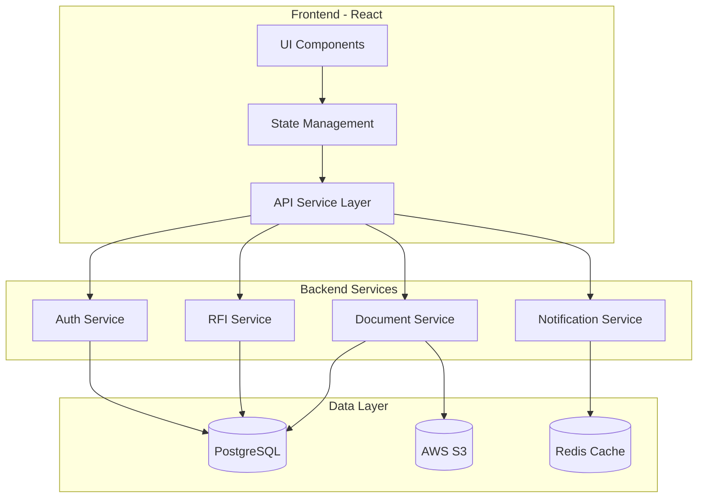

# Design Coordination Feature - Technical Specification

## 1. Overview

This document provides the technical specification for implementing the Design Coordination feature in the Site Daily Operation Overview application. The feature enables management of design documents, RFIs, and design issues with real-time collaboration capabilities.

## 2. Architecture

### 2.1 System Architecture



### 2.2 Component Architecture

```
src/
├── features/
│   └── designCoordination/
│       ├── components/
│       │   ├── DocumentManager/
│       │   ├── RFIManager/
│       │   ├── IssueTracker/
│       │   └── Dashboard/
│       ├── hooks/
│       ├── services/
│       ├── store/
│       └── types/
```

## 3. Data Models

### 3.1 Database Schema

```sql
-- Documents Table
CREATE TABLE documents (
    id UUID PRIMARY KEY DEFAULT gen_random_uuid(),
    project_id UUID NOT NULL,
    name VARCHAR(255) NOT NULL,
    type VARCHAR(50) NOT NULL,
    discipline VARCHAR(50),
    file_url TEXT NOT NULL,
    file_size BIGINT,
    version INTEGER DEFAULT 1,
    parent_id UUID REFERENCES documents(id),
    uploaded_by UUID NOT NULL,
    created_at TIMESTAMP DEFAULT CURRENT_TIMESTAMP,
    updated_at TIMESTAMP DEFAULT CURRENT_TIMESTAMP,
    FOREIGN KEY (project_id) REFERENCES projects(id)
);

-- RFIs Table
CREATE TABLE rfis (
    id UUID PRIMARY KEY DEFAULT gen_random_uuid(),
    project_id UUID NOT NULL,
    rfi_number VARCHAR(50) UNIQUE NOT NULL,
    title VARCHAR(255) NOT NULL,
    description TEXT,
    status VARCHAR(50) DEFAULT 'open',
    priority VARCHAR(20) DEFAULT 'medium',
    created_by UUID NOT NULL,
    assigned_to UUID,
    due_date DATE,
    responded_at TIMESTAMP,
    response TEXT,
    created_at TIMESTAMP DEFAULT CURRENT_TIMESTAMP,
    updated_at TIMESTAMP DEFAULT CURRENT_TIMESTAMP,
    FOREIGN KEY (project_id) REFERENCES projects(id)
);

-- Design Issues Table
CREATE TABLE design_issues (
    id UUID PRIMARY KEY DEFAULT gen_random_uuid(),
    project_id UUID NOT NULL,
    issue_number VARCHAR(50) UNIQUE NOT NULL,
    title VARCHAR(255) NOT NULL,
    description TEXT,
    type VARCHAR(50),
    severity VARCHAR(20),
    status VARCHAR(50) DEFAULT 'open',
    cost_impact DECIMAL(12, 2),
    schedule_impact INTEGER, -- days
    assigned_to UUID,
    resolved_at TIMESTAMP,
    resolution TEXT,
    created_at TIMESTAMP DEFAULT CURRENT_TIMESTAMP,
    updated_at TIMESTAMP DEFAULT CURRENT_TIMESTAMP,
    FOREIGN KEY (project_id) REFERENCES projects(id)
);

-- RFI Attachments
CREATE TABLE rfi_attachments (
    id UUID PRIMARY KEY DEFAULT gen_random_uuid(),
    rfi_id UUID NOT NULL,
    document_id UUID,
    file_url TEXT,
    file_name VARCHAR(255),
    created_at TIMESTAMP DEFAULT CURRENT_TIMESTAMP,
    FOREIGN KEY (rfi_id) REFERENCES rfis(id),
    FOREIGN KEY (document_id) REFERENCES documents(id)
);

-- Comments
CREATE TABLE comments (
    id UUID PRIMARY KEY DEFAULT gen_random_uuid(),
    entity_type VARCHAR(50) NOT NULL, -- 'rfi', 'issue', 'document'
    entity_id UUID NOT NULL,
    user_id UUID NOT NULL,
    content TEXT NOT NULL,
    parent_id UUID REFERENCES comments(id),
    created_at TIMESTAMP DEFAULT CURRENT_TIMESTAMP,
    updated_at TIMESTAMP DEFAULT CURRENT_TIMESTAMP
);
```

### 3.2 TypeScript Interfaces

```typescript
// Document Types
export interface Document {
  id: string;
  projectId: string;
  name: string;
  type: DocumentType;
  discipline?: Discipline;
  fileUrl: string;
  fileSize: number;
  version: number;
  parentId?: string;
  uploadedBy: string;
  createdAt: Date;
  updatedAt: Date;
}

export enum DocumentType {
  PDF = 'pdf',
  DWG = 'dwg',
  DXF = 'dxf',
  IMAGE = 'image',
  OTHER = 'other'
}

export enum Discipline {
  ARCHITECTURAL = 'architectural',
  STRUCTURAL = 'structural',
  MEP = 'mep',
  CIVIL = 'civil',
  LANDSCAPE = 'landscape'
}

// RFI Types
export interface RFI {
  id: string;
  projectId: string;
  rfiNumber: string;
  title: string;
  description?: string;
  status: RFIStatus;
  priority: Priority;
  createdBy: string;
  assignedTo?: string;
  dueDate?: Date;
  respondedAt?: Date;
  response?: string;
  attachments?: RFIAttachment[];
  comments?: Comment[];
  createdAt: Date;
  updatedAt: Date;
}

export enum RFIStatus {
  OPEN = 'open',
  IN_REVIEW = 'in_review',
  RESPONDED = 'responded',
  CLOSED = 'closed'
}

export enum Priority {
  LOW = 'low',
  MEDIUM = 'medium',
  HIGH = 'high',
  CRITICAL = 'critical'
}

// Design Issue Types
export interface DesignIssue {
  id: string;
  projectId: string;
  issueNumber: string;
  title: string;
  description?: string;
  type?: IssueType;
  severity: Severity;
  status: IssueStatus;
  costImpact?: number;
  scheduleImpact?: number;
  assignedTo?: string;
  resolvedAt?: Date;
  resolution?: string;
  createdAt: Date;
  updatedAt: Date;
}

export enum IssueType {
  CONFLICT = 'conflict',
  MISSING_INFO = 'missing_info',
  ERROR = 'error',
  CLARIFICATION = 'clarification'
}

export enum Severity {
  LOW = 'low',
  MEDIUM = 'medium',
  HIGH = 'high',
  CRITICAL = 'critical'
}

export enum IssueStatus {
  OPEN = 'open',
  IN_PROGRESS = 'in_progress',
  RESOLVED = 'resolved',
  CLOSED = 'closed'
}
```

## 4. API Specification

### 4.1 RESTful Endpoints

```yaml
# Document Management
GET    /api/documents                 # List documents with filters
POST   /api/documents                 # Upload new document
GET    /api/documents/:id            # Get document details
PUT    /api/documents/:id            # Update document metadata
DELETE /api/documents/:id            # Delete document
GET    /api/documents/:id/download   # Download document
POST   /api/documents/:id/version    # Create new version

# RFI Management  
GET    /api/rfis                     # List RFIs with filters
POST   /api/rfis                     # Create new RFI
GET    /api/rfis/:id                # Get RFI details
PUT    /api/rfis/:id                # Update RFI
DELETE /api/rfis/:id                # Delete RFI
POST   /api/rfis/:id/respond        # Add response to RFI
POST   /api/rfis/:id/attachments    # Add attachment to RFI

# Design Issues
GET    /api/issues                   # List issues with filters
POST   /api/issues                   # Create new issue
GET    /api/issues/:id              # Get issue details
PUT    /api/issues/:id              # Update issue
DELETE /api/issues/:id              # Delete issue
POST   /api/issues/:id/resolve      # Resolve issue

# Comments
GET    /api/comments                 # Get comments for entity
POST   /api/comments                 # Add comment
PUT    /api/comments/:id            # Update comment
DELETE /api/comments/:id            # Delete comment
```

### 4.2 Request/Response Examples

```json
// POST /api/rfis
// Request
{
  "title": "Clarification on foundation detail",
  "description": "Need clarification on rebar spacing in foundation detail FD-101",
  "priority": "high",
  "assignedTo": "engineer-uuid",
  "dueDate": "2025-10-01",
  "attachments": [
    {
      "documentId": "doc-uuid",
      "fileName": "foundation-photo.jpg"
    }
  ]
}

// Response
{
  "id": "rfi-uuid",
  "rfiNumber": "RFI-2025-001",
  "title": "Clarification on foundation detail",
  "status": "open",
  "createdAt": "2025-09-21T10:00:00Z"
}
```

## 5. Component Specifications

### 5.1 Document Manager Component

```typescript
interface DocumentManagerProps {
  projectId: string;
  onDocumentSelect?: (document: Document) => void;
}

// Features:
// - Grid/List view toggle
// - Upload with drag & drop
// - Search and filter
// - Version history
// - Preview modal
// - Bulk operations
```

### 5.2 RFI Manager Component

```typescript
interface RFIManagerProps {
  projectId: string;
  userRole: UserRole;
}

// Features:
// - RFI list with filters
// - Create/Edit RFI form
// - Status tracking
// - Response workflow
// - Attachment management
// - Comment thread
```

### 5.3 Dashboard Component

```typescript
interface DashboardProps {
  projectId: string;
}

// Features:
// - Summary statistics
// - Open RFIs chart
// - Issue severity breakdown
// - Response time metrics
// - Recent activities
// - Quick actions
```

## 6. State Management

### 6.1 Redux Store Structure

```typescript
interface DesignCoordinationState {
  documents: {
    items: Document[];
    loading: boolean;
    error: string | null;
    filters: DocumentFilters;
    selectedId: string | null;
  };
  rfis: {
    items: RFI[];
    loading: boolean;
    error: string | null;
    filters: RFIFilters;
    selectedId: string | null;
  };
  issues: {
    items: DesignIssue[];
    loading: boolean;
    error: string | null;
    filters: IssueFilters;
    selectedId: string | null;
  };
  ui: {
    documentViewMode: 'grid' | 'list';
    sidebarOpen: boolean;
    activeTab: string;
  };
}
```

### 6.2 Context Providers

```typescript
// Design Coordination Context
export const DesignCoordinationContext = React.createContext<{
  state: DesignCoordinationState;
  actions: DesignCoordinationActions;
}>(defaultValue);

// WebSocket Context for real-time updates
export const WebSocketContext = React.createContext<{
  subscribe: (event: string, handler: Function) => void;
  unsubscribe: (event: string) => void;
  emit: (event: string, data: any) => void;
}>(defaultValue);
```

## 7. Security Considerations

### 7.1 Authentication & Authorization

- JWT-based authentication
- Role-based access control (RBAC)
- Document-level permissions
- API rate limiting

### 7.2 Data Protection

- Encryption at rest (AES-256)
- TLS 1.3 for data in transit
- Input validation and sanitization
- SQL injection prevention
- XSS protection

### 7.3 Audit Logging

```typescript
interface AuditLog {
  userId: string;
  action: string;
  entityType: string;
  entityId: string;
  previousValue?: any;
  newValue?: any;
  timestamp: Date;
  ipAddress: string;
}
```

## 8. Performance Requirements

### 8.1 Response Times
- Page load: < 2 seconds
- API responses: < 500ms (p95)
- Document upload: < 10 seconds for 50MB
- Search results: < 1 second

### 8.2 Scalability
- Support 500+ concurrent users
- Handle 10,000+ documents per project
- Process 1,000+ RFIs per month

### 8.3 Optimization Strategies
- Lazy loading for document lists
- Virtual scrolling for large datasets
- Image thumbnail generation
- CDN for static assets
- Database query optimization
- Redis caching for frequently accessed data

## 9. Testing Strategy

### 9.1 Unit Testing
- Component testing with React Testing Library
- Service layer testing with Jest
- Redux action/reducer testing
- Utility function testing

### 9.2 Integration Testing
- API endpoint testing
- Database transaction testing
- File upload/download testing
- Authentication flow testing

### 9.3 E2E Testing
- Complete user workflows
- Cross-browser testing
- Mobile responsiveness testing
- Performance testing

### 9.4 Test Coverage Requirements
- Minimum 80% code coverage
- 100% coverage for critical paths
- All edge cases covered

## 10. Deployment

### 10.1 Environment Configuration

```env
# Production Environment Variables
REACT_APP_API_URL=https://api.siteops.com
REACT_APP_WS_URL=wss://ws.siteops.com
REACT_APP_S3_BUCKET=siteops-documents
REACT_APP_MAX_FILE_SIZE=104857600
REACT_APP_ALLOWED_FILE_TYPES=pdf,dwg,dxf,jpg,png
```

### 10.2 CI/CD Pipeline
1. Code commit triggers build
2. Run linting and type checking
3. Execute unit tests
4. Build Docker image
5. Run integration tests
6. Deploy to staging
7. Run E2E tests
8. Deploy to production
9. Run smoke tests

## 11. Monitoring

### 11.1 Metrics to Track
- API response times
- Error rates
- Document upload success rate
- RFI response times
- User engagement metrics

### 11.2 Alerting
- Error rate > 1%
- API response time > 2s
- Upload failure rate > 5%
- Database connection issues

## 12. Documentation

### 12.1 Code Documentation
- JSDoc comments for all functions
- README for each module
- API documentation with examples
- Component storybook

### 12.2 User Documentation
- Feature overview
- Step-by-step guides
- Video tutorials
- FAQ section

## 13. Migration Plan

### 13.1 Data Migration
- Export existing data from legacy systems
- Data transformation scripts
- Validation procedures
- Rollback plan

### 13.2 User Migration
- Phased rollout by project
- Training sessions
- Support during transition
- Feedback collection

## 14. Dependencies

### 14.1 Frontend Dependencies
```json
{
  "react": "^18.2.0",
  "react-router-dom": "^6.8.0",
  "redux": "^4.2.0",
  "react-redux": "^8.0.5",
  "axios": "^1.3.0",
  "socket.io-client": "^4.5.0",
  "react-dropzone": "^14.2.0",
  "react-pdf": "^6.2.0",
  "recharts": "^2.5.0"
}
```

### 14.2 Backend Dependencies
```json
{
  "express": "^4.18.0",
  "postgresql": "^8.10.0",
  "aws-sdk": "^2.1300.0",
  "socket.io": "^4.5.0",
  "jsonwebtoken": "^9.0.0",
  "multer": "^1.4.5",
  "node-cron": "^3.0.2"
}
```