# Construction Daily Operations Hub - Integration Guide

**Version**: v3.0  
**Date**: 2025-09-21

## Overview

This guide provides comprehensive instructions for integrating the Construction Daily Operations Hub with external systems commonly used in construction projects, including ERP systems, scheduling software, BIM tools, and third-party services.

## Integration Architecture

```mermaid
graph TB
    subgraph "Construction Daily Ops Hub"
        API[API Gateway]
        EVENTS[Event Bus - Kafka]
        SYNC[Sync Service]
    end
    
    subgraph "ERP Systems"
        SAP[SAP ERP]
        ORACLE[Oracle ERP]
        SAGE[Sage Construction]
        PROCORE[Procore]
    end
    
    subgraph "Scheduling Software"
        P6[Primavera P6]
        MSP[Microsoft Project]
        ASTA[Asta Powerproject]
        EXCEL[Excel Schedules]
    end
    
    subgraph "BIM Tools"
        REVIT[Autodesk Revit]
        ARCHICAD[Graphisoft ArchiCAD]
        TEKLA[Tekla Structures]
        NAVIS[Navisworks]
    end
    
    subgraph "External Services"
        WEATHER[Weather APIs]
        EMAIL[Email Services]
        SMS[SMS Services]
        CALENDAR[Calendar APIs]
    end
    
    subgraph "File Storage"
        BIM360[BIM 360]
        DOCUMENTUM[Documentum]
        SHAREPOINT[SharePoint]
        S3[AWS S3]
    end
    
    API --> SAP
    API --> ORACLE
    API --> P6
    API --> MSP
    EVENTS --> REVIT
    EVENTS --> ARCHICAD
    SYNC --> WEATHER
    SYNC --> EMAIL
    API --> BIM360
    API --> DOCUMENTUM
```



## Supported Integrations

### ERP Systems

#### SAP ERP Integration

**Overview**: Integration with SAP ERP for cost management, procurement, and financial data synchronization.

**Configuration**:
```json
{
  "sap": {
    "baseUrl": "https://sap-server.company.com:8000",
    "systemId": "PRD",
    "client": "100",
    "username": "${SAP_USERNAME}",
    "password": "${SAP_PASSWORD}",
    "language": "EN",
    "syncInterval": "PT1H",
    "enabledModules": ["FI", "CO", "MM", "PS"]
  }
}
```

**API Endpoints**:
```http
POST /integrations/sap/sync-costs
POST /integrations/sap/sync-procurement
POST /integrations/sap/sync-projects
GET /integrations/sap/status
```

**Data Mapping**:
- **Projects**: SAP Project ID → Hub Project ID
- **Cost Centers**: SAP Cost Center → Hub WBS Element
- **Materials**: SAP Material Number → Hub Material ID
- **Vendors**: SAP Vendor ID → Hub Contractor ID

#### Oracle ERP Integration

**Configuration**:
```json
{
  "oracle": {
    "baseUrl": "https://oracle-server.company.com",
    "database": "construction_db",
    "username": "${ORACLE_USERNAME}",
    "password": "${ORACLE_PASSWORD}",
    "serviceName": "CONSTRUCTION",
    "syncInterval": "PT2H",
    "enabledModules": ["GL", "AP", "AR", "PO"]
  }
}
```

#### Sage Construction Integration

**Configuration**:
```json
{
  "sage": {
    "baseUrl": "https://sage-api.sage.com/v1",
    "apiKey": "${SAGE_API_KEY}",
    "companyId": "${SAGE_COMPANY_ID}",
    "syncInterval": "PT4H",
    "enabledModules": ["projects", "invoicing", "payroll"]
  }
}
```

### Scheduling Software

#### Primavera P6 Integration

**Overview**: Bidirectional synchronization with Primavera P6 for schedule management and critical path analysis.

**Configuration**:
```json
{
  "primavera": {
    "database": {
      "host": "p6-db.company.com",
      "port": 1521,
      "serviceName": "P6",
      "username": "${P6_USERNAME}",
      "password": "${P6_PASSWORD}"
    },
    "syncInterval": "PT30M",
    "syncModes": ["schedule", "resources", "costs"],
    "autoUpdate": true,
    "conflictResolution": "latest_wins"
  }
}
```

**Synchronization Process**:
1. **Pull from P6**: Import project schedules, tasks, and dependencies
2. **Push to P6**: Export progress updates and schedule changes
3. **Conflict Resolution**: Handle conflicts based on configured strategy

**Data Mapping**:
- **Projects**: P6 Project ID → Hub Project ID
- **Activities**: P6 Activity ID → Hub Task ID
- **Resources**: P6 Resource ID → Hub Resource ID
- **Dependencies**: P6 Relationship → Hub Task Dependency

#### Microsoft Project Integration

**Configuration**:
```json
{
  "msproject": {
    "syncMethod": "file_based",
    "filePath": "/shared/project-files",
    "syncInterval": "PT1H",
    "supportedFormats": ["mpp", "xml"],
    "autoExport": true
  }
}
```

**File-based Integration**:
```typescript
// Example: Import MS Project file
const projectFile = await fs.readFile('project.mpp');
const schedule = await msProjectParser.parse(projectFile);

// Map to Hub format
const hubSchedule = {
  projectId: 'hub-project-123',
  tasks: schedule.tasks.map(task => ({
    id: `task-${task.id}`,
    name: task.name,
    startDate: task.startDate,
    endDate: task.endDate,
    dependencies: task.predecessors
  }))
};

// Sync to Hub
await hubAPI.schedules.import(hubSchedule);
```

### BIM Tools

#### Autodesk Revit Integration

**Overview**: Integration with Revit for BIM data synchronization and clash detection.

**Configuration**:
```json
{
  "revit": {
    "bim360": {
      "accountId": "${BIM360_ACCOUNT_ID}",
      "projectId": "${BIM360_PROJECT_ID}",
      "clientId": "${BIM360_CLIENT_ID}",
      "clientSecret": "${BIM360_CLIENT_SECRET}"
    },
    "syncInterval": "PT2H",
    "syncModels": true,
    "syncElements": true,
    "syncParameters": ["Type", "Material", "Location"]
  }
}
```

**BIM Element Mapping**:
```typescript
interface BIMElement {
  id: string;
  type: string;
  material?: string;
  location: {
    x: number;
    y: number;
    z: number;
  };
  parameters: Record<string, any>;
  wbsId?: string; // Linked to WBS element
  taskId?: string; // Linked to construction task
}
```

#### Navisworks Integration

**Configuration**:
```json
{
  "navisworks": {
    "filePath": "/shared/navisworks-models",
    "syncInterval": "PT4H",
    "syncClashes": true,
    "syncProperties": true,
    "autoUpdateModels": false
  }
}
```

### External Services

#### Weather API Integration

**Configuration**:
```json
{
  "weather": {
    "provider": "openweathermap",
    "apiKey": "${WEATHER_API_KEY}",
    "updateInterval": "PT1H",
    "forecastDays": 7,
    "alerts": {
      "enabled": true,
      "thresholds": {
        "rainProbability": 0.6,
        "windSpeed": 15,
        "temperature": {
          "min": -10,
          "max": 40
        }
      }
    }
  }
}
```

**Weather Data Integration**:
```typescript
// Weather service integration
class WeatherService {
  async getCurrentWeather(location: Location): Promise<WeatherData> {
    const response = await fetch(
      `https://api.openweathermap.org/data/2.5/weather?lat=${location.lat}&lon=${location.lon}&appid=${this.apiKey}`
    );
    return response.json();
  }

  async getForecast(location: Location): Promise<ForecastData[]> {
    const response = await fetch(
      `https://api.openweathermap.org/data/2.5/forecast?lat=${location.lat}&lon=${location.lon}&appid=${this.apiKey}`
    );
    return response.json();
  }
}
```

#### Email Service Integration

**Configuration**:
```json
{
  "email": {
    "provider": "sendgrid",
    "apiKey": "${SENDGRID_API_KEY}",
    "fromEmail": "noreply@construction-hub.com",
    "templates": {
      "alertEscalation": "d-1234567890abcdef",
      "dailyBriefing": "d-abcdef1234567890",
      "meetingInvite": "d-0987654321fedcba"
    }
  }
}
```

#### SMS Service Integration

**Configuration**:
```json
{
  "sms": {
    "provider": "twilio",
    "accountSid": "${TWILIO_ACCOUNT_SID}",
    "authToken": "${TWILIO_AUTH_TOKEN}",
    "fromNumber": "+1234567890",
    "enabled": true
  }
}
```

### File Storage Systems

#### BIM 360 Integration

**Configuration**:
```json
{
  "bim360": {
    "accountId": "${BIM360_ACCOUNT_ID}",
    "clientId": "${BIM360_CLIENT_ID}",
    "clientSecret": "${BIM360_CLIENT_SECRET}",
    "projects": [
      {
        "hubId": "hub-123",
        "projectId": "project-456",
        "syncFiles": true,
        "syncModels": true
      }
    ]
  }
}
```

#### SharePoint Integration

**Configuration**:
```json
{
  "sharepoint": {
    "siteUrl": "https://company.sharepoint.com/sites/construction",
    "clientId": "${SHAREPOINT_CLIENT_ID}",
    "clientSecret": "${SHAREPOINT_CLIENT_SECRET}",
    "tenantId": "${SHAREPOINT_TENANT_ID}",
    "documentLibraries": [
      {
        "name": "Project Documents",
        "syncEnabled": true,
        "syncInterval": "PT2H"
      }
    ]
  }
}
```

## Integration Patterns

### Event-Driven Integration

**Kafka Event Schema**:
```json
{
  "eventType": "RFI_CREATED",
  "eventId": "evt-123456",
  "timestamp": "2025-09-21T10:30:00Z",
  "source": "construction-hub",
  "data": {
    "rfiId": "RFI-214",
    "projectId": "proj-123",
    "title": "Column reinforcement conflict",
    "assignee": "consultant@example.com",
    "dueDate": "2025-09-25T17:00:00Z"
  }
}
```

**Event Handlers**:
```typescript
// SAP ERP event handler
class SAPEventHandler {
  async handleRFICreated(event: RFICreatedEvent): Promise<void> {
    const rfiData = {
      projectId: event.data.projectId,
      rfiNumber: event.data.rfiId,
      description: event.data.title,
      assignee: event.data.assignee,
      dueDate: event.data.dueDate
    };

    await this.sapClient.createRFI(rfiData);
  }
}

// Primavera P6 event handler
class P6EventHandler {
  async handleTaskUpdated(event: TaskUpdatedEvent): Promise<void> {
    const taskData = {
      activityId: event.data.taskId,
      actualStart: event.data.actualStart,
      actualFinish: event.data.actualFinish,
      percentComplete: event.data.percentComplete
    };

    await this.p6Client.updateActivity(taskData);
  }
}
```

### API-Based Integration

**RESTful Integration Service**:
```typescript
class IntegrationService {
  async syncWithERP(projectId: string): Promise<SyncResult> {
    try {
      // Pull data from ERP
      const erpData = await this.erpClient.getProjectData(projectId);
      
      // Transform to Hub format
      const hubData = this.transformERPData(erpData);
      
      // Update Hub
      const result = await this.hubClient.updateProject(projectId, hubData);
      
      // Log sync result
      await this.logSyncResult(projectId, 'ERP', 'success', result);
      
      return result;
    } catch (error) {
      await this.logSyncResult(projectId, 'ERP', 'error', error);
      throw error;
    }
  }

  private transformERPData(erpData: ERPProjectData): HubProjectData {
    return {
      projectId: erpData.projectNumber,
      name: erpData.projectName,
      startDate: erpData.plannedStartDate,
      endDate: erpData.plannedEndDate,
      budget: erpData.totalBudget,
      costs: erpData.costCenters.map(cc => ({
        wbsId: cc.costCenterId,
        budget: cc.plannedCost,
        actual: cc.actualCost
      }))
    };
  }
}
```

### File-Based Integration

**Schedule Import Service**:
```typescript
class ScheduleImportService {
  async importFromExcel(filePath: string, projectId: string): Promise<void> {
    // Read Excel file
    const workbook = xlsx.readFile(filePath);
    const worksheet = workbook.Sheets['Schedule'];
    
    // Parse schedule data
    const scheduleData = xlsx.utils.sheet_to_json(worksheet);
    
    // Transform to Hub format
    const tasks = scheduleData.map((row: any) => ({
      id: `task-${row.ID}`,
      name: row.Name,
      startDate: this.parseDate(row.StartDate),
      endDate: this.parseDate(row.EndDate),
      dependencies: this.parseDependencies(row.Predecessors)
    }));
    
    // Import to Hub
    await this.hubAPI.schedules.import(projectId, tasks);
  }

  private parseDependencies(predecessors: string): string[] {
    if (!predecessors) return [];
    return predecessors.split(',').map(p => p.trim()).map(p => `task-${p}`);
  }
}
```

## Data Synchronization

### Sync Strategies

#### Real-time Sync
```typescript
class RealTimeSyncService {
  private websocket: WebSocket;

  constructor() {
    this.websocket = new WebSocket('wss://hub.construction-hub.com/ws');
    this.websocket.onmessage = this.handleMessage.bind(this);
  }

  private handleMessage(event: MessageEvent): void {
    const message = JSON.parse(event.data);
    
    switch (message.type) {
      case 'SCHEDULE_UPDATED':
        this.syncWithP6(message.data);
        break;
      case 'COST_UPDATED':
        this.syncWithSAP(message.data);
        break;
      case 'RFI_CREATED':
        this.notifyExternalSystems(message.data);
        break;
    }
  }

  private async syncWithP6(data: ScheduleUpdateData): Promise<void> {
    await this.p6Client.updateActivity({
      activityId: data.taskId,
      actualStart: data.actualStart,
      actualFinish: data.actualFinish
    });
  }
}
```

#### Batch Sync
```typescript
class BatchSyncService {
  async performBatchSync(): Promise<void> {
    const projects = await this.hubAPI.projects.list();
    
    for (const project of projects) {
      await Promise.all([
        this.syncWithSAP(project.id),
        this.syncWithP6(project.id),
        this.syncWithBIM360(project.id)
      ]);
    }
  }

  private async syncWithSAP(projectId: string): Promise<void> {
    try {
      const hubData = await this.hubAPI.projects.getCosts(projectId);
      await this.sapClient.updateProjectCosts(projectId, hubData);
    } catch (error) {
      console.error(`Failed to sync project ${projectId} with SAP:`, error);
    }
  }
}
```

### Conflict Resolution

**Conflict Resolution Strategies**:
```typescript
enum ConflictResolutionStrategy {
  HUB_WINS = 'hub_wins',
  EXTERNAL_WINS = 'external_wins',
  LATEST_WINS = 'latest_wins',
  MANUAL_REVIEW = 'manual_review'
}

class ConflictResolver {
  async resolveConflict(
    hubData: any,
    externalData: any,
    strategy: ConflictResolutionStrategy
  ): Promise<any> {
    switch (strategy) {
      case ConflictResolutionStrategy.HUB_WINS:
        return hubData;
      
      case ConflictResolutionStrategy.EXTERNAL_WINS:
        return externalData;
      
      case ConflictResolutionStrategy.LATEST_WINS:
        return hubData.updatedAt > externalData.updatedAt ? hubData : externalData;
      
      case ConflictResolutionStrategy.MANUAL_REVIEW:
        return this.createManualReviewTask(hubData, externalData);
      
      default:
        throw new Error(`Unknown conflict resolution strategy: ${strategy}`);
    }
  }
}
```

## Error Handling and Monitoring

### Integration Health Monitoring

**Health Check Service**:
```typescript
class IntegrationHealthService {
  async checkAllIntegrations(): Promise<IntegrationHealthReport> {
    const integrations = [
      { name: 'SAP', service: this.sapClient },
      { name: 'Primavera P6', service: this.p6Client },
      { name: 'BIM 360', service: this.bim360Client },
      { name: 'Weather API', service: this.weatherService }
    ];

    const healthChecks = await Promise.allSettled(
      integrations.map(integration => this.checkIntegration(integration))
    );

    return {
      timestamp: new Date().toISOString(),
      integrations: healthChecks.map((result, index) => ({
        name: integrations[index].name,
        status: result.status === 'fulfilled' ? 'healthy' : 'unhealthy',
        details: result.status === 'fulfilled' ? result.value : result.reason
      }))
    };
  }

  private async checkIntegration(integration: any): Promise<HealthCheckResult> {
    const startTime = Date.now();
    
    try {
      await integration.service.healthCheck();
      return {
        status: 'healthy',
        responseTime: Date.now() - startTime,
        lastChecked: new Date().toISOString()
      };
    } catch (error) {
      return {
        status: 'unhealthy',
        error: error.message,
        responseTime: Date.now() - startTime,
        lastChecked: new Date().toISOString()
      };
    }
  }
}
```

### Error Recovery

**Retry Mechanism**:
```typescript
class RetryService {
  async withRetry<T>(
    operation: () => Promise<T>,
    maxRetries: number = 3,
    delay: number = 1000
  ): Promise<T> {
    let lastError: Error;

    for (let attempt = 1; attempt <= maxRetries; attempt++) {
      try {
        return await operation();
      } catch (error) {
        lastError = error;
        
        if (attempt < maxRetries) {
          await this.delay(delay * Math.pow(2, attempt - 1)); // Exponential backoff
        }
      }
    }

    throw new Error(`Operation failed after ${maxRetries} attempts: ${lastError.message}`);
  }

  private delay(ms: number): Promise<void> {
    return new Promise(resolve => setTimeout(resolve, ms));
  }
}
```

## Testing Integrations

### Integration Tests

**SAP Integration Test**:
```typescript
describe('SAP Integration', () => {
  it('should sync project costs successfully', async () => {
    const mockProject = {
      id: 'proj-123',
      costs: [
        { wbsId: 'wbs-1', budget: 100000, actual: 75000 },
        { wbsId: 'wbs-2', budget: 200000, actual: 150000 }
      ]
    };

    const sapClient = new MockSAPClient();
    const integrationService = new SAPIntegrationService(sapClient);

    await integrationService.syncProjectCosts(mockProject);

    expect(sapClient.updateProjectCosts).toHaveBeenCalledWith(
      'proj-123',
      mockProject.costs
    );
  });
});
```

**Primavera P6 Integration Test**:
```typescript
describe('Primavera P6 Integration', () => {
  it('should import schedule successfully', async () => {
    const mockSchedule = {
      projectId: 'proj-123',
      tasks: [
        {
          id: 'task-1',
          name: 'Foundation Work',
          startDate: '2025-09-01',
          endDate: '2025-09-15',
          dependencies: []
        }
      ]
    };

    const p6Client = new MockP6Client();
    const integrationService = new P6IntegrationService(p6Client);

    await integrationService.importSchedule(mockSchedule);

    expect(p6Client.createActivity).toHaveBeenCalledWith(
      expect.objectContaining({
        name: 'Foundation Work',
        startDate: '2025-09-01',
        endDate: '2025-09-15'
      })
    );
  });
});
```

## Security Considerations

### Authentication and Authorization

**API Key Management**:
```typescript
class APIKeyManager {
  private keys: Map<string, APIKey> = new Map();

  async validateKey(apiKey: string): Promise<boolean> {
    const key = this.keys.get(apiKey);
    if (!key) return false;

    // Check expiration
    if (key.expiresAt && new Date() > key.expiresAt) {
      this.keys.delete(apiKey);
      return false;
    }

    // Update last used
    key.lastUsedAt = new Date();
    return true;
  }

  async generateKey(integrationName: string): Promise<string> {
    const key = crypto.randomBytes(32).toString('hex');
    const apiKey: APIKey = {
      key,
      integrationName,
      createdAt: new Date(),
      lastUsedAt: new Date()
    };

    this.keys.set(key, apiKey);
    return key;
  }
}
```

### Data Encryption

**Encryption Service**:
```typescript
class EncryptionService {
  private algorithm = 'aes-256-gcm';
  private key: Buffer;

  constructor(key: string) {
    this.key = crypto.scryptSync(key, 'salt', 32);
  }

  encrypt(data: any): string {
    const iv = crypto.randomBytes(16);
    const cipher = crypto.createCipher(this.algorithm, this.key);
    cipher.setAAD(Buffer.from('construction-hub'));

    let encrypted = cipher.update(JSON.stringify(data), 'utf8', 'hex');
    encrypted += cipher.final('hex');

    const authTag = cipher.getAuthTag();

    return JSON.stringify({
      encrypted,
      iv: iv.toString('hex'),
      authTag: authTag.toString('hex')
    });
  }

  decrypt(encryptedData: string): any {
    const { encrypted, iv, authTag } = JSON.parse(encryptedData);

    const decipher = crypto.createDecipher(this.algorithm, this.key);
    decipher.setAAD(Buffer.from('construction-hub'));
    decipher.setAuthTag(Buffer.from(authTag, 'hex'));

    let decrypted = decipher.update(encrypted, 'hex', 'utf8');
    decrypted += decipher.final('utf8');

    return JSON.parse(decrypted);
  }
}
```

## Deployment and Configuration

### Environment Variables

```bash
# ERP Systems
SAP_BASE_URL=https://sap-server.company.com:8000
SAP_USERNAME=construction_user
SAP_PASSWORD=secure_password
SAP_SYSTEM_ID=PRD
SAP_CLIENT=100

ORACLE_BASE_URL=https://oracle-server.company.com
ORACLE_USERNAME=construction_user
ORACLE_PASSWORD=secure_password
ORACLE_SERVICE_NAME=CONSTRUCTION

# Scheduling Software
P6_DB_HOST=p6-db.company.com
P6_DB_PORT=1521
P6_DB_SERVICE_NAME=P6
P6_USERNAME=construction_user
P6_PASSWORD=secure_password

# BIM Tools
BIM360_ACCOUNT_ID=account-123
BIM360_CLIENT_ID=client-456
BIM360_CLIENT_SECRET=secret-789

# External Services
WEATHER_API_KEY=your-weather-api-key
SENDGRID_API_KEY=your-sendgrid-api-key
TWILIO_ACCOUNT_SID=your-twilio-account-sid
TWILIO_AUTH_TOKEN=your-twilio-auth-token

# File Storage
SHAREPOINT_SITE_URL=https://company.sharepoint.com/sites/construction
SHAREPOINT_CLIENT_ID=your-sharepoint-client-id
SHAREPOINT_CLIENT_SECRET=your-sharepoint-client-secret
```

### Docker Configuration

```yaml
# docker-compose.integrations.yml
version: '3.8'

services:
  integration-service:
    build:
      context: .
      dockerfile: Dockerfile.integrations
    environment:
      - NODE_ENV=production
      - DATABASE_URL=${DATABASE_URL}
      - SAP_BASE_URL=${SAP_BASE_URL}
      - SAP_USERNAME=${SAP_USERNAME}
      - SAP_PASSWORD=${SAP_PASSWORD}
      - P6_DB_HOST=${P6_DB_HOST}
      - P6_USERNAME=${P6_USERNAME}
      - P6_PASSWORD=${P6_PASSWORD}
    volumes:
      - ./integrations/config:/app/config
      - ./integrations/logs:/app/logs
    depends_on:
      - postgres
      - kafka
```

## Troubleshooting

### Common Issues

#### SAP Connection Issues
```bash
# Check SAP connectivity
curl -k -u $SAP_USERNAME:$SAP_PASSWORD \
     "$SAP_BASE_URL/sap/bc/ui2/nwbc/fiori"

# Check SAP service status
curl -k -u $SAP_USERNAME:$SAP_PASSWORD \
     "$SAP_BASE_URL/sap/bc/rest/sap/si/rest/rest_services"
```

#### Primavera P6 Connection Issues
```bash
# Test P6 database connection
sqlplus $P6_USERNAME/$P6_PASSWORD@$P6_DB_HOST:$P6_DB_PORT/$P6_DB_SERVICE_NAME

# Check P6 web services
curl -u $P6_USERNAME:$P6_PASSWORD \
     "http://p6-server.company.com:8206/p6ws/services/ProjectService"
```

#### BIM 360 API Issues
```bash
# Test BIM 360 authentication
curl -X POST \
     -H "Content-Type: application/x-www-form-urlencoded" \
     -d "grant_type=client_credentials&client_id=$BIM360_CLIENT_ID&client_secret=$BIM360_CLIENT_SECRET" \
     "https://developer.api.autodesk.com/authentication/v1/authenticate"
```

### Log Analysis

**Integration Logs**:
```bash
# View integration logs
kubectl logs -f deployment/integration-service

# Filter SAP integration logs
kubectl logs deployment/integration-service | grep "SAP"

# Monitor sync performance
kubectl logs deployment/integration-service | grep "sync"
```

---

**Next Steps**: 
1. Configure integration endpoints
2. Set up authentication credentials
3. Test integrations in development
4. Deploy to staging environment
5. Perform integration testing
6. Deploy to production
7. Monitor integration health

