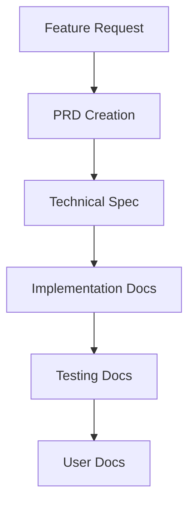
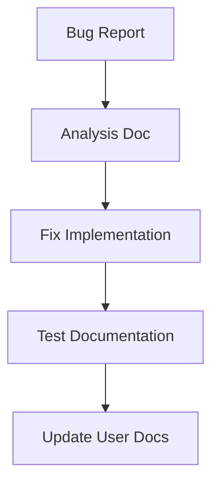
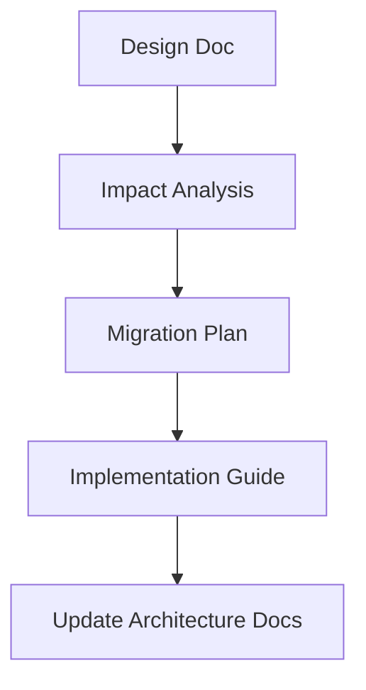

# SDLC Documentation

## Overview

This directory contains all Software Development Life Cycle (SDLC) guidelines and practices for the Kids Record project.

## Contents

### 1. [Development Best Practices](./DEVELOPMENT_BEST_PRACTICES.md)
- Coding standards
- Git workflow
- Code review process
- Quality assurance

### 2. [Testing Guidelines](./TESTING.md)
- Unit testing
- Integration testing
- E2E testing
- Test coverage requirements

### 3. [Critical Flows](./CRITICAL_FLOWS.md)
- Critical feature identification
- Testing requirements
- Monitoring requirements
- Recovery procedures

### 4. [Documentation Guidelines](./DOCUMENTATION_GUIDELINES.md)
- Documentation structure
- Documentation requirements
- Templates and standards
- Review process
- Maintenance procedures

## Documentation Requirements in SDLC

### 1. Planning Phase
- Feature PRD
- Technical specification
- Architecture documents
- Test plans

### 2. Development Phase
- Code documentation
- API documentation
- Test documentation
- Implementation notes

### 3. Review Phase
- Documentation review
- Cross-reference verification
- Template compliance
- Content accuracy

### 4. Deployment Phase
- Release notes
- User documentation
- API versioning
- Migration guides

### 5. Maintenance Phase
- Update procedures
- Troubleshooting guides
- Recovery procedures
- Audit reports

## Documentation Workflow

### 1. New Features

### 2. Bug Fixes

### 3. Architecture Changes

## Documentation Standards

### 1. File Organization
- Use appropriate directory
- Follow naming conventions
- Update index files
- Maintain cross-references

### 2. Content Requirements
- Clear purpose
- Accurate information
- Complete coverage
- Regular updates

### 3. Review Process
- Technical review
- Content review
- Format review
- Cross-reference check

## Templates

### 1. Documentation Types
- Feature documentation
- Technical documentation
- User documentation
- API documentation

### 2. Required Sections
- Overview
- Requirements
- Implementation
- Testing
- Maintenance

### 3. Format Guidelines
- Markdown syntax
- Code examples
- Diagrams
- Screenshots

## Quality Assurance

### 1. Documentation QA
- Content accuracy
- Format compliance
- Link validation
- Version control

### 2. Review Checklist
- Technical accuracy
- Completeness
- Clarity
- Cross-references

### 3. Maintenance
- Regular updates
- Version tracking
- Deprecation process
- Archive procedure

## Tools and Resources

### 1. Recommended Tools
- VS Code with extensions
- Markdown linters
- Diagram tools
- Documentation generators

### 2. CI/CD Integration
- Documentation builds
- Link checking
- Format validation
- Version management

### 3. Review Tools
- PR templates
- Review checklists
- Automated checks
- Version control

## Document Archiving Workflow (Post-PR Approval)

After a feature or project PR is approved and merged into master:

1. Identify all related documentation (PR templates, specs, review notes, workflow summaries, etc.) in the `docs/features/`, `docs/implementation/`, or other working directories.
2. Move these documents to the appropriate archive directory under `docs/archived/projects/` (e.g., for class features, use `class-lesson-pipeline-2025`).
3. If the project does not have an archive folder, create a new one following the naming convention.
4. Update the SDLC documentation if the workflow or process changes.
5. This ensures historical traceability and keeps the working documentation area clean for ongoing and future work.
